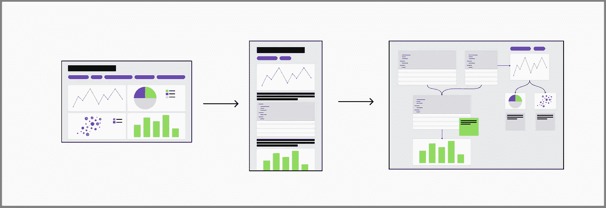

# 仪表盘已经死了：三年后的回顾

> 原文：[`towardsdatascience.com/dashboards-are-dead-3-years-later-72347757bfa6?source=collection_archive---------0-----------------------#2023-04-12`](https://towardsdatascience.com/dashboards-are-dead-3-years-later-72347757bfa6?source=collection_archive---------0-----------------------#2023-04-12)

## 2023 年仪表盘的目的是什么？

 [泰勒·布朗洛](https://taylor-count.medium.com/?source=post_page-----72347757bfa6--------------------------------)

·

[关注](https://medium.com/m/signin?actionUrl=https%3A%2F%2Fmedium.com%2F_%2Fsubscribe%2Fuser%2Fcdc63fa2a06e&operation=register&redirect=https%3A%2F%2Ftowardsdatascience.com%2Fdashboards-are-dead-3-years-later-72347757bfa6&user=Taylor+Brownlow&userId=cdc63fa2a06e&source=post_page-cdc63fa2a06e----72347757bfa6---------------------post_header-----------) 发布于 [面向数据科学](https://towardsdatascience.com/?source=post_page-----72347757bfa6--------------------------------) ·6 分钟阅读·2023 年 4 月 12 日

--

2020 年 4 月 9 日，我发布了一篇名为“仪表盘已经死了”的文章。我写这篇文章主要是为了发泄作为数据分析师的积压情绪，当然也为了挑战当时最流行的数据工具：仪表盘。

令我惊讶的是，很多人读了这篇文章。仅在第一个周末，就有超过 60,000 人阅读，到目前为止已超过 250,000 人。这篇现在臭名昭著的文章显然引起了其他人的共鸣（或者只是让他们非常生气）。在过去的三年里，我尝试写了各种后续文章，但总是在最后一刻却退缩了，不确定自己到底想说什么。

这个周末标志着那篇文章发布三周年，到现在我可能已经有足够的距离来清楚地看到事情——无论是当时行业的状况，还是我们取得的进展。

图片由[Sonja Langford](https://unsplash.com/@sonjalangford?utm_source=unsplash&utm_medium=referral&utm_content=creditCopyText)在[Unsplash](https://unsplash.com/photos/eIkbSc3SDtI?utm_source=unsplash&utm_medium=referral&utm_content=creditCopyText)提供

# 仪表盘并没有死去

不用担心，我看到角落里的大象了。

当然，仪表盘并没有真正消亡。为了澄清一下，我并不是在[暗示](https://en.wikipedia.org/wiki/Hyperbole?ref=blog.count.co)这一点。

我试图表达的是，仪表盘一直以来有一个明确的用途：快速展示数字。但我们却误用了它们，期待它们为我们做一切。我们要求它们讲故事、视觉上吸引人、快速传达信息、作为数据门户，还要做任何我们能想到的事情。当然，它们不能做到这些。

我确实相信，有时仪表盘*是*最好的选择。但我也坚信我们应该得到更好的。

## 但是它们正在逐渐消亡

说有些人对这篇文章反应强烈可能有些轻描淡写（只要看看评论就知道了）。即使是那些同意仪表盘基本缺陷的人，也很难想象它们会消失。

但如今，情况显然不同了。仪表盘不再是数据社区的宠儿。Tableau 似乎已[从](https://twitter.com/RobertJanezic/status/1612434044024942592?ref_src=twsrc%5Etfw%7Ctwcamp%5Etweetembed%7Ctwterm%5E1612434044024942592%7Ctwgr%5Eda0a846c0dbea47294b79d9175b39be98540921f%7Ctwcon%5Es1_&ref_url=https%3A%2F%2Fblog.count.co%2Fp%2F6dc638ff-67e5-482b-85ee-885a849f64d8%2F&ref=blog.count.co)了[青睐](https://www.geekwire.com/2023/tableau-has-been-killed-by-salesforce-past-and-current-tableau-employees-gather-at-irish-wake/?ref=blog.count.co)，而[语义层](https://davidsj.substack.com/p/semantic-superiority-part-1?ref=blog.count.co)承诺从根本上动摇这个领域。

此外，我们从未有过如此多的仪表盘替代方案。现在，数据团队可以选择反向 ETL、BI 笔记本、数据画布、自助服务解决方案以及嵌入式分析。看到这些新选项的出现令人兴奋，因为每一个选项都略微改变了我们解决问题的方式——这正是关键所在……

# 这从来不仅仅是关于仪表盘

我在过去几年中逐渐清楚地看到，“仪表盘已死”与仪表盘本身的关系远没有与其周围的事物相关。最终，我的不满根源在于关系、沟通、流程和人员。但责怪那个被塞进来解决所有这些问题的工具要简单得多。

这大大复杂了问题。改变***我们***的工作方式比采用新工具要困难得多。这要求我们从根本上重新思考问题、我们的角色以及我们的关系。

在这里，我们在过去三年中取得了一些令人兴奋的进展：

## 分析师不仅仅是图表构建者

当 DaD 发布时，许多人问了一个问题：“如果分析师不再构建仪表板，他们会做什么？”

现在想到我们曾经认为分析师与仪表板密不可分，真的很疯狂，考虑到他们今天的角色更多。分析师现在是[探索者](https://wrongbutuseful.substack.com/p/analysts-are-explorers?ref=blog.count.co)、数据翻译者和商业的可信顾问。他们终于找回了他们的灵感。

考虑到[AI 将在我们的图表构建中扮演的角色](https://www.forbes.com/sites/bernardmarr/2023/02/07/will-chatgpt-put-data-analysts-out-of-work/?sh=57a7b9fe4030&ref=blog.count.co)，分析师的这种观念变化尤为及时。

这个转变不仅仅是防御性的举措，它对我们的福祉是必要的。在过去五年里，我遇到了太多对数据分析师感到愤世嫉俗的人，他们对作为分析师的时光感到失望，完全放弃了他们的数据职业。至少这里有一个人际问题正在得到急需的关注。如果我真的很乐观（这是我出名的），那么我认为我们可能很快会看到一个[分析师文艺复兴](https://blog.count.co/what-will-analyst-2-0-look-like/)的到来。

## 我们在提出更大的问题

作为分析师，当没有人查看我们的仪表板时，我们的经理把责任推给了我们。“你不知道设计原则吗？你使用了正确的颜色吗？信息排列顺序对吗？”

现在回过头来看，很容易意识到再多的设计专业知识也无法让那些仪表板被多看一次。它们根本上是错误的解决方案，而不是错误的设计。

作为一个行业，我们似乎达成了同样的结论，从“如何使这个仪表板更好”转向“交付这些信息的最佳方式是什么？”

区别很微妙，但后者提供了更多可能的解决方案。我们终于准备好抛出一些想法了。

数据是产品吗？实施数据网格的优缺点是什么？我们应该在自助服务的光谱中走多远？

我喜欢这些问题。它们如此有效地要求我们审视我们是谁以及我们不是谁。这些讨论和实验是必要的，确实是不可或缺的，如果我们真的要取得突破。

# 我们还有很长的路要走

尽管这些初步的变革迹象很有希望，但事实仍然是，驱使我编写 DaD 的大多数问题仍然存在。依我看，要解决这些问题，我们有三个关键问题需要解决：

## 1 — 平衡堆栈

到目前为止，我甚至还没有提到在过去三年中变化最大的部分：堆栈的背面。以前我们数据库中的几个预定视图现在已经变成了一个复杂的生态系统，包含互联的管道、编排计划和复杂的数据库环境。如果你退一步来看，我们在这方面取得了如此大的进步，真的很令人惊叹。

不过，我们还没有将这些堆栈背面的创新转化为堆栈前端的价值。我们仍在摸索如何利用这些。

为了做到这一点，我们需要[走出我们的泡沫](https://www.linkedin.com/pulse/dear-data-practitioner-have-you-gone-outside-?ref=blog.count.co)和[在堆栈中平衡我们的精力](https://superdatablog.substack.com/p/how-to-build-an-analytics-front-end?ref=blog.count.co)。

## 2 — 信任不仅仅是对的

也许由于过度关注我们的管道，今天的数据团队在文化上与三年前有所不同。今天的主要目标似乎是通过可靠性和准确性建立信任。

结果是，许多团队现在比以前更加严格和过程驱动。这些控制措施通过减少有人部署错误代码并破坏大家报告的机会，有助于优化准确性和可靠性。

一个建立在信任基础上的文化是一个伟大的目标。但准确性并不是建立信任的唯一途径。

信任还涉及到关系、沟通，甚至是自由犯错的感觉。

一个既注重这些价值观***和***可靠性的文化有潜力显著改善数据团队和我们支持的利益相关者的生活。

## 3 — 我们仍然需要合适的工具

伟大的软件能激发我们最好的一面。为了实现我们在这里讨论的变革，我们需要一些来自优秀软件的支持。特别是那些：

+   优先考虑**协作**：如果我们要改善数据团队与业务团队之间的关系，我们需要我们的工具积极创建一个合作空间。

+   通过**透明度**来强化信任：不再有“隐藏查询”。如果我们关心信任，那透明地展示一个数字的来源不是更好吗？

+   **足够灵活**以便我们进行实验：我不相信会有一种工具完全取代仪表盘。我们将需要不同的解决方案来应对不同的需求，有些需求我们甚至尚未预见到。

从仪表盘到笔记本再到白板。作者图片。

> **附注：我知道当我提到 count.co 在这方面的出色表现时，大家真的很喜欢 DaD 的这一部分，但这次我会避免提及，只说一句：是的，count.co 希望在这里提供帮助。我们已经抛弃了 BI 笔记本游戏，转而采用一个更具协作性和灵活性的画布。是的，我对它很看好，但这也是我在那里的原因😀。**

# 现在怎么办？

三年前，我们很多人都认同仪表板存在的问题。直到现在，三年过去了，我们才开始将那种初生的挫败感转化为实际而稳健的改变。

所以我真正想说的是，我们终于迎来了好时光。系好安全带。
