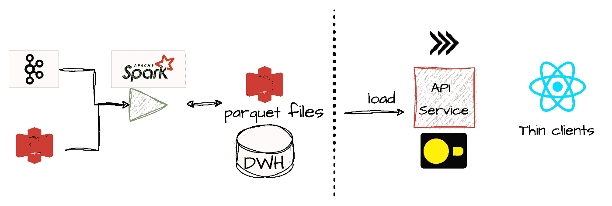

# 数据访问 API 无需复杂性即可访问数据湖表

> 原文：[`towardsdatascience.com/data-access-api-over-data-lake-tables-without-the-complexity-4deb68ee88b3?source=collection_archive---------3-----------------------#2023-09-28`](https://towardsdatascience.com/data-access-api-over-data-lake-tables-without-the-complexity-4deb68ee88b3?source=collection_archive---------3-----------------------#2023-09-28)

## 使用 DuckDB 和 Go 在 S3 数据湖文件上构建一个稳健的 GraphQL API 服务

[](https://medium.com/@alon.agmon?source=post_page-----4deb68ee88b3--------------------------------)[](https://towardsdatascience.com/?source=post_page-----4deb68ee88b3--------------------------------) [Alon Agmon](https://medium.com/@alon.agmon?source=post_page-----4deb68ee88b3--------------------------------)

·

[关注](https://medium.com/m/signin?actionUrl=https%3A%2F%2Fmedium.com%2F_%2Fsubscribe%2Fuser%2Fbcd1e3126cdc&operation=register&redirect=https%3A%2F%2Ftowardsdatascience.com%2Fdata-access-api-over-data-lake-tables-without-the-complexity-4deb68ee88b3&user=Alon+Agmon&userId=bcd1e3126cdc&source=post_page-bcd1e3126cdc----4deb68ee88b3---------------------post_header-----------) 发表在 [数据科学前沿](https://towardsdatascience.com/?source=post_page-----4deb68ee88b3--------------------------------) · 11 分钟阅读 · 2023 年 9 月 28 日[](https://medium.com/m/signin?actionUrl=https%3A%2F%2Fmedium.com%2F_%2Fvote%2Ftowards-data-science%2F4deb68ee88b3&operation=register&redirect=https%3A%2F%2Ftowardsdatascience.com%2Fdata-access-api-over-data-lake-tables-without-the-complexity-4deb68ee88b3&user=Alon+Agmon&userId=bcd1e3126cdc&source=-----4deb68ee88b3---------------------clap_footer-----------)

--

[](https://medium.com/m/signin?actionUrl=https%3A%2F%2Fmedium.com%2F_%2Fbookmark%2Fp%2F4deb68ee88b3&operation=register&redirect=https%3A%2F%2Ftowardsdatascience.com%2Fdata-access-api-over-data-lake-tables-without-the-complexity-4deb68ee88b3&source=-----4deb68ee88b3---------------------bookmark_footer-----------)

图片来源：[Joshua Sortino](https://unsplash.com/@sortino?utm_source=medium&utm_medium=referral) 选自 [Unsplash](https://unsplash.com/?utm_source=medium&utm_medium=referral)

# **1\. 简介**

数据湖表主要由数据工程团队使用大数据计算引擎（如 Spark 或 Flink）利用，也被数据分析师和科学家使用，后者使用重型 SQL 查询引擎（如 Trino 或 Redshift）创建模型和报告。这些计算引擎已成为访问数据湖数据的标准，因为它们被设计来有效处理大数据处理通常涉及的挑战：扫描大量数据，处理基于云的对象存储，读取和写入查询优化的格式化文件，如 Parquet 或 ORC 等。

然而，将大数据产品（或其某些汇总视图）通过某种 API 提供给*轻量客户端*，如内部微服务，也是一个常见的需求。假设我们有一个数据湖表，存储了由某些 Spark 应用生成的实时客户统计数据。这些数据可能主要用于内部报告，但对我们组织的其他服务也可能很有价值。尽管这是一个常见的需求，但它远非简单，主要因为它需要完全不同的工具集。将 S3 桶中的 parquet 文件提供给低延迟的 HTTP API 并不简单（尤其是当文件持续更新并且在提供之前需要进行某些转换时）。

为了使这种用例有效，我们通常需要一个能够以快速客户面向延迟处理查询的数据库。同样，我们需要一些 ETL 作业来处理和转换 S3 中的数据文件并将其加载到数据库中。最后，我们必须创建一个适当的 API 端点来服务客户的查询。


确实，如插图所示，提供给轻量客户端快速查询数据湖文件的能力通常会带来更多的移动部件和流程，以便要么将数据复制并摄取到更昂贵的客户面仓库中，要么将其汇总和转换以适应低延迟数据库。

本文的目的是探讨和演示一种不同且更简单的方法，利用轻量级的内进程查询引擎来解决这一需求。具体来说，我将展示如何使用内进程引擎，如*DuckDB*和*Arrow Data Fusion*，以创建能够处理数据湖文件和数据量*并且*作为快速内存存储来服务低延迟 API 调用的服务。采用这种方法，我们可以将所需的功能高效整合到一个可以水平扩展的单一查询服务中，该服务将加载数据、汇总并存储在内存中，并高效、快速地处理 API 调用。



接下来，第二部分将概述该服务的主要要求和构建模块，并解释它们如何帮助我们解决主要挑战。第三部分将*深入*服务的核心——数据加载和查询功能，并演示如何使用 DuckDB 和 Go 实现它。（本文将专注于 DuckDB 和 Go，但你可以在下面链接的仓库中找到使用 Arrow Data Fusion 实现这一概念的 Rust 实现）。第四部分将在其上添加 GraphQL API 服务层。第五部分将作结。

# 2. 主要构建模块

应注意，这种方法的基本假设是我们希望提供给 API 的数据可以适配到我们服务的内存中，或运行服务的机器中。对于某些用例来说，这可能是一个问题，但我认为这比看起来的限制要小。例如，我曾经使用这种方法处理一个包含 2M 记录和 10 列的内存关系表，内存使用量约为 350MB。我们往往忘记，我们实际*提供*的数据通常比我们存储或处理的数据要小得多。无论如何，这都是一个需要牢记的重要因素。

一个独立的服务，它将作为一个更简单、更有吸引力的替代方案来取代上述常见架构，应该至少满足以下要求：

+   它应该能够直接从我们的数据湖或对象存储中舒适地读取和转换数据文件。

+   它应该能够在内存中存储关系数据，并以低延迟响应查询。

+   它应该具备水平扩展性。

+   查询、转换和加载数据应该简单且声明性强——SQL 将是最方便的方法。

简而言之，我们希望创建一个可以直接从源加载和转换数据、有效存储数据并快速查询的服务，而不是扩展应用程序的基础设施，增加数据库和额外的 ETL 过程。

在我看来，这 3 个特性组合是*DuckDB*（本文的重点）和*Arrow Data Fusion*带来的最大优势之一。虽然内存数据库并不是新事物，但 DuckDB 和 Arrow Data Fusion 的颠覆性在于它们的可扩展性，这使得我们可以使用扩展轻松地添加能力，直接读取和写入不同格式和位置的数据，并且以规模化和快速的方式进行。

因此，我们的服务将由 3 个主要组件或层组成，这些组件或层将互相包装或封装：一个低级数据组件，它将封装一个 DuckDB 连接（我将其称为*DataDriver*），一个*DAO*组件，它将使用驱动程序来执行查询和处理 API 请求，以及一个提供服务的 API 解析器。


换句话说，依赖关系及其关系方面，我们有以下结构：

`**API-Resolver** *封装* 一个 **DAO 结构体** *封装* 一个 **DataDriver** **结构体** *封装* 一个 **DuckDB 连接**`

下一节将重点讨论较低层（DAO 结构体和 DataDriver），而接下来的部分将讨论顶部 API 层以及它如何将所有内容整合在一起。

# 3\. 数据加载和 DuckDB 查询

在这一部分，我们将创建一个封装 DuckDB 连接的驱动程序组件。它将负责初始化 DuckDB，并暴露一个接口来执行 SQL 语句和查询。我们将使用优秀的[go-duckdb](https://github.com/marcboeker/go-duckdb)库，它通过静态链接到其 C 库，为 DuckDB 提供了一个*database/sql*接口。

## 初始化 sql.DB 连接到 DuckDB

如前所述，我们将用一个名为*DuckDBDriver*的结构体封装*sql.DB*接口，该结构体将负责正确初始化它。我们通过使用 Connector 对象执行多个初始化语句（`bootQueries`）来初始化 DuckDB。该连接器执行设置 AWS 凭证的语句（因为我们要从 S3 加载数据），以及加载和安装我们的服务所需的扩展：*parquet*扩展（用于读取 parquet 文件）和*httpfs*（用于直接从基于 HTTP 的对象存储（如 S3）中读取数据）。

如上面的代码块所示，函数*getBootQueries*()简单地返回一组初始化语句作为字符串（你可以[在这里](https://github.com/a-agmon/gql-parquet-api/blob/757bef6325899b6669baef414335549bbd814e0a/pkg/data/duckdb.go#L18)查看这些语句）。初始化语句由连接器执行，因此当我们调用*OpenDB*()时，我们会得到一个已加载所需扩展和秘密的 DuckDB 作为 sql.DB 连接。由于 go-duckdb 为 DuckDB 连接提供了*database/sql*接口，因此其主要查询功能可以相当简单地实现和暴露：

如前所述，DuckDB 数据驱动程序结构体将简单地充当一个实用类，用于封装到 DuckDB 数据库的连接，而所有查询执行将由一个 DAO 结构体有效管理，该结构体将拥有一组使用驱动程序方法的业务逻辑函数。DAO 结构体将进一步封装 DuckDBDriver 结构体。

## 加载缓存数据

在服务数据后端初始化的最后阶段，我们将把我们想要提供的数据从 S3 中的 parquet 文件加载到内存表中。为此，我们将使用驱动程序的*execute*()函数和 CTAS 查询，该查询将使用我们可以在 SQL 中表达的任何变换创建一个命名表，从*read_parquet()*函数获取数据。一个示例将使这点更加清楚。

假设我们有一个包含描述我们 *users* 的数据的 parquet 表。我们想创建一个服务，该服务将仅从此 parquet 表中暴露 3 个字段以便于快速 API 访问：*name*、*last_name* 和 *age*。我们还希望确保 *age* 字段能够作为整数访问，尽管它在 parquet 文件中以字符串形式保存。

为此，在我们的 DuckDB 驱动程序初始化了所需的扩展，并设置了所需的 AWS 凭证后，我们只需执行一个 SQL 语句，将我们想要的数据直接从 S3 中的 parquet 文件加载到内存中，使用 *read_parquet()* 函数。

```py
CREATE TABLE Users AS 
SELECT NAME, LAST_NAME, CAST(AGE as integer)
FROM read_parquet('s3://somewhere/data/*')
```

在这个语句中，我们基本上创建了一个名为 *Users* 的内存表，它由我们从 parquet 文件中选择的字段组成，这些文件的位置在 *read_parquet()* 函数中给出。我们可以使用 DuckDB 支持的任何 SQL 函数和语法，包括复杂的查询语句和聚合。以下是如何使用这种方法初始化我们的服务的更完整示例。

这实际上是该服务的核心——当服务创建并启动时，它执行的语句基本上是从 S3 加载数据到其内存中。

在服务初始化并加载数据后，我们可以直接在内存表上执行所需的任何 SQL 查询，由我们的数据驱动程序表示，以便以子秒级延迟服务我们的 API。

# 4\. 提供 GraphQL 服务

现在我们已经连接到一个加载了缓存 parquet 数据的内存表，最后一步是创建一个 GraphQL 端点，以便高效地响应数据查询。为此，我们将使用库 [*gqlgen* by 99designs](http://github.com/99designs/gqlgen)，它使这项任务变得相当简单。

对 *gqlgen* 的深入介绍，不幸的是超出了我的范围。对于那些对 GraphQL 不太熟悉的读者，建议浏览其 [documentation](http://gqlgen.com)，文档非常清晰明了。然而，我相信对 GraphQL 概念的一些熟悉即可跟随本节内容并理解要点。

使用 gqlgen 暴露一个 GraphQL 端点通常涉及 3 个主要步骤：（1）创建架构，（2）生成解析器代码和存根，（3）添加实现 API 函数的解析器代码。

我们将从描述我们表中一个用户的架构开始，并提供两个主要函数来获取用户数据：一个通用的获取所有功能和一个按邮箱获取功能。

```py
scalar Time

type User {
  name: String!
  last_name: String!
  email: String!
  age: Int!
}

type Query {
  users: [User!]!
  getUsersByEmail(email: String!): [User!]!
}
```

创建架构后，我们在项目目录中调用 gqlgen 代码生成过程：

```py
go run github.com/99designs/gqlgen generate
```

运行 *generate* 过程将生成大量代码，包括实际的 *User* 结构（我们的数据模型结构）、相应的 *resolver* 声明模板和 *resolver implementation*。

让我们按顺序讨论这些内容。

解析器结构体是在一个名为*resolver.go*的文件中生成的，只有 2 个语句——一个没有属性或成员的结构体类型声明和一个将初始化它的构造函数（一个 new()方法）。正如我们将很快看到的那样，解析器是我们的 API 服务层，它为 API 的每个方法实现一个函数。*resolver.go*文件的目的是为了让我们向解析器注入任何所需的依赖项，或向其中添加任何我们需要的内容来处理 API 的查询。请记住，这正是我们 DAO 结构体的目的。我们的 DAO 结构体包装了 DuckDB 数据驱动程序，它持有对内存表的连接，并负责将 API 数据请求“翻译”为 SQL 查询。因此，我们只需*注入*一个初始化的 DAO 对象到解析器中，以便解析器可以使用它来执行查询。

```py
// resolver.go

type Resolver struct {
 dao *data.DAO // add a ref to our DAO
}

func NewResolver(dao *data.DAO) *Resolver {
 return &Resolver{dao: dao} //initialize our DAO
}
```

生成的下一个文件（每次我们运行*gqlgen generate*过程时都会重新生成）是*schema.resolvers.go*，它是解析器方法的实现。生成的*schema.resolvers*文件本质上包含了在模式中声明的 API 函数的方法签名。在我们的例子中，它将包括这 2 个方法。

```py
// schema.resolvers.go

func (r *queryResolver) GetUsersByEmail(ctx context.Context, email string)
 ([]*model.User, error) {

}
func (s *DAO) GetUsers() ([]*model.User, error) {
}
```

为了实现这些函数，我们首先需要在 DAO 结构体中拥有相应的方法，但为了举例说明，让我们先实现一个，然后完成所需的 DAO 代码。

```py
// schema.resolvers.go

func (r *queryResolver) Users(ctx context.Context) ([]*model.User, error) {
 res, err := r.dao.GetUsers()
 if err != nil {
  log.Printf("error getting users: %v", err)
  return nil, err
 }
 return res, nil
}
```

正如你所见，由于我们的 DAO 被注入到解析器结构体中，我们可以简单地通过我们的解析器调用其函数。这种结构使得 API 层的代码非常干净和简单。

现在让我们编写 DAO 结构体中所需函数的实际实现。正如你所见，所需的代码非常简单。虽然我使用了一些辅助函数（你可以在配套的 github repo 中看到），但*GetUsers()*函数只是对我们内存中的 DuckDB 表执行一个 SQL 查询，并构建一个用户列表（请记住，model.User 结构体是由 gqlgen 使用我们的模式生成的）。

```py
//dao.go

func (s *DAO) GetUsers() ([]*model.User, error) {
//QryAllUsers := "select * from users"
 rows, err := s.driver.Query(QryAllUsers)
 if err != nil {
  return nil, err
 }
 defer rows.Close()
 resultset, err := sqlhelper.ResultSetFromRows(rows)
 if err != nil {
  return nil, err
 }
 users := make([]*model.User, 0)
 for _, row := range resultset {
  user := newUserFromRow(row) // populate the user struct
  users = append(users, user)
 }
 return users, nil
}
```

现在我们基本上拥有了我们需要链在一起的所有层。也就是说，一个*数据驱动程序*结构体（封装了数据库连接），它被注入到一个*DAO 结构体*中，该结构体实现并作为所有所需 API 函数的接口，由解析器——我们的 API 处理程序调用。

组件和角色之间的关系通过它们在主*server.go*文件中的链式连接表达得非常清楚，该文件引导我们的服务及其依赖项。

```py
// server.go
dataDriver := data.NewDuckDBDriver(awsCred)
dataStore := data.NewStore(dataDriver) 
resolver := graph.NewResolver(dataStore)
srv := handler.NewDefaultServer(graph.NewExecutableSchema(graph.Config{Resolvers: resolver}))

http.Handle("/query", srv)
```

当我们的服务被初始化时，我们首先初始化我们的驱动程序，它获取与 DuckDB 内存存储的连接。接下来，我们将驱动程序注入到*NewStore*方法中，该方法创建一个 DAO 并使用驱动程序将数据从 parquet 文件加载到内存中。最后，我们将 DAO 结构体注入到 API 处理程序中，当服务 API 请求时它会调用其函数。

## 5\. 结论

这篇文章的目的是提供一种替代方法，使薄客户端能够访问数据湖表的 HTTP API。这个用例越来越普遍，通常需要在我们的管道中添加许多动态组件、监控和资源。在这篇文章中，我提出了一种更简单的替代方案，我相信它适用于许多用例。我演示了如何利用 DuckDB 的查询性能和扩展来使我们的服务能够从远程对象存储中加载数据，将其保存在内存中的关系表中，并使我们能够以亚秒级延迟进行查询。更一般地说，我试图举例说明 DuckDB 扩展为我们的服务带来的强大能力以及它如何容易嵌入。

希望这会对你有用！

+   附带的 GitHub 仓库及示例代码可以在[这里](https://github.com/a-agmon/gql-parquet-api)找到。

+   使用 Rust 和 Arrow Data Fusion 实现相同概念的 GitHub 仓库可以在[这里](https://github.com/a-agmon/rs-parquet-gql)找到。

** *所有图像，除非另有说明，均由作者提供*
