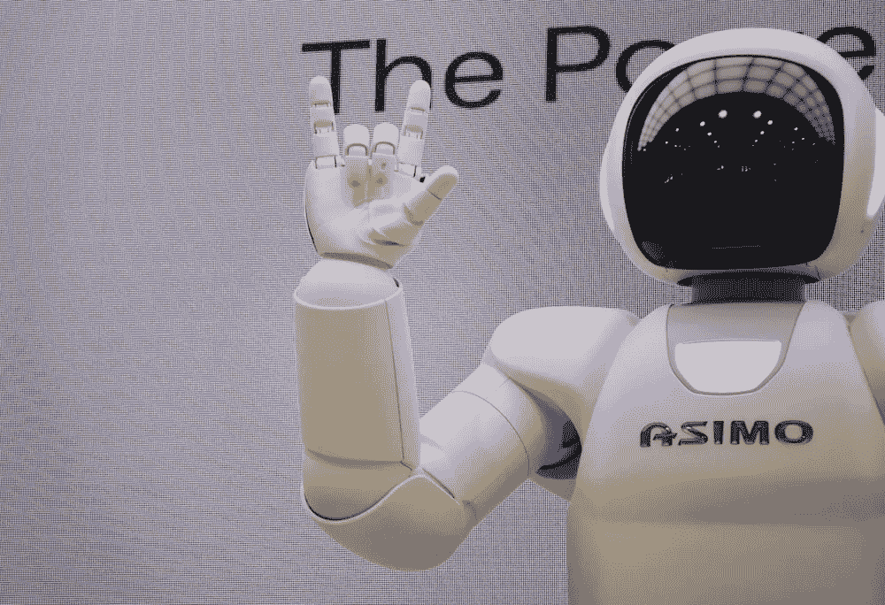

# 数据利他主义：企业引擎的数字燃料

> 原文：[`towardsdatascience.com/data-altruism-the-digital-fuel-for-corporate-engines-7896aee0a84c?source=collection_archive---------3-----------------------#2023-12-10`](https://towardsdatascience.com/data-altruism-the-digital-fuel-for-corporate-engines-7896aee0a84c?source=collection_archive---------3-----------------------#2023-12-10)

## 在人工智能时代处理数据的注意事项

 [Tea Mustać](https://medium.com/@tea.mustac?source=post_page-----7896aee0a84c--------------------------------)

·

[关注](https://medium.com/m/signin?actionUrl=https%3A%2F%2Fmedium.com%2F_%2Fsubscribe%2Fuser%2F109d4928877a&operation=register&redirect=https%3A%2F%2Ftowardsdatascience.com%2Fdata-altruism-the-digital-fuel-for-corporate-engines-7896aee0a84c&user=Tea+Musta%C4%87&userId=109d4928877a&source=post_page-109d4928877a----7896aee0a84c---------------------post_header-----------) 发表在 [Towards Data Science](https://towardsdatascience.com/?source=post_page-----7896aee0a84c--------------------------------) ·10 min 阅读·2023 年 12 月 10 日

--

图片由 [Gilles Lambert](https://unsplash.com/@gilleslambert) 提供，来源于 [Unsplash](https://unsplash.com/)

# 超越利润：数字时代的给予与获得

数字经济建立在平等、快速和免费的知识与信息获取的美好承诺上。这已经过去很久了。取而代之的是承诺中的平等，我们得到了由网络效应放大的权力不平衡，使用户被锁定在最受欢迎服务的提供者那里。然而，乍一看，用户似乎仍然没有付出任何费用。但这时，值得仔细观察一下，因为他们确实在付出代价。我们都在付出。我们为了访问某些服务，正在提供我们的数据（而且是大量数据）。与此同时，提供者在这不平衡的方程式的背后获得了天文数字的利润。这不仅适用于当前和成熟的社交媒体网络，也适用于不断增长的 AI 工具和服务。

在这篇文章中，我们将全面探讨这一“疯狂滑梯”，并从用户和提供者的角度进行考虑。当前现实中，大多数服务提供者依赖于黑暗模式的做法来尽可能获取数据，这只是其中一个选择。不幸的是，这正是我们所生活的现实。为了了解其他可能的情况，我们将从所谓的技术接受模型入手。这将帮助我们判断用户是否真正接受了*游戏规则*，或者只是无论后果如何都在追逐人工智能的炒作。一旦我们弄清楚这一点，我们将转向数据（如此慷慨地被赠予）的后续处理。最后，我们将考虑一些实用步骤和最佳实践解决方案，以便那些希望做得更好的 AI 开发者参考。

## a. 技术接受还是通过滑头方式获得同意？

技术接受模型绝不是一个新概念。相反，这一理论自 1989 年 Fred D. Davis 在他的《感知有用性、感知易用性和信息技术用户接受度》中提出以来，就一直是公众讨论的话题[[1]](#_ftn1)。正如标题所暗示的，这个观点的要旨在于用户对技术的有用性认知以及与技术互动时的用户体验，是决定用户是否愿意接受技术的两个关键因素。

对于许多 AI 技术而言，我们不需要考虑太久就能发现这一点。我们称许多 AI 系统为“工具”，这本身就足以表明我们确实将它们视为有用的。如果说有的话，那么至少是为了打发时间。此外，市场法则基本上要求只有最用户友好和美观的应用才能进入大规模受众。

如今，我们可以在戴维斯的方程中添加两个新因素，即网络效应和‘AI 炒作’。所以现在，不仅仅是如果你从未让 ChatGPT 纠正拼写或起草礼貌邮件你就像是一个穴居人，而且你还无法参与到四处发生的许多对话中，无法理解一半的头条新闻，而且你还显得在浪费时间，因为其他人都在利用这些*工具*。这对接受几乎任何呈现给你的东西的动机如何呢，尤其是当它被美丽的图形用户界面精心包装时？

图片由 [Possessed Photograph](https://unsplash.com/@possessedphotography) 在 [Unsplash](https://unsplash.com/) 提供

## b. 默认设置 — 强制性的利他主义

正如已经暗示的，我们似乎对将所有数据提供给许多 AI 系统的开发者持相当*开放*的态度。我们在互联网上留下了痕迹，对这些痕迹没有概览或控制权，显然还必须容忍商业行为者收集这些痕迹并用它们来制作炸鸡。这个比喻可能有些牵强，但它的含义仍然适用。看来我们必须容忍某些系统可能已经用我们的数据进行训练的事实，因为如果我们甚至无法确定所有数据的去向，如何能期望提供者弄清楚所有数据的来源，并相应地通知所有数据主体。

然而，有一件事我们目前默认是利他主义的，但在隐私和 GDPR 仍有一线生机的是在与给定系统互动时收集的数据，用于改进该系统或由同一提供者开发新模型。目前我们似乎无私地提供这些数据的原因，与前一段描述的原因有所不同。这里的利他主义更多地源于我们所处的法律状况不明以及对其许多漏洞和模糊性的滥用。（此外，用户在大多数情况下也更重视他们的钱而非隐私，但这现在无关紧要。）

例如，与 OpenAI 主动寻找每一个包含在训练模型的数据集中的个人不同，它完全可以通知其活跃用户他们的聊天记录将用于改进现有模型和训练新模型。这里是免责声明

> *“如上所述，我们可能会使用您提供的内容来改进我们的服务，例如训练支持 ChatGPT 的模型。有关如何选择退出我们使用您的内容来训练模型的说明，请参见这里。”*

由于几个原因，这种做法无法被接受。[[3]](#_ftn3) 首先，用户应该能够主动决定是否希望其数据用于改进服务提供者的服务，而不仅仅是能够在事后选择退出。其次，使用如‘可能’这样的词汇可能给普通用户一种非常错误的印象。这可能暗示这是仅在偶尔和特殊情况下才会发生的事情，而实际上这是一种常见的做法和行业黄金规则。第三，“驱动 ChatGPT 的模型”对于即使是对其实践非常了解的人来说也含糊不清。他们既没有提供关于他们使用的模型和如何训练这些模型的充分信息，也没有解释这些模型如何“驱动 ChatGPT”。

最后，在阅读他们的政策时，人们会得出这样的信念：他们只使用内容（大写的 C）来训练这些未知的模型。意思是他们仅仅使用

> “*个人信息包括在输入、文件上传或[用户]对[OpenAI]服务的反馈中*。”

然而，当我们考虑到 2023 年 3 月的丑闻时，这显然是不正确的，其中涉及一些用户的支付详情被共享给其他用户。[ [4]](#_ftn4) 如果这些支付详情已经进入模型，我们可以安全地假设，随附的姓名、电子邮件地址和其他账户信息也没有被排除在外。

当然，在这种描述的背景下，*数据利他主义*这一术语只能带有相当大的讽刺和反讽。然而，即使是对于那些并非明显撒谎关于他们使用哪些数据，也没有故意隐瞒他们使用数据目的的提供者，我们依然会遇到问题。例如，处理操作的复杂性可能导致隐私政策的过度简化，类似于 OpenAI 的情况，或者是无人愿意查看的难以理解的政策，更不用说阅读了。这两者最终都导致相同的结果，即用户同意任何必要的条款，只为能够访问服务。

现在，对这种观察的一个非常流行的回应是，我们所泄露的大部分数据对我们来说并不重要，那么为什么对其他人来说会重要？此外，我们凭什么对那些掌控世界的大型企业如此有趣？然而，当这些数据用于建立一个完全依赖于从全球数百万个地方收集的那些*微不足道的*数据点的商业模型时，这个问题就会有完全不同的视角。

## c. 作为商业模式的盗取数据？

要审视基于这些每天被随意抛弃的数百万个无关同意的商业模式，我们需要检查用户在放弃他们的数据时有多么*利他*。当然，当用户访问服务并在过程中放弃他们的数据时，他们也会以此获得服务。但这并不是他们唯一获得的东西。他们还会收到广告，或者可能得到一个二级服务，因为一级服务留给了订阅用户。更不用说这些订阅用户仍然在放弃他们的内容（以大写字母 C 表示），以及（至少在 OpenAI 的情况下）他们的账户信息。

因此，尽管用户为了使用工具或服务同意他们的数据可以被用于几乎任何用途，但他们所放弃的数据却被多次变现，以便为他们提供个性化广告和开发新的模型，这些模型可能再次采用免费增值（freemium）模式。撇开更为哲学性的问题，比如为什么银行账户上的数字比我们的生活选择和个人偏好更有价值，这似乎完全不符合逻辑，用户为了得到如此少的东西却要付出这么多。特别是因为我们讨论的数据对服务提供商至关重要，至少如果他们想保持竞争力的话。

然而，情况不必如此。我们不必等待新的具体 AI 法规来告诉我们该做什么和如何行为。至少在涉及个人数据时，GDPR 对其如何使用及其用途已经非常明确，无论上下文如何。

# 法律对此有何规定？

与版权问题不同，版权问题可能需要根据新技术重新解释法规，但数据保护则不能如此。数据保护在数字时代发展起来，并试图规范在线服务提供商的行为。因此，不能避免应用现有法规和遵守现有标准。是否以及如何做到这一点是另一个问题。

在这里，有几个事项需要考虑：

*1\. 同意是一种义务，而不是选择。*

如果不在用户实际开始使用工具之前告知他们个人数据和模型输入将用于开发新模型和改进现有模型，这是一大红旗。基本上是最红的那种。类似于收集 cookie 同意的同意弹窗是一个*必须*，而且是一个容易编程的。

另一方面，“支付或跟踪”（或在 AI 模型背景下的“支付或收集”）的概念，即用户决定是否愿意让 AI 开发者使用他们的数据，这一想法受到激烈争议，几乎无法合法实施。主要原因是，用户仍需自由选择接受或拒绝跟踪，这意味着价格必须相对较低（服务必须非常便宜），才能证明选择是自由的。更不用说，你必须履行承诺，不收集任何订阅用户的数据。由于 Meta 最近已经转向这一模式，数据保护机构也因此收到了一些投诉[[5]](#_ftn5)，因此有趣的是，欧盟法院将如何裁定此事。然而，当前，依赖合法同意是最安全的方式。

*2. 隐私政策需要更新*

提供给数据主体的信息需要更新，以包括整个 AI 系统生命周期中的数据处理。从开发、测试到部署。为此，所有复杂的处理操作需要转化为通俗易懂的语言。这绝非易事，但这是不可避免的。虽然同意弹窗不是合适的地方来做这件事，但隐私政策可能是。只要隐私政策直接链接到同意弹窗，就可以了。

*3. 发挥创造力*

翻译复杂的处理操作本身就是一项复杂的任务，但对于实现 GDPR 透明度标准来说绝对必要。无论你是想使用图形、图片、测验还是视频，你都需要找到一种方式来向普通用户解释他们的数据到底发生了什么。否则，他们的同意永远无法被视为知情和合法。因此，现在是时候动动脑筋，挽起袖子，投入到规划中去了。[[6]](#_ftn6)

图片由[Amélie Mourichon](https://unsplash.com/@amayli)拍摄，来源于[Unsplash](https://unsplash.com/)

[[1]](#_ftnref1) Fred D. Davis，《感知有用性、感知易用性与信息技术用户接受度》，MIS 季度刊，第 13 卷，第 3 期（1989 年），第 319–340 页，[`www.jstor.org/stable/249008?typeAccessWorkflow=login`](https://www.jstor.org/stable/249008?typeAccessWorkflow=login)

[[2]](#_ftnref2) Christophe Carugati，《平台监管者面临的“支付或同意”挑战》，2023 年 11 月 6 日，[`www.bruegel.org/analysis/pay-or-consent-challenge-platform-regulators`](https://www.bruegel.org/analysis/pay-or-consent-challenge-platform-regulators)。

[[3]](#_ftnref3) OpenAI，《隐私政策》，[`openai.com/policies/privacy-policy`](https://openai.com/policies/privacy-policy)

[[4]](#_ftnref4) OpenAI，3 月 20 日 ChatGPT 停机：发生了什么，[`openai.com/blog/march-20-chatgpt-outage`](https://openai.com/blog/march-20-chatgpt-outage)

[[5]](#_ftnref5) noyb，noyb 对 Meta 提起了关于“支付或同意”的 GDPR 投诉，[`noyb.eu/en/noyb-files-gdpr-complaint-against-meta-over-pay-or-okay`](https://noyb.eu/en/noyb-files-gdpr-complaint-against-meta-over-pay-or-okay)

[[6]](#_ftnref6) untools，六顶思考帽，[`untools.co/six-thinking-hats`](https://untools.co/six-thinking-hats)
