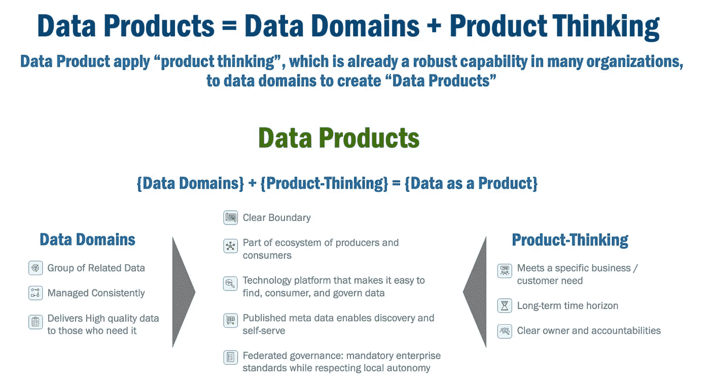
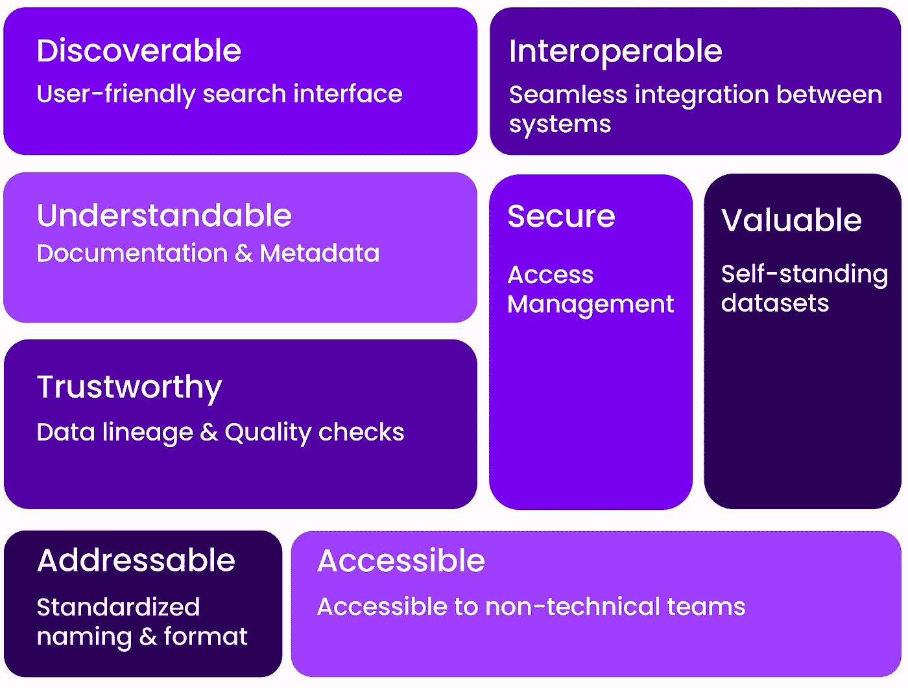
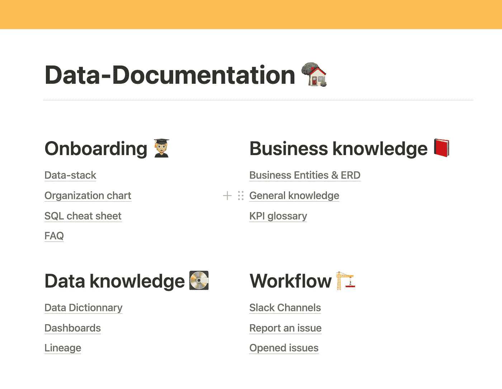

# 数据即产品：从概念到现实

> 原文：[`towardsdatascience.com/data-as-a-product-from-concept-to-reality-b2a853712250`](https://towardsdatascience.com/data-as-a-product-from-concept-to-reality-b2a853712250)

## 创建有效数据产品的蓝图

 [Louise de Leyritz](https://medium.com/@louise.de.leyritz?source=post_page-----b2a853712250--------------------------------)

·发表于[Towards Data Science](https://towardsdatascience.com/?source=post_page-----b2a853712250--------------------------------) ·阅读时间 11 分钟·2023 年 4 月 12 日

--

数据即产品 — 图片由[Castor](https://www.castordoc.com)提供

**数据即产品**的方法最近获得了广泛关注，因为公司希望最大化数据价值。

我坚信**数据即产品**的方法是我们为创造更好的[数据体验](https://www.castordoc.com/blog/dx-is-the-new-ux)所需的革命性变革，这是我心中珍视的概念。

关于数据体验的简要说明，以防你需要赶上进度：

数据曾经是技术团队的领域。但现在不再是。如今，数据驱动着公司内部的所有运营功能：销售、财务、营销、运营等。

商业用户已经成为数据用户，他们的体验即是**数据体验**。**数据体验**是这些领域专家在日常使用数据来增强工作能力时的感受。

截至今天，[数据体验](https://www.castordoc.com/blog/the-data-experience-is-broken)仍然不尽如人意。即使我们能产生高质量的数据，仍然难以找到、访问和理解。糟糕的数据体验导致业务团队对数据失去信任并失去兴趣。如果数据不能促进更好的决策，那收集数据又有什么意义呢？

数据即产品的方法简单却有效。它涉及思维方式的转变，将数据用户视为客户，突显出优先考虑其满意度的必要性。通过更好的概念化和呈现，这一方法力求提供卓越的**数据体验**。虽然我们会在后续详细探讨这一方法，但关键要点是将数据视为产品意味着将数据消费者放在首位。

我们如何在实践中实现这一转变？要实施数据即产品的方法，你需要改变你对**生成**和**提供**数据的方式。也就是说，你需要在生成数据**和**在数据生命周期内应用产品管理思维。希望将数据视为产品的公司往往会关注一个方面，而忽视另一个方面。

本文将带你了解这两个步骤：

1.  在数据创建中利用产品管理思维

1.  将产品管理应用于数据呈现和交付

在本文中，术语“数据产品”和“数据即产品”将交替使用，指的是**数据被视为产品**。

# I. 在数据创建中利用产品管理思维

数据即产品的概念始于最基础的层面——你的思维方式。不仅要理解这一点，还要在整个组织中嵌入数据即产品的思维。

将数据视为产品意味着将传统产品开发中使用的相同原则和实践应用于你的数据项目。

那么，在实际生活中将数据视为产品到底意味着什么？埃里克·布罗达解释了数据产品是通过将产品思维应用于数据领域而产生的，正如下图所示。

图片由埃里克·布罗达提供

现实生活中的产品：

+   分配给一个明确的**负责人**进行产品开发和管理。

+   遵循**具体的业务和客户需求**，为特定目的和目标受众量身定制。

+   以**长期视角**进行开发，由产品负责人制定持续改进和成功的计划。

实际操作中这意味着什么？

[威廉·安吉尔](https://www.youtube.com/watch?v=jwdSUWWn-6o)，[Caribou](https://www.caribou.com)的数据工程高级技术产品经理，建议在以产品管理思维处理分析时，在数据创建阶段分配额外时间是很重要的。与其直接跳入构建仪表盘或预测模型，不如首先考虑谁将使用它，以及它将如何对他们产生价值。‍

> *“很多人认为在构建项目时这种方法是自然而然的。但很多时候，情况却是车子在马前面，我们使用模型是因为它们的准确性，而不是它们的业务影响。”威廉·安吉尔，数据工程高级技术产品经理*‍

通过采用产品管理思维，可以确保所创建的分析对业务及其用户具有实际价值。

在数据创建之前采用产品管理思维是提供可靠数据产品的初始阶段。然而，仅此是不够的。在现实中，一旦产品创建完成，它还需要被包装和呈现给客户。这是下一节的主题。

# II. 将产品管理应用于数据展示和交付

许多组织在数据生产阶段引入了产品管理思维，然后就不再关注数据。但如果你把数据当作产品来看待，你必须考虑数据的整个**生命周期**。

让我们考虑一下实体产品的生命周期。一个实体产品会被创建、使用，最终被丢弃。如果你要以可持续的方式创建这个产品，你需要考虑整个生命周期，并计划安全使用、存储以及产品生命周期结束时的最终处置。数据的背景下又意味着什么呢？

> *“当涉及到数据时，必须考虑如何存储和记录数据，以及数据将如何被利用。” 数据工程高级技术产品经理 William Angel*

为确保数据产品得到有效管理和利用，应考虑一些特定的特征。这些特征来自 Zhamak Dehghani 关于数据网格的工作。我们在这里简要介绍它们，并解释如何在实践中实现这些特征。

可靠数据产品的特征——图片来源于[Castor](https://www.castordoc.com/)

# 可发现性

可靠的数据产品的第一个特征是可发现性。一个很好的指标是，当数据团队不再被视作数据目录时，即数据消费者能够自主找到他们数据问题的答案。

这意味着**公司里的每个人都知道在哪里以及如何找到适合他们特定项目的最佳数据**。即使数据是混乱的，即使有 20 个表格具有相同的名称。

那么，“好”的标准是什么呢？当团队能够轻松浏览混乱的数据，并且毫不费力地识别出哪些是最受欢迎且最新的表格，而无需询问同事或上司时，数据就具备了可发现性。

你有两种利益相关者在寻找数据：一种是寻找特定数据集的人，另一种是浏览文档以了解数据全貌的人。数据应该对这两种人都具有可发现性。

确保这一点的最简单方法是将数据目录插件集成到你的数据堆栈上，以便于搜索和探索。如果你没有数据目录，你的数据文档可能会散布在不同的工具中：

+   用于一般知识和入职培训的 Wiki 页面

+   用于描述和标签的代码库（如果你使用代码注释）

+   用于管理问题和请求的 JIRA 或 Gitlab

+   用于部落知识的 Slack 频道

即使你还不能将这些与数据目录合并，你至少可以制作一个主页，汇集所有有用的链接。

使用 Notion 构建数据文档入口 — 图片来自于[Castor](https://www.castordoc.com/)

# 可理解的

人们理解数据集的前提是**意识到这些数据将满足的需求、内容和位置**。没有上下文的数据是毫无价值且危险的。一旦找到相关的数据集，你完成了 10%的工作。现在，你需要通过一系列问题的检查清单，以确保你理解你正在使用的数据。如果你不能回答以下问题，你就不理解你的数据。

+   数据来源于哪里？

+   数据流向哪里，并且流入了哪些下游表格？

+   谁拥有它/谁对它负责？

+   在我的领域中，某个字段的含义是什么？

+   为什么这很重要？

+   这个表格最后一次更新时间是什么时候？

+   这些数据的上下游依赖关系是什么？

+   这些数据是生产质量的数据吗？

当**所有相关知识都与数据关联**时，人们才能真正理解数据。理解是主观的。机器学习工程师会以不同于数据分析师的方式来处理数据集。这就是为什么所有的理解都需要将所有**相关知识层**与数据集关联起来。

应用良好的文档原则本质上意味着为数据提供正确的上下文。如上所述，传统文档帮助数据用户理解数据集的目的和字段的含义。在此基础上，你可以以显著的方式指定数据集所有者，让数据用户知道谁负责某个数据集。

最后，**数据血缘**是跟踪数据历史的过程，当数据经过一系列转换，如数据提取、清洗、丰富和存储时，它有助于理解数据元素的来源、转化和依赖关系。血缘功能帮助数据用户回答诸如“这些数据的上下游依赖关系是什么？”这样的问题。

# 可靠的

数据产品应当可靠和值得信赖。利益相关者应对其可用性感到有信心。

数据信任可以通过提供关于数据使用和数据来源的完整透明度来实现，这需要强大的血缘功能。它有助于理解数据元素的来源、转化和依赖关系。血缘功能帮助数据用户回答诸如“这些数据的上下游依赖关系是什么？”这样的问题。

‍

数据血缘可视化 — 图片来自于[Castor](https://www.castordoc.com/)

另一种建立信任的方法是围绕[透明度](https://www.castordoc.com/blog/transparency-for-trust)构建你公司内人员使用数据的透明度。这使得员工可以学习专家的**最佳实践**。

当人们知道可信赖的同事已经查询和使用了数据时，他们可以更好地推断该数据集是可信的。获得社会验证，证明数据有价值，有助于建立数据信任。

另一种弥合信任差距的方法是遵守已批准的数据产品服务水平协议（SLA）：

1.  变化间隔和及时性

1.  完整性

1.  新鲜度、通用性和性能

这基本上指的是数据质量检查，数据必须通过这些检查。这些检查可以手动进行，也可以通过自动化工具进行，并涉及将数据与一套定义好的规则或标准进行验证，以确保其符合所需的质量标准。使这些质量检查对每个数据集都可访问，对于帮助用户理解数据非常有帮助。‍

# 可寻址性

数据产品应该有一个唯一的标识符或地址，使其可以被轻松访问和使用。

数据产品的可寻址性意味着为其提供一个独特、易于找到的位置，以便其他人可以访问它。可以把它想象成房子的街道地址。就像你需要一个具体的地址来找到房子一样，数据消费者需要一个独特的地址来访问你的数据产品。

地址应该遵循一套规则和标准，以便每个人都可以轻松找到它，并以相同的方式使用，无论他们是谁或使用什么系统。这使得人们能够轻松找到、使用和理解你的数据产品。‍

# 可访问性

当数据产品被称为“可访问”时，这意味着它们可以被用户轻松获取或到达。这可能意味着数据可以随时使用，或者获取数据的过程对于用户来说简单方便。

如果你要提供数据背景，应该通过正确的接口进行。并非所有团队成员都具有相同的技术专长，也并非所有团队都有相同的数据需求。

例如，如果你在 dbt 中记录数据，你不能指望市场团队去那里获取文档。背景信息应该在对业务团队友好的工具中提供。

# 安全性

数据产品必须安全以保护敏感信息这并不令人惊讶。不论数据如何处理，安全始终是一个问题。然而，对于数据产品来说，安全变得特别具有挑战性，因为它们必须既是**可发现的**又是**可访问的**。你如何在实施强安全措施的同时使其可访问呢？

管理隐私和安全风险可以通过实施一些关键策略来实现。为了保护个人信息，投资于适当的**文档**并建立明确的**数据共享协议**是很重要的。此外，实施**访问控制**和遵循**数据最小化**实践可以帮助降低安全风险，并确保敏感信息的安全。这些策略需要一整篇文章来解释。幸运的是，我们[写了一篇](https://www.castordoc.com/blog/data-sharing-challenges)。

确保数据共享、隐私和安全之间的兼容性 — 图片来源于[Castor](https://www.castordoc.com/)

# 可互操作

数据产品应该与其他数据产品和系统兼容，实现无缝集成。可互操作性意味着不同的数据产品可以协同工作并相互通信，而不会出现问题。

即使它们是由不同的人或组织创建的，也可以共享信息并一起使用。这使得人们更容易使用并从这些数据产品中受益。

为确保你的数据产品能够与其他产品良好配合，你需要遵循以下步骤：

1.  使用常见且公认的数据格式和结构标准。

1.  使用其他人可以轻松使用的开放数据格式。

1.  编写清晰的说明和信息，告知他人如何正确使用你的数据产品。

1.  为你的数据使用清晰的名称，以便他人可以轻松理解数据的含义。

1.  测试你的数据产品与其他系统的兼容性，以确保其正常工作。

# 自身具有价值

数据产品应该为用户提供价值，即使在不与其他数据产品结合的情况下。

数据产品必须自身具有价值，因为如果没有价值，人们就不会使用它们。仅仅拥有数据是不够的 — 数据需要为用户提供实际价值。这种价值可以表现为洞察、知识或问题的解决方案。

为了使数据产品具有价值，数据产品经理（DPM）需要关注用户的需求和期望。在设计数据产品时，DPM 应该尝试弄清楚用户要解决什么问题，然后围绕这些问题设计解决方案。将数据生产者与业务战略对齐是确保数据能够为消费者提供洞察的最佳方式。

# 结论

为了创建数据即产品的方法，你需要转变思维方式，将数据视为需要生产、打包并提供给客户的产品。

这需要公司内部对数据生产方式进行新的思考。实际上，数据产品是将产品思维引入数据领域的结果。现实生活中的产品以用户为中心并具有明确的所有者。这两个来自产品管理的组件应该被引入数据领域，以构建可靠的数据产品。

但应用产品管理思维不应仅限于生产阶段。交付高质量数据产品的第二步是打包和展示数据，确保数据提供了合适的背景，使人们**能够找到、理解和信任它**。通过遵循这些步骤，你可以将数据转化为推动业务决策并提升整体[数据体验](https://www.castordoc.com/blog/dx-is-the-new-ux)的宝贵资产。

‍

# 关于我们

我们撰写了有关利用数据资产的所有过程：包括[现代数据堆栈](https://notion.castordoc.com/)、数据团队组成和数据治理。我们的[博客](https://www.castordoc.com/resources/blog)涵盖了从数据中创造实际价值的技术和非技术方面。

在 Castor，我们正在为 Notion、Figma、Slack 一代构建一个数据文档工具。

想看看吗？[联系我们](https://www.castordoc.com/try-castor)，我们将向您展示一个演示。

‍

‍

*最初发表于* [*https://www.castordoc.com*](https://www.castordoc.com/blog/data-as-a-product-from-concept-to-reality)*.*
