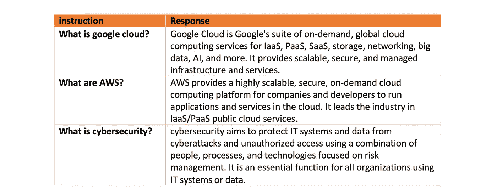

# HuggingFace 中的数据整理器

> 原文：[`towardsdatascience.com/data-collators-in-huggingface-a0c76db798d2`](https://towardsdatascience.com/data-collators-in-huggingface-a0c76db798d2)

## 它们是什么以及它们的功能

[](https://medium.com/@mina.ghashami?source=post_page-----a0c76db798d2--------------------------------)[](https://towardsdatascience.com/?source=post_page-----a0c76db798d2--------------------------------) [Mina Ghashami](https://medium.com/@mina.ghashami?source=post_page-----a0c76db798d2--------------------------------)

·发表于 [数据科学前沿](https://towardsdatascience.com/?source=post_page-----a0c76db798d2--------------------------------) ·9 分钟阅读·2023 年 11 月 8 日

--


图片来自 [unsplash.com](https://unsplash.com/photos/assorted-source-codes-sp1BZ1atp7M)

当我开始学习 HuggingFace 时，数据整理器是我最不直观的组件之一。我很难理解它们，而且没有找到足够好的资源来直观地解释它们。

在这篇文章中，我们将探讨数据整理器是什么，它们有何不同，以及如何编写自定义的数据整理器。

# 数据整理器：高级

数据整理器是 HuggingFace 中数据处理的关键部分。我们在对数据进行标记化后，都会使用它们，然后将数据传递给 Trainer 对象来训练模型。

> 简而言之，它们将样本列表整理成一个小型训练批次。它们的功能取决于它们所定义的任务，但至少会对输入样本进行填充或截断，以确保小批次中的所有样本长度相同。典型的小批量大小范围从 16 到 256 个样本，具体取决于模型大小、数据和硬件限制。

数据整理器是**任务特定的**。每个以下任务都有一个数据整理器：

+   因果语言建模（CLM）

+   掩码语言建模（MLM）

+   序列分类

+   Seq2Seq

+   标记分类

*一些数据整理器很简单*。例如，对于“序列分类”任务，数据整理器只需填充小批量中的所有序列以确保它们长度相同。然后将它们连接成一个张量。

*一些数据整理器非常复杂*，因为它们需要处理该任务的数据处理。

# 基本数据整理器

最基本的两个数据整理器如下：

[**1)DefaultDataCollator**](https://github.com/huggingface/transformers/blob/v4.35.0/src/transformers/data/data_collator.py#L78)**:** 这不进行任何填充或截断。它假设所有输入样本的长度相同。如果你的输入样本长度不一致，这会引发错误。

```py
import torch
from transformers import DefaultDataCollator

texts = ["Hello world", "How are you?"]

# Tokenize
from transformers import AutoTokenizer
tokenizer = AutoTokenizer.from_pretrained('bert-base-uncased')
tokens = [tokenizer(t) for t in texts]

# Default collate function 
collate_fn = DefaultDataCollator()

# Pass it to dataloader
dataloader = torch.utils.data.DataLoader(dataset=tokens, collate_fn=collate_fn, batch_size=2) 

# this will end in error
for batch in dataloader:
    print(batch)
    break
```

令牌化后的输出是：

```py
[{'input_ids': [101, 7592, 2088, 102], 'token_type_ids': [0, 0, 0, 0], 'attention_mask': [1, 1, 1, 1]},
 {'input_ids': [101, 2129, 2024, 2017, 1029, 102], 'token_type_ids': [0, 0, 0, 0, 0, 0], 'attention_mask': [1, 1, 1, 1, 1, 1]}]
```

如你所见，两个序列的长度不同。第一个序列有 4 个标记，第二个序列有 6 个标记。这是在调用数据加载器时出现错误的原因！

现在如果我们将输入更改为两个相同长度的序列，例如：

```py
texts = ["Hello world", "How are"]
```

然后代码运行正常，输出将是：

```py
{'input_ids': tensor([[ 101, 7592, 2088,  102],
                      [ 101, 2129, 2024,  102]]), 
'token_type_ids': tensor([[0, 0, 0, 0],
                          [0, 0, 0, 0]]), 
'attention_mask': tensor([[1, 1, 1, 1],
                          [1, 1, 1, 1]])}
```

请注意，它不返回`labels`。

[**2) DataCollatorWithPadding**](https://github.com/huggingface/transformers/blob/v4.35.0/src/transformers/data/data_collator.py#L215)**:** 这个整理器填充输入样本，使它们都具有相同长度。对于填充，

+   它要么填充到提供的`max_length`参数。

+   或者它填充到批次中最长的序列。

查看 [文档](https://github.com/huggingface/transformers/blob/v4.35.0/src/transformers/data/data_collator.py#L215) 获取更多详细信息。

此外，这个整理器接受*tokenizer*，因为许多标记器有不同的填充标记，因此**DataCollatorWithPadding**接受标记器来确定填充序列时的填充标记。

```py
import torch
from transformers import DataCollatorWithPadding

texts = ["Hello world", "How are you?"]

# Tokenize
from transformers import AutoTokenizer
tokenizer = AutoTokenizer.from_pretrained('bert-base-uncased')
tokens = [tokenizer(t) for t in texts]

# Default collate function 
collate_fn = DataCollatorWithPadding(tokenizer, padding=True) #padding=True, 'max_length'

dataloader = torch.utils.data.DataLoader(dataset=tokens, collate_fn=collate_fn, batch_size=2) 

for batch in dataloader:
    print(batch)
    break
```

上述代码的输出是：

```py
{'input_ids': tensor([[ 101, 7592, 2088,  102,    0,    0],
                      [ 101, 2129, 2024, 2017, 1029,  102]]), 
'token_type_ids': tensor([[0, 0, 0, 0, 0, 0],
                          [0, 0, 0, 0, 0, 0]]), 
'attention_mask': tensor([[1, 1, 1, 1, 0, 0],
                          [1, 1, 1, 1, 1, 1]])}
```

注意第一个序列的 4 个标记现在填充为 6 个标记。在`bert-base-uncase`标记器中，填充标记的 ID 是 0。让我们在代码中查看：

```py
print(tokenizer.special_tokens_map)
print()
```

这段代码输出：

```py
{'unk_token': '[UNK]', 'sep_token': '[SEP]', 'pad_token': '[PAD]', 'cls_token': '[CLS]', 'mask_token': '[MASK]'}
```

`pad_token = [PAD]` 是用于填充的标记。让我们检查它的 token_id。

```py
print(tokenizer.convert_tokens_to_ids('[PAD]'))
```

这输出为`0`。

请注意，与 DefaultDataCollator 类似，DataCollatorWithPadding 不创建`labels`。如果你的数据中已经有标签，它们会返回，但否则不会创建！！

简而言之，如果你的标签简单明了，且数据在喂给模型进行训练之前不需要任何特殊处理，则使用这两个整理器。

# 语言建模数据整理器

语言建模数据整理器有两种模式：

+   MLM 数据整理器：这是用于掩码语言建模的，我们掩盖 15%的标记，模型进行预测。

+   CLM 数据整理器：这是用于因果语言建模的，我们掩盖当前标记右侧的所有标记，并期望模型在每一步预测下一个标记。

在代码中，MLM 整理器是：

```py
collate_fn = DataCollatorForLanguageModeling(tokenizer=tokenizer, mlm=True, mlm_probability=0.15)
```

CLM 整理器是：

```py
collate_fn = DataCollatorForLanguageModeling(tokenizer=tokenizer, mlm=False)
```

让我们看看 MLM 整理器的例子：

```py
from transformers import DataCollatorForLanguageModeling
from transformers import AutoTokenizer
import torch

## input text
texts = [
  "The quick brown fox jumps over the lazy dog.",
  "I am learning about NLP and AI today"  
]

## tokenize
tokenizer = AutoTokenizer.from_pretrained('bert-base-uncased')

data = [tokenizer(t) for t in texts] 

## MLM collator
collate_fn = DataCollatorForLanguageModeling(tokenizer=tokenizer, mlm=True, mlm_probability=0.15)

## pass collator to dataloader
dataloader = torch.utils.data.DataLoader(data, collate_fn=collate_fn, batch_size=2)

## let's look at one sample
for batch in dataloader:
    print(batch)
    break
```

它输出如下内容：

```py
{'input_ids': tensor([[  101,  1996,  4248,  2829,  4419, 14523,  2058,  1996, 13971,  3899,
          1012,   102],
                      [  101,  1045,  2572,   103,  2055, 17953,  2361,  1998,  9932,  2651,
           102,     0]]), 
'token_type_ids': tensor([[0, 0, 0, 0, 0, 0, 0, 0, 0, 0, 0, 0],
                          [0, 0, 0, 0, 0, 0, 0, 0, 0, 0, 0, 0]]), 
'attention_mask': tensor([[1, 1, 1, 1, 1, 1, 1, 1, 1, 1, 1, 1],
                          [1, 1, 1, 1, 1, 1, 1, 1, 1, 1, 1, 0]]), 
'labels': tensor([[-100, -100, -100, -100, -100, -100, -100, -100, -100, -100, -100, -100],
                  [-100, -100, -100, 4083, -100, -100, -100, -100, -100, -100, -100, -100]])}
```

注意几点：

**1)** 两个示例的`input_ids`都以`101`开头，以`102`结尾。在第二个示例中，`102`之后有一个`0`，我们已经知道这是填充标记。让我们看看`101`和`102`是什么？

```py
print( tokenizer.decode(101), tokenizer.decode(102))
## prints [CLS] and [SEP]
```

它分别打印`[CLS]`和`[SEP]`标记。

**2)** 它返回`labels`，不同于基本的数据整理器。我们看到标签中有很多`-100`。请注意，每个样本的`labels`长度与`input_ids`的长度相同！标签为`-100`的地方意味着对应的标记没有被屏蔽，因此在计算损失时我们需要忽略这些位置。MLM 使用交叉熵损失函数，如果你查看[文档](https://pytorch.org/docs/stable/generated/torch.nn.CrossEntropyLoss.html)，默认的`ignore_index=-100`；这意味着如果标签设置为`-100`则忽略。

第三点需要注意的是，对于第一个示例，标签是`[-100, -100, -100, -100, -100, -100, -100, -100, -100, -100, -100, -100]`，这意味着没有任何标记被屏蔽。然而，对于第二个输入，标签是`[-100, -100, -100, 4083, -100, -100, -100, -100, -100, -100, -100, -100]`，我们看到有一个标记被屏蔽，其对应的标签是`4083`。`input_ids`中的对应标记是`103`，这是`[MASK]`标记的 token_id。

CLM 数据整理器要简单得多，因为它用于因果语言建模，即预测下一个标记。我们来看一个示例：

```py
from transformers import DataCollatorForLanguageModeling
from transformers import AutoTokenizer

texts = [
  "The quick brown fox jumps over the lazy dog.",
  "I am learning about NLP and AI today"  
]

# Tokenize
from transformers import AutoTokenizer
tokenizer = AutoTokenizer.from_pretrained('bert-base-uncased')
tokens = [tokenizer(t) for t in texts]

collate_fn = DataCollatorForLanguageModeling(tokenizer=tokenizer, mlm=False)
dataloader = torch.utils.data.DataLoader(data, collate_fn=collate_fn, batch_size=2)

for batch in dataloader:
    print(batch)
```

输出如下：

```py
{'input_ids': tensor([[  101,  1996,  4248,  2829,  4419, 14523,  2058,  1996, 13971,  3899,
          1012,   102],
                      [  101,  1045,  2572,  4083,  2055, 17953,  2361,  1998,  9932,  2651,
           102,     0]]), 
'token_type_ids': tensor([[0, 0, 0, 0, 0, 0, 0, 0, 0, 0, 0, 0],
                          [0, 0, 0, 0, 0, 0, 0, 0, 0, 0, 0, 0]]), 
'attention_mask': tensor([[1, 1, 1, 1, 1, 1, 1, 1, 1, 1, 1, 1],
                           [1, 1, 1, 1, 1, 1, 1, 1, 1, 1, 1, 0]]), 
'labels': tensor([[  101,  1996,  4248,  2829,  4419, 14523,  2058,  1996, 13971,  3899,
          1012,   102],
                  [  101,  1045,  2572,  4083,  2055, 17953,  2361,  1998,  9932,  2651,
           102,  -100]])}
```

你会看到在这两个示例中，标签是`input_ids`的副本。这是因为在因果语言建模中，任务是预测给定所有先前标记的下一个标记，而某个位置的标签就是该标记本身。

# 自定义数据整理器

假设你有一个数据集，包含两列：*指令*和*响应*。



作者提供的图像

你想对一个预训练模型进行*指令调优*。不深入细节，我们注意到我们需要一个自定义数据整理器来仅屏蔽响应而不是指令。

假设我们写一个函数，将两列合并成以下格式：

`下面是一个描述任务的指令。写一个适当完成请求的响应。 ### 指令: {instruction} ### 响应: {response} ### 结束`

数据现在看起来是这样的：


作者提供的图像

我们看到有特殊标记：

+   ### 指令

+   ### 响应

+   ### 结束

那么让我们开始编写自定义数据整理器。我们希望有一个仅屏蔽响应而不屏蔽指令的数据整理器。为什么？因为我们希望模型生成响应而不是指令。

```py
from typing import Any, Dict, List, Tuple, Union
import numpy as np

from transformers import AutoModelForCausalLM
from transformers import AutoTokenizer
from transformers import TextDataset, DataCollatorForLanguageModeling
from transformers import Pipeline, PreTrainedTokenizer

RESPONSE_KEY = f"### Response:\n"

class DataCollatorForCompletionLM(DataCollatorForLanguageModeling):    
    def torch_call(self, examples: List[Union[List[int], Any, Dict[str, Any]]]) -> Dict[str, Any]:

        # The torch_call method overrides the same method in the base class and 
        # takes a list of examples as input.  
        batch = super().torch_call(examples)

        labels = batch["labels"].clone()

        # The code then encodes a special token, RESPONSE_KEY_NL, 
        # representing the end of the prompt followed by a newline. 
        # It searches for this token in the sequence of tokens (labels) 
        # and finds its index.
        response_token_ids = self.tokenizer.encode(RESPONSE_KEY)

        for i in range(len(examples)):

            response_token_ids_start_idx = None
            for idx in np.where(batch["labels"][i] == response_token_ids[0])[0]:
                response_token_ids_start_idx = idx
                break

            if response_token_ids_start_idx is None:
                # If the response token is not found in the sequence, it raises a RuntimeError. 
                # Otherwise, it determines the end index of the response token.
                raise RuntimeError(
                    f'Could not find response key {response_token_ids} in token IDs \
                    {batch["labels"][i]}'
                )

            response_token_ids_end_idx = response_token_ids_start_idx + 1

            # To train the model to predict only the response and ignore the prompt tokens, 
            # it sets the label values before the response token to -100\. 
            # This ensures that those tokens are ignored by the PyTorch loss function during training.
            labels[i, :response_token_ids_end_idx] = -100

        batch["labels"] = labels

        return batch
```

这个数据整理器找到`###Response: \n`的位置，并将该位置之前的任何标记的标签更改为`-100`。这样，损失函数将忽略这些标记。

当我们调用数据整理器时，我们使用它如下：

```py
data_collator = DataCollatorForCompletionLM(
        tokenizer=tokenizer, mlm=False, return_tensors="pt"
)
```

像往常一样，我们在进行模型训练之前，在训练对象中使用这个数据整理器。

# 结论

在这篇文章中，我们深入探讨了 HuggingFace 中的数据收集器。我们了解到数据收集器负责填充序列，使得批次中的所有样本长度相同。我们还看到了四种不同的数据收集器示例。其中一个重要的数据收集器是 `DataCollatorForLanguageModeling`，它用于 MLM 和 CLM 训练。我们还看到了如何修改数据收集器以进行指令调优的示例。

如果你有任何问题或建议，请随时联系我：

电子邮件: mina.ghashami@gmail.com

LinkedIn: [`www.linkedin.com/in/minaghashami/`](https://www.linkedin.com/in/minaghashami/)
