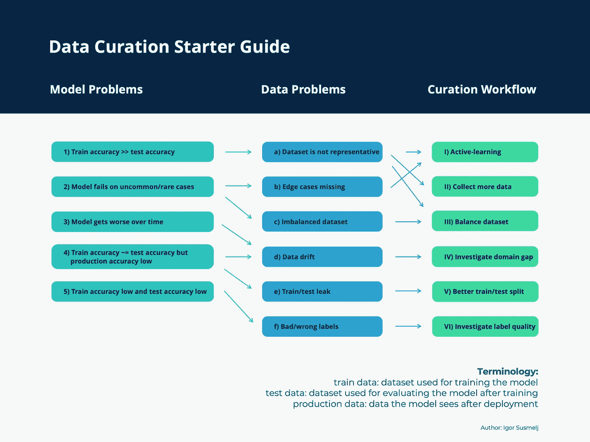
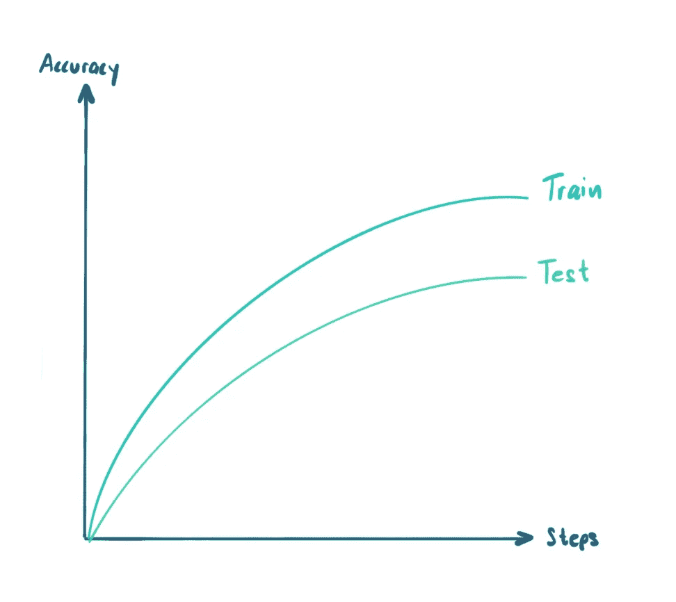
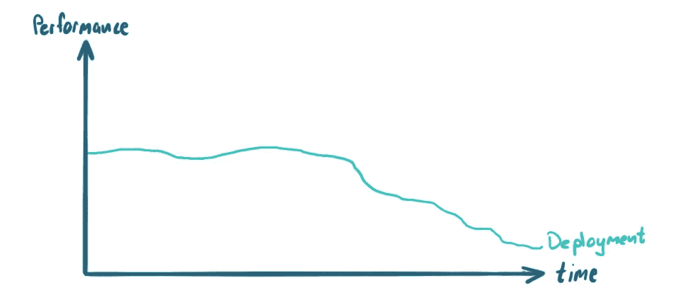

# 计算机视觉数据整理指南

> 原文：[`towardsdatascience.com/data-curation-guide-for-computer-vision-acc525f4cd7`](https://towardsdatascience.com/data-curation-guide-for-computer-vision-acc525f4cd7)

## **计算机视觉中的数据整理缺乏标准化，导致许多从业者不确定如何正确进行。我们总结了一些最常见的方法。**

 [伊戈尔·苏斯梅尔](https://medium.com/@isusmelj?source=post_page-----acc525f4cd7--------------------------------)

·发表于[Towards Data Science](https://towardsdatascience.com/?source=post_page-----acc525f4cd7--------------------------------) ·阅读时间 10 分钟·2023 年 3 月 9 日

--

从哪里开始数据整理？瓦伦丁·安东努奇的图片：[`www.pexels.com/de-de/foto/person-die-kompass-halt-691637/`](https://www.pexels.com/de-de/foto/person-die-kompass-halt-691637/)

本文是以计算机视觉中的数据整理为背景编写的。然而，一些概念可以应用于其他数据领域，如自然语言处理、音频或表格数据。

# 什么是数据整理？

数据整理是一个广泛使用的术语，特别是在[数据驱动的人工智能](https://datacentricai.org/)领域。理解数据整理在机器学习中的组成部分非常重要。我们理解数据整理包括以下几个组成部分：

+   **数据清理和归一化** — 删除“损坏”样本或尝试纠正它们的过程

+   **数据选择** — 根据特定任务的重要性对数据进行排序的过程

## 机器学习中的数据清理

理解**结构化数据的数据清理**最简单的方法是考虑表格数据。假设你在一家银行从事一个项目，想要根据客户的来源分析他们的支出。你的数据在一个 CSV 文件中，你发现位置信息缺失。一些条目存在拼写错误，例如城市拼写错误或完全缺失的条目。你现在可以选择通过删除所有“损坏”的条目来清理数据，或者根据其他可用数据尝试纠正缺失的条目。像[fancyimpute](https://github.com/iskandr/fancyimpute)和[autoimpute](https://github.com/kearnz/autoimpute)这样的开源库可以对表格数据中的缺失示例进行插补。

当处理**非结构化数据**如图像时，可以检查相机故障的图像。硬件问题可能导致[视频帧损坏](https://docs.lightly.ai/docs/corruptness-check#broken-video-frames)，或者记录的数据可能质量更好（光线不足，图像模糊）。

对于非结构化数据，你通常依赖于监督学习。你也应该考虑清理“损坏”的标签，或至少尝试纠正它们。

## 数据选择（与主动学习相关）

正如你可能之前听说过的，并非所有数据对你的机器学习模型都同等重要。你不想在[不需要的数据上浪费资源](https://www.lightly.ai/post/the-data-you-dont-need)。

在训练机器学习模型时，你必须确保用于训练的数据与系统运行时预期的数据匹配。这听起来简单，但实际上是一个巨大的问题。考虑开发一个自动送货机器人感知系统。你有一个原型机器人从你有研发的城市中选择数据。你的模型将基于单一城市的数据进行训练，但最终需要在全球各种城市中工作。不同的城市可能有不同的建筑结构、环境条件、交通标志等。

可以进行逐步推出，按城市部署机器人，并持续收集更多数据以改进感知系统。但是，这样一来，初始城市的数据贡献显著高于最后的城市。如何跟踪哪些是新的、有效的，或者哪些是“冗余”的？

# 什么是良好整理的数据集？

首先，实际上没有通用的完美数据集。数据集的价值取决于你想要解决的任务以及模型架构、训练过程和可用计算能力等其他变量。尽管如此，一个良好整理的数据集可以帮助防止遇到本指南中概述的任何问题。

理想情况下，你的数据集是良好平衡的。你的测试集代表了模型的部署领域，并且独立于训练数据。因此，你了解模型的泛化能力。你的数据集涵盖了你关心的边缘情况，标签也是正确的。

# 数据整理入门指南

我创建了一个入门指南来帮助你识别机器学习管道中的问题。将其作为参考以了解最常见的数据整理工作流程。

*请注意，这份备忘单并没有涵盖所有可能的问题，应作为你不知从何开始时的帮助工具。*

**如何使用数据整理入门指南：**

1.  识别你面临的模型问题，位于左侧

1.  跟随箭头查找潜在的数据问题

1.  选择解决问题的数据整理工作流程

数据整理入门指南。[图片由作者提供]

# 常见模型问题及其解决方案

最常见的数据问题概述及解决建议。

## 1: 我的模型在训练集上准确率很高，但在测试集上准确率很低

发生这种情况有不同的原因。首先，你应该排除可能导致模型过拟合训练数据的常见训练过程错误。添加更多的数据增强或[正则化方法，如 L2 或权重范数，可以帮助减少过拟合的风险，正如 Andre Ng 在这个视频中所述](https://www.youtube.com/watch?v=u73PU6Qwl1I)。

也可能存在其他过拟合的原因。

最常见的情况之一是你的模型在训练数据上表现良好，但在测试集上表现较差。这很可能是你的模型过拟合了。简单的训练方法，如添加正则化方法，可以减少这个问题。但在某个时候，你需要改进数据本身。[image by author]

一旦你知道这不再是模型训练问题而是数据问题，你应该查看你用于训练和测试集的数据。另一个可能的原因是你的训练数据代表性不够。可能是一些示例出现频率很低，模型无法从中学习。在这种情况下，一个潜在的解决方案是收集更多关于模型难以处理的稀有事件的数据。像[主动学习](https://www.lightly.ai/post/a-guide-for-active-learning-in-computer-vision)这样的方案已经被提出，以自动化和可扩展的方式解决这个问题。[BAAL](https://arxiv.org/abs/2006.09916)[1] 是 2020 年的一个主动学习算法。

## 2: 模型在不常见/稀有情况下失败

通常情况下，你的模型只在某些类别和情况中表现良好。例如，稀有类别通常被常见的学习过程忽略。在特定的应用场景中，例如医学影像中，稀有类别可能比其他类别更重要。在这种情况下，存在几种解决方案。

首先，如果你的模型在某个特定类别上的表现不佳，也要检查一下该类别是否在你的数据集中代表性不足。如果这是一个少数类别，你应该尝试[使用加权损失函数](https://medium.com/gumgum-tech/handling-class-imbalance-by-introducing-sample-weighting-in-the-loss-function-3bdebd8203b4)来解决这种不平衡。这是一个简单的技巧，通常会产生很有希望的结果。

如果问题仍然存在，你可以开始从数据的角度思考如何解决这个问题。有两个选项。我们可以改善类别平衡或尝试找到更多边缘情况。

**改进类别平衡** 你需要改变训练数据集中类别的比例，使其更加均衡。有几种方法可以处理不同的情况。如果你处理大量数据，可以开始丢弃多数类的样本（[欠采样](https://en.wikipedia.org/wiki/Oversampling_and_undersampling_in_data_analysis)）以平衡类别。

如果你处理小型数据集或无法负担删除训练数据，你可以尝试收集更多数据，并优先考虑之前代表性不足的类别。但是如何实现后者呢？你可以使用模型在未标记数据上的预测来了解数据分布。每当我们发现主要类别时，我们就会降低对它们的优先级。我们会增加对稀有类别潜在预测的优先级。有一个[处理不平衡数据的开源库](https://imbalanced-learn.org/stable/index.html)叫做 imbalanced-learn。

**通过主动学习发现更多边界情况** 如果你确切知道你在寻找什么（例如，模型在检测警车方面表现不佳），你可以依靠**相似性搜索**方法，如[SEALS](https://arxiv.org/abs/2007.00077)[2]。你可以使用这些稀有物体的参考图像，并利用它们的嵌入作为搜索向量，在未标记数据中寻找相似的图像或物体。使用相似性搜索时要小心。如果你只使用某种特定类型的警车或某个角度的图像，那么你可能会发现更多相似的警车图像，这些图像不会增强你的数据集，反而增加了附近的重复项。这会产生类似于仅仅扩充初始数据集的效果。相反，你希望找到与现有警车略有不同的相似警车！

另一种更通用的方法是使用[**主动学习**的模型预测和嵌入组合](https://arxiv.org/abs/2004.04699)[3]。你可以通过找到难以分类或在语义上与现有训练数据非常不同的未标记数据来将新图像添加到训练集中。在 Lightly，我们在这种方法中取得了很大的成功，因为它可以自动化并扩展到大规模数据集。

## 3: 模型随着时间变差

你可能会发现失败率增加，并且有一种直觉认为你在几周前部署的模型没有按预期工作。这可能是“数据漂移”问题。模型需要用新的训练数据进行更新。首先，你应该分析模型在生产中看到的数据，并将其与用于训练模型的数据进行比较。可能会有明显的分布差异。

如果模型性能随着时间的推移而下降，你可能面临数据漂移问题。简单来说，模型在部署中看到的数据开始与训练中看到的数据逐渐偏离。如果不使用新数据重新训练模型并重新部署，准确率的损失可能会增加，直到系统不再可靠。[图片由作者提供]

作为一个简单的实验，你也可以训练一个简单的分类器模型，来分类给定的图像是否属于现有的训练数据或新的生产数据。如果数据分布完全匹配，你的分类器不会比随机猜测表现更好。然而，如果分类器表现良好，说明两个领域有所不同。分析领域差距后，你应该更新训练数据。例如，你可以选择一部分生产数据，使用基于多样性的采样，然后进行新的训练/测试拆分。然后，将相应的训练/测试拆分添加到你用来训练已部署模型的现有拆分中。

现在模型将使用以下内容进行训练和评估：

+   训练（初始）+ 训练（新生产数据）

+   测试（初始），测试（新生产数据）

*注意，我们建议分别评估两个测试集，以确保你可以衡量不同分布的指标。这也将帮助你发现测试（初始）集的准确率是否发生了变化。*

## 4: 我的模型在训练集和测试集上的准确率很高，但在部署后表现很差

这是每个机器学习模型都会面临的普遍问题。当你开始训练和评估模型时，你假设可用的训练集和测试集的分布与模型在部署时面对的情况相似。如果情况不是这样，你就不知道模型的表现如何。例如，一个专门在加州数据上训练和评估的交通标志检测模型，在部署到欧洲时可能会因为交通标志样式不同而表现很差。

确保模型在与其部署环境尽可能匹配的数据上进行训练和评估是至关重要的。避免这个问题的一种方法是持续收集数据，并仔细考虑数据收集策略，以减少任何领域差距。

为了更早发现模型泛化的潜在问题，你可以[使用不同的训练测试拆分](https://www.lightly.ai/post/train-test-split-in-deep-learning)，例如基于城市而不是随机地划分训练和测试数据。

## 5: 训练准确率低，测试准确率低

如果训练和测试的准确率都很低，说明你的模型没有学到很多东西。模型没有改善的原因可能有多种：

+   **任务过于困难** — 根据现有的训练数据和模型的能力，解决这个问题太困难了。

+   **标签错误** — 即使数据本身非常有价值。没有正确的标签，模型无法学到任何东西。

**我的模型任务是否过于困难？**

在计算机视觉中，一个简单而有效的方法来确定任务是否最终太难解决，就是做“我能自己做吗”测试。给定几张带标签的训练图像和任务，你能否正确分类测试集中的图像？

如果是，你知道你可以解决它，并且数据可能足够好。检查模型是否有足够的训练数据来捕捉正确的信号。

*注意：这在计算机视觉中效果特别好，因为人类在模式匹配方面非常出色。如果你处理其他数据类型，这个简单的测试可能不适用。*

**处理坏标签**

在监督学习中，训练数据由样本（例如图像）及其对应的标签组成。即使数据集中的样本具有代表性和均衡性，不良标签仍然可能导致模型学习不到有用的东西。这就像在学校教一个孩子做数学，但使用的公式和例子是随机排列的。今天你学到 1+1=3，明天你学到 1+1=5。如果没有一致的教学模式，因为数据标注错误，我们就会遇到问题。

如果你有标签问题，可以做以下操作。从训练集中随机挑选一小部分（例如 100）样本，并手动检查潜在的标签错误。你可以对测试集做相同的操作。

拥有一些错误标签是不幸的非常常见。一些学术数据集，如 ImageNet 和 CIFAR10 的[标签错误率约为 5%](https://arxiv.org/pdf/2103.14749.pdf)[4]。如果错误不是系统性的且错误率不是很高，它不应该有显著的影响。但如果你遇到系统性错误（例如，所有猫都标记为狗），你必须纠正它们。

如果你在处理大型数据集时，可能不想重新标注整个训练集/验证集和测试集。一种更直接的方法可能是纠正验证集和测试集的标签。拥有好的评估数据集是非常关键的。对于训练集，你可以使用诸如[共教学](https://proceedings.neurips.cc/paper/2018/file/a19744e268754fb0148b017647355b7b-Paper.pdf)[5]之类的方法来训练你的模型，即便是有噪声的标签。如今，许多模型还通过不需要标签的自监督学习方法进行预训练。因此，这些模型不会拾取训练数据中的系统性错误。但你仍然需要对这些模型进行适当评估，因此需要好的验证集和测试集。

希望你喜欢这篇文章。如果你有任何关于如何进一步改进本指南的建议，请随时联系我们或留下评论！

Igor Susmelj，

联合创始人 [Lightly](https://lightly.ai/)

[1] Atighehchian 等（2020），“用于生产的贝叶斯主动学习：系统研究和可重用库”

[2] Coleman 等（2020），“高效主动学习和稀有概念搜索的相似性搜索”

[3] Haussmann 等（2020），“面向目标检测的可扩展主动学习”

[4] Northcutt 等人 (2021)， “测试集中的普遍标签错误使机器学习基准不稳定”

[5] Han 等人 (2018)， “共同教学：在极度噪声标签下对深度神经网络的鲁棒训练”
