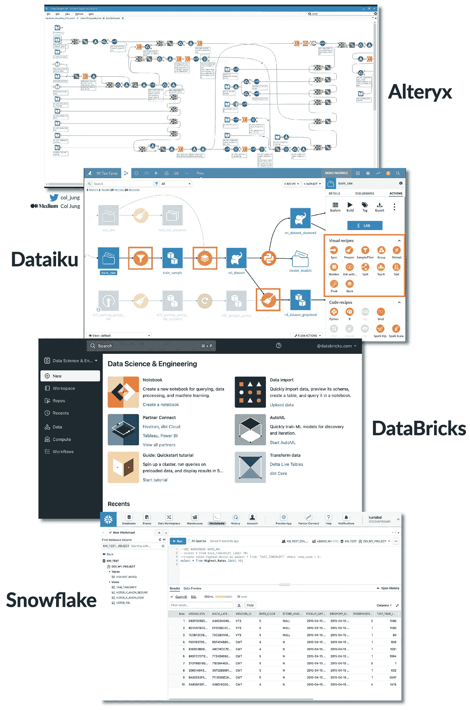

# 数据民主化：大型公司采纳的 5 种“人人数据”策略

> 原文：[`towardsdatascience.com/data-democratisation-5-data-for-all-strategies-embraced-by-large-companies-e62fad52c250`](https://towardsdatascience.com/data-democratisation-5-data-for-all-strategies-embraced-by-large-companies-e62fad52c250)

## 这关乎数据、技能、工具……特别是文化！

[](https://col-jung.medium.com/?source=post_page-----e62fad52c250--------------------------------)[](https://towardsdatascience.com/?source=post_page-----e62fad52c250--------------------------------) [Col Jung](https://col-jung.medium.com/?source=post_page-----e62fad52c250--------------------------------)

·发表于 [Towards Data Science](https://towardsdatascience.com/?source=post_page-----e62fad52c250--------------------------------) ·15 分钟阅读·2023 年 7 月 19 日

--


图片由[Windows](https://unsplash.com/photos/w79mIrYKcK4)（Unsplash）提供

2006 年，《*哈佛商业评论*》发表了一篇题为“[竞争于分析](https://hbr.org/2006/01/competing-on-analytics)”的文章。

由学者托马斯·达文波特和珍妮·哈里斯撰写的这篇具有影响力的文章引发了关于如何利用分析作为商业竞争优势的广泛讨论。

公司开始投资于 BI 软件、大数据平台、数据科学团队和尖端的[AI 和机器学习](https://medium.com/geekculture/ai-revolution-your-fast-paced-introduction-to-machine-learning-914ce9b6ddf)工具，希望成为数据驱动型公司。

结果令人失望。

一项[德勤调查](https://www2.deloitte.com/us/en/insights/topics/analytics/insight-driven-organization.html)显示，14 年后只有 10%的公司在分析洞察方面具有竞争力。大多数公司只能声称拥有孤立的分析卓越领域。而最受欢迎的分析工具是，鼓声……

……**微软 Excel**。

事实是，转型为**数据驱动型组织**比看起来要*困难*得多。

请关注我的分析和数据 YouTube 频道 [这里](https://www.youtube.com/@col_builds)。


你们公司处于什么位置？图片由作者提供

能够***大规模地***利用数据驱动的洞察，并将其融入到**日常决策**中，需要在多个领域达到较高水平的企业**数据成熟度**：

+   **数据：** 如果你没有[优质数据](https://generativeai.pub/data-products-why-your-organisation-needs-them-4ac7bf2e5953)，AI 就无从谈起。

+   **技能：** 你的员工*整体上*是否具备数据素养？

+   **工具：** 你的基础设施是否为[大规模分析](https://generativeai.pub/modern-enterprise-data-strategy-a-guide-for-analysts-data-scientists-engineers-2d4b45a31427)做好了准备？

+   **文化：** 这是最大的障碍。你的公司是否存在*对数据驱动洞察*抗拒的传统文化？这是一个严重的问题。

我所在的公司，一家‘四大’银行[我在这里工作的](https://generativeai.pub/modern-enterprise-data-strategy-a-guide-for-analysts-data-scientists-engineers-2d4b45a31427)过去五年作为工程师和数据科学家，是数据成熟度量表上的 2.5 分。我们正在努力达到数据驱动的 4 分，将我们置于行业领先的‘数字原生’公司边缘。（加油团队！）

全球范围内，平均公司数据成熟度大约为 2.2，参考[国际高级分析研究所](https://iianalytics.com/resources/analytics-maturity)。

**这意味着只有少数员工具备超越电子表格的分析技能。**


数据民主化弥合了数据素养的差距。图片由作者提供

解决方案似乎很明确。

为了铺垫迈向数据驱动的步伐，企业需要推动数据成熟度。

那么，如何推动数据成熟度呢？

向**数据民主化**问好，这是一种被[全球公司采纳](https://generativeai.pub/modern-enterprise-data-strategy-a-guide-for-analysts-data-scientists-engineers-2d4b45a31427)的方式。

数据民主化是一种*数据为所有人*的全员参与精神，旨在提升公司**各个角落的数据成熟度**。

例如，我的银行并没有扶持只能由少数特权且高度专业化的数据科学团队使用的专门工具，而是投资于提升**数据、技能、工具和文化**，以赋能*所有* 40,000 名同事……

+   **自助**获取可靠的数据；

+   **自动化**掉他们日常工作中的繁琐事务；

+   **拥抱**数据驱动的洞察和决策，而不是‘*直觉*’。

如果每个人仅通过自动化一个简单的流程每周节省一个小时，我的银行每年将节省 200 万小时，相当于大约 1.5 亿美元，这些钱可以用于其他地方。

这其中蕴含着一个重要的教训。

数据民主化认识到***繁琐事务***与***大胆创新***分析项目同样重要。

我们最优秀的数据科学家（公司 1%）的尖端 AI 和机器学习项目值得庆祝。

**同样值得庆祝的是我们日常知识工作者和公民分析师的快速胜利。**

通过为企业分析和数据科学建立一个坚实的***大规模***基础，数据民主化有望解决大多数公司迄今为止[失败](https://generativeai.pub/modern-enterprise-data-strategy-a-guide-for-analysts-data-scientists-engineers-2d4b45a31427)成为数据驱动的根本原因。

那么，数据民主化在实践中究竟是什么样的呢？

我会讲到五种策略，并结合我自己的经验。

前三种代表了工具的进步，而最后两种则关注数据、技能和文化领域的进展。

# 1\. 全能分析与自动机器学习平台

2020 年代见证了**低代码一站式分析与机器学习平台**的兴起，它们将三种主要的企业问题解决方法整合在一个平台下：

1.  可视化；

1.  分析；

1.  自动化。

最受欢迎的平台包括：

+   **Alteryx**，被全球最大 2000 家公司中的一半使用；

+   **Dataiku**，一家由谷歌投资部门支持的法国独角兽；

+   **DataBricks**，它将大数据计算和机器学习统一在一个平台下；

+   **Snowflake**，一个快速的云数据仓库颠覆者。

这是他们的用户界面：



流行的全能分析和机器学习平台。图片由作者提供

我的银行目前使用*Alteryx*和*Dataiku*。

这些平台使我们的财务团队能够在几分钟内建立审计管道。只需将一些数据源拖放到屏幕上，使用几次点击按钮将它们连接起来，然后设置自动化，当出现红旗时通过电子邮件通知你。

不需要电子表格、SQL 或 Python。

不需要在不同程序之间跳转。

不需要对自动化管道进行繁琐的测试以查看它们是否按预期工作。

*一切正常运作。*

在一个全能平台上拥有所有这些功能可以产生额外的协同效应。

假设我的经理让我深入探讨**客户或员工流失——**这是一个经典的商业问题。在这些现代平台中，我可以……

+   从一些**可视化**开始，尝试发现有趣的趋势。很好。如果我没有太大运气怎么办？

+   不用担心，该进行一些**分析**。我可以原型化预测模型，以揭示数据中流失的潜在驱动因素。结果显示每周工作超过 48 小时的人辞职的几率显著增加。很好的洞察，现在我们有一个**商业决策**——招聘更多的人分担工作，或者识别出有辞职风险的人并及时阻止。

+   我可以非常迅速地设置一个**自动化**，当数据显示有人工作过度时，通过电子邮件通知我（或人力资源部）。

在企业问题解决中，你永远不知道哪种方法——可视化、分析或自动化——效果最好。

在这里，自动化实际上是最**有影响力**的，因为它标记出风险员工，使得**立即采取行动**成为可能，从而节省了大量的后续开支。人力资源部会告诉你，替换失去的员工花费*很多钱*。

但确实，达到目标之前需要一些探索。分析通常不是线性的。能够在一个地方完成所有工作，并推动数据和结果——通常无需编码——让生活变得轻松许多。

对于公民分析师和数据科学家来说，这无疑是一个极具赋能性的提议。

# 2\. 综合生产力与分析生态系统

该策略审视了一组联合的应用程序和平台，它们在一个*生态系统*下紧密而协同地集成在一起。

最好的例子是微软。

对于企业生产力，业界标准已经是*Windows*和*Office 365*一代：

+   *Outlook* 用于日历和邮件；

+   *Teams* 和 *Yammer* 用于聊天和社区；

+   *OneDrive* 和 *SharePoint* 用于文件存储；

+   *Word*和*Excel*用于日常工作。

这些基础工具现在是更广泛的**Microsoft 365**生态系统的一部分，反映了微软提供**统一生产力 *和* 分析平台**的战略。

公式中的分析部分是微软*Power Platform*，这是一个低代码应用程序家族，包括……

+   **Power BI** — 创建数据模型和惊艳的可视化，*无需编码*。

+   **Power Apps** — 创建桌面和移动应用，*几乎无需编码*。

+   **Power Automate** — 自动化工作流和任务，*几乎无需编码*。

+   **Power Virtual Agent** — 构建自己的聊天机器人，*几乎无需编码*。

他们用户界面的预览：


制作可视化，构建应用程序和自动化工作流。图片由作者提供

‘民主化’来自两个方面。

首先，这些工具易于使用，并且每个月变得越来越容易。易用意味着采用，正如任何商界人士、企业家和 UX 设计师会告诉你的那样。

其次，这些 Power Platform 应用程序的**集成**与*彼此* **以及**微软更广泛的核心生产力应用程序，如 Outlook 和 Teams，至关重要，以使每位员工能够为自己和组织创造价值。

比如说，审查和批准请求的繁琐过程，通常通过无尽的来回邮件和手动流程处理。**这是大多数组织中的主要问题源。**

够了！厌倦了每次都花几个小时审查，比如数据请求？

拥有数据的公民分析师可以构建一个**Power BI**报告，提供有关他们拥有的数据资产的信息，并确定这些数据是否可以与同事共享。

他们可以将这些数据驱动的洞察直接嵌入到**Power Apps**中构建的应用程序中，该应用程序作为同事申请访问的前端。（此外，由于微软与大型企业基础设施的成熟集成，这个应用程序会立即投入生产——[数据治理人员的喘息](https://example.org/5-common-data-governance-pain-points-for-analysts-data-scientists-8efe8a007ac2)！）

现在，当同事通过应用提交他们的数据请求时，数据所有者将通过*Outlook* 收到自动请求的电子邮件，甚至通过 Microsoft 的*Approvals* 应用在*Teams*上直接收到通知，因为这些自动化设置在**Power Automate**中完成，几乎无需编码。

我们谦虚的公民分析师将一个每周占用 5 小时的繁琐任务转变为一个现在只需几分钟的自动化管道，从而释放出宝贵的时间用于更具生产力的工作。

（或者也许早下班……！）

# 3\. 成熟的大数据工具

过去五年中，全球企业对大数据和数据湖的接受在很大程度上未能兑现其炒作的承诺。

由于粗糙的工具、数据质量问题、夸大的承诺和可扩展性挑战，解锁数据湖中所有数据潜在价值的必要手段和员工面临的现实之间的差距实在太大。

在我的银行，我们最初的 Apache *Zeppelin* 笔记本难以使用。Apache *Atlas* 上的元数据对于非数据工程师来说难以导航。数据通常是按项目基础摄取的，并且经常不完整，需要与我们的数据仓库资产集成——这对喜欢使用未处理数据进行处理和建模的数据科学家来说是一个不理想的情况。

由于许多数据资产未被使用，数据质量问题堆积如山。

数据湖中的水变得陈旧。

我们后来将更好的工具，如*Power BI*和管理机器学习的平台如*Dataiku*，接入到我们的数据湖基础设施中，但奇怪和低效的问题仍然存在，就像 PC 制造商必须将来自不同供应商的硬件和软件拼凑在一起所遇到的挑战一样。

如果有一种提供“苹果般”体验的大数据解决方案就好了：硬件和软件完美同步，数据天作之合。

那个时候就是现在。

我们的数据湖现在托管在**Microsoft Azure**的[云端](https://generativeai.pub/cloud-computing-unleashed-how-to-harness-the-power-of-cloud-for-your-business-f72e8e23be9)，为我们提供了弹性计算和超大规模能力。此外，鉴于许多组织在 2015 年至 2020 年间开始了大数据之旅，我们正在逐步放弃 Apache *Hadoop* 技术栈，转而使用完全原生的 Azure 解决方案。

*全程 Azure。*

这包括**Azure Synapse**，用于无缝的数据集成和分析，将数据仓库和大数据[整合在一个平台](https://generativeai.pub/azure-synapse-analytics-in-action-7-real-world-use-cases-explored-c73ef231b408)下。此外，我们还使用**Azure Purview**以确保全面和简化的数据治理体验。


Azure 原生的数据分析、集成和治理工具。图片由作者提供

当然，微软只是主要的云供应商之一。其他包括：

+   亚马逊网络服务（AWS）；

+   谷歌云平台（GCP）；

+   阿里巴巴云。

所有这些巨头每年投入数十亿美元来改善他们的云基础设施、产品和服务。

简而言之——将数据、*分析*工具来处理数据、*集成*工具来结合数据和*治理*工具来管理数据——都集中在一个平台上，创造了 2023 年尽可能无缝的大数据体验。

# 4\. 文化与教育……文化与教育……

我们刚刚看到三种专注于工具技术进步的策略。

我有一些可能让人有点惊讶的消息：

成为数据驱动的最大挑战不是技术。

**关键在于人、流程和** [**文化**](https://www.forbes.com/sites/brentdykes/2021/06/01/10-reasons-why-your-organization-still-isnt-data-driven/?sh=1db3fbb67d80)**。**

你可以拥有世界上最好的技术栈，但一个抵触数据驱动洞察的传统文化将阻碍你的数据成熟之路。这是致命的。

生活的现实是**人们抗拒变化**。

这就是为什么通过提供充足的机会来提升技能和建立数据驱动的社区至关重要。

我的银行刚刚推出了一项企业范围的*数据与数字赋能*计划，提供给所有 40,000 名员工学习各种主题的机会，从数据流畅性到数据领导力，通过为期 8 周的课程，包括讲座、大师班、播客和由内部专家和行业人物主讲的视频。

我们还举办了一年一度的*TechX*大会，展示新兴技术，以及一个*数据周*活动，包含一整周令人兴奋的数据相关演讲。

而且猜猜看？今年的*数据周*主题是**数据为所有人**。

***每一个演讲***都融入了数据民主化的元素。我们不惜一切代价邀请了来自数据领导者如亚马逊、*Alteryx*、*Dataiku*、*微软*、*谷歌*等的高管与我们的员工交流。

听着，我们自己的数据架构主管装扮成***不可思议***的“数据英雄”，强调*数据是每个人的*。


我们公司的年度数据周大会

一个数据驱动的组织需要持续地提升和赋能其员工，这需要强大的文化、强大的社区和高层领导的强力倡导。

没有绕过的办法。

# 5\. 数据市场

最后，让我们谈谈支持分析的数据本身。

寻求数据驱动洞察的讽刺在于，数据在大多数公司中处于*糟糕*的状态，主要表现为三个问题：

+   缺乏**可见性**。这些数据到底在哪里？

+   缺乏**信任**。不可靠的数据意味着不可靠的洞察。

+   缺乏**时效性**。需要一些数据迅速得到？太遗憾了。

数据在不断流动，但就像一个谜团——没有人能可靠地确定具体内容：它包含了什么，去向何处，源头在哪里，或者谁拥有这些数据。更别提数据质量以及它如何与其他数据连接了。在尝试执行数据战略以成为数据驱动型公司时，这些痛点从一开始就成为严重的障碍。

正如我在这篇文章中所写的企业数据架构：

> “几十年的数据仓库让组织淹没在一片由混乱的数据管道连接的数据系统的海洋中。魔法般的解决方案本意是将数据集中到一个中央库中。不幸的是，数据湖的梦想在许多组织中变成了数据湖的*沼泽*。”

企业长期以来以**项目**为导向来处理数据，这导致业务团队在需要解决某些问题时创建孤立的数据管道。将数据管道整合到一个集中化的数据团队中，在一个大型数据湖中迅速遇到了瓶颈，导致数据海洋泛滥，难以访问、理解，并且充满了持久的数据问题。

这对全球首席数据和分析官（CDAO）来说是令人沮丧的事情。

在 2020 年代，已经取得了显著的进展来克服这些挑战。

公司正在投资于一种去中心化的**数据网格**架构，这种架构使各个业务单元能够自豪地打造[可重用且*可信赖的* **数据产品**](https://generativeai.pub/data-products-why-your-organisation-needs-them-4ac7bf2e5953)，这些数据产品可以在整个数据网格中无缝共享。

这些数据产品——就像任何从货架上取下的骄傲产品一样——可以由知识工作者进行选购和自助服务，促进了所有战略企业数据资产的最高可见性。

在我的银行中，正在构建一个*Netflix*或*YouTube* 风格的**数据市场**，使员工能够自助服务精选的数据产品和其他数据资产……***并且***发布他们自己的资产。


将数据视为一种产品，使数据成为一级公民。图片由作者提供

凭借一个经过精心打磨的用户界面，该界面整合了社交元素，并快速提供元数据、数据来源和所有权信息等关键信息，我们正在见证一个**集中化且精致的一站式数据商店**的兴起，使组织中的每个人都能够轻松地获取和发布数据。

就像伊斯坦布尔的 16 世纪大巴扎，被视为当时的亚马逊市场，吸引了来自世界各地的商人，企业数据市场使数据民主化，面向所有人开放。

突然间，数据资产变得可发现、快速且易于访问，且值得信赖。这大大降低了推动数据洞察、智能决策和先进分析能力（如机器学习和人工智能）的成本。

很棒的东西。

# 未来会怎样？一些结束语

最具影响力的分析历史上通常来自具备一点分析技能的*领域专家*。

在 1850 年代，**约翰·斯诺** [使用](https://www.ph.ucla.edu/epi/snow/snowcricketarticle.html)地理空间地图来分析数据，并说服科学家和政策制定者霍乱的传播与污水源有关。

Snow 不是‘分析师’或‘数据科学家’。他是医生。

在同一时期，**弗洛伦斯·南丁格尔** [运用了](https://theconversation.com/the-healing-power-of-data-florence-nightingales-true-legacy-134649)类似现代 A/B 测试的技术，并利用饼图等可视化手段揭示影响战地死亡率的潜在因素。

今天被公认为统计学的先驱，她开创性的工作奠定了我们今天遵循的众多卫生实践的基础，例如洗手和戴口罩。

南丁格尔不是统计学家。她是护士。

170 多年后，现代企业正在被提醒，数据和分析的民主化对于实现数据驱动的成功是一个前提条件。

这种胜利的心态间接解决了许多问题。

例如，识别和解决大规模数据质量问题的最佳方法是对这些数据进行*运用*。通过将数据访问的民主化超越少数特权者，企业正在创造出一个提升自身数据质量的绝佳配方。

换句话说，赋予公民数据分析师在公司数据湖中畅游的能力，他们清理的垃圾越多，就会激励更多同事参与其中。

数据民主化启动了一个成功的良性循环。

随着时间的推移，多方面的数据成熟度——数据、技能、工具和文化的同步提升，将最终使企业更接近于成为 4 级或 5 级分析驱动的强大企业的梦想。

未来会怎样？

技术领域正被[生成性人工智能](https://generativeai.pub/the-road-to-chatgpt-gpt-4-how-deep-learning-revolutionised-natural-language-processing-835d89560577)剧烈震动。

我预计大型语言模型将在当前工具之上添加一个抽象层，进一步简化各行各业人士利用分析和数据驱动洞察的用户体验。

历史上，技术进步一直关注于抽象层。

在过去，计算机先驱们深陷于汇编代码中。你必须编写这些代码来计算 1 + 1：

```py
section .data
    result db 0  ; Variable to store the result

section .text
    global _start

_start:
    mov al, 1    ; Move 1 into AL register
    add al, 1    ; Add 1 to AL

    mov [result], al  ; Store the result in the 'result' variable

    ; Exit the program
    mov eax, 1   ; System call number for exit
    xor ebx, ebx ; Exit status 0
    int 0x80     ; Invoke the kernel
```

C++、Java 和 Python 等高级编程语言在 1980 年代之后出现，使我们的生活轻松了很多。到 2012 年，统计学家现在可以在‘笔记本’中原型制作常用的机器学习模型，而无需太多编程经验：

```py
from sklearn.linear_model import LogisticRegression
from sklearn.model_selection import train_test_split
from sklearn.metrics import accuracy_score

iris = load_iris()
X = iris.data
y = iris.target

# Train a logistic regression model
X_train, X_test, y_train, y_test = train_test_split(X, y, test_size=0.2, random_state=42)
model = LogisticRegression()
model.fit(X_train, y_train)

# Make some predictions and evaluate
y_pred = model.predict(X_test)
accuracy = accuracy_score(y_test, y_pred)
print("Accuracy:", accuracy)
```

在 2023 年，像*Power BI*和*Tableau*这样的企业工具，以及像*Alteryx*、*Databricks*和*Dataiku*这样的托管机器学习平台，可以通过点击几下按钮生成强大的分析。

微软推出了**Fabric**，一个统一了数据仓储、大数据、数据工程和管理的[SaaS 云分析平台](https://generativeai.pub/azure-synapse-analytics-in-action-7-real-world-use-cases-explored-c73ef231b408)。


生成式 AI 会革新分析吗？图像作者提供

几十年后，专用分析平台可能会成为历史遗迹。

只需简单地提示**你想要什么**，然后看奇迹发生：

> “在我的数据集中寻找相关性。”
> 
> “运行压力测试以模拟 5 个基点的利率上升。”
> 
> “预测未来 5 年的当前销售预测。”
> 
> “分析数据质量并给我展示报告。”

我能说什么——现在正是分析和 AI 领域的激动人心的时刻。

在 [Twitter](https://twitter.com/col_jung) 和 YouTube [这里](https://youtube.com/@col_builds)、[这里](https://youtube.com/@col_invests) 和 [这里](https://youtube.com/@col_shoots) 找到我。

# 我的热门 AI、ML 和数据科学文章

+   AI 与机器学习：快速入门 — [这里](https://col-jung.medium.com/ai-revolution-your-fast-paced-introduction-to-machine-learning-914ce9b6ddf)

+   机器学习与机制建模 — [这里](https://medium.com/swlh/differential-equations-versus-machine-learning-78c3c0615055)

+   数据科学：现代数据科学家的新时代技能 — 这里

+   生成式 AI：大型公司如何争先恐后地采用 — [这里](https://generativeai.pub/how-big-companies-are-scrambling-to-adopt-generative-ai-d52456fb4c69)

+   ChatGPT & GPT-4: OpenAI 如何赢得 NLU 战争 — [这里](https://col-jung.medium.com/the-road-to-chatgpt-gpt-4-how-deep-learning-revolutionised-natural-language-processing-835d89560577)

+   GenAI 艺术：DALL-E、Midjourney 和 Stable Diffusion 解析 — [这里](https://col-jung.medium.com/generative-ai-art-the-road-to-dall-e-midjourney-stable-diffusion-3b3219d97f02)

+   超越 ChatGPT: 寻找真正智能的机器 — [这里](https://col-jung.medium.com/from-chatgpt-to-singularity-the-search-for-a-truly-intelligent-machine-856c8f4c5e63)

+   现代企业数据策略解析 — [这里](https://generativeai.pub/modern-enterprise-data-strategy-a-guide-for-analysts-data-scientists-engineers-2d4b45a31427)

+   从数据仓库与数据湖到数据网格 — 这里

+   从数据湖到数据网格：最新架构指南 — 这里

+   Azure Synapse Analytics 实战：7 种用例解析 — [这里](https://generativeai.pub/azure-synapse-analytics-in-action-7-real-world-use-cases-explored-c73ef231b408)

+   云计算基础：利用云计算为您的业务服务 — [这里](https://generativeai.pub/cloud-computing-unleashed-how-to-harness-the-power-of-cloud-for-your-business-f72e8e23be9)

+   数据仓库与数据建模 — 快速入门课程 — 这里

+   数据产品：为分析建立坚实的基础 — [这里](https://generativeai.pub/data-products-why-your-organisation-needs-them-4ac7bf2e5953)

+   数据民主化：5 种“数据普及”策略 — 这里

+   数据治理：分析师的 5 个常见痛点 — 这里

+   数据讲故事的力量 — 销售故事，而非数据 — [这里](https://medium.com/swlh/power-of-storytelling-in-business-data-analytics-your-data-is-only-half-the-story-f50fadf9712b)

+   数据分析入门：谷歌方法 — 这里

+   Power BI — 从数据建模到惊艳报告 — 这里

+   回归分析：使用 Python 预测房价 — 这里

+   分类：使用 Python 预测员工流失 — 这里

+   Python Jupyter Notebooks 与 Dataiku DSS — 这里

+   常见机器学习性能指标解析 — 这里

+   在 AWS 上构建 GenAI — 我的初次体验 — [这里](https://generativeai.pub/how-big-companies-are-scrambling-to-adopt-generative-ai-d52456fb4c69)

+   数学建模与机器学习在 COVID-19 中的应用 — [这里](https://medium.com/swlh/math-modelling-and-machine-learning-for-covid-19-646efcbe024e)

+   工作的未来：在 AI 时代您的职业安全吗 — [这里](https://col-jung.medium.com/future-of-work-is-your-career-safe-in-the-age-of-chatgpt-gpt-4-122d5996bd57)
