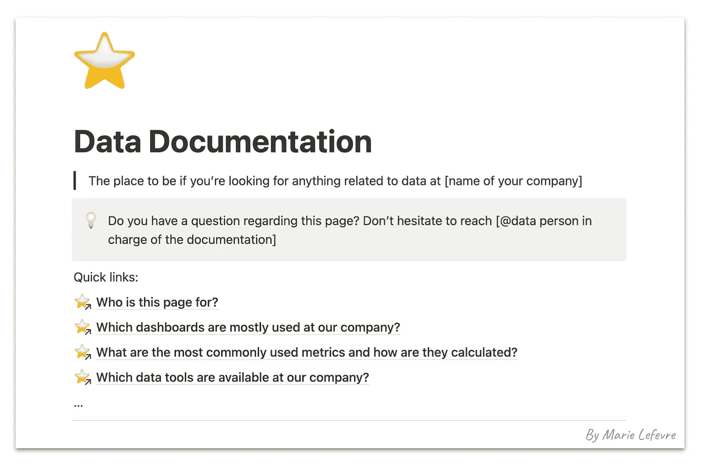
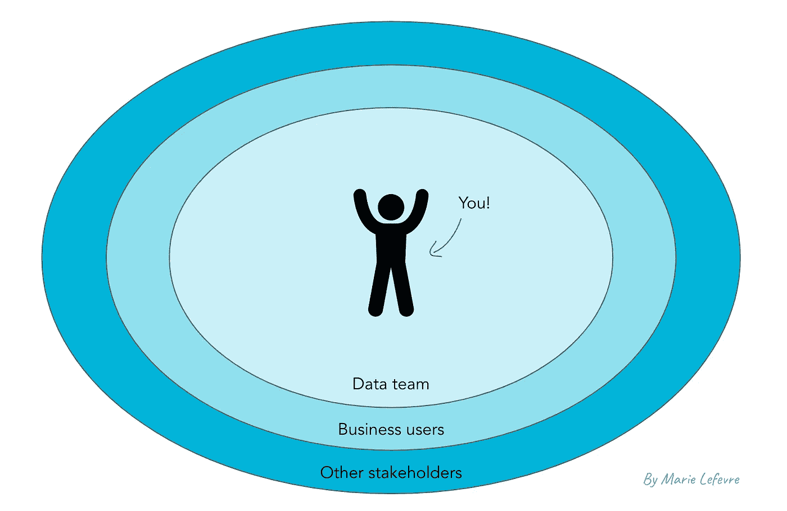
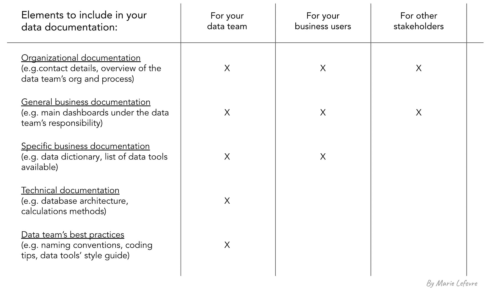

# 数据文档 101：为何？如何？为谁？

> 原文：[`towardsdatascience.com/data-documentation-101-why-how-for-whom-927311354a92`](https://towardsdatascience.com/data-documentation-101-why-how-for-whom-927311354a92)

## 数据管理

## 在你的组织内部建立完整且可靠的数据文档的最佳实践

 [Marie Lefevre](https://marielefevre.medium.com/?source=post_page-----927311354a92--------------------------------)

·发表于 [Towards Data Science](https://towardsdatascience.com/?source=post_page-----927311354a92--------------------------------) ·6 分钟阅读·2023 年 6 月 13 日

--

摄影师 [Maksym Kaharlytskyi](https://unsplash.com/@qwitka?utm_source=medium&utm_medium=referral) 的照片，来源于 [Unsplash](https://unsplash.com/?utm_source=medium&utm_medium=referral)

我记得每次作为数据团队成员进入新公司时，我的主要关注点之一是：

> 我会找到完整且可靠的数据文档吗？如果找到的话，在哪里呢？

在与其他公司的同行以及不属于数据团队的同事交谈时，我发现许多利益相关者依赖某种数据文档，并希望找到**一个可以提供公司所有数据相关知识的地方**。

在这个如梦似幻的愿景中，数据文档将是完整且可靠的，并且可以在适当的地点提供给合适的人。想象一下那种感觉会是怎样的！

作为我当前雇主的数据策略师，我的优先事项之一是**使数据对所有部门可用**。这意味着不仅要沟通数据团队在公司所取得的工作，还要让我的每一位同事（以及可能的外部利益相关者）了解我们作为一个组织拥有的数据资产。

为此，我建立了一个中央数据文档页面，同时为每类利益相关者提供了相应的衍生文档。为了让你了解它的样子，以下是我向所有人开放的中央数据文档页面的前几行：

中央数据文档页面（作者提供的图像）

**你在以前或当前的公司是否遇到过类似的问题？你想开始或继续构建你公司的数据文档吗？** 在本文中，我想与大家分享我从创建数据文档的想法到其具体实施所遵循的主要步骤。我希望你能觉得这些内容有用且适用。

现在让我们深入探讨一下你应该采取的必要步骤，以**为自己和你的利益相关者创建完整可靠的数据文档**。

# 什么是数据文档？

**这是一组关于公司数据资产的相关信息。** 它包含了一系列元素，例如指标定义、数据源描述、数据模式、数据模型解释、数据工具的访问权限映射等。

没有通用的模板来创建数据文档。最重要的是数据文档服务于你的组织。把它想象成**一本全面的手册，能够帮助利益相关者自信且清晰地浏览数据环境**。

# 为什么数据文档至关重要？

就像任何类型的文档一样，数据文档为你的公司提供了一种关于过去事件的记忆。书面文档不仅仅告诉你当前的情况。它还允许任何成员掌握数据管理的历史，无论他们在组织中待了多久。**通过记录逐步建立的定义、规则和流程，你为任何有意使用数据的人员带来了清晰和背景**。

目前，建立和维护最新的数据文档可以将概念层面上决定的内容和技术实施的内容确立下来。将所有这些元素集中在一个文档中，无疑将利益相关者聚集在一起：在他们就数据管理达成一致后，**记录下来能增加其可靠性**。

# 那么，你应该从哪里开始？

正如我们稍后将看到的，你的数据文档的格式可能会根据你的目标受众而有所不同。最初不要专注于文档的形式，而是关注其意图。然后，你将**根据构建数据文档的意图来衍生文档的内容和形式**。

你可以从问自己以下问题开始：

+   我的受众是谁？他们的技术背景是什么？

+   他们对数据文档有什么期望？

+   我希望我的受众了解关于数据的哪些信息？

+   我的受众在深入细节之前应该知道哪些基本知识？

+   在深入细节时，我应该深入到什么程度，以便让我的受众能够很好地理解而不会迷失？

# 谁是你的目标受众？

一般来说，我识别出三种类型的受众，你应该针对这些受众来编写数据文档。

首要受众是最接近你作为数据领导者的位置的人：即**你的数据团队**。在这个可能具有异质性的团队中，我们可以区分**新成员**和初级员工，以及更多的**高级成员**。因此，你的文档应包括基本概念和更高级的元素，如指标的详细计算方法。

排在第二的位置是**业务用户**。首先你要服务于那些**日常使用数据的用户**。他们的需求可能与另一个群体的需求略有不同：业务用户可能**偶尔会有数据相关的问题**，而且他们与你的工作关系不紧密。你的文档应对这两种类型的业务用户都要提供便利。

最后，**其他利益相关者**可能需要与公司数据资产相关的特定文档。在这一类别中，我包括了**管理委员会、与其他部门的同事**（你不一定与他们有互动），以及**外部利益相关者**。他们对数据文档的需求可能较小，但需要简洁和准确。

不同受众类型的地图（图像由作者提供）

# 数据文档应包括（或不包括）什么？

数据文档的内容将根据目标受众的不同而有所变化。

**向所有类型的受众提供的共同元素**包括关于数据团队的一般知识，如：

+   数据团队的联系方式

+   数据团队概述以及它如何与组织其他部分互动

+   数据团队负责的数据资产

除了这些元素，**业务用户需要与他们自己职责范围相关的文档**，以及数据如何支持他们的日常活动。这些元素包括：

+   常用术语的词汇表

+   包含指标定义和计算方法的数据字典（可能简化）

+   数据来源的列表以及它们在数据中心的利用方式

+   可用的数据工具列表以及谁应该有权限使用它们

+   最常用的仪表板列表、其内容、拥有者

+   如何使用数据工具的教程（如相关）

最后，数据团队成员需要更加**具体的文档，包括技术元素**，例如：

+   数据架构和数据模型的架构图

+   包含指标定义和计算方法的数据字典

+   所有数据工具中使用的命名规范

+   数据工具的风格指南

+   你的仪表板设计系统（颜色、字体等）

+   任何成员都应使用的模板（例如用于分享数据分析结果、向听众展示关键数据等）

+   编码语言的最佳实践（SQL、Python、R 等）

简而言之，最好是**只包含与每种受众相关的元素**，以便他们能全面了解可用文档，而不会被不必要的文档元素淹没。

根据目标受众回顾数据文档的内容（图像由作者提供）

# 你应该如何以及在哪里提供数据文档？

至于形式，你应该**适应目标受众使用的工具**。他们是否将知识库集中在像 Notion 或 Confluence 这样的工具中？那么，你的数据文档就应该放在这里。他们是否更倾向于使用共享在 Google Drive 或 Sharepoint 服务器上的幻灯片？那么，你应该在这里展示数据文档的元素。

除了根据受众的习惯调整文档的形式和位置外，你还可以将一些关于数据的信息**直接包含在你的数据工具中**（例如，在数据仓库或数据转换工具中）。像数据目录和支持（元）数据管理的软件等新兴工具可以帮助你实现这一点。

# 总结

要建立完整且可靠的数据文档，请记住遵循以下步骤：

1.  确保你了解数据文档为何至关重要

1.  问问自己你的目标受众是谁——可能有多个受众群体，需求各不相同

1.  决定你想在数据文档中包含哪些元素

1.  选择合适的工具和合适的地方来创建和维护你的数据文档

这样你就准备好了！
