# 数据驱动的调度

> 原文：[`towardsdatascience.com/data-driven-dispatch-76b7e998a7a7?source=collection_archive---------4-----------------------#2023-08-04`](https://towardsdatascience.com/data-driven-dispatch-76b7e998a7a7?source=collection_archive---------4-----------------------#2023-08-04)

## 使用监督学习预测芝加哥车辆碰撞的服务呼叫

[](https://medium.com/@john_lenehan?source=post_page-----76b7e998a7a7--------------------------------)[](https://towardsdatascience.com/?source=post_page-----76b7e998a7a7--------------------------------) [John Lenehan](https://medium.com/@john_lenehan?source=post_page-----76b7e998a7a7--------------------------------)

·

[关注](https://medium.com/m/signin?actionUrl=https%3A%2F%2Fmedium.com%2F_%2Fsubscribe%2Fuser%2F2eb00da71bb6&operation=register&redirect=https%3A%2F%2Ftowardsdatascience.com%2Fdata-driven-dispatch-76b7e998a7a7&user=John+Lenehan&userId=2eb00da71bb6&source=post_page-2eb00da71bb6----76b7e998a7a7---------------------post_header-----------) 发表在 [Towards Data Science](https://towardsdatascience.com/?source=post_page-----76b7e998a7a7--------------------------------) · 13 分钟阅读 · 2023 年 8 月 4 日[](https://medium.com/m/signin?actionUrl=https%3A%2F%2Fmedium.com%2F_%2Fvote%2Ftowards-data-science%2F76b7e998a7a7&operation=register&redirect=https%3A%2F%2Ftowardsdatascience.com%2Fdata-driven-dispatch-76b7e998a7a7&user=John+Lenehan&userId=2eb00da71bb6&source=-----76b7e998a7a7---------------------clap_footer-----------)

--

[](https://medium.com/m/signin?actionUrl=https%3A%2F%2Fmedium.com%2F_%2Fbookmark%2Fp%2F76b7e998a7a7&operation=register&redirect=https%3A%2F%2Ftowardsdatascience.com%2Fdata-driven-dispatch-76b7e998a7a7&source=-----76b7e998a7a7---------------------bookmark_footer-----------)

[Sawyer Bengtson](https://unsplash.com/@sawyerbengtson?utm_source=medium&utm_medium=referral) 在 [Unsplash](https://unsplash.com/?utm_source=medium&utm_medium=referral) 的照片

# 介绍

在当今快节奏的世界中，数据驱动的调度响应系统变得越来越重要。调度员在接听电话时会进行一种分诊，基于严重性和时间敏感性等因素来优先处理案件。通过利用监督学习模型的力量，优化这一过程有很大的潜力，可以在与人工调度员的评估相结合的情况下，更准确地预测案件的严重性。

在这篇文章中，我将介绍我开发的一个解决方案，以改善对芝加哥汽车碰撞中伤亡和/或严重车辆损坏的预测。考虑了碰撞地点、道路条件、限速和发生时间等因素，以回答一个简单的是或否的问题——*这次车祸是否需要救护车或拖车？*


[Chris Dickens](https://unsplash.com/@chrisdickens?utm_source=medium&utm_medium=referral)提供的照片，来源于[Unsplash](https://unsplash.com/?utm_source=medium&utm_medium=referral)

简而言之，这个机器学习工具的主要目标是基于其他已知因素，分类最可能需要呼叫（医疗、拖车或两者）的碰撞。通过利用这个工具，响应人员可以根据天气和时间等各种条件高效分配资源到城市的不同区域。

为了使这个工具准确有效，需要一个大型数据源来从历史数据中进行预测——幸运的是，芝加哥市已经有这样的资源（[**芝加哥数据门户**](https://data.cityofchicago.org/)**），**因此将使用这些数据作为测试案例。

实施这些预测模型无疑将提高处理城市街道碰撞时的准备性和响应时间效率。通过深入了解碰撞数据中的潜在模式和趋势，我们可以致力于创造更安全的道路环境，并优化应急服务。

我将在下面详细讨论数据清理、模型构建、微调和评估，然后分析模型的结果并得出结论。该项目的 github 文件夹链接，包括一个 jupyter notebook 和一个更全面的项目报告，可以在[**这里**](https://github.com/jlenehan/Chicago_Dispatch_Classification)找到。

# 数据收集与准备

## 初始设置

我列出了项目中使用的基本数据分析库；标准库如 pandas 和 numpy 在整个项目中都有使用，以及用于可视化的 matplotlib 的 pyplot 和 seaborn。此外，我还使用了 missingno 库来识别数据中的缺失情况——我发现这个库在可视化数据集中缺失数据方面非常有用，并推荐在涉及数据框的数据科学项目中使用：

```py
#generic data analysis 
import os
import pandas as pd
from datetime import date
import matplotlib.pyplot as plt
import numpy as np
import seaborn as sns
import missingno as msno
```

从机器学习模块 SciKit learn (sklearn)中导入了函数来构建机器学习引擎。这些函数在此处展示——我将在分类模型部分详细描述这些函数的用途：

```py
#Preprocessing
from sklearn.preprocessing import LabelEncoder
from sklearn.preprocessing import StandardScaler

# Models
from sklearn.neighbors import KNeighborsClassifier

# Reporting
from sklearn.model_selection import train_test_split
from sklearn.model_selection import RandomizedSearchCV

#metrics
from sklearn.metrics import accuracy_score
from sklearn.metrics import f1_score
from sklearn.metrics import precision_score
from sklearn.metrics import recall_score
```

这个项目的数据全部从芝加哥数据门户中导入，来源于两个渠道：

1.  [**交通事故**](https://data.cityofchicago.org/Transportation/Traffic-Crashes-Crashes/85ca-t3if)**:** 芝加哥地区车辆碰撞的实时数据集。该数据集的特征是碰撞发生时记录的条件，如天气条件、道路对齐、纬度和经度数据等细节。

1.  [**警察巡逻区边界**](https://data.cityofchicago.org/Public-Safety/Boundaries-Police-Beats-current-/aerh-rz74)**:** 一个静态数据集，指示 CPD 巡逻区的边界；该数据集用于补充交通事故数据集的区信息。可以将其与原始数据集连接，以对事故最频繁的地区进行分析。

## 数据清理

导入两个数据集后，现在可以合并它们以将区数据添加到最终分析中。这是通过 pandas 中的 .merge() 函数完成的——我在两个数据框上使用了内连接，以捕捉两个数据框中的所有信息，使用两个数据框中的 beat 数据作为连接键（在交通事故数据集中列为 beat_of_occurrence，在警察巡逻区数据集中为 BEAT_NUM）：

```py
#joining collision data to beat data - inner join
collisions = collision_raw.merge(beat_data, how='inner',
                                 left_on='beat_of_occurrence',
                                 right_on='BEAT_NUM'
                                 )
```

从 .info() 函数提供的信息快速查看显示了几个数据稀疏的列。这可以通过 missingno 矩阵函数可视化：

```py
#visualising missing data
#sorting values by report received date

collisions = collisions.sort_values(by='crash_date', ascending=True)

#plotting matrix of missing data
msno.matrix(collisions)
plt.show()

#info of sorted data
print(collisions.info())
```

这显示了所有列中的缺失数据矩阵，如下图所示：

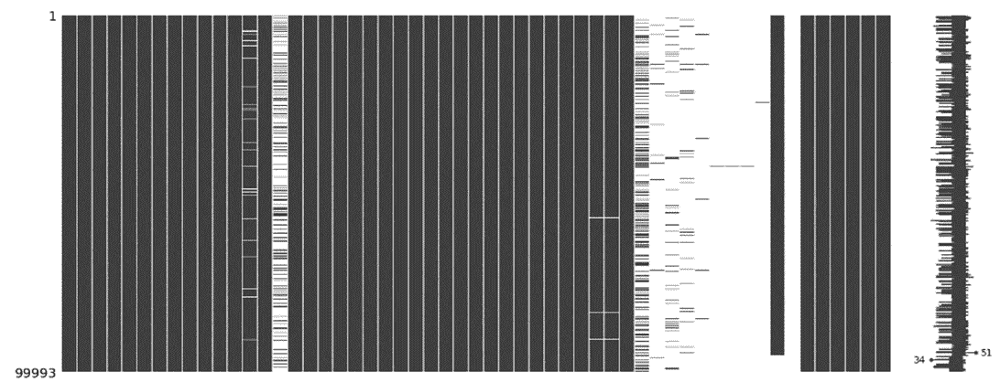

未经精炼的数据集，多个列包含大量的空值

通过删除包含稀疏数据的列，可以提取一个更干净的数据集；要删除的列在列表中定义，然后使用 .drop() 函数从数据集中移除：

```py
#defining unnecessary columns
drop_cols = ['location', 'crash_date_est_i','report_type', 'intersection_related_i',
       'hit_and_run_i', 'photos_taken_i', 'crash_date_est_i', 'injuries_unknown',
       'private_property_i', 'statements_taken_i', 'dooring_i', 'work_zone_i',
       'work_zone_type', 'workers_present_i','lane_cnt','the_geom','rd_no',
            'SECTOR','BEAT','BEAT_NUM']

#dropping columns
collisions=collisions.drop(columns=drop_cols)

#plotting matrix of missing data
msno.matrix(collisions)
plt.show()

#info of sorted data
print(collisions.info())
```

这导致了一个更干净的 msno 矩阵：

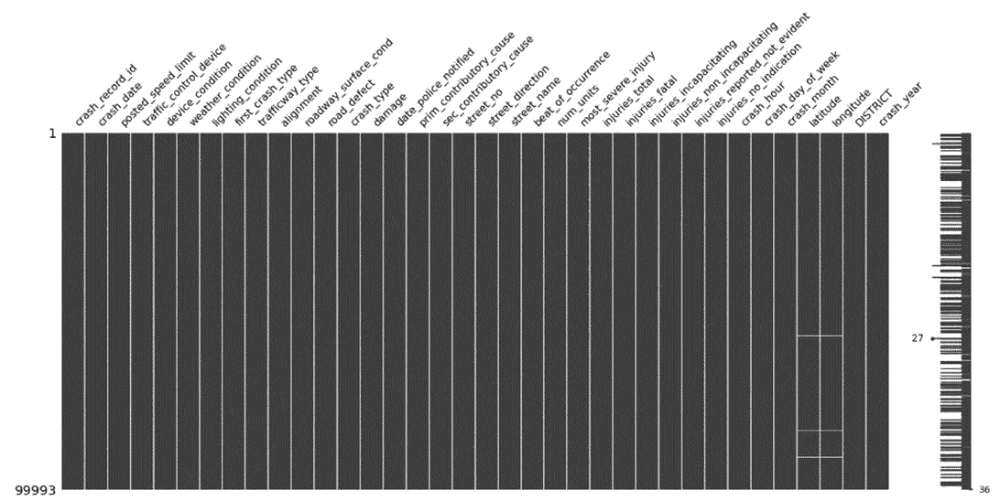

修剪后的数据集的 msno 矩阵

查看纬度和经度的数据，少量行有空值，而其他行错误地有零值（很可能是报告错误）：


纬度和经度列都包含零值（查看每列的最小值和最大值）

这些会导致训练模型时出错，所以我将它们移除了：

```py
#Some incorrect lat/long data - need to remove these rows
collisions = collisions[collisions['longitude']<-80]
collisions = collisions[collisions['latitude']>40]
```

数据充分清理后，我能够继续开发分类模型。

# 分类模型

## 探索性数据分析

在进行机器学习模型之前，需要进行一些探索性数据分析（EDA）——数据框的每一列都绘制在直方图上，使用 50 个箱子来显示数据的分布。直方图在 EDA 步骤中很有用，主要是因为它们提供了数据分布的概述，有助于识别异常值，并最终帮助做出特征工程的决策：

```py
#plotting histograms of numerical values
collisions.hist(bins=50,figsize=(16,12))
plt.show()
```

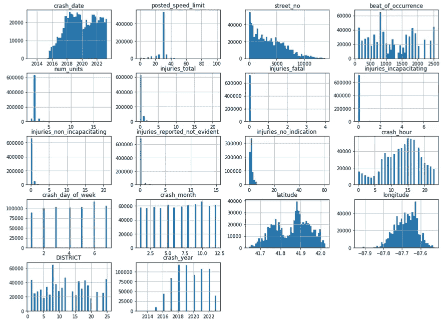

最终数据集中列的直方图

粗略查看列的直方图显示，纬度数据是双峰的，而经度数据则是偏斜的。这需要标准化，以便更好地应用于机器学习目的。

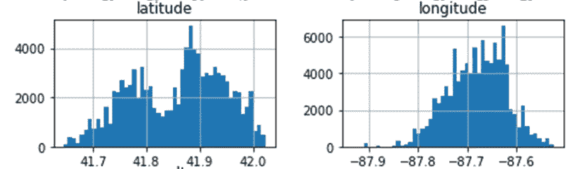

未缩放的纬度-经度数据

此外，崩溃小时列似乎具有周期性特征——这可以通过三角函数（例如正弦）进行变换。

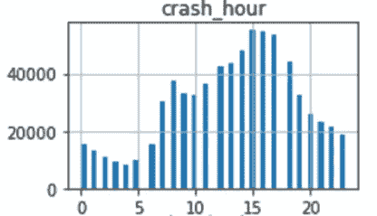

未缩放的崩溃小时数据

## 缩放与变换

缩放是一种在数据预处理中用于标准化特征的技术，使其具有相似的大小。这对于机器学习模型尤为重要，因为模型通常对输入特征的尺度很敏感。我定义了 StandardScaler() 函数作为此模型中的缩放器——这个缩放函数将数据转换为均值为 0 和标准差为 1 的形式。

对于具有偏斜或双峰分布的数据，可以使用对数函数进行缩放。对数函数使偏斜的数据更为对称，并减少数据中的尾部——这在处理异常值时非常有用。我以这种方式缩放了纬度和经度数据；由于经度数据都是负值，因此计算了负对数，然后进行了缩放。

```py
#scaling latitude and longitude data
scaler = StandardScaler()

# Logarithmic transformation on longitude
collisions_ml['neg_log_longitude'] = scaler.fit_transform(np.log1p(-collisions_ml['longitude']).
                                                          values.reshape(-1,1))

# Normalisation on latitude
collisions_ml['norm_latitude'] = scaler.fit_transform(np.log1p(collisions['latitude']).
                                                      values.reshape(-1, 1))
```

这产生了期望的效果，如下所示：

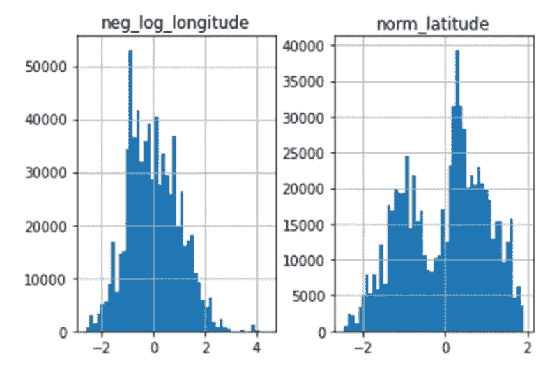

缩放后的纬度-经度数据

相比之下，周期性数据通常使用三角函数（如正弦和余弦）进行缩放。根据早期观察，崩溃小时数据看起来大致是周期性的，所以我对数据应用了正弦函数——由于 numpy 的 sin() 函数以弧度为单位，我在计算输入的正弦值之前，首先将输入转换为弧度：

```py
#transforming crash_hour 
#data is cyclic, can be encoded using trig transforms

#trig transformation - sin(crash_hr)
collisions_ml['sin_hr'] = np.sin(2*np.pi*collisions_ml['crash_hour']/24)
```

变换后的数据的直方图如下所示：

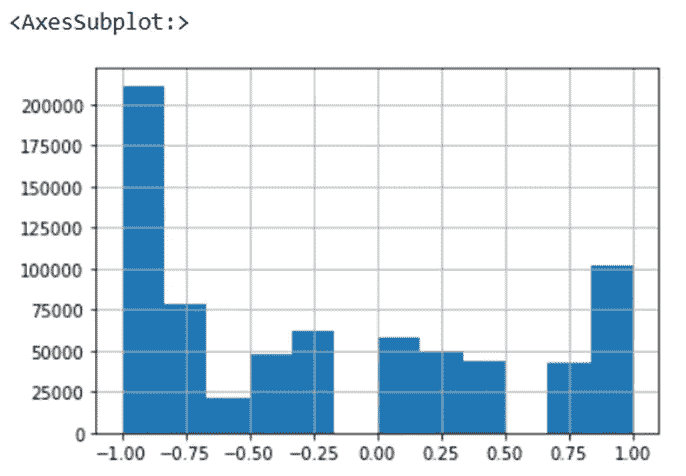

缩放后的崩溃小时数据

最后，我从模型中移除了未缩放的数据，以避免干扰模型预测：

```py
#drop previous latitude/longitude columns
lat_long_drop_cols = ['longitude','latitude']
collisions_ml.drop(lat_long_drop_cols,axis=1,inplace=True)

#drop crash_hour column
collisions_ml.drop('crash_hour',axis=1,inplace=True)
```

## 数据编码

数据预处理的另一个重要步骤是数据编码——这是将非数值数据（例如类别）表示为数值格式的过程，以使其与机器学习算法兼容。在这个模型中，对于类别数据，我使用了一种叫做标签编码的方法——在将每个类别输入到模型之前，为列中的每个类别分配一个数值。此过程的示意图如下：

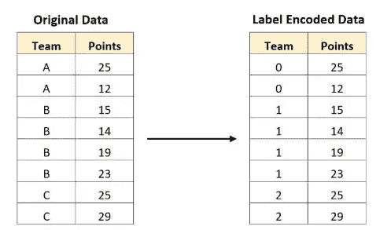

标签编码的一个示例（感谢 Zach M—[来源](https://www.statology.org/label-encoding-in-python/)）

我对数据集中的列进行了编码，首先将要保留的列从原始数据集中分离出来，并制作了数据框（collisions_ml）的副本。然后，我在列表中定义了类别列，并使用 sklearn 的 LabelEncoder() 函数来拟合和变换这些类别列：

```py
#segmenting columns into lists
ml_cols = ['posted_speed_limit','traffic_control_device', 'device_condition', 'weather_condition',
          'lighting_condition', 'first_crash_type', 'trafficway_type','alignment', 
           'roadway_surface_cond', 'road_defect', 'crash_type','damage','prim_contributory_cause',
          'sec_contributory_cause','street_direction','num_units', 'DISTRICT',
          'crash_hour','crash_day_of_week','latitude', 'longitude']
cat_cols = ['traffic_control_device', 'device_condition', 'weather_condition', 'DISTRICT',
           'lighting_condition', 'first_crash_type', 'trafficway_type','alignment',
           'roadway_surface_cond', 'road_defect', 'crash_type','damage','prim_contributory_cause',
           'sec_contributory_cause','street_direction','num_units']

#making a copy of the dataset
collisions_ml = collisions[ml_cols].copy()

#encoding categorical values
label_encoder = LabelEncoder()
for col in collisions_ml[cat_cols].columns:
    collisions_ml[col] = label_encoder.fit_transform(collisions_ml[col])
```

由于数据已经足够预处理，现在可以将数据拆分为训练数据和测试数据，并对数据进行分类模型拟合。

## 拆分训练和测试数据

在构建机器学习模型时，将数据分为训练集和测试集非常重要；训练集是初始数据的一部分，用于对模型进行正确响应的训练，而测试集用于评估模型性能。保持这两者分开是减少过拟合和模型偏差风险的必要措施。

我使用 drop() 函数分离出 crash_type 列（其余特征将用作预测 crash_type 的变量），并将 crash_type 定义为使用模型进行预测的 y 结果。使用 sklearn 的 train_test_split 函数将初始数据集的 20% 作为训练数据，其余部分用于模型测试。

```py
#Create test set
#setting X and y values

X = collisions_ml.drop('crash_type', axis=1)
y = collisions_ml['crash_type']
X_train, X_test, y_train, y_test = train_test_split(X, y, test_size=0.2, random_state=42)
```

## K-近邻分类

在这个项目中，使用 K-近邻（KNN）分类模型根据特征预测结果。KNN 模型通过检查未知数据点周围 K 个最近已知值的值来工作，然后根据这些“邻居”点的值对数据点进行分类。它是一种非参数分类器，这意味着它对底层数据分布没有任何假设；然而，它计算开销大，并且对数据中的异常值可能敏感。

我初始化了 KNN 分类器，初始 n_neighbors 设置为 3，使用欧几里得度量，然后将模型拟合到训练数据上：

```py
#Classifier - K Nearest Neighbours
#instantiate KNN Classifier
KNNClassifier = KNeighborsClassifier(n_neighbors=3, metric = 'euclidean')

KNNClassifier.fit(X_train,y_train)
```

一旦模型拟合到训练数据上，我对测试数据进行了如下预测：

```py
#Predictions
#predict on training set
y_train_pred = KNNClassifier.predict(X_train)

#predict on test data
y_test_pred = KNNClassifier.predict(X_test)
```

## 评估

机器学习模型的评估通常使用四个指标：准确率、精确率、召回率和 F1 分数。这些指标之间的差异非常细微，但用通俗的语言可以定义如下：

1.  ***准确率:*** 真正例预测占所有模型预测的百分比。通常，应测量训练数据和测试数据的准确率以评估模型拟合情况。

1.  ***精确率:*** 真正例预测占所有*正*模型预测的百分比。

1.  ***召回率:*** 真正例预测占所有*数据集中正例的百分比*。

1.  ***F1 分数:*** 模型识别数据中正例能力的总体指标，结合了精确率和召回率分数。

我使用以下代码片段计算了 KNN 模型的指标——我还计算了模型在训练集和测试集上的准确性差异，以评估拟合情况：

```py
#Evaluate model
# Calculate the accuracy of the model

#calculating accuracy of model on training data
train_accuracy = accuracy_score(y_train, y_train_pred)

#calculating accuracy of model on test data
test_accuracy = accuracy_score(y_test, y_test_pred)

#computing f1 score,precision,recall
f1 = f1_score(y_test, y_test_pred)
precision = precision_score(y_test,y_test_pred)
recall = recall_score(y_test,y_test_pred)

#comparing performances
print("Training Accuracy:", train_accuracy)
print("Test Accuracy:", test_accuracy)
print("Train-Test Accuracy Difference:", train_accuracy-test_accuracy)

#print precision score
print("Precision Score:", precision)

#print recall score
print("Recall Score:", recall)

#print f1 score
print("F1 Score:", f1)
```

KNN 模型的初始指标如下：

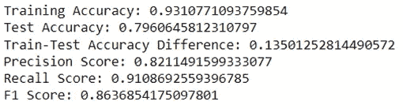

KNN 模型在第一次迭代中的指标

模型在测试准确率（79.6%）、精确度（82.1%）、召回率（91.1%）和 F1 分数（86.3%）上表现良好——然而，测试准确率远高于训练准确率，达到了 93.1%，差异为 13.5%。这表明模型存在过拟合现象，这意味着它在对未见数据进行准确预测时会遇到困难。因此，需要调整模型以获得更好的拟合——这可以通过一种称为超参数调整的过程来完成。

## 超参数调整

超参数调整是选择机器学习模型最佳超参数集的过程。我使用了*k 折交叉验证*对模型进行了微调——这是一种重采样技术，将数据拆分为*k*个子集（或*折*），然后每个折轮流用作验证集，而其余数据用作训练集。这种方法有效地降低了由于特定训练/测试集选择引入模型偏差的风险。

KNN 模型的超参数包括邻居数量（*n_neighbors*）和距离度量。有多种方法可以在 KNN 分类器中测量距离，但在这里我专注于两个选项：

1.  ***欧几里得：*** 这可以被认为是两点之间的直线距离——它是最常用的距离度量。

1.  ***曼哈顿：*** 也称为“城市街区”距离，这是两个点之间坐标绝对差异的总和。如果你想象站在城市建筑的一个角落并试图到达对角线的另一角——你不会穿过建筑物，而是先上一个街区，然后横穿一个街区。

请注意，我也可以对权重参数进行微调（该参数决定了所有邻居是否平等投票，或者较近的邻居是否被赋予更高的重要性），但我决定保持投票权重均匀。

我定义了一个参数网格，包含`n_neighbors`值为 3、7 和 10，以及欧几里得或曼哈顿度量。我然后实例化了一个*RandomizedSearchCV*算法，将 KNN 分类器作为估计器，并传入参数网格。我将算法设置为将数据拆分为 5 折，通过将*cv*参数设置为 5；然后将其拟合到训练集上。以下是相关代码片段：

```py
#Fine tuning (RandomisedSearchCV)
# Define parameter grid
param_grid = {
    'n_neighbors': [3, 7, 10],
    'metric': ['euclidean','manhattan']
}

# instantiate RandomizedSearchCV
random_search = RandomizedSearchCV(estimator=KNeighborsClassifier(), param_distributions=param_grid, cv=5)

# fit to training data
random_search.fit(X_train, y_train)

# Retrieve best model and performance
best_classifier = random_search.best_estimator_
best_accuracy = random_search.best_score_

print("Best Accuracy:", best_accuracy)
print("Best Model:", best_classifier)
```

从算法中检索到最佳准确率和分类器，表明分类器在使用曼哈顿距离度量时，`n_neighbors`设置为 10 的效果最佳，这将导致准确率为 74.0%：

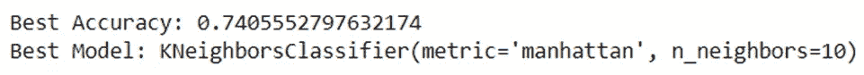

交叉验证的结果——随机搜索分类器推荐使用`n_neighbors=10`，采用曼哈顿距离度量

因此，这些参数被输入到分类器中，模型被重新训练：

```py
#Classifier - K Nearest Neighbours
#instantiate KNN Classifier
KNNClassifier = KNeighborsClassifier(n_neighbors=10, metric = 'manhattan')

KNNClassifier.fit(X_train,y_train)
```

性能指标再次从分类器中提取，方式与之前相同——以下是此迭代的指标截屏：

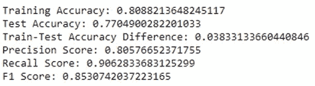

调整后的 KNN 模型指标

交叉验证导致所有指标的结果略有下降；测试准确率下降了 2.6%，精确度下降了 1.5%，召回率下降了 0.5%，F1 分数下降了 1%。然而，训练与测试准确率的差异降至 3.8%，而最初为 13.5%。这表明模型不再过拟合数据，因此更适合预测未见过的数据。

# 结论

总结来说，KNN 分类器在预测碰撞是否需要拖车或救护车方面表现良好。模型首次迭代的初步指标令人印象深刻，但测试和训练准确率之间的差距表明存在过拟合。超参数调整使得模型得以优化，从而显著减少了两个数据集之间的准确率差距。虽然在此过程中性能指标有所下降，但模型更好的拟合度的好处超越了这些问题。

# 参考文献

1.  Levy, J. (无日期)。交通事故——事故[数据集]。取自芝加哥数据门户网站。网址：[`data.cityofchicago.org/Transportation/Traffic-Crashes-Crashes/85ca-t3if`](https://data.cityofchicago.org/Transportation/Traffic-Crashes-Crashes/85ca-t3if)（访问日期：2023 年 5 月 14 日）。

1.  芝加哥警察局（无日期）。边界——警察巡逻区（当前）[数据集]。取自芝加哥数据门户网站。网址：[`data.cityofchicago.org/Public-Safety/Boundaries-Police-Beats-current-/aerh-rz74`](https://data.cityofchicago.org/Public-Safety/Boundaries-Police-Beats-current-/aerh-rz74)（访问日期：2023 年 5 月 14 日）。

1.  Zach M. (2022)。“如何在 Python 中进行标签编码（附示例）。”[在线]。网址：[`www.statology.org/label-encoding-in-python/`](https://www.statology.org/label-encoding-in-python/)（访问日期：2023 年 7 月 19 日）。
