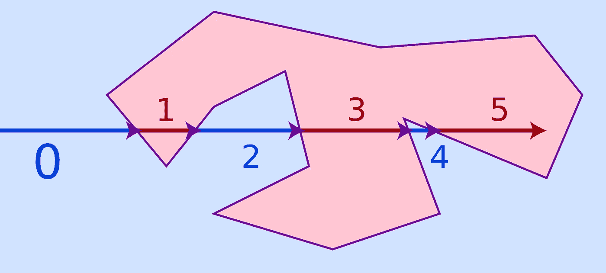

# 数据工程：在单个旧 GPU 上进行大约 2 亿行的快速空间连接

> 原文：[`towardsdatascience.com/data-engineering-fast-spatial-joins-across-2-billion-rows-on-a-single-old-gpu-c6cb531949ed?source=collection_archive---------11-----------------------#2023-05-30`](https://towardsdatascience.com/data-engineering-fast-spatial-joins-across-2-billion-rows-on-a-single-old-gpu-c6cb531949ed?source=collection_archive---------11-----------------------#2023-05-30)

## 比较在本地机器上的旧款 Nvidia GeForce GTX 1060 GPU 上进行空间连接时，ORC 和 Parquet 的性能表现

[](https://medium.com/@voycey?source=post_page-----c6cb531949ed--------------------------------)[](https://towardsdatascience.com/?source=post_page-----c6cb531949ed--------------------------------) [Daniel Voyce](https://medium.com/@voycey?source=post_page-----c6cb531949ed--------------------------------)

·

[关注](https://medium.com/m/signin?actionUrl=https%3A%2F%2Fmedium.com%2F_%2Fsubscribe%2Fuser%2F558f3984efd6&operation=register&redirect=https%3A%2F%2Ftowardsdatascience.com%2Fdata-engineering-fast-spatial-joins-across-2-billion-rows-on-a-single-old-gpu-c6cb531949ed&user=Daniel+Voyce&userId=558f3984efd6&source=post_page-558f3984efd6----c6cb531949ed---------------------post_header-----------) 发表在 [Towards Data Science](https://towardsdatascience.com/?source=post_page-----c6cb531949ed--------------------------------) · 7 分钟阅读 · 2023 年 5 月 30 日[](https://medium.com/m/signin?actionUrl=https%3A%2F%2Fmedium.com%2F_%2Fvote%2Ftowards-data-science%2Fc6cb531949ed&operation=register&redirect=https%3A%2F%2Ftowardsdatascience.com%2Fdata-engineering-fast-spatial-joins-across-2-billion-rows-on-a-single-old-gpu-c6cb531949ed&user=Daniel+Voyce&userId=558f3984efd6&source=-----c6cb531949ed---------------------clap_footer-----------)

--

[](https://medium.com/m/signin?actionUrl=https%3A%2F%2Fmedium.com%2F_%2Fbookmark%2Fp%2Fc6cb531949ed&operation=register&redirect=https%3A%2F%2Ftowardsdatascience.com%2Fdata-engineering-fast-spatial-joins-across-2-billion-rows-on-a-single-old-gpu-c6cb531949ed&source=-----c6cb531949ed---------------------bookmark_footer-----------)

图片由 [Clay Banks](https://unsplash.com/@claybanks?utm_source=medium&utm_medium=referral) 提供，来源于 [Unsplash](https://unsplash.com/?utm_source=medium&utm_medium=referral)

在过去几周里，我对自 2019 年以来 GPU 数据处理库的进展进行了更深入的探讨。

在 4 年里，我发现许多在 2019 年处于早期 alpha 阶段的库已经成熟为实际使用的可靠项目。

我在大数据解决方案的 Data Engineering 领域工作了多年，我们定期进行的任务之一是通过多个多边形执行人类运动数据的空间连接。这是一个具有多个优化层次的很好的用例，但“点在多边形内”测试是所有工作的核心。



[`en.wikipedia.org/wiki/Point_in_polygon#/media/File:RecursiveEvenPolygon.svg`](https://en.wikipedia.org/wiki/Point_in_polygon#/media/File:RecursiveEvenPolygon.svg)

之前，我们探索了包括 PostGIS、Redshift 和 BigQuery 在内的多种方法来实现这一目标。最终，我们建立了管道，通过大约 1.4 亿个多边形在 BigQuery 上处理每日 2000 亿行数据。

随着 GPU 处理技术的最新进展，我对重新评估这项任务以及使用我的实验室机器评估 GPU 上的处理时间产生了兴趣。本文详细介绍了在消费者 GPU（GeForce GTX 1060）上执行这项任务的过程和所需时间。

# 设置

你可以在这里阅读关于设置、数据预处理和其他内容：

[## GPU 数据工程，使用 Dask 和 RAPIDS.ai 将 CSV 转换为 Parquet 和 ORC](https://medium.com/@voycey/gpu-data-engineering-csv-to-parquet-orc-using-dask-rapids-ai-2d68f7912458?source=post_page-----c6cb531949ed--------------------------------)

### 直到最近，我的大部分数据工程工作都集中在设计和部署数据管道上，通常是在…

[medium.com](https://medium.com/@voycey/gpu-data-engineering-csv-to-parquet-orc-using-dask-rapids-ai-2d68f7912458?source=post_page-----c6cb531949ed--------------------------------)

该实验使用的数据集包含 CSV 格式的经纬度点和一个表示拉斯维加斯的多边形。数据集被转换为 Parquet 和 ORC 格式，以评估这些格式之间的性能差异。

CuSpatial 是一个基于 rapids.ai 的库，专注于地理空间和 GIS 应用程序，用于实际性能测试。

[## GitHub - rapidsai/cuspatial: CUDA 加速的 GIS 和时空算法](https://github.com/rapidsai/cuspatial?source=post_page-----c6cb531949ed--------------------------------)

### cuSpatial 通过 GPU 并行化加速矢量地理空间操作。作为 RAPIDS 库的一部分…

[github.com](https://github.com/rapidsai/cuspatial?source=post_page-----c6cb531949ed--------------------------------)

我故意避免使用任何空间索引或其他方法来提升性能。这项实验应被视为基线性能，经过各种技术手段可以显著提升。

数据集约 400GB 未压缩，包含 28 亿行点数据。

# 代码

下面提供的代码依赖于 Rapids.ai 和 Dask（特别是*dask_cudf*），以在 GPU 上处理数据并将数据划分以适应有限的 GPU 内存。这个过程涉及大量的调整和格式特定的错误信息（例如，在 Parquet 上工作正常但在 ORC 上却出现问题，反之亦然）。

ChatGPT 和 NVIDIA 团队在完成这项任务中发挥了重要作用，我喜欢大家在数据社区中的乐于助人！ChatGPT 对理解一些 Dask 相关功能和通过提供一些解决方案来处理各种错误很有帮助。

每个实验的基本设置如下，唯一的区别在于如何创建 *ddf*（*read_orc* 与 *read_parquet*）：

```py
rmm.reinitialize(managed_memory=True)
cluster = LocalCUDACluster()
client = Client(cluster)

polygon_wkt = "POLYGON((-115.074444 36.289153, -115.208314 36.325569, -115.208688 36.325646, -115.259397 36.335589, -115.260628 36.335652, -115.260845 36.335658, -115.276407 36.335967, -115.320842 36.33641, -115.333587 36.30627, -115.368573 36.170149, -115.3682 36.168344, -115.36794 36.16714, -115.353159 36.109493, -115.315922 36.023474, -115.298126 35.998029, -115.102856 35.918199, -115.100108 35.918038, -115.095546 35.917781, -115.084946 35.918409, -115.072079 35.923316, -114.918841 35.983522, -114.919047 36.0226, -114.919067 36.022821, -114.919108 36.022997, -114.93976 36.080677, -115.006009 36.219129, -115.007607 36.222047, -115.008162 36.222806, -115.010791 36.225883, -115.06011 36.27717, -115.068572 36.285772, -115.069297 36.286474, -115.069637 36.286803, -115.070046 36.287197, -115.071477 36.288191, -115.071736 36.288332, -115.074214 36.289087, -115.074444 36.289153))"

#build polygon geoseries
polygon_shapely = wkt.loads(polygon_wkt)
polygon = geopandas.GeoSeries.from_wkt([polygon_wkt])
polygon[0]

def spatial_join(df_partition, polygon):

    #build points geoseries
    i_ddf = df_partition[['lon', 'lat']].interleave_columns(
    points_gseries = cuspatial.GeoSeries.from_points_xy(i_ddf)

    #do spatial join
    result = cuspatial.point_in_polygon(
        points_gseries, polygon
    )

    #needed for large datasets as wont fit into size_type (https://github.com/rapidsai/cudf/issues/3958)
    true_count = np.sum(result)
    false_count = len(result) - true_count

    return (true_count, false_count)

def wrapped_spatial_join(df_partition):
    gpolygon = cuspatial.from_geopandas(polygon)
    return spatial_join(df_partition, gpolygon)

sums = ddf.map_partitions(wrapped_spatial_join).compute()

total_true_count = sum(t[0] for t in sums)
total_false_count = sum(t[1] for t in sums)

result = {'True': total_true_count, 'False': total_false_count}
result
```

# 结果与文件类型

关于结果和文件类型，在上一篇文章中我选择了 ORC 和 Parquet 作为导出文件类型，因为它们是大数据生态系统中最广泛使用的两种文件格式。ORC 经常被忽视而青睐 Parquet，但它提供的功能在某些系统上可以超越 Parquet。

我在 ORC 和 Parquet 文件上运行了相同的代码，并获得了以下结果：

## Parquet 结果

***3 分钟 9 秒 — 令人印象深刻！***

```py
sums = ddf.map_partitions(wrapped_spatial_join).compute()

CPU times: user 8.81 s, sys: 2.01 s, total: 10.8 s
Wall time: 3min 9s

total_true_count = sum(t[0] for t in sums)
total_false_count = sum(t[1] for t in sums)
​
result = {'True': total_true_count, 'False': total_false_count}
result

CPU times: user 1.3 s, sys: 79.2 ms, total: 1.38 s
Wall time: 1.34 s
{'True': 0    2179985812
 dtype: int64,
 'False': 0    66374320
 dtype: int64}

Total: 2,246,360,132 Rows
```

> ***从 CSV 到结果的总 Parquet 时间 = 23 分 04 秒***

## Orc 结果

***6 分钟 18 秒 — Parquet 时间的两倍但仍然*** *值得称道* ***！***

```py
sums = ddf.map_partitions(wrapped_spatial_join).compute()

CPU times: user 23.8 s, sys: 4.37 s, total: 28.1 s
Wall time: 6min 18s

total_true_count = sum(t[0] for t in sums)
total_false_count = sum(t[1] for t in sums)

result = {'True': total_true_count, 'False': total_false_count}
result

CPU times: user 4.29 s, sys: 301 ms, total: 4.59 s
Wall time: 4.45 s
{'True': 0    2179985812
 dtype: int64,
 'False': 0    66374320
 dtype: int64}

Total: 2,246,360,132 Rows
```

> ***从 CSV 到结果的总 ORC 时间 = 17 分 55 秒***
> 
> 总体而言，Parquet 总时间为 23 分钟，而 ORC 为 18 分钟。然而，最佳文件格式将取决于你的使用案例和所使用的系统。

# 痛点

在这个过程中，我遇到了一些挑战，例如处理数据帧大小、有限的 GPU 内存以及数据集的大小和类型问题。

尽管存在这些障碍，从这个实验中得出的结论是，虽然 Parquet 转换时间较长，但转换后性能更佳。而 ORC 在计算上较慢，但转换速度较快。

两种格式在有限硬件上的表现都令人印象深刻，并且通过基本优化，性能都可以显著提升。

## Dask 分布式实现中的挑战

为了利用 CuSpatial 的空间连接函数 “*point_in_polygon*”，纬度和经度点必须存储在交错数组格式中：

```py
#interleaved

[
lon,
lat,
lon,
lat,
lon,
lat,
lon,
...
]

#instead of

[[lon,lat],[lon,lat],[lon,lat],[lon,lat],[lon,lat],...] 
```

这种特定安排可能是由于 GPU 流处理对这种数据结构的高效性。主要挑战是处理比 GPU 内存更大的数据帧，并将其转换为所需的交错数组格式。

起初，我尝试使用 *dask_cudf* 对我读取的点数据进行分区，希望这足以执行 *point_in_polygon* 函数。然而，我很快意识到，由于需要将点交错，除非这些点（10GB）能够适应 GPU 内存（6GB），否则这将是不可能的。

回顾起来，解决方案是使用*map_partitions*来处理* dask_cudf* 框架中的数据。交错需要在 map_partitions 函数内进行，而不是在传递之前，这样只对每个分区进行交错，而不是整个数据框。

这并不像看起来那么简单，因为函数的 Pickle 序列化存在问题，最终需要创建“*wrapped_spatial_join*”函数。

事后看来，这是一个显而易见的解决方案，我本应该使用*map_partitions*来处理*dask_cudf* 框架中的数据，交错需要在*map_partitions*函数内完成，而不是在传递给*map_partitions*之前，这样只对每个块进行交错，而不是整个数据框。

这也并不像描述的那样简单，因为*dask* 不喜欢在*map_partitions*函数内包含其他函数（这会导致 Pickle 序列化函数的问题——因此最终有了“*wrapped_spatial_join*”函数）。

## 数据大小和类型挑战

另一个遇到的问题是*cuDF*的数据集大小限制，由*INT_32*（2,147,483,647）大小限制。我的数据集大约包含 23 亿条记录，超出了这个限制。

这意味着不可能一次性处理整个数据集，因此必须对数据分区完成所有操作。其中一个例子是多边形内外点的最终计数。不能使用简单的*result.value_counts()*，需要对每个分区进行单独计算，然后汇总结果。

对于需要在数据集上进行复杂计算的大型或宽数据集，这一点尤为重要，因为处理整个数据集可能不可行。这实际上是这次实验的主要焦点，因为现在这在小型 GPU 上有效，你可以确信相同的过程可以应用于更大的 GPU 和更大的数据集！

# 结论

就性能而言，Parquet 转换所需时间较长，但一旦转换完成，其效率更高。根据工作流程，这可能是一个关键因素。通常，数据只需转换一次，但可能会经历多次分析，使得 Parquet 成为更合适的选择。

另一方面，ORC 转换更快，但在计算时效率较低。对于更多的临时计算，ORC 可能更可取，特别是与具有高效 ORC 引擎的工具如 TrinoDB 一起使用时。

> 两种格式在有限的硬件上表现出强大的性能。通过一些基本优化，它们的性能可能会进一步提高。观察每种格式的基线性能是很有价值的。

## 未来实验

在未来，我计划对多个多边形进行相同的实验，并探索处理这些多边形的方法。例如，我将对拉斯维加斯地区的邮政编码数据集进行空间连接，以检查处理多个多边形的可行性。此外，我还计划利用空间索引解决方案，如 Uber 的 H3，来对数据进行索引，并评估其对最终结果的影响。

## 关于作者

## Dan Voyce


