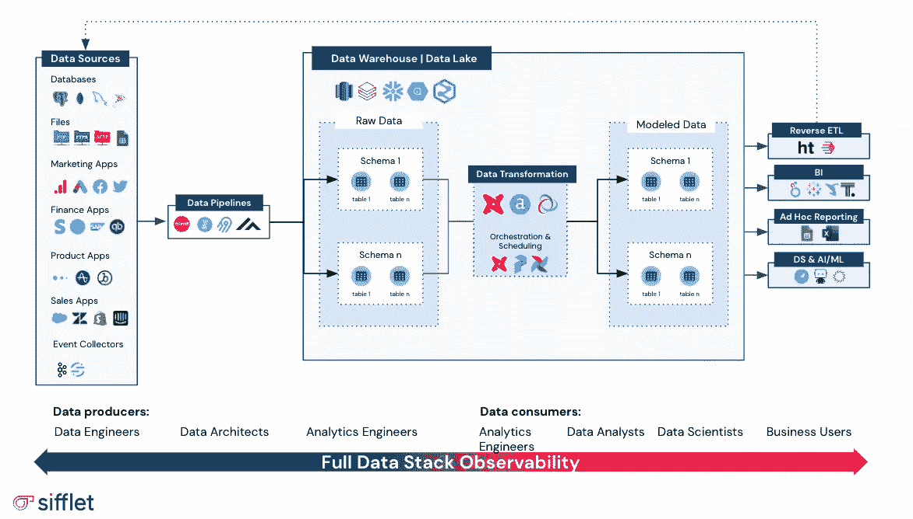

# 数据熵：数据越多，问题越多？

> 原文：[`towardsdatascience.com/data-entropy-more-data-more-problems-fa889a9dd0ec?source=collection_archive---------0-----------------------#2023-05-18`](https://towardsdatascience.com/data-entropy-more-data-more-problems-fa889a9dd0ec?source=collection_archive---------0-----------------------#2023-05-18)

## 如何在现代数据组织中应对和拥抱复杂性。

 [Salma Bakouk](https://medium.com/@salmabakouk?source=post_page-----fa889a9dd0ec--------------------------------)

·

[Follow](https://medium.com/m/signin?actionUrl=https%3A%2F%2Fmedium.com%2F_%2Fsubscribe%2Fuser%2F738a4a8bdba9&operation=register&redirect=https%3A%2F%2Ftowardsdatascience.com%2Fdata-entropy-more-data-more-problems-fa889a9dd0ec&user=Salma+Bakouk&userId=738a4a8bdba9&source=post_page-738a4a8bdba9----fa889a9dd0ec---------------------post_header-----------) 发表在 [Towards Data Science](https://towardsdatascience.com/?source=post_page-----fa889a9dd0ec--------------------------------) ·10 分钟阅读·2023 年 5 月 18 日

--

来源：[`unsplash.com/@brett_jordan`](https://unsplash.com/@brett_jordan)

“就像我们遇到的钱越多，我们看到的问题也越多。” —— **Notorious B.I.G**

[Webster’s](https://www.merriam-webster.com/dictionary/entropy#:~:text=1%20thermodynamics%20%3A%20a%20measure%20of,with%20the%20temperature%20of%20the) 词典将热力学中的熵定义为一个封闭热力学系统中不可用能量的度量，同时通常也被认为是系统混乱程度的度量。

在信息论中，信息熵的概念由[克劳德·香农](https://en.wikipedia.org/wiki/A_Mathematical_Theory_of_Communication)于 1948 年提出，表示一个随机变量的“惊讶”、“信息”以及与各种可能结果相关的“不确定性”水平。对我的数学迷们来说，推荐一些有趣的阅读材料（这里和[这里](https://people.math.harvard.edu/~ctm/home/text/others/shannon/entropy/entropy.pdf)）。

在更广泛的背景下，熵是指事物随着时间推移而趋向无序的倾向，以及系统或环境中一般的混乱和不确定性增加。

如果你是今天繁荣的数据生态系统中的数据从业者，并被同行或业务利益相关者要求描述你的数据平台，我想你会使用以下词汇的组合：现代的/基于云的、模块化的、不断演变的、灵活的、可扩展的、安全的等。但你和我之间，你知道你也想把：混乱的、不可预测的、混沌的、昂贵的和无序的词汇加进去。

以下场景是否让你感到熟悉？

+   商业用户无法找到并访问对他们的工作流程至关重要的数据资产。

+   利益相关者不断质疑他们在业务仪表板中看到的数字的准确性。

+   数据工程师花费无数时间来解决损坏的管道问题。

+   每一个“微小”的上游变化都会导致混乱。

+   数据团队不断面临精疲力竭，并且员工流失率高。

+   利益相关者无法看到昂贵数据举措背后的投资回报。

列表还在继续。

每个组织都希望成为数据驱动型，但现实是许多组织在囤积数据，每年在技术和人力资源上花费数百万美元，并希望一切顺利。你是否看到熵不仅仅存在于热力学中？

**那么，熵在数据平台的背景下是什么样的？**

**基础设施与技术**

根据[IDC 的研究](https://www.businesswire.com/news/home/20210817005182/en/Global-Spending-on-Big-Data-and-Analytics-Solutions-Will-Reach-215.7-Billion-in-2021-According-to-a-New-IDC-Spending-Guide)，全球公司每年在数据和分析解决方案上花费超过 2000 亿美元，以利用数据推动创新和业务繁荣。然而，由于缺乏方向和糟糕的战略，大多数公司最终会陷入技术和数据堆栈膨胀的困境，技术债务和维护成本不断上升。

基础设施和技术熵可以以一种或几种以下方式表现出来

+   过多的重叠工具，内部和外部解决方案的异质混合。在数据与基础设施工具方面，少即是多。如果你刚刚起步，你的分析需求相对简单，你的数据堆栈应该反映这一点。也就是说，你还应该考虑未来，倾向于选择能够随着需求扩展并提供所需灵活性的解决方案，以应对超高速增长阶段。要了解如何根据公司数据成熟度阶段为成功的数据实践奠定适当基础，请阅读[这篇文章](https://medium.com/towards-data-science/things-i-wish-i-knew-when-i-was-building-a-data-team-efcb43591204)。如果你正在升级现有平台，关键是要有战略眼光，考虑业务关键性，并据此优先排序。作为一个经验法则，在投资新解决方案之前，你必须确保可以完全迁移现有解决方案和流程，并战略性地规划[废弃](https://abseil.io/resources/swe-book/html/ch15.html)过程，以最小化技术债务。

+   孤立的数据。[Tech Target](https://www.techtarget.com/searchdatamanagement/definition/data-silo)将数据孤岛定义为由一个部门或业务单元控制的数据存储库，因此其他部门无法完全或轻易访问这些数据。虽然它们看似无害，但数据孤岛往往会导致不必要的信息壁垒的产生，从而稀释整体数据质量和数据治理标准。

+   缺乏或不充分采用公司范围内的数据产品创建和部署指南。这既可能是文化问题，也可能是技术问题，我们将在本文稍后讨论文化方面，但在技术方面，这通常发生在技术基础不允许数据及其生产基础设施的灵活性和民主化时。这不仅会导致开发周期变慢和数据解决方案质量差，还会严重阻碍组织的数据成熟过程。

**人员与文化**

“文化比战略更重要” 彼得·德鲁克。

奥地利裔美国管理顾问和作者的名言在组织的数据战略方面特别适用。数据在现代组织中扮演着核心角色；这种中心性不仅仅是一个比喻，因为数据团队通常介于传统 IT 和不同业务职能之间。因此，数据从业人员被期望管理和应对不同背景和沟通风格的利益相关者。这可能导致以下一种或多种情况：

+   IT 与业务之间缺乏对齐。业务和 IT 团队在组织中有着根本不同的目的和责任。然而，他们都朝着相同的目标努力：提高整体业务表现，降低成本，实现可持续增长。

+   IT 与数据管理功能之间缺乏对齐。对于大多数组织来说，数据实践相对于软件来说是新兴的。虽然将数据管理视为一个独立实体是有意义的，但完全与 IT 和工程分隔开并不是一个明智的选择。完全分离可能会损害数据生产周期，并导致许多低效，更不用说对知识转移的负面影响了。

+   数据生产者和数据消费者在数据服务级别协议（SLAs）方面缺乏对齐。我们称他们为消费者，但他们真的被这样对待吗？

+   数据质量的所有权不明确。是数据生产者的责任吗？是消费者的责任吗？还是数据产品经理的责任？越来越多的角色正在崛起以解决这个问题，例如数据质量分析师、数据运营、数据治理战略家等。然而，大多数组织仍然难以确定像数据资产质量这样基本问题的责任归属。

+   数据被视为二等公民。每家公司都希望成为数据驱动型，但即使在今天的环境下，数据驱动决策对许多人来说仍然是一个难以捉摸的理念。在启用和促进强大的数据驱动文化时，购买软件无疑是最简单的部分。

+   数据工程师将超过 50%的时间用于处理数据事件。让数据工程师专注于创造收入的活动而不是解决数据管道问题，可以带来很多价值。这样做不仅减少了他们在重复任务上花费的时间，还使他们能够关注更重要的事情。

**数据质量或其缺乏**

+   数据质量事件频繁，涉及的影响和严重程度各异。在[2021](https://www.gartner.com/smarterwithgartner/how-to-improve-your-data-quality) [Gartner 报告](https://www.gartner.com/smarterwithgartner/how-to-improve-your-data-quality)中，不良数据每年给企业带来的成本约为 1300 万美元。但数据质量问题到底是什么样的？有各种指标可以衡量数据质量并评估数据偏离预期的程度。更多信息可以在[这篇博客](https://medium.com/the-observatory-by-sifflet/getting-started-with-data-observability-60ad64044f04)中找到。

+   看似相同的事物有多个版本。什么是单一的真实来源？这尤其受到孤岛现象和团队之间缺乏协调的加剧。因此，试图根据数据做出决策的利益相关者之间的混乱和挫折不断升级，导致他们质疑数据团队生产的所有内容，有时甚至质疑其存在。

+   数据生产者和数据消费者之间存在持续冲突，通常关于谁应该对数据的可靠性负责以及在管道的哪个阶段。虽然在相对较小的组织中可能会得到控制，但在更大规模时，这种冲突就变得难以克服。

**那么你如何在数据平台中减少熵？**

虽然热力学第二定律指出熵要么随着时间增加，要么保持不变，绝不会减少，但幸运的是，对我们数据从业者来说，这一规则并不适用。以下是一些减少数据平台中熵的技巧：

**人员与文化**

+   数据驱动的文化始于（非常）高层。为了创建和培养数据驱动的文化，公司高层管理和 C 级管理者需要灌输和培养基于事实的决策思维。当高层管理者普遍期望每个业务案例和每个决策都需要以事实为依据，并以身作则时，操作人员自然会跟随。关于这一点的精彩阅读[在这里](https://hbr.org/2020/02/10-steps-to-creating-a-data-driven-culture)。

+   数据领导者也是业务领导者。作为数据领导者，你在设计上是一个混合角色，因为数据需要服务于特定的业务目的。没有公司是为了分析而进行分析的。你不仅凭借出色的技术领导力赢得了席位，还可以在整体业务表现中发挥重要作用。为此，你需要像业务领导者一样思考，这意味着要对数据和数据项目采取务实的以结果为导向的方法。

+   要有宏大的目标，但也要庆祝小胜利。数据成熟没有捷径，虽然你应该有雄心壮志并承担大项目，但知道何时退一步庆祝小成就对于保持团队的积极性和参与感至关重要。在这里同样需要采取基于事实的方法，因为这会增加数据驱动的倾向，并为强大的数据文化奠定良好的基础。

**流程**

“如果你不能将你所做的事情描述为一个过程，那你就不知道你在做什么。” ——W. Edwards Deming

+   **复杂性是不可避免的。学会接受它**。随着数据平台的扩展，它会变得越来越复杂。重要的是要记住，复杂性并不是坏事，它是不可避免的。关键在于管理复杂性，使系统更容易理解和使用。

+   **放下那些不再适用于你的东西**。数据平台复杂性的一个挑战是可能会导致大量的“技术债务”。这种情况发生在系统中存在一些不再发挥作用但由于过于复杂或耗时而被保留的部分。定期审查数据平台并剔除不必要的部分对保持其精简和高效至关重要。

+   **务实，经常审查流程并在必要时进行更改**。随着数据平台的发展，你的流程也应相应变化。定期审查运营并根据需要进行调整至关重要，以保持其更新和相关性。

**技术**

+   **软件投资回报率**。在数据平台技术领域，确保获得良好的投资回报率至关重要。这意味着选择适合你目的、能够满足现在和未来需求的软件至关重要。在做出决策时，还必须考虑诸如扩展成本、维护费用和培训等因素。

+   **何时构建，何时购买**。市场上有大量优秀的数据平台软件可供选择，在大多数情况下，购买现成的解决方案比自行构建更具成本效益。在权衡每种方法的利弊时，需要考虑的关键因素包括：成本、时间、质量和可扩展性。虽然在某些情况下构建自定义解决方案以解决特定问题可能是有意义的，但这通常会导致技术债务的累积，并且无法实现可扩展性，更不用说构建和维护解决方案所带来的机会成本。

+   **数据可观测性**。数据可观测性指的是理解和衡量数据平台中不同数据资产及其组件健康状态的能力。由于数据熵代表了数据平台内部的混乱和混沌，数据可观测性解决方案应运而生，旨在解决这类问题。

    如[这篇博文](https://medium.com/the-observatory-by-sifflet/getting-started-with-data-observability-60ad64044f04)中所解释的，数据可观测性是一个源自软件及控制理论的概念。软件可观测性的概念——比如 Datadog 和 New Relic 这样的公司——旨在帮助软件工程师更好地了解其应用程序内部的运行情况并监控其健康状态。现在这一概念可以应用到数据领域。因此，可观测性可以被定义为组织获得关于其数据健康状态的可操作见解的能力。正如我在[这篇博文](https://medium.com/the-observatory-by-sifflet/data-quality-monitoring-is-dead-say-hello-to-full-data-stack-observability-f73cac27ea52)中所解释的，数据可观测性有四大支柱：

+   **指标**：衡量数据质量

+   **元数据**：访问和监控数据的外部特征

+   **谱系**：映射数据资产之间的依赖关系

+   **日志**：数据与“外部世界”互动的方式

    理解数据可观察性的最佳方式是将其视为现代数据基础设施的一个监督层，旨在使数据从业者能够洞察和理解构成现代企业数据平台的日益复杂的数据资产网络。通过连接到数据堆栈的每个部分，从数据摄取、ETL/ELT、建模、数据仓库，一直到 BI/分析、反向 ETL、机器学习等，数据可观察性解决方案应能够提供对数据资产在管道各阶段健康状态的可操作见解。

图片由作者提供

# 结论

数据熵是昂贵的。根据[IBM](https://www.lightsondata.com/estimating-cost-poor-data-quality/)的研究，数据质量差每年给美国经济造成高达 3.1 万亿美元的损失，更不用说它对组织竞争地位和声誉的影响了。数据中的熵是否不可避免？它是否是规模和扩展的直接结果？是否应该接受它？是的，是的，还是。面对不可避免的复杂性增加，领先的组织正在寻求切实的解决方案，以帮助他们应对数据熵，确保他们昂贵的软件和数据平台投资能够获得最佳的投资回报。数据可观察性作为应对数据熵的解决方案，通过提供数据资产健康状态的全面视图以及它们如何与平台内的数据交互，帮助数据从业者最终将时间投入到推动业务前进的有价值的任务中。
