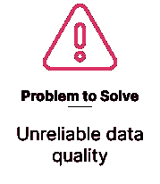
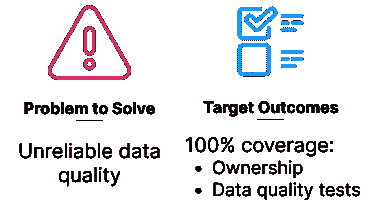
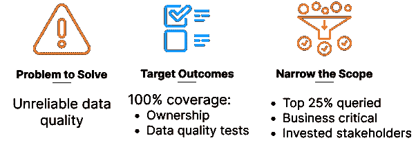
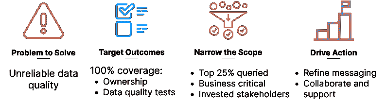
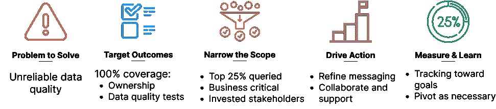

# 数据治理，但要将其作为团队运动

> 原文：[`towardsdatascience.com/data-governance-but-make-it-a-team-sport-30dc0164fb7c?source=collection_archive---------2-----------------------#2023-01-20`](https://towardsdatascience.com/data-governance-but-make-it-a-team-sport-30dc0164fb7c?source=collection_archive---------2-----------------------#2023-01-20)

## 数据治理中没有`我` 🙃

 [Maggie Hays](https://medium.com/@maggie.hays?source=post_page-----30dc0164fb7c--------------------------------)

·

[关注](https://medium.com/m/signin?actionUrl=https%3A%2F%2Fmedium.com%2F_%2Fsubscribe%2Fuser%2F97bb0837f08f&operation=register&redirect=https%3A%2F%2Ftowardsdatascience.com%2Fdata-governance-but-make-it-a-team-sport-30dc0164fb7c&user=Maggie+Hays&userId=97bb0837f08f&source=post_page-97bb0837f08f----30dc0164fb7c---------------------post_header-----------) 发表在 [Towards Data Science](https://towardsdatascience.com/?source=post_page-----30dc0164fb7c--------------------------------) ·6 分钟阅读·2023 年 1 月 20 日

--

众所周知，我们正处于现代数据堆栈的黄金时代。现在接入和使用高度灵活、可扩展的数据工具从未如此快速和简单。我们敏捷！我们以数据驱动！我们正在实现自助服务、数据民主化的梦想！

图片由 [Campaign Creators](https://unsplash.com/@campaign_creators?utm_source=medium&utm_medium=referral) 提供，来源于 [Unsplash](https://unsplash.com/?utm_source=medium&utm_medium=referral)

但每个优势背后都伴随有劣势：数据在不断增长的系统集合中越容易生成和消费，我们亲爱的现代数据堆栈就越快变成错综复杂的依赖网络。我们变得不那么灵活，反而花费越来越多的时间来处理不断增长的破损管道、转换逻辑、仪表板等积压问题。自助资源开始产生冲突的结果，挫败了我们的核心利益相关者，并在我们做出数据驱动决策的能力上播下了怀疑的种子。

不可避免地，这会转变为有关数据所有权、文档、标签、分类等的讨论；数据治理成为了可以解决一切的灵丹妙药！但我们应该从哪里开始？谁负责，负责什么？

听起来令人畏惧，对吧？其实不必如此！让我们通过一个迭代框架来引入数据治理。

# 步骤 1\. 确定要解决的问题

首先，花时间清楚定义你希望通过数据治理实践解决的问题。例如：

+   遵守不断变化的**合规/监管要求**需要耗时且冗余的手动审计数据源。我们没有标准的数据敏感性定义，因此结果会因审计人员的不同而有所变化。

+   我们每月的**数据存储和处理成本**失控了。我们需要尽快削减成本，但不知道谁负责什么，也不知道它在组织中的使用情况。

+   我们团队花费 20%的开发时间来修复由于**数据质量不可靠**而导致的损坏管道。数据质量问题应该在源头被发现，并由拥有数据源的团队解决。

*让我们在深入框架时聚焦于第三个问题：*

作者提供的图片

# 步骤 2\. 设定明确的目标

现在你已经确定了要解决的目标问题，并有了如何解决的想法，是时候设定一些具体的目标了。

花时间深入思考当前的问题：其他人可以采取什么措施来解决这个问题？你可以为其他人设定什么目标？如果一切顺利，这项努力会带来什么可衡量的影响？

让我们继续以数据质量不可靠为例，我们希望数据质量问题在源头被发现，并由适当的团队解决。这意味着我们要设定两个目标：1）分配**数据所有权**，2）为所有资产建立**数据质量测试覆盖**。因此，我们期望看到解决破损数据管道的时间减少。

作者提供的图片

很简单，对吧？我们知道要解决什么问题，怎么解决它，以及如何衡量影响。让我们继续前进。

# 步骤 3\. 从小处着手，然后再扩大

你还记得我们在第 2 步刚想到的解决方案吗？抑制一下将其一次性推广到所有数据资产的冲动。这一点尤其重要，当你从数千（或数十万！）资源开始，并将其委派给几十或上百个人时。

🤦🏼‍♀️*提醒：将 180k 列名称直接放入 Google 表格，并期待整个工程团队因为你礼貌请求就同意添加文档，这* ***绝对是个糟糕的主意*** *。他们会嘲笑你，你每次想到这事时都会感到尴尬。* 🙃🙃

相反，从高影响、低复杂性的数据资源子集和高度投入的利益相关者开始，与他们合作——*这就是我们开始将数据治理变成团队运动的地方！*

回到我们的数据质量问题例子：我们设定了一个非常高的目标，即将所有数据实体的所有权和数据质量测试分配给 100%。我们将避免一下子实现这个大目标，而是从一个狭窄的资源子集开始，这些资源是：

+   由高度投入的利益相关者拥有

+   频繁查询

+   应用于业务关键的管道、模型、报告等

作者提供的图片

通过保持数据实体的狭窄范围，你将能够更专注于设计可重复的、跨团队的数据治理工作流程。

# 第 4 步：推动渐进行动

你已经完成了定义解决什么问题、目标结果以及处理哪些资源的工作；现在是时候启用其他人采取行动了。这是与初步利益相关者组紧密合作的机会，以测试这一举措，为未来的大规模推广提供信息。

在你启用其他人采取行动时，请记住以下一些问题：

+   **这明显吗？** “为什么”应该对他们来说是显而易见的；应清楚为什么这项工作是有价值和有影响的

+   **这简单吗？** “做什么”应该明确定义，以便他们可以专注于执行

+   **这是协作的吗？** 不要过度规定“如何做”；专注于共同的最终目标，鼓励他们建立适合现有工作流程的过程/解决方案

最后但同样重要的是，创建快速反馈循环，并主动征求反馈。你的利益相关者在哪些方面缺乏背景？哪些行动对他们来说很困难？他们需要什么类型的持续支持？

回到我们不可靠的数据质量例子，我们已经要求高度投入的利益相关者正式承担所有权，并为他们最常查询的 25%业务关键数据资产添加数据质量测试。在这一步中，我们应专注于确保他们：

+   理解数据质量测试的缺乏对下游资源有很大影响

+   理解我们对数据所有者的期望

+   能够轻松创建和监控范围内资源的数据质量测试

作者提供的图片

# 第 5 步：衡量进展并学习

既然你已经启动了跨团队的数据治理工作流，现在是时候衡量进展并确定哪些有效哪些无效了：

+   你是否在朝着你的目标取得进展？

+   目标仍然是正确的吗？

+   你的利益相关者是否支持这一倡议？

+   在向其他利益相关者推出之前，你需要改变/调整什么？

作者提供的图片

# 第 6 步。迭代！

你已经完成了最后一步！现在是时候从头开始，应用你所学到的知识，并在过程中完善这些工作流。

# 一些告别的想法

不要让完美成为善的敌人——即使你不能完美地治理你堆栈中的每一个数据实体，也不意味着治理一个子集没有价值。关注影响，而不是完美。

要习惯重新评估你的目标/预期结果，并根据需要帮助你的利益相关者调整方向。听取他们的反馈。记住，你是在让他们承担额外的工作，所以尽力让这份工作值得他们的时间（而不是因为我们曾经设定了一个目标，所以我们也许应该去做它。）

我很想知道你在组织中如何处理数据治理——让我们一起对这个框架进行迭代！你可以随时通过[DataHub](https://datahubproject.io/)或[Slack](https://slack.datahubproject.io/)与我联系——我迫不及待地想听到你的消息！
