# 数据是语言模型的基础

> 原文：[`towardsdatascience.com/data-is-the-foundation-of-language-models-52e9f48c07f5`](https://towardsdatascience.com/data-is-the-foundation-of-language-models-52e9f48c07f5)

## 高质量的数据如何影响 LLM 训练流程的每个方面…

 [Cameron R. Wolfe, Ph.D.](https://wolfecameron.medium.com/?source=post_page-----52e9f48c07f5--------------------------------)

·发表于 [Towards Data Science](https://towardsdatascience.com/?source=post_page-----52e9f48c07f5--------------------------------) ·阅读时间 16 分钟·2023 年 10 月 29 日

--

（照片由 [Joshua Sortino](https://unsplash.com/@sortino?utm_content=creditCopyText&utm_medium=referral&utm_source=unsplash) 提供，来源于 [Unsplash](https://unsplash.com/photos/worms-eye-view-photography-of-ceiling-LqKhnDzSF-8?utm_content=creditCopyText&utm_medium=referral&utm_source=unsplash)）

大型语言模型（LLMs）已经存在了一段时间，但直到最近，它们令人印象深刻的表现才引起了更广泛的人工智能社区的显著关注。考虑到这一点，我们可能开始质疑当前 LLM 运动的起源。*究竟是什么使得近期模型相比于前辈如此令人印象深刻？* 尽管有些人可能会提出多种不同因素，但一个尤其重要的进步是执行对齐的能力。换句话说，我们找到了训练 LLMs 的方法，不仅输出最可能的下一个词，而且输出能满足人类目标的文本，无论是通过遵循指令还是检索重要信息。

> “我们假设对齐可以是一个简单的过程，其中模型学习与用户互动的风格或格式，以揭示在预训练期间已经获得的知识和能力”*— 来自 [1]*

本概述将研究对齐的作用和影响，以及对齐与预训练之间的相互作用。有趣的是，这些观点由最近的 LIMA 模型 [1] 探讨，该模型通过仅对 1,000 个高质量响应示例的半手动策划语料库进行预训练的 LLM 的微调来执行对齐。我们将了解到，对齐过程虽然关键，但主要教会 LLM 可操控性和正确的行为或风格，而大多数知识是在预训练期间获得的。因此，即使数据训练量极少，对齐也可以成功执行。然而，我们将看到数据质量和多样性对对齐以及 LLM 训练的其他方面（例如，预训练、微调等）的影响是巨大的。

# LLM 训练流程

> “LLMs 的训练分为两个阶段：（1）从原始文本中进行无监督预训练，以学习通用表示，和（2）大规模的指令调整和强化学习，以更好地对齐最终任务和用户偏好。” *— 摘自 [1]*

尽管最近几个月从各种不同的角度研究了语言模型，但这些模型的创建往往遵循标准化的过程，并具有一些共同的组件；见下文。

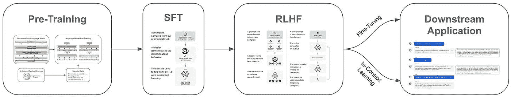

创建和完善 LLM 的多步骤过程（摘自 [11, 12]）

这个过程的第一步——预训练——是通过语言建模目标在大规模的未标记文本语料库上训练模型，通常是最昂贵的步骤。之后，模型会经过一个对齐过程，包括监督微调（SFT）和/或来自人类反馈的强化学习（RLHF）。在模型训练完成后，可以将其部署到下游应用中，在那里可以利用进一步的微调或上下文学习来提高性能。在本节中，我们将概述这些组件，以更好地理解它们对大型语言模型（LLM）行为的影响。

## 语言模型预训练

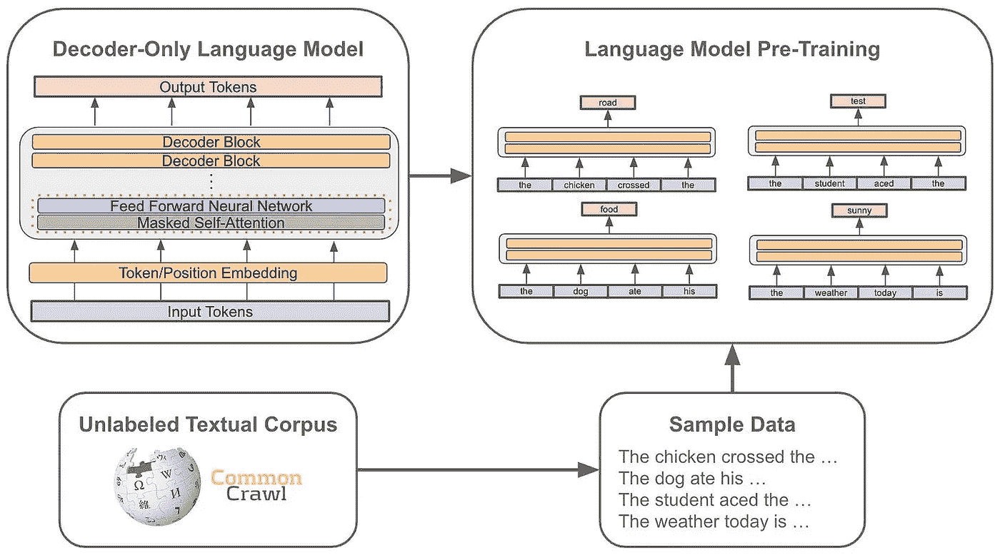

（作者创建）

上述的预训练过程是创建大型语言模型（LLM）中计算最昂贵的一步。在此过程中，语言模型会接触到未标记的文本数据集，并使用标准的语言建模目标进行训练。简而言之，这意味着我们通过 *i)* 从数据集中采样一些文本以及 *ii)* 训练模型以预测下一个单词来训练模型。这一预训练过程是一种自监督学习形式，因为正确的“下一个”单词可以通过简单地查看数据集中的下一个单词来确定。考虑到数据集庞大（例如，~0.5–2 万亿标记 [13]）且模型必须从头开始训练，预训练过程是广泛的。

## 对齐过程

（摘自 [11]）

在预训练完成后，我们拥有一个“基础模型”，即一个尚未具备任何专门能力的通用 LLM。为了赋予这个模型进行有趣对话、遵循指令等能力，我们必须对齐这个模型，或者训练它以复制人类用户期望的行为。在大多数情况下，对齐过程基于两种主要技术：

+   监督微调（SFT）

+   人类反馈中的强化学习（RLHF）

这些技术可以单独使用，也可以通过依次执行将它们组合在一起，正如 InstructGPT [11]（即 ChatGPT 的前身）最初提议的那样。

**SFT** 是一种简单的对齐方法——我们只需获取期望行为的示例，并直接在这些数据上对 LLM 进行微调（使用语言建模目标）。例如，如果我们想教一个基础 LLM 遵循指令，我们可以获取许多对基于指令的提示做出准确回应的示例，然后在这些示例上训练基础模型。我们将在本概述中重点讨论这一技术，它既简单又强大。然而，正如我们将看到的，*使用 SFT 获得良好结果依赖于精心策划的数据集*。

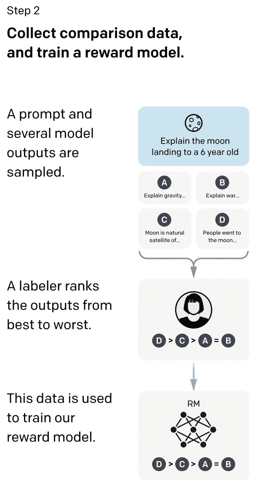

（来自 [11]）

**RLHF** 使我们能够根据人类提供的反馈来优化 LLM 的参数。从一组提示开始，我们首先使用 LLM 为每个提示生成多个潜在输出。根据这些输出，我们可以要求人工标注员对这些回应的质量进行排名（即，哪个输出是“最佳”），然后使用这些排名来训练奖励模型——这只是一个较小的 LLM，它根据模型的回应预测人类的偏好[1](https://cameronrwolfe.substack.com/p/data-is-the-foundation-of-language#footnote-1-134561977)；见上文。我们可以使用奖励模型的输出作为标量奖励，并通过 PPO 算法优化 LLM 以最大化这一奖励；见下文。

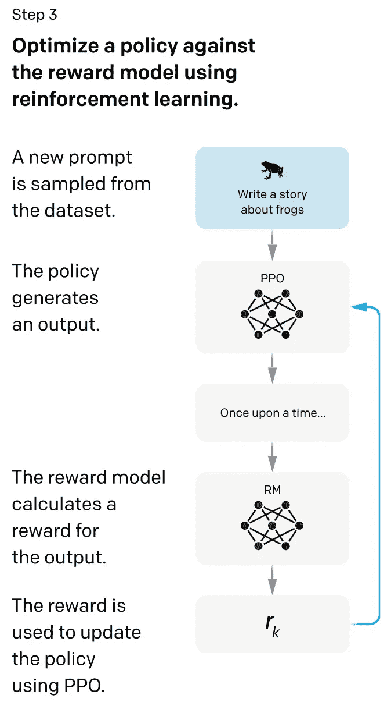

（来自 [11]）

上述 RLHF 过程的美妙之处在于我们直接基于人类偏好来优化模型，但“偏好”可以捕捉各种不同的属性！例如，也许我们希望模型更好地遵循指令，输出更有趣的内容，甚至停止幻想（即，编造虚假信息）。所有这些行为都可以通过使用 RLHF 进行优化，使其成为一种非常强大的对齐工具；见下文。

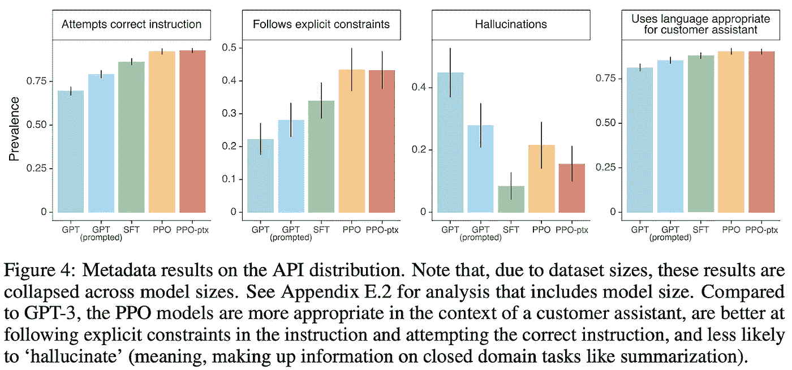

（来自 [11]）

对于那些不熟悉强化学习（RL）的人来说，没有额外背景阅读，RLHF 可能是一个难以理解的框架。为了获得更好的 RL 背景，我建议查看以下资源。

+   强化学习基础 [[link](https://www.synopsys.com/ai/what-is-reinforcement-learning.html)]

+   近端策略优化 [[link](https://openai.com/research/openai-baselines-ppo)]

+   RLHF 概述 [[link](https://huggingface.co/blog/rlhf)]

> “模型的能力主要来自预训练过程——RLHF 并不会提升考试表现（如果没有积极的努力，它实际上会降低表现）。但模型的引导来自于后训练过程——基础模型需要提示工程才能知道它应该回答问题。” *— 引自 GPT-4 博客*

**对齐的目的是什么？** 对齐是一个极其活跃的研究领域。目前，研究社区正在讨论更好地理解对齐的角色/目的。在 GPT-4 的分析中，我们看到对齐技术如 RLHF 的作用是使 LLM 更易于引导和有趣，而不是教给模型新的信息。事实上，模型所拥有的大部分知识似乎来自预训练。在 [1] 中也提出了类似的观点，我们看到通过一个小型的精心策划的数据集进行 SFT 可以实现高质量的对齐。考虑到在对齐流行的专有模型如 GPT-4 上投入的大量人力和计算资源，这一结果尤其有趣。

## 应用 LLM

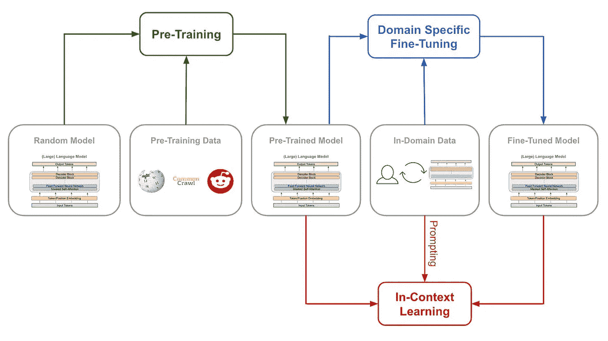

与 LLM 的不同学习类型（由作者创建）

一旦一个 LLM 完成了预训练和对齐，它就（或多或少）准备好用于下游应用。然而，我们必须采取一些措施来确保 LLM 能够准确解决特定任务。通常，这可以通过 *i)* 进一步微调模型或 *ii)* 使用上下文学习来完成；见上文。

**领域特定的微调。** 如果我们将 LLM 部署到一个专业领域（例如医疗、法律、软件等），那么进一步微调模型以适应该领域的数据类型可能是有意义的。这个过程非常简单。我们继续使用语言建模目标训练模型，但使用领域特定的语料库（即与所需应用中将看到的数据类似的数据）来代替预训练数据集。

**上下文学习。** 一旦我们准备好部署模型（无论是否经过领域特定的微调），我们应利用上下文学习，这种方法使用文本提示来指导/引导模型朝向期望的行为，以更准确地解决下游任务。这些提示可能包括正确解决方案的示例（即少量示例），但这些数据仅作为生成输出时的上下文使用（即，我们不用于训练）。我们在之前的综述中已经广泛探讨了提示方法。

+   实用提示工程 [link]

+   高级提示工程 [link]

# LIMA: 对齐中的少即是多

在 [1] 中，作者通过训练 LIMA（一种 LLaMA-65B [2] 的衍生模型），对比了预训练与对齐的相对重要性。LIMA 经过了针对策划对齐数据集的 SFT（没有 RLHF）。特别是，LIMA 使用的微调数据集是由 1,000 个精心策划的提示和回答示例组成，这些示例具有相似的输出风格和多样化的输入；见下文。

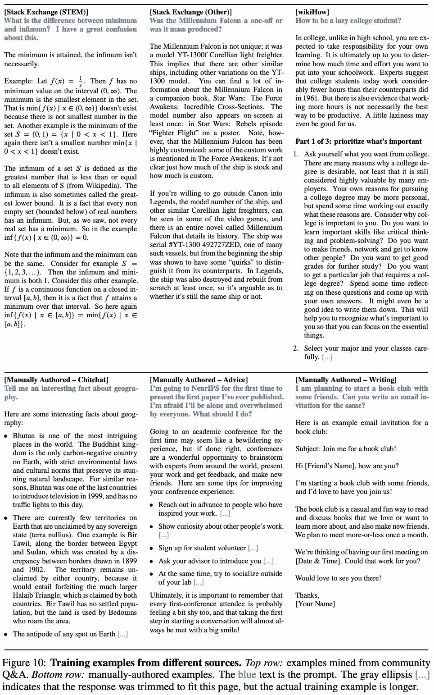

(来自 [1])

当在这些示例上训练时，我们看到 LIMA 的表现非常好，甚至接近于最先进的专有模型，如 GPT-4 和 Claude。这样的结果表明，通过少量精心选择的示例，语言模型可以被有效对齐，*从而强调了数据质量和多样性在训练和对齐强大语言模型中的作用*。

> “一个模型的知识和能力几乎完全是在预训练期间学到的，而对齐则教会它在与用户交互时应该使用哪些格式的子分布。” *— 来自 [1]*

**肤浅对齐假说。** 在这方面，[1] 中的作者提出了肤浅对齐假说（SAH），其总结见上述引文。大多数大型语言模型（LLM）的核心知识是在预训练期间学习的，而对齐则寻找展示这些知识的适当格式或风格。SAH 简单地表示，给定一组具有足够质量和多样性的示例，对齐可以以数据高效的方式学习。

## 数据策划以实现对齐

[1] 中用于对齐的数据集是由社区问答论坛（例如 StackExchange、wikiHow 和 Reddit）与手动编写的示例结合构建的。与近期试图自动化 SFT 数据策划的工作不同（例如，[Self-Instruct](https://cameronrwolfe.substack.com/i/125726849/the-self-instruct-framework)），我们在 [1] 中看到，这两种来源的数据都经过了仔细（且通常是手动）筛选，以确保质量和多样性。尽管手动策划需要时间，但它提升了最终数据集的质量，而这种质量被发现非常有益。

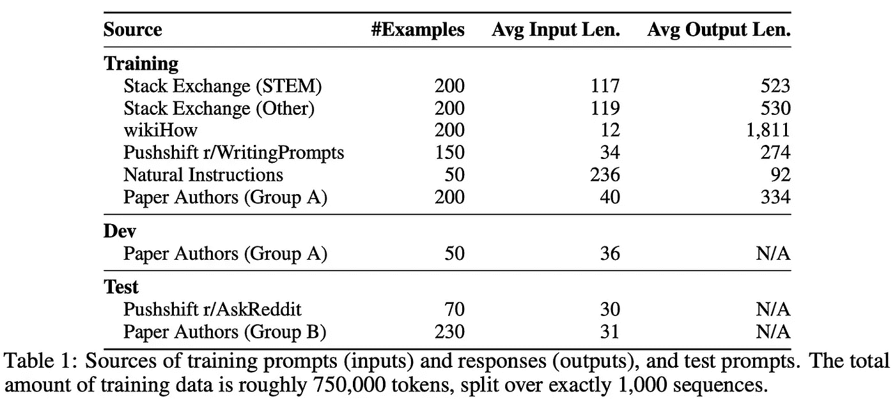

(来自 [1])

**数据来源。** LIMA 的训练数据的详细信息见上表。在训练集中，750 个样本来自社区问答论坛。为了确保数据质量，这些样本要么经过人工筛选，要么通过“点赞”指标进行筛选。剩余的 250 个样本由作者手动编写——其中 200 个是从零开始创建的，50 个则来自[SuperNaturalInstructions](https://huggingface.co/datasets/andersonbcdefg/supernatural-instructions-2m)。在手动创建数据时，作者通过确保以下几点来最大化数据的多样性和一致性：

+   回应的风格与有用的 AI 代理的行为保持一致

+   提示尽可能多样化

简而言之，我们希望尽量减少对齐数据集中噪声的数量（即，确保风格、语气、格式等的一致性），同时确保 LLM 观察到的数据具有尽可能多的多样性和覆盖范围。值得注意的是，[1]中的作者甚至在对齐数据中包括了一些恶意提示，以展示如何避免潜在的有害命令。

**我们能自动化吗？** 在关于开源 LLM 的模仿学习的近期工作中，我们通常会看到用于微调的数据是自动策划的。例如，SFT 的数据可以从在线来源（例如，[ShareGPT](https://sharegpt.com/)）下载或直接从 LLM API 获取（如 ChatGPT 或 GPT-4）。与手动策展相比，这种方法效率极高，并且（在某些情况下）表现良好；例如，Orca [3] 在从 ChatGPT/GPT-4 获得的大量对话中进行训练，表现相当好（甚至与顶级模型相比）。然而，在[4]中我们看到，以这种方式训练的模型通常存在局限性，并在经过广泛分析时表现较差。

> “手动创建多样化的提示并以一致的风格撰写丰富的回应是劳动密集型的。虽然一些近期工作通过蒸馏和其他自动化手段避免了手动劳动，优化数量而非质量，但这项工作探索了投资于多样性和质量的效果。” *— 来自[1]*

在[1]中，我们研究了一种对齐的替代方法，即投入到高质量数据的策展中。与其自动获取大量数据，不如手动筛选和选择较少的示例。这种较小规模（但劳动密集型）的选择过程使数据的多样性和质量得以控制，*这说明了数据规模和质量对 LLM 对齐的影响*。

## 对齐实际上是肤浅的吗？

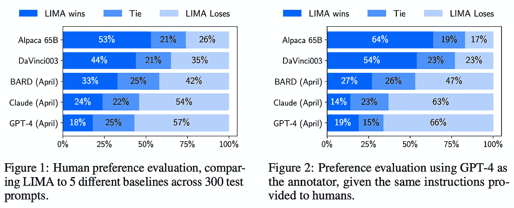

（来自[1]）

LIMA 的表现与各种不同语言模型的表现进行了比较。特别地，我们将 LIMA 的表现与 Alpaca-65B [6]、DaVinci003（即经过 RLHF 调优的 GPT-3.5 版本）、Bard（即基于 PaLM [7]）、Claude（即通过 AI 反馈训练的 52B 参数 LLM [8]）和 GPT-4 进行了比较。评估使用了众包工作者和来自 GPT-4 的自动反馈，如上图所示。有趣的是，LIMA 的表现始终优于 Alpaca（尽管其在`52X`少量数据上进行了微调！），甚至在相当多的情况下与 Claude 和 GPT-4 的质量相当或超越。考虑到这些其他模型在数百万用户提示和反馈下进行训练，LIMA 的竞争力表现令人印象深刻。

**绝对性能。** 除了上面进行的模型比较试验外，[1]中的作者还手动评估了 LIMA 生成的 50 个随机响应的质量。有趣的是，我们发现 LIMA 仅在 50 个提示中的六个中未能作答，并且在 50%的试验中产生了优秀的响应；见下文。

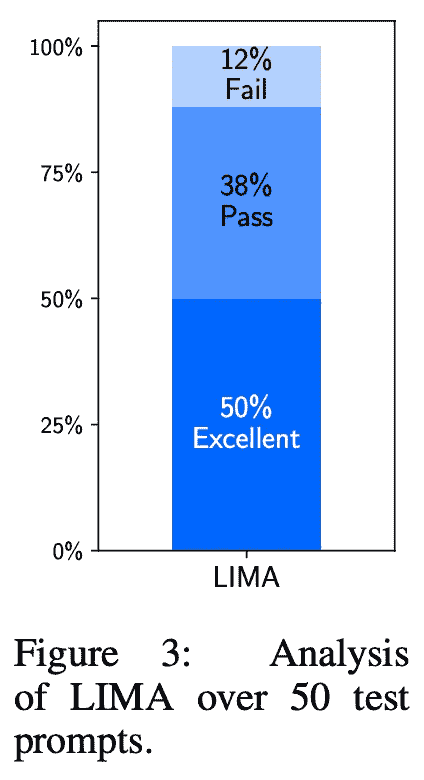

(来自 [1])

当这种手动评估仅在分布外的提示上重复进行（即那些与微调集中包含的例子差异较大的提示），结果差异不大——20% 的响应失败，35% 的响应合格，45% 的响应优秀。这种结果表明 LIMA 实际上具有较好的泛化能力，而不仅仅是记忆或过拟合于策划的微调数据集[3](https://cameronrwolfe.substack.com/p/data-is-the-foundation-of-language#footnote-3-134561977)。

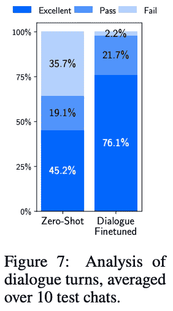

(来自 [1])

例如，LIMA 在多轮对话方面表现得相对较好（但不出色），尽管在其微调数据集中没有这样的例子。当模型仅接触到 30 个多轮对话例子时，我们看到 LIMA 能够快速学习如何从这些例子中维持对话；见上文。

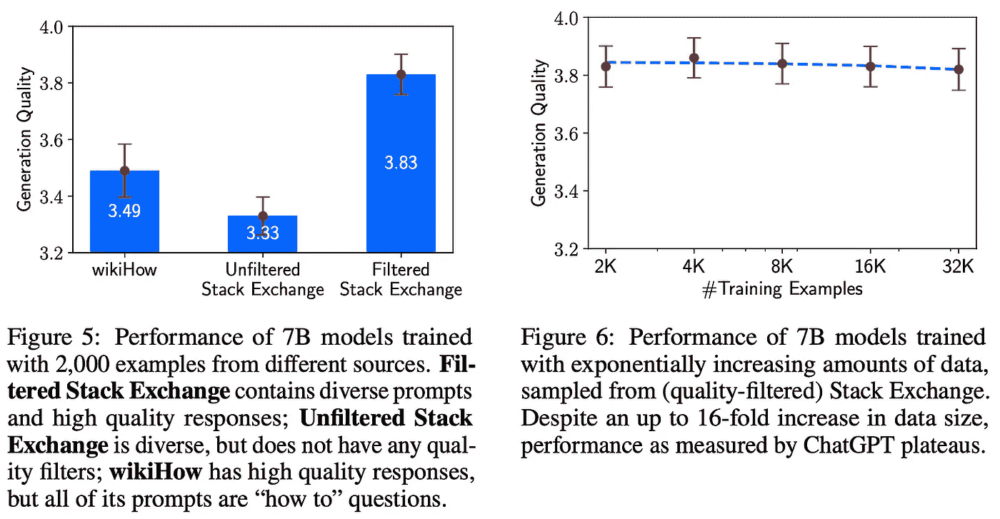

(来自 [1])

**数据的有用属性。** 除了上述主要结果外，我们在 [1] 的消融实验中看到，用于对齐的样本的多样性和质量非常重要；见上文。值得注意的是，*仅仅增加微调数据集的大小并不总是能提高 LLM 的性能*。因此，我们从 [1] 中了解到，高质量数据的精心策划对于对齐是非常有价值的。

## 更大的图景

在最近的开源语言模型研究中，我们看到了一系列不同的 LLM（例如，Alpaca [6]、Vicuna [9]、Koala [10] 等）采用了自动化的数据策划方法进行 SFT。特别是，这些模型使用了一种模仿方法，其中 *i)* 从其他 LLM 收集大量对话，*ii)* 对这些数据进行监督微调。虽然这些模型最初表现得相当不错，但我们在更有针对性的评估中看到它们的对齐质量较差。考虑到这一点，我们可以合理地问：*是什么使得 LIMA 的方法更有效？*

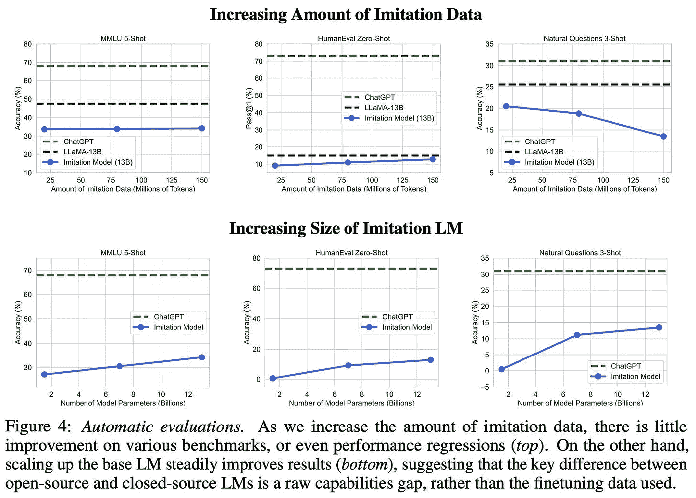

(来自 [4])

**质量 > 数量。** 即使在模仿模型的研究中，我们也发现仅仅增加微调集中的数据量对模型性能的提升影响有限；见上文。我们在 [1] 中看到类似的结果对于 LIMA 也是如此。鉴于仅增加数据量没有好处，我们有几个不同的选项来提升 LLM 的性能：

1.  创建一个更强大的基础模型

1.  改进对齐数据集

虽然一些工作（例如 MPT 和 Falcon）已经探讨了更好的基础模型的创建，但 LIMA 研究了如何创建更好的对齐数据集[4](https://cameronrwolfe.substack.com/p/data-is-the-foundation-of-language#footnote-4-134561977)。简单来说，我们在 [1] 中看到，创建一个既多样化又高质量的对齐数据集（即使它很小！）是极其有效的。LLMs 可以根据最少的数据准确地学习模拟某些行为，这支持了 SAH。

> “为了对齐的目的，扩大输入多样性和输出质量具有可测量的积极效果，而单独扩大数量可能没有。” *— 来自 [1]*

**但这些结果并不完美！** 之前的模仿模型最初被认为表现非常出色，甚至可以与像 ChatGPT 这样的顶级专有模型相媲美。然而，我们后来发现这些结论是由于人为错误所致。这些模型模仿了专有 LLMS 的风格，但缺乏其真实性，并且在训练集之外的泛化表现较差，这使得在评估这些模型时，人类更难以推断。鉴于 LIMA 也是主要通过众包工人进行评估的，[1]中的结果也存在类似的局限性。然而，我们看到 LIMA 往往具有良好的泛化能力，并且常常优于像 Alpaca 这样的模仿模型，这表明高质量的对齐数据仍然对 LLM 性能非常有益。

# 数据对齐之外的影响

在 [1] 中，我们看到数据的质量对于有效地对齐语言模型极其重要。然而，数据质量和多样性的重要性不仅仅局限于对齐 —— *数据的类型和质量会影响 LLM 训练流程的各个方面*。让我们来看几个参考例子。

**预训练。** 在各种不同的模型中，我们看到用于预训练的数据质量至关重要。例如，在 Galactica [14] 中，作者发现使用较小的、高度策划的高质量科学信息数据集进行训练可以获得最佳性能。类似地，BioMedLM 模型是在较小的、策划过的技术内容语料库上进行预训练的。最后，Falcon-40B —— *目前开源语言模型的最先进水平* —— 给予了预训练数据质量显著的重视，我们看到作者投入了大量精力来开发一个新颖且高效的管道，从网络中提取高质量的预训练数据。

**对齐。** 除了[1]中探讨的方法外，最近提出的 Orca 模型[3]重点研究了数据质量在解决对齐问题中的作用。然而，采用了一种略有不同的方法。即，作者使用模仿方法训练模型，但将用于 SFT 的数据（即与其他 LLM 的对话示例）与模型关于每个问题如何解决的详细信息进行增强。包括这些额外细节在对齐数据集中被发现能够生成比像 Alpaca[6]或 Vicuna[9]这样的模型更为强健的模仿模型。

**上下文学习。** 除了对 LLM 进行训练和微调外，用于上下文/少量示例学习的数据可以极大地影响性能。特别是，最近关于少量示例学习的研究表明，示例的排序、分布或格式等因素都可能影响模型的表现。进一步而言，我们看到数据的多样性是极其重要的，使用多样化的少量示例提示模型通常表现得更好。

# 结束语

> “这些结果强烈表明，大型语言模型中的几乎所有知识都在预训练期间学习，只有有限的指令调优数据才有必要教会模型生成高质量的输出。” *— 来自[1]*

本概述中涉及的主要结论有两点：

1.  *表面对齐假设*：LLMs 在预训练期间学习他们的知识，而对齐则教会它们如何与用户进行适当的互动。

1.  数据的质量和多样性对对齐过程至关重要（比数据规模更为重要）。

在[1]中，我们在创建 LIMA 的过程中观察到了这些主要结论，其中高质量的对齐可以通过较小的、精心策划的语料库来实现。如果数据的质量足够高，即输入提示多样且响应具有标准化的结构和语气，则对齐（使用 SFT）所需的数据量不多。然而，高质量数据的积极影响远远超出了对齐——*所有 LLM 训练的方面都从使用高质量数据中受益*。无论是在预训练还是上下文学习中，语言模型仍然基本遵循与其他所有机器学习模型相同的基本规则：“垃圾进，垃圾出”。

## 与我联系！

非常感谢您阅读这篇文章。我是 [Cameron R. Wolfe](https://cameronrwolfe.me/)，[Rebuy](https://www.rebuyengine.com/) 的 AI 总监。我研究深度学习的经验和理论基础。如果您喜欢这个概述，可以订阅我的 [Deep (Learning) Focus 新闻通讯](https://cameronrwolfe.substack.com/)，我会通过从基础开始的相关主题概述来帮助读者理解 AI 研究。您还可以在 [X](https://twitter.com/cwolferesearch) 和 [LinkedIn](https://www.linkedin.com/in/cameron-r-wolfe-ph-d-04744a238/) 上关注我，或查看我在 medium 上的 [其他著作](https://medium.com/@wolfecameron)！

## 参考文献

[1] Zhou, Chunting 等人. “Lima: 对齐问题中的简约主义。” *arXiv 预印本 arXiv:2305.11206* (2023)。

[2] Touvron, Hugo 等人. “Llama: 开放和高效的基础语言模型。” *arXiv 预印本 arXiv:2302.13971* (2023)。

[3] Mukherjee, Subhabrata 等人. “Orca: 通过 GPT-4 的复杂解释轨迹进行渐进学习。” *arXiv 预印本 arXiv:2306.02707* (2023)。

[4] Gudibande, Arnav 等人. “模仿专有语言模型的虚假承诺。” *arXiv 预印本 arXiv:2305.15717* (2023)。

[5] Wang, Yizhong 等人. “Super-naturalinstructions: 通过声明性指令在 1600+ NLP 任务中进行泛化。” *arXiv 预印本 arXiv:2204.07705* (2022)。

[6] Taori, Rohan 等人. “Stanford Alpaca: 一个跟随指令的 LLaMA 模型。” (2023)。

[7] Chowdhery, Aakanksha 等人. “Palm: 通过路径扩展语言建模。” *arXiv 预印本 arXiv:2204.02311* (2022)。

[8] Bai, Yuntao 等人. “Constitutional ai: 从 AI 反馈中获得的无害性。” *arXiv 预印本 arXiv:2212.08073* (2022)。

[9] Chiang, Wei-Lin 等人. “Vicuna: 一个开源聊天机器人，以 90%* ChatGPT 质量打动 GPT-4。” (2023)。

[10] Geng, Xinyang 等人. “Koala: 一个用于学术研究的对话模型。” (2023)。

[11] Ouyang, Long 等人. “训练语言模型以通过人类反馈遵循指令。” *神经信息处理系统进展* 35 (2022): 27730–27744。

[12] Glaese, Amelia 等人. “通过针对性的人类评判改善对话代理的对齐。” *arXiv 预印本 arXiv:2209.14375* (2022)。

[13] Hoffmann, Jordan 等人. “训练计算最优的大型语言模型。” *arXiv 预印本 arXiv:2203.15556* (2022)。

[14] Taylor, Ross 等人. “Galactica: 一个用于科学的大型语言模型。” *arXiv 预印本 arXiv:2211.09085* (2022)。
