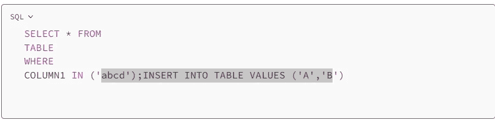

# 《使用 Python 和 SQL 掌握数据：通过 4 个战略应用案例释放效率和安全性》

> 原文：[`towardsdatascience.com/data-mastery-with-python-and-sql-unleashing-efficiency-and-security-through-4-strategic-use-cases-eb8afb5019a0`](https://towardsdatascience.com/data-mastery-with-python-and-sql-unleashing-efficiency-and-security-through-4-strategic-use-cases-eb8afb5019a0)

## 利用技术提取标签、抑制警告，并使用参数化查询进行强大的数据分析

[](https://mg-subha.medium.com/?source=post_page-----eb8afb5019a0--------------------------------)[](https://towardsdatascience.com/?source=post_page-----eb8afb5019a0--------------------------------) [Subha Ganapathi](https://mg-subha.medium.com/?source=post_page-----eb8afb5019a0--------------------------------)

·发表于 [Towards Data Science](https://towardsdatascience.com/?source=post_page-----eb8afb5019a0--------------------------------) ·阅读时长 9 分钟·2023 年 5 月 23 日

--


照片由 [Kevin Canlas](https://unsplash.com/@kvncnls?utm_source=unsplash&utm_medium=referral&utm_content=creditCopyText) 提供，来源于 [Unsplash](https://unsplash.com/photos/BHPGjYd4fp8?utm_source=unsplash&utm_medium=referral&utm_content=creditCopyText)

# 介绍

数据分析和管理是任何现代企业运营的重要组成部分。为了有效利用数据的力量，专业人员依赖于编程语言和工具的组合，以实现高效的数据处理、操作和分析。本文探讨了 Python 和 SQL 的惊人能力，这两种基础语言被数据分析师和科学家广泛应用于有效决策。

众所周知，Python 提供了大量的库和框架来应对各种数据相关的挑战。Python 和 SQL 组合成了一个强大的双雄，使数据专业人员能够充分挖掘数据的潜力，更有效地挖掘数据库。

在本文中，我们深入探讨了四个独特的应用案例，展示了 Python 和 SQL 在应对各种数据挑战中的有效性和协同作用。每个应用案例代表了一个独特的场景，展现了 Python 灵活性与 SQL 查询能力的结合效果。

让我们深入了解！

# 应用案例

**应用案例 1：提升在 Python 中编写的 SQL 查询的可读性**

想象一下你正在使用 Web API 连接到云数据库，比如 GridDB，并通过执行 SQL 查询来检索数据。在构建 HTTP 请求体时，特别是对于接受 JSON 负载的 API 端点，SQL 查询需要被包含在请求体中。但真正的挑战在于实际的查询。

实际的 SQL 查询往往变得更加复杂，通常很难维持适当的缩进，添加换行符，以及格式化代码以提高可读性。此外，当被限制在 Python 笔记本（如 VScode 或 Jupyter）中编写单行查询时，很难添加有用的注释行来解释代码的功能。这样的查询的笔记本在长期维护和调试时会变得困难。

以下解决方案允许你在多行中编写 SQL 查询，这样可以提高代码的可读性和可维护性。通过使用适当的换行和缩进，你可以轻松组织和理解复杂的查询，而不会牺牲清晰度。

这里有一种更好的方法来编写 Python 中的 SQL 查询。

```py
sql_query1 = (f"""
-- Query to classify sales data by region, category, and sales classification

SELECT region,
    CASE WHEN lower(category) LIKE 'a%' THEN 'Category A'
         WHEN lower(category) LIKE 'b%' THEN 'Category B'
         WHEN lower(category) LIKE 'c%' THEN 'Category C'
         ELSE 'Other Categories'
    END AS category_classification,
    CASE WHEN subquery.total_sales BETWEEN 1 AND 1000 THEN 'Low Sales' 
         WHEN subquery.total_sales BETWEEN 1001 AND 5000 THEN 'Medium Sales'
         WHEN subquery.total_sales > 5000 THEN 'High Sales'
    END AS sales_classification
FROM Sales_Dataset
JOIN (
    SELECT region, SUM(sales) AS total_sales
    FROM Sales_Dataset
    GROUP BY region
) AS subquery
ON Sales_Dataset.region = subquery.region
GROUP BY 1, 2
ORDER BY 3 DESC
""")
```

这可以通过 Python 的 JSON 库传递给请求体，如下所示 -

```py
import json
# Construct the request body
request_body = json.dumps([
    {
        "type": "sql-select",
        "stmt": sql_query1
    }
])

# Validate the constructed request body
print(request_body)
```

它创建了一个包含单个项目的 JSON 对象，该项目包含操作类型（“sql-select”）和 SQL 查询语句（sql_query1）。使用 json.dumps() 函数将 Python 字典转换为 JSON 字符串表示。

然后你可以使用 requests 库继续发出请求。

```py
data_req1 = requests.post(url, data=request_body, headers=header_obj)
```

## 用例 **2: 从文本列中提取标签（hashtags）**

在分析 TikTok 和 Instagram 等社交媒体平台时，通常会通过 API 提取数据并将其存储在像 Azure 或 Redshift 这样的数据库中。然而，API 响应通常包括作为字符串的内容，标签分散在视频标题中。为了解决这个问题，可以使用以下查询从文本列（如视频标题）中提取标签。

```py
select * from 
(SELECT distinct TRIM(SPLIT_PART(title, '#', num)) AS hashtag
FROM social_media_video_info
CROSS JOIN (
    SELECT 1 AS num UNION ALL
    SELECT 2 AS num UNION ALL
    SELECT 3 AS num UNION ALL
    SELECT 4 AS num UNION ALL
    SELECT 5 AS num UNION ALL
    SELECT 6 AS num UNION ALL
    SELECT 7 AS num UNION ALL
    SELECT 8 AS num UNION ALL
    SELECT 9 AS num UNION ALL
    SELECT 10 AS num
) AS nums
WHERE num <= LENGTH(title) - LENGTH(REPLACE(title, '#', '')) + 1
  AND TRIM(SPLIT_PART(title, '#', num)) <> ''
) 
where hashtag not like '% %'
```

子查询执行以下步骤：

+   它使用‘#’字符作为分隔符，分割“social_media_video_info”表的“title”列。

+   函数 SPLIT_PART(title, ‘#’, num) 提取“title”列中由‘#’分隔的在指定“num”位置的部分。

+   TRIM() 函数去除提取部分的任何前导或尾随空格。

+   DISTINCT 关键字确保仅选择唯一的标签。

+   与子查询 “nums” 的 CROSS JOIN 生成一个临时结果集，包含从 1 到 10 的数字。

+   条件 num <= LENGTH(title) — LENGTH(REPLACE(title, ‘#’, ‘’)) + 1 确保分割操作做到“title”列中的最大标签数量。

+   条件 TRIM(SPLIT_PART(title, ‘#’, num)) <> ‘’ 过滤掉任何空标签。

+   总结来说，查询通过使用 ‘#’ 作为分隔符，提取“social_media_video_info”表中的“title”列中的标签。它确保仅选择唯一的非空标签，并排除包含空格的标签。请注意，此查询仅考虑 **每个标题最多 10 个标签**。

## 用例 3：在 Python 中抑制未来和弃用警告

这些代码行的目的是在程序执行期间抑制未来警告和弃用警告。

```py
import warnings
warnings.simplefilter(action='ignore', category=FutureWarning)
warnings.simplefilter(action='ignore', category=DeprecationWarning) 
```

这在你确信你使用的代码与当前版本的库兼容，并且你不想被警告潜在问题或弃用功能的情况下会很有用。

警告通常提供有关潜在问题或库未来版本变化的有价值信息。通常建议解决导致警告的根本问题，而不是完全忽视它们。‘warnings’ 模块还提供了 simplefilter() 选项，可用于控制如何在 Python 代码中处理警告。

## 用例 4：在可能的情况下使用参数化查询

当使用 Python 执行 SQL 查询时，建议使用参数化查询或预处理语句，而不是直接在 SQL 语句中嵌入值。这有助于防止 SQL 注入攻击，并确保数据类型的正确处理。

假设你的应用程序或脚本使用以下选择查询 -

```py
SELECT * FROM 
TABLE 
WHERE 
COLUMN1 IN ('abcd')
```

如果攻击者想在你的数据库中插入恶意值，他们可以利用这个查询作为漏洞来做到这一点。以下是攻击者如何将插入语句添加到‘选择查询’中并注入不必要的值到数据库的基本示例。下面的灰色部分是攻击者提供的恶意输入，这导致执行了两个查询而不是一个——1\. 选择和 2\. 插入。



**SQL 注入攻击 — 场景亮点（作者提供的图片）**

请注意，这不限于插入表。攻击者可以运行其他选择、更新或删除操作，甚至执行 drop table。想象一下‘DROP TABLE’会有多么灾难！

SQL 注入可以通过净化输入和参数化来防止。让我们详细看看这两者。

## 参数化

参数化可以手动完成，也可以通过 Python 中的可用包完成。设想你使用一个调查应用程序，向用户发送调查以填写。用户被要求在提供的两个文本框中输入详细信息。假设每次用户在两个文本框中输入详细信息时，后台都会运行如下的插入 SQL 查询 -

theVal1 = 来自调查文本框 1

theVal2 = 来自调查文本框 2

以下是后台运行的应用代码 -

```py
 sql = "INSERT INTO TABLE VALUES ('" + theVal1 + "','" + theVal2 + "')"
```

假设第一个用户在文本框 1 中输入**A3**，并在文本框 2 中输入**A4**。后台运行的查询如下 -

```py
INSERT INTO TABLE VALUES ('A3','A4')
```

假设第二个用户是恶意用户。这个用户了解你的表结构和后台查询。如果他们有一些恶意企图，他们可以尝试使用这些来恶意插入额外的记录。

假设用户在文本框 1 中输入了**值 A1**，并在文本框 2 中输入了**下面的值** -

```py
A2 ');INSERT INTO TABLE VALUES ('B1','B2
```

本质上发生的情况是，这个值被附加到后台查询中，变成了下面的内容 -

```py
INSERT INTO TABLE VALUES ('A1','A2');INSERT INTO TABLE VALUES ('B1','B2')
```

因此，这个恶意用户将插入 2 条记录。

你的表将有三个值，第一个用户插入了 1 个，第二个用户插入了 2 个 -


**后台表（作者提供的图片）**

## 输入清理

数据清理可以通过转义输入中的特殊字符来完成。这涉及到用其转义字符替换或编码在目标上下文（例如 SQL 查询）中具有特殊意义的字符。例如，在 SQL 中，单引号字符（‘）通常通过将其加倍（‘’）来转义，即**用两个单引号替换字符串中的单引号**。换句话说，我们可以在将输入值放入查询之前手动转义这些值。我们可以使用 str.replace 来实现这一点。

虽然应用代码保持不变，我们添加了几条字符串替换语句，如下所示 -

theVal1 = 来自调查文本框 1

theVal2 = 来自调查文本框 2

```py
escapedVal1 = theVal1.replace("'", "''")
escapedVal2 = theVal2.replace("'", "''")
sql = "INSERT INTO TABLE VALUES ('" + escapedVal1 + "','" + escapedVal2 + "')"
```

结果是，当恶意用户尝试插入恶意记录时，它会连同用户的插入语句一起被插入。它看起来像下面这样 -

```py
INSERT INTO TABLE VALUES ('A1','A2'');INSERT INTO TABLE VALUES (''B1'',''B2')
```

插入到你的表中的值如下 -


**转义引号后的后台表（作者提供的图片）**

因此，你会在后台表中看到其中一个用户尝试运行插入语句。**你通过仅仅转义输入变量，有效地阻止了 SQL 注入的发生。**

更优化的方法是使用诸如 psycopg2、pyodbc、sqlite3 或 SQLAlchemy 等 Python 库。这些是 SQL 适配器，内置支持参数化查询等功能。

# 结论

在这篇文章中，我们探索了四个实际用例，以提高你在处理 SQL 查询时的 Python 编程技能。我们从用例 1 开始，重点提高了用 Python 编写的 SQL 查询的可读性。通过利用查询格式化和缩进等技术，我们可以使代码更有条理，更易于理解。

继续用例 2，我们深入探讨了如何从文本列中提取标签。通过利用 SQL 及其字符串处理函数，我们学会了如何有效提取相关标签，并增强数据分析过程。

在用例 3 中，我们讨论了在 Python 中抑制未来和弃用警告的重要性。通过利用`warnings`模块，我们可以确保 Python 输出更清晰，代码执行无错误，避免不必要的干扰和潜在的兼容性问题。

最后，在用例 4 中，我们强调了使用经过清理的代码和参数化查询的重要性，以增强安全性、提高性能并防止 SQL 注入攻击。

通过理解和实施这些用例，Python 开发者和数据分析师可以提升 SQL 查询执行和优化技能，进而编写出更健壮和高效的代码。我相信，将这些技术应用于实际场景将有助于创建更清晰的工作流程，并使你能够高效而安全地提取可操作的见解。
