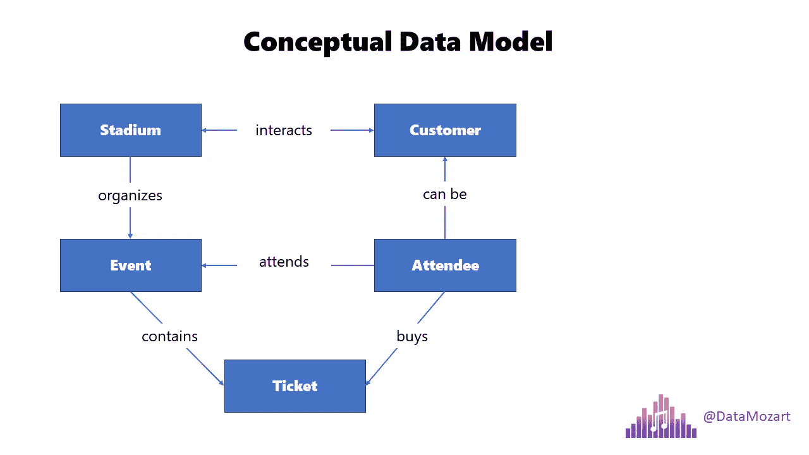
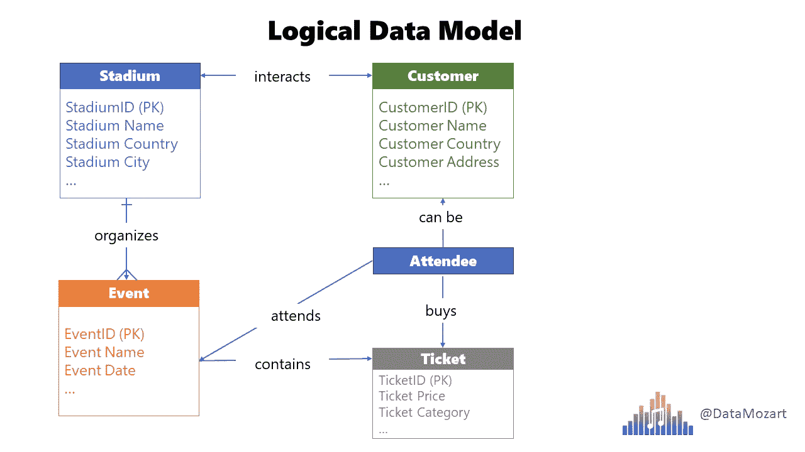
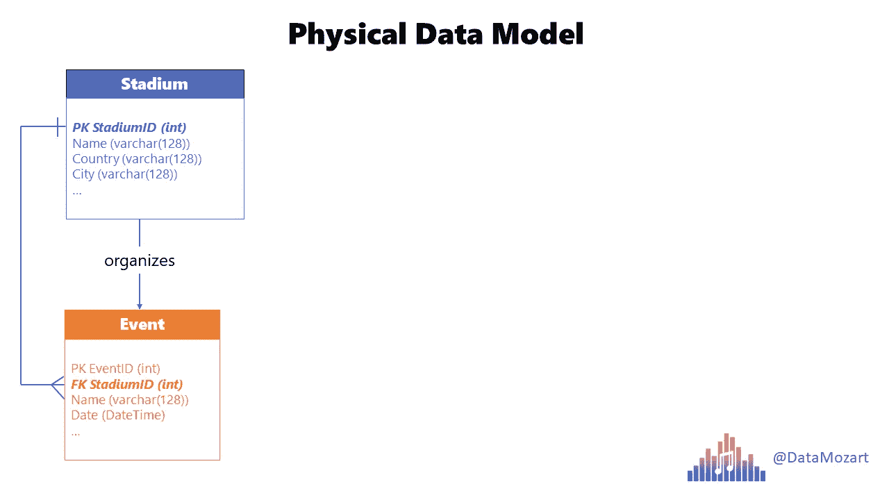
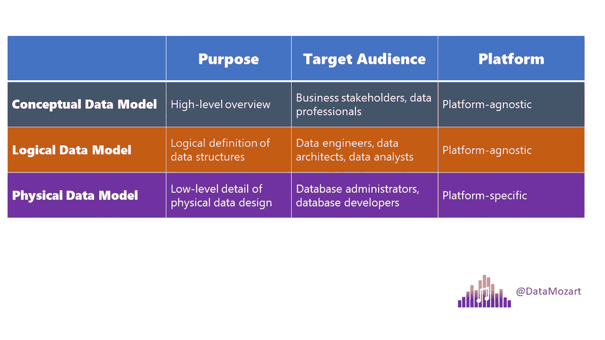

# 数据建模的初学者，第一部分：什么是数据建模？

> 原文：[`towardsdatascience.com/data-modeling-for-mere-mortals-part-1-what-is-data-modeling-103eb184930e`](https://towardsdatascience.com/data-modeling-for-mere-mortals-part-1-what-is-data-modeling-103eb184930e)

## 数据建模有时可能看起来令人畏惧（那些复杂的图表！），但其实并不一定如此

 [Nikola Ilic](https://datamozart.medium.com/?source=post_page-----103eb184930e--------------------------------)

·发表于 [Towards Data Science](https://towardsdatascience.com/?source=post_page-----103eb184930e--------------------------------) ·12 min 阅读·2023 年 8 月 2 日

--

[由 Alina Grubnyak 拍摄，来自 Unsplash](https://unsplash.com/de/fotos/ZiQkhI7417A)

近年来，我进行了数十次关于各种数据平台主题的培训，面对各种观众。在教授各种数据平台概念和技术时，我发现其中一个概念对许多业务分析师特别令人畏惧，尤其是那些刚刚开始他们旅程的人。那就是***数据建模的概念***。

# 为什么数据建模有时令人感到畏惧？

也许是因为当你看到这些看起来如此复杂和复杂的图表时你感到迷茫……

但是，数据建模不是关于图表的。它是关于建立信任，即业务与数据专业人士之间的共同理解，最终目标是通过数据提供增加的业务价值。

如果我们同意数据建模是关于建立信任的，我相信我们也可以同意信任不是轻易建立的——必须考虑到一定的时间和精力。而且，时间和精力不是你可以理所当然地拥有的——这是你需要投入的！

所以，我们可以正确地认为***数据建模是一种投资***。一种应该为你的业务带来更多稳定性和适应性的投资。

把它想象成投资建造一座房子。

[由 Pixabay 拍摄，来自 Pexels](https://www.pexels.com/de-de/foto/gelbe-und-schwarze-schwere-ausrustung-nahe-unvollendetem-gebaude-534220/)

显然，你可以选择快速简便的方法，将建筑块直接放在地面上，这在某段时间内可能会有效，直到出现新的情况——例如地震或雷暴。你的房子可能会受到损坏。但不仅仅是房子会受损——*你的信任也会受到损害：*与你同住的人、你的邻居、朋友会意识到你没有投入足够的时间和精力来预防这种不良情况。

现在，假设你决定采取另一条路径——在一开始更具挑战性，这将需要你投入更多的时间和精力。你为房子奠定了一个良好的基础，固定了地下的东西，然后在上面建造了房子。现在，你的房子会更稳固，可以适应未来的挑战。

[照片由 Valeria Miller 拍摄，来源于 Pexels](https://www.pexels.com/de-de/foto/foto-von-palmen-und-blumen-in-der-nahe-eines-gebaudes-2587054/)

既然我们已经解释了为什么投入时间和精力构建数据模型至关重要，现在让我们审视各种类型的数据模型以及它们如何融入大数据建模的全貌。

# 概念数据模型

通常，起点是创建一个概念数据模型。这是一个高层次的视角，可以说是从 10,000 英尺的高度来看待数据的业务需求。由于我们讨论的是高层次的视角，概念数据模型的主要目标是简化日常业务流程和关键实体。

在这个阶段，我们在编制一个大图景：在我们的业务流程中，关键实体是什么？它们之间是如何关联的？概念数据模型的关键特征是它应以易于理解的术语进行沟通。简而言之，利用商业用户和非技术人员容易理解的通用语言。

我知道我告诉过你数据建模不是关于图表的，但我们仍然需要可视化创建数据模型的过程。我会首先给你一个概念数据模型的基本示例。

作者提供的图像

在这个插图中，你可以识别出各种实体。体育场、事件、客户、观众和票务。你还可以注意到这些实体之间是如何互相连接的。这种高层次的概述提供了组织内业务流程的简化图景。

现在，让我们继续用通俗的语言解释一下这张插图中所展示的内容。

我们的第一个实体是***体育场***。体育场有一个名称，并且位于一个特定的国家和城市，这些信息唯一地标识了该体育场。体育场可能会举办许多活动，可能会有很多观众来参加这些活动。

接下来，我们有一个***事件***。一个特定的事件不能存在于其计划举办的体育场之外。一个事件可以由一个参与者出席，并且一个事件可以有许多参与者。

***参与者***是参加活动的实体。他们也可以是**体育场**实体的顾客，比如他们曾经访问过体育场商店或类似场所。**顾客**和***参与者***的主要区别在于，顾客不一定需要参加体育场的特定活动。

***顾客***可能与体育场有关，例如，通过参观体育场博物馆或在体育场球迷商店购物，但这并不意味着他们是活动的参与者。

最后，***票务***是一个实体，代表确认参与者将参加特定的活动。每张票都有一个唯一的标识符，因为如果两个或更多参与者得到相同编号的票就会很尴尬。尽管票务有唯一的标识，单个参与者可以购买多张票。

# 我们为什么需要概念数据模型？

既然我们已经解释了概念数据建模的核心组件，你可能会想：这为什么重要？为什么有人要花时间和精力描述所有实体及其之间的关系？

还记得我们讨论过如何在业务和数据角色之间建立信任吗？这正是概念数据模型的全部内容。确保业务相关者能够获得他们所需的信息，以通用语言解释，以便他们能够轻松理解整个工作流程。建立概念数据模型还为业务相关者提供了识别一系列需要在构建物理数据模型之前回答的业务问题的可能性。

业务可能会问的一些问题包括：顾客和参与者是同一个实体吗（如果不是，为什么）？一个参与者可以购买多张票吗？什么唯一标识一个特定事件？当然还有更多问题……

此外，概念数据模型有时以更易于理解的方式展示非常复杂的业务流程。与其翻阅一页又一页的书面文档，不如查看实体和关系的图示，所有内容都以用户友好的方式解释，从而快速理解业务流程的核心要素。

# 逻辑数据模型

一旦业务和数据团队就概念数据模型达成一致，数据建模过程的下一步是设计逻辑数据模型。在这一阶段，我们在前一步的基础上进行，确定实体的具体结构，并提供有关这些实体之间关系的更多细节。在这一阶段，你应该识别特定实体的所有相关属性，以及关系的基数。

请注意，与概念数据建模阶段一样，我们仍然不讨论具体的平台或解决方案。与之前的阶段一样，我们的重点是理解业务需求以及如何将这些需求有效地转化为数据模型。

为确保概念数据模型成功演变为逻辑数据模型，需要执行几个步骤。

+   ***识别实体属性***

+   ***识别候选键*** — 找出哪个属性或属性集可以唯一标识特定实体

+   ***选择主键*** — 根据上一阶段的发现，设置实体的主键

+   ***对数据模型应用规范化/反规范化*** — 我们将在接下来的文章中更详细地讨论规范化和反规范化。此时，请记住，规范化应消除数据冗余，通常用于 OLTP 系统。另一方面，[反规范化](https://data-mozart.com/mastering-dp-500-exam-optimize-data-model-by-using-denormalization/)主要用于分析系统或 OLAP，以减少 JOIN 操作的影响并加快数据读取速度

+   ***设置实体间关系*** — 验证各种实体如何互联，如果需要，通过将一个实体拆分为多个实体来减少多个关系依赖的复杂性

+   ***识别关系基数*** — 另一个极其重要的步骤。关系基数定义了一个实体的多少实例与另一个实体的实例相关联。有三种主要的基数类型：一对一（1:1）、一对多（1:M）和多对多（M:M）

+   ***迭代和优化*** — 在现实中，几乎不可能立刻找到适合所有人需求并满足所有要求的数据模型。因此，始终从业务相关者那里征求反馈至关重要，并根据收到的反馈优化逻辑数据模型，然后再将其转化为物理形式

图片由作者提供

# 为什么我们需要逻辑数据模型？

与概念数据模型不同，虽然在构建概念数据模型时投资时间和精力的好处并不明显，但我认为对于逻辑数据模型，其潜在收益更加明显。首先，逻辑数据模型作为最优质的质量保证测试，因为它可以发现业务流程中的差距和问题，从而节省大量时间和精力。在确定特定平台并在其上构建低效的物理数据模型之前，在此阶段修复这些问题要容易得多且成本更低。

正如我们之前提到的，一个好的逻辑数据模型的关键特征之一是迭代和微调是一个持续的过程。因此，构建逻辑数据模型可以被视为敏捷数据建模周期的一部分，这确保了更强健、可扩展和面向未来的模型。

逻辑数据模型的终极好处在于，它作为业务逻辑最终实现的蓝图，通过物理数据模型得以实现。依赖于精心设计的逻辑数据模型，数据库工程师和数据架构师能够创建更高效的物理数据库系统。

# 物理数据模型

物理数据模型代表了最终的细节 — 数据模型将在特定的数据库中如何实现。与概念数据模型和逻辑数据模型不同，后者是平台和解决方案无关的，物理实现需要定义可能特定于某些数据库提供商的低级细节。

从逻辑数据模型过渡到物理数据模型需要对逻辑数据模型中定义的实体和关系进行更多的迭代和微调。

作者提供的图片

与逻辑数据模型一样，成功实现数据模型的过程需要完成一整套必要的步骤，因此，让我们关注其中最重要的一些：

1.  ***选择平台*** — 这是一个无法跳过的步骤，因为这个决策将塑造你未来的设计原则。

1.  ***将逻辑实体转换为物理表*** — 逻辑实体只是逻辑上的存在，存在于更抽象的层次上。由于实际数据库不支持这种抽象层次，我们需要将该实体转换为物理单元。这意味着我们需要向底层平台提供如何存储数据的信息 — 简单来说，就是定义每个实体属性的数据类型 — 无论是整数、十进制数还是普通文本。此外，每个物理表应依赖于键来确保数据完整性 — 在物理数据建模过程中，你的任务是设置主键、外键和唯一键。

1.  ***建立关系*** — 基于关键列，物理数据建模工作流中的下一步是创建表之间的关系。

1.  ***应用规范化/非规范化*** — 类似于我们在逻辑数据建模阶段已经检查过的，检查并确认表格是否根据你设计的是事务系统还是分析系统，规范化或非规范化到确保特定系统工作负载最有效的程度 — 不要忘记，在 OLTP 系统中，表格应规范化（在大多数情况下）到第三范式，以减少数据冗余，并高效支持**写入**操作（插入、更新），而在 OLAP 系统中，数据可能被非规范化以消除连接的数量，使**读取**操作更具性能。

1.  ***定义表约束*** — 你可以应用许多约束以确保数据完整性。这不仅仅是关于我们之前提到的键，还有其他逻辑检查。我给你一个简单的例子：假设你的表中有一个列存储关于学生大学成绩的数据。学生可以获得 100 分吗？或者 1000 分？或者 1 分？当然不行！有一个有限的可能成绩列表，在 5 到 10 之间（或者在其他系统中是 A 到 F）。那么，为什么不在列上定义这个约束，从而防止插入不合逻辑的值 — 无论是由于错误，还是让最终用户有可能输入他们想要的内容？

1.  ***创建索引和/或分区*** — 索引和分区是特殊的物理数据结构，它们“存在”于表中，其主要目标是提高数据模型的效率。[解释索引](https://data-mozart.com/rows-or-columns-where-should-i-put-my-index-on/)和[表分区](https://data-mozart.com/partitioning-why-you-need-to-consider-it/)超出了本文的范围，但请记住，这两种功能可能会显著影响数据模型的性能 — 既有利也有弊！可以公平地说，尤其是对于索引，实现高效的索引策略本身就是一种精通。表分区是一种将一个大表拆分为多个较小的“子表”的技术，从而帮助数据库引擎在查询执行期间减少扫描时间。一个好的例子是按日历周期进行分区，比如按年份进行分区。与其将所有记录保存在一个庞大的、数百万行或数十亿行的表中，不如拆分这个表并创建多个包含特定年份记录的较小“子表”。当我说“子表”时不要感到困惑 — 这些并不是你数据模型中的“真实”新表 — 一切都发生在幕后，这只是数据在底层物理结构的方式。

1.  ***扩展程序化对象*** — 几乎每个数据库管理系统都允许你创建各种程序化对象，如存储过程、函数或触发器。解释这些对象中的每一个超出了本文的范围，它们各自有不同的用途，并帮助你高效地完成各种任务。然而，它们的实现几乎是每个数据平台解决方案中的“事实”标准，很难找到不依赖于这些对象的 OLTP 或 OLAP 系统。

# 为什么我们需要物理数据模型？

结合之前提到的所有要点，拥有一个物理数据模型的主要好处是确保效率、最佳性能和可扩展性。当我们谈论效率时，我们显然是在考虑两个最珍贵的业务资产 — 时间和金钱。除非你认为时间=金钱，否则我们只有一个资产需要考虑…

[由 Karolina Grabowska 提供的照片，来自 Pexels](https://www.pexels.com/de-de/foto/geld-kasse-prufung-zahlen-4475523/)

简而言之，你的数据模型越高效，它可以服务的用户就越多，服务他们的速度也会更快，这通常最终会带来更多的商业利润。

# 并排比较

这是每种数据模型类型的关键特征的简要概述：

图片由作者提供

# 结论

我希望你记住有关数据建模的三件关键事项：

+   千万不要低估数据建模过程和设计合适数据模型的重要性！你可以“偷偷”绕过它吗？当然可以……但是，就像我们举的房子例子一样，没有坚实的基础，迟早你会开始挠头了。

+   节省时间和精力以避免构建高效数据模型将会产生技术债务，这会导致在后期需要投入更多的时间和资源来处理它。

+   始终以业务为导向来建模数据！为了建一个数据模型而设计数据模型，或使用预定义的“通用数据建模”模板，如果那个模型不能回答关键的业务问题，那是没有意义的。

在本系列的下一部分，我们将探讨维度数据建模的奇妙世界……

感谢阅读！

[成为会员，支持 Medium 上的数千名作者！](https://datamozart.medium.com/membership)
