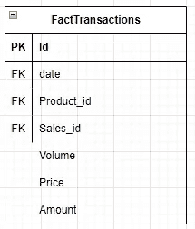

# 数据建模技术用于数据仓库

> 原文：[`towardsdatascience.com/data-modeling-techniques-for-data-warehouse-3edcb541e34e?source=collection_archive---------0-----------------------#2023-06-19`](https://towardsdatascience.com/data-modeling-techniques-for-data-warehouse-3edcb541e34e?source=collection_archive---------0-----------------------#2023-06-19)

[](https://medium.com/@mariusz_kujawski?source=post_page-----3edcb541e34e--------------------------------)[](https://towardsdatascience.com/?source=post_page-----3edcb541e34e--------------------------------) [Mariusz Kujawski](https://medium.com/@mariusz_kujawski?source=post_page-----3edcb541e34e--------------------------------)

·

[关注](https://medium.com/m/signin?actionUrl=https%3A%2F%2Fmedium.com%2F_%2Fsubscribe%2Fuser%2Fa60a4246b015&operation=register&redirect=https%3A%2F%2Ftowardsdatascience.com%2Fdata-modeling-techniques-for-data-warehouse-3edcb541e34e&user=Mariusz+Kujawski&userId=a60a4246b015&source=post_page-a60a4246b015----3edcb541e34e---------------------post_header-----------) 发布于 [Towards Data Science](https://towardsdatascience.com/?source=post_page-----3edcb541e34e--------------------------------) ·11 分钟阅读·2023 年 6 月 19 日[](https://medium.com/m/signin?actionUrl=https%3A%2F%2Fmedium.com%2F_%2Fvote%2Ftowards-data-science%2F3edcb541e34e&operation=register&redirect=https%3A%2F%2Ftowardsdatascience.com%2Fdata-modeling-techniques-for-data-warehouse-3edcb541e34e&user=Mariusz+Kujawski&userId=a60a4246b015&source=-----3edcb541e34e---------------------clap_footer-----------)

--

[](https://medium.com/m/signin?actionUrl=https%3A%2F%2Fmedium.com%2F_%2Fbookmark%2Fp%2F3edcb541e34e&operation=register&redirect=https%3A%2F%2Ftowardsdatascience.com%2Fdata-modeling-techniques-for-data-warehouse-3edcb541e34e&source=-----3edcb541e34e---------------------bookmark_footer-----------)

图片来源：[Zdeněk Macháček](https://unsplash.com/@zmachacek?utm_content=creditCopyText&utm_medium=referral&utm_source=unsplash) 在 [Unsplash](https://unsplash.com/photos/silver-and-diamond-studded-cross-pendant-rGzUMs-QsCM?utm_content=creditCopyText&utm_medium=referral&utm_source=unsplash)

数据建模是创建数据及其在组织或系统中关系的概念表示的过程。维度建模是一种先进的技术，旨在以任何用户都能直观理解的方式呈现数据。它还允许高性能的访问、灵活性和可扩展性，以适应业务需求的变化。

在这篇文章中，我将深入概述数据建模，特别关注 Kimball 的方法。此外，我还将介绍其他用于以用户友好和直观的方式呈现数据的技术。一个特别有趣的技术是将数据存储在一个宽表中，尽管这种方法可能不适用于所有查询引擎。我将介绍在数据仓库、数据湖、数据湖屋等中使用的技术。然而，选择适合特定用例和查询引擎的方法论非常重要。

# 什么是维度建模？

每个维度模型由一个或多个具有多部分键的表组成，称为事实表，以及一组称为维度表的表。每个维度表都有一个主键，与事实表中多部分键的一个组件精确对应。这种独特的结构通常被称为星型模式。在某些情况下，可以使用一种更复杂的结构称为雪花模式，其中维度表与更小的维度表相连接。

# 维度建模的好处：

维度建模提供了一种实用而高效的数据组织和分析方法，带来了以下好处：

+   为业务用户提供简单易懂的体验。

+   改进查询性能以加快数据检索速度。

+   灵活性和可扩展性以适应不断变化的业务需求。

+   确保多个来源的数据一致性和集成。

+   增强用户采用和自助分析。

现在我们已经讨论了什么是维度建模及其为组织带来的价值，让我们探讨如何有效利用它。

# 数据和维度建模方法

虽然我打算主要关注 Kimball 的方法，但在深入研究之前，让我们简要了解几种其他流行的技术。

# Inmon 方法

Inmon 建议在数据仓库中使用规范化的数据模型。这种方法支持数据集市的创建。这些数据集市是数据仓库的较小、专门的子集，服务于特定的业务领域或用户组。它们旨在为特定的业务功能或部门提供更量身定制和高效的数据访问体验。

# 数据保险库

数据保险库是一种建模方法，重点关注可扩展性、灵活性和可追溯性。它由三个核心组件组成：中心、链接和卫星。

**中心**

中心是所有独特实体的集合。例如，一个账户中心将包括账户、account_ID、load_date 和 src_name。这使我们能够追踪记录最初的来源，并确定是否需要从业务键生成替代键。

**链接**

链接建立中心之间的关系，并捕获不同实体之间的关联。它们包含相关中心的外键，支持多对多关系的创建。

**卫星表**

卫星表存储关于中心的描述性信息，提供额外的上下文和属性。它们包括历史数据、审计信息以及与特定时间点相关的其他属性。

Data Vault 的设计允许灵活且可扩展的数据仓库架构。它促进数据的可追溯性、可审计性和历史跟踪。这使得它适用于数据集成和敏捷性至关重要的场景，如高度受监管的行业或快速变化的商业环境。

# 单一大表（OBT）

OBT 将数据存储在一个宽表中。使用一个大表或非规范化表可以简化查询、提高性能，并简化数据分析。这消除了复杂连接的需求，简化了数据集成，在某些场景中可能有益。然而，它可能导致冗余、数据完整性挑战和维护复杂性增加。在选择单个大表之前，请考虑具体要求。


*作者提供的图片*


*作者提供的图片*

```py
WITH transactions AS (
  SELECT 1000001 AS order_id, TIMESTAMP('2017-12-18 15:02:00') AS order_time,
          STRUCT(65401 AS id, 'John Doe' AS name, 'Norway' AS location) AS customer,
          [
            STRUCT('xxx123456' AS sku, 3 AS quantity, 1.3 AS price),
            STRUCT('xxx535522' AS sku, 6 AS quantity, 500.4 AS price),
            STRUCT('xxx762222' AS sku, 4 AS quantity, 123.6 AS price)
          ] AS orders
  UNION ALL
  SELECT 1000002, TIMESTAMP('2017-12-16 11:34:00'),
        STRUCT(74682, 'Jane Smith', 'Poland') AS customer,
        [
            STRUCT('xxx635354',   4,      345.7),
            STRUCT('xxx828822', 2,      9.5)
        ] AS orders
)

select *

from
transactions
```

对于一个宽表，我们不需要连接多个表。我们可以使用一个表来聚合数据和进行分析。这种方法提高了 BigQuery 的性能。


*作者提供的图片*

```py
select customer.name, sum(a.quantity)

from
transactions t, UNNEST(t.orders) as a
group by  customer.name
```

# Kimball 方法论

Kimball 方法论强调创建一个称为数据仓库的集中数据存储库。这个数据仓库作为唯一的真实数据源，以一致且结构化的方式整合和存储来自各种操作系统的数据。

这种方法提供了一套全面的指导方针和最佳实践，用于设计、开发和实施数据仓库系统。它强调创建维度数据模型，并优先考虑简洁性、灵活性和易用性。现在，让我们*深入探讨* Kimball 方法论的关键原则和组件。

## 实体模型到维度模型

在我们的数据仓库中，数据源通常存在于实体模型中，这些模型被规范化为多个表，包含应用程序的业务逻辑。在这种情况下，理解表之间的依赖关系和基础业务逻辑可能很具挑战性。创建分析报告或生成统计数据通常需要连接多个表。


*作者提供的图片*

要创建维度模型，数据需要经过提取、转换和加载（ETL）过程，将其反规范化为星型模式或雪花模式。这个过程的关键活动包括识别事实表和维度表，并定义粒度。粒度决定了事实表中存储的详细程度。例如，交易可以按小时或按天汇总。


*图片由作者提供*

假设我们有一家销售自行车和自行车配件的公司。在这种情况下，我们有以下信息：

+   交易

+   商店

+   客户

+   产品

根据我们的业务知识，我们知道需要收集关于销售量、随时间变化的数量，以及按地区、客户和产品细分的信息。根据这些信息，我们可以设计我们的数据模型。交易表将作为我们的事实表，而商店、客户和产品表将作为维度表。

## 事实表

事实表通常代表一个业务事件或交易，并包括与该事件相关的指标或度量。这些指标可以包含各种数据点，如销售金额、销售数量、客户互动、网站点击或任何其他提供业务绩效见解的可衡量数据。事实表还包括建立与维度表关系的外键列。



*图片由作者提供*

事实表设计的最佳实践是将所有外键放在表的顶部，然后再进行度量。

**事实表类型**

1.  **交易事实表**提供的粒度在其最低级别为一行代表来自交易系统的一条记录。数据会每日或实时刷新。

1.  **定期快照事实表**捕捉某一时间点的事实表快照，例如月末。

1.  **累积快照事实表**总结了在过程开始和结束之间的可预测步骤中发生的测量事件。

1.  **无事实表**记录没有任何度量或指标的事件信息。

## 维度表

维度表是维度建模中的一种表，包含描述性属性，例如关于产品、其类别和类型的信息。维度表为存储在事实表中的定量数据提供了背景和视角。

维度表包含一个唯一键，用于识别表中的每条记录，称为代理键。表中可以包含一个来自源系统的业务键。一个好的做法是生成代理键，而不是使用业务键。

创建[代理键](https://docs.getdbt.com/terms/surrogate-key)有几种方法：

+   - 哈希：可以使用类似 MD5、SHA256 的哈希函数生成代理键（例如 md5(key_1, key_2, key_3)）。

+   - 增量生成：通过使用总是递增的数字（例如 row_number()、identity）生成的替代键

+   - 连接生成：通过连接唯一键列（例如 concat(key_1, key_2, key_3)）生成的替代键

+   - 唯一生成的：通过使用生成唯一标识符的函数（例如 GENERATE_UUID()）生成的替代键

你选择的方法取决于你用于处理和存储数据的引擎。这可能会影响数据查询的性能。

维度表通常包含层级结构。

a) 例如，父子层级可以用来表示员工与其经理之间的关系。


*作者提供的图像*

属性之间的层级关系。例如，一个时间维度可能具有如年份、季度、月份和日期等属性，形成一个层级结构。


*作者提供的图像*

## 维度表的类型

**一致维度：**

一致维度是可以被多个事实表使用的维度。例如，一个区域表可以被不同的事实表利用。

**退化维度：**

当属性存储在事实表中而不是维度表中时，就会发生退化维度。例如，交易编号可以在事实表中找到。

**垃圾维度：**

这包含在现有维度表中不适合的无意义属性，或表示各种状态组合的标志和二进制值的组合。

**角色扮演维度：**

相同的维度键在事实表中包含多个外键。例如，日期维度可以在事实表中引用不同的日期，如创建日期、订单日期和交货日期。

**静态维度：**

静态维度是一个通常不会变化的维度。它可以从参考数据中加载而无需更新。一个例子可能是公司的分支机构列表。

**桥表：**

当事实表与维度表之间存在一对多关系时，使用桥表。

## 缓慢变化维度

缓慢变化维度（SCD）是维度建模中的一个概念。它处理维度表中维度属性随时间的变化。SCD 提供了一种机制，用于在业务实体发展及其属性变化时维护维度表中的历史数据和当前数据。SCD 有六种类型，但最受欢迎的三种是：

+   **SCD 类型 0**：在这种类型中，仅导入新记录到维度表中，不进行任何更新。

+   **SCD 类型 1**：在这种类型中，新记录被导入到维度表中，现有记录被更新。

+   **SCD 类型 2**：在这种类型中，新记录被导入，并为更改的属性创建新记录和新值。

例如，当 John Smith 搬到另一个城市时，我们使用 SCD 类型 2 来保留与伦敦相关的事务信息。在这种情况下，我们创建一个新记录并更新之前的记录。结果是，历史报告将保留他在伦敦进行购买的信息。


*图片由作者提供*


*图片由作者提供*

```py
MERGE INTO client AS tgt
USING (
    SELECT 
Client_id,
Name,       
Surname,
City
      GETDATE() AS ValidFrom
    ‘20199-01-01’ AS ValidTo
from client_stg
) AS src
ON (tgt.Clinet_id = src.Clinet_id AND tgt.iscurrent = 1)
WHEN MATCHED THEN
    UPDATE SET tgt.iscurrent = 0, ValidTo = GETDATE()
WHEN NOT MATCHED THEN
    INSERT (Client_id, name, Surname, City, ValidFrom, ValidTo, iscurrent)
    VALUES (Client_id, name, Surname, City, ValidFrom, ValidTo,1);
```

这是 SCD 3 的样子，当我们将新值和旧值保存在不同列时。


## 星型模式与雪花模式

设计数据仓库时最流行的方法是使用星型模式或雪花模式。星型模式包含与事实表相关的事实表和维度表。在星型模式中，事实表和维度表直接与事实表相关。另一方面，雪花模式由一个事实表、与事实表相关的维度表以及与这些维度表相关的附加维度组成。


*图片由作者提供*

这两种设计之间的主要区别在于它们的规范化方法。星型模式保持数据非规范化，而雪花模式确保规范化。星型模式旨在提供更好的查询性能。雪花模式专门设计用来处理大型维度的更新。如果你在更新大规模维度表时遇到挑战，可以考虑转换为雪花模式。

## 数据加载策略

在我们的数据仓库、数据湖和数据湖屋中，我们可以有各种加载策略，例如：

**全量加载（Full Load）：** 全量加载策略涉及从源系统中加载所有数据到数据仓库中。当出现性能问题或缺乏可以指示行修改的列时，通常会使用这种策略。

**增量加载（Incremental Load）：** 增量加载策略涉及仅加载自上次数据加载以来的新数据。如果源系统中的行不能更改，我们可以基于唯一标识符或创建日期仅加载新记录。我们需要定义一个“水印”，以便用于选择新行。

**增量加载（Delta Load）：** 增量加载策略专注于加载自上次加载以来发生变化或新增的记录。它与增量加载的不同之处在于，它专门针对增量变化，而不是所有记录。当处理大量数据变化时，增量加载策略可以提高效率，并显著减少处理时间和所需资源。

加载数据的最常见策略是首先填充维度表，然后填充事实表。这里的顺序很重要，因为我们需要在事实表中使用维度表的主键来创建表之间的关系。有一个例外情况。当我们需要在维度表之前加载事实表时，这种技术被称为“迟到维度”（late arriving dimensions）。

在这种技术中，我们可以在维度表中创建代理键，并在填充事实表后通过 ETL 过程更新它。

**总结**

在详细阅读本文后，如果你有任何问题或想进一步讨论数据建模和有效的维度模型，请随时通过[LinkedIn](https://www.linkedin.com/in/mariusz-kujawski-812bb1103/)与我联系。实施数据建模可以释放数据的潜力，为明智决策提供有价值的见解，同时获得方法和最佳实践的知识。
