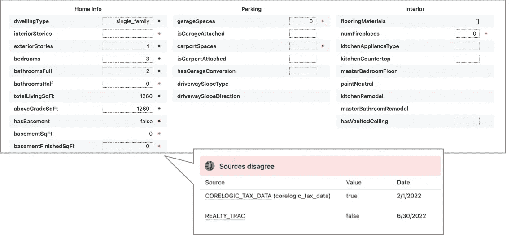
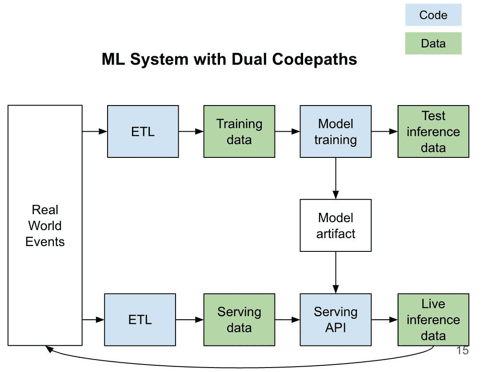

# 数据可观察性：分析与机器学习团队的应用

> 原文：[`towardsdatascience.com/data-observability-for-analytics-and-ml-teams-421f6089d905?source=collection_archive---------6-----------------------#2023-04-06`](https://towardsdatascience.com/data-observability-for-analytics-and-ml-teams-421f6089d905?source=collection_archive---------6-----------------------#2023-04-06)

## 确保高质量数据流的原则、实践和示例

 [Sam Stone](https://medium.com/@sjstone1987?source=post_page-----421f6089d905--------------------------------)

·

[关注](https://medium.com/m/signin?actionUrl=https%3A%2F%2Fmedium.com%2F_%2Fsubscribe%2Fuser%2Fcbfd810ae7b5&operation=register&redirect=https%3A%2F%2Ftowardsdatascience.com%2Fdata-observability-for-analytics-and-ml-teams-421f6089d905&user=Sam+Stone&userId=cbfd810ae7b5&source=post_page-cbfd810ae7b5----421f6089d905---------------------post_header-----------) 发布于 [Towards Data Science](https://towardsdatascience.com/?source=post_page-----421f6089d905--------------------------------) ·8 分钟阅读·2023 年 4 月 6 日

--

来源: [DreamStudio](https://beta.dreamstudio.ai/)（由作者生成）

[几乎 100%](https://www.americanbanker.com/payments/opinion/stolen-datas-a-hot-potato-that-gets-quickly-passed-around) 的公司今天依赖数据来推动商业机会，76% 的公司将数据作为形成商业策略的重要组成部分。在当今数字业务时代，越来越多的公司在提供客户体验、建立信任和塑造商业策略时，都从准确的数据开始。数据质量差不仅会让公司难以了解客户的需求，还可能使决策变成一种不必要的猜测。数据质量对于提供良好的客户体验至关重要。

数据可观察性是一组可以在工具中实现的原则，以确保数据准确、最新和完整。如果你希望提高组织的数据质量，这里是数据可观察性可能是你答案的原因以及如何实施。

## **如何判断你是否需要数据可观察性**

数据可观察性变得越来越必要，特别是传统的软件监控方法在处理高容量、高多样性的数据时显得不足。单元测试，评估小块代码在离散、确定性任务上的性能，被现实世界数据可能采取的多样化形状和数值所压倒。例如，一个单元测试可以验证一个预期为布尔值的列确实是布尔值，但如果该列中“真”的百分比在一天到另一天之间变化很大呢？甚至只是略微变化。另一方面，端到端测试，评估一个横跨代码库和服务的完整系统，被跨团队的动态数据管道复杂性所压倒。单元测试和端到端测试是必要的，但不足以确保在有复杂数据需求和复杂表格的组织中保持高数据质量。

你的组织需要数据可观察性的三个主要迹象——这不仅仅与机器学习有关：

+   上游数据的变化经常破坏下游应用程序，尽管上游团队进行了预防性措施

+   数据问题经常由客户（内部或外部）发现，而不是由拥有相关表格的团队发现

+   你正在朝着一个集中的数据团队迈进

我在[Opendoor](http://opendoor.com)工作了四年，该平台是一个用于住宅房地产交易的电子商务平台，并且是一个大型的买卖房屋平台——我们用来评估房屋价值的数据丰富但常常自相矛盾。我们使用数百个数据源，并维护成千上万的表——包括公共数据、第三方数据和专有数据——这些数据常常相互矛盾。例如，一套房子可能在最近的 MLS 列表和公共税务评估中提供了不同的平方英尺数据。房主在出售房屋时可能会声明最高的平方英尺，但在处理税务部门时则声明最低的面积。获取“真实情况”并不总是容易，但我们通过合成多个来源的数据来提高数据准确性——这就是数据可观察性派上用场的时候。

家庭数据示例，突显源系统不一致之处：来源：Opendoor，经许可

## **定义健康表格**

数据可观察性简单来说就是应用能够量化动态表健康状况的框架。要检查表中的行和列是否符合预期，请考虑以下因素和问题：

**行**

+   新鲜度——数据最后一次更新是什么时候？

+   数据量——最近添加或更新了多少行？

+   重复——是否有任何行是冗余的？

**列：**

+   模式——你预期的所有列都存在吗（还有一些你不期望的列吗）

+   分布——描述数据的统计信息发生了怎样的变化？

新鲜度、数据量、重复和模式检查都相对容易实现（即，如果你期望数据的形状随着时间保持稳定）。

或者你可以使用简单的时间序列模型来评估这些指标，如果你的数据形状在以渐进和可预测的方式变化，可以调整确定性检查参数。例如，如果你客户量增长了 X%，你可以设置行数据量检查，以便有一个随着时间推移而逐步增加的可接受窗口。在 Opendoor，我们知道房地产交易在节假日时非常少，因此我们能够设置规则，在这些日子调整警报窗口。

列分布检查通常是复杂性和重点所在。它们往往最难做到准确，但做好了则回报最高。列分布检查的类型包括以下内容：

+   数值——均值、中位数、第 X 百分位数，……

+   类别——列基数、最常见值、第 2 常见值，……

+   百分比缺失值

当你的表格健康时，分析和产品团队可以确信下游用途和数据驱动的洞察是可靠的，并且他们是在建立在一个可靠的基础上。当表格不健康时，所有下游应用程序都需要仔细检查。

## **异常检测**

拥有数据健康框架是一个有用的第一步，但能够将该框架转化为可靠运行的代码、生成有用的警报并且易于配置和维护是至关重要的。以下是从数据质量抽象到启动实时异常检测系统时需要考虑的几个事项：

+   **检测逻辑**：如果可以提前定义什么构成行级或列级违规，那么专注于确定性检查的系统（由开发人员手动编写这些规则）可能是最好的。如果你看到异常就能识别（但不能通过确定性规则提前描述），那么专注于概率检测的系统可能更好。如果需要检查的关键表格数量如此庞大，以至于手动编写逻辑不可行，那么同样适用。

+   **集成**：你的系统应该与你已经拥有的核心系统集成，包括数据库、警报系统（例如 PagerDuty），以及——如果你有的话——数据目录（例如 SelectStar）。

+   **成本**：如果你有一个小型的工程团队但预算没有限制，则倾向于选择第三方解决方案。如果你的预算有限但工程团队很大，并且有非常独特的需求，则倾向于选择内部构建的第一方解决方案。

+   **数据类型**：异常检测的方式取决于数据是结构化、半结构化还是非结构化的，因此了解你正在处理的数据类型非常重要。

当涉及到检测非结构化数据（例如文本、图像、视频、音频）中的异常时，很难计算有意义的列级描述统计信息。非结构化数据是高维的——例如，一个小的 100x100 像素图像可能有 30,000 个值（10,000 个像素 x 三种颜色）。与其检查数据库中 10,000 列的图像类型的变化，不如将图像转换为少量维度，并对这些维度应用列级检查。这一降维过程称为数据嵌入，适用于任何非结构化数据格式。

这是我们在 Opendoor 遇到的一个例子：我们在第一天接收到 100,000 张图像，其中 20%标记为“is_kitchen_image=True”。第二天，我们接收到 100,000 张图像，其中 50%标记为“is_kitchen_image=False”。这可能是正确的——但分布变化的规模肯定应该引发异常警报！

如果你的团队专注于非结构化数据，请考虑具有内置嵌入支持的异常检测。

## **自动化数据目录**

自动化你的数据目录使得数据对开发人员、分析师和非技术团队成员更易于访问，从而促进更好的数据驱动决策。在构建数据目录时，以下是几个关键问题：

**表格文档**

+   每一行代表什么？

+   每一列代表什么？

+   表格所有权——当表格出现问题时，我应该联系组织中的谁？

**表格血缘（代码关系）**

+   上游有哪些表格？它们是如何被查询或转换的？

+   下游有哪些表格、仪表板或报告？

**现实世界中的应用**

+   这个表格的受欢迎程度如何？

+   这个表格和/或列在查询中通常如何使用？

+   我们组织中的谁使用这个表格？

在 Opendoor，我们发现表格文档化很难自动化，成功的关键在于我们的工程和分析团队在一个明确的地方填写这些定义的责任划分。另一方面，我们发现自动检测表格血统和现实世界中的应用（通过解析 SQL 代码，包括检入到 Github 的代码和更多“即席”SQL 支持仪表板）为这些元数据提供了很高的覆盖率和准确性，无需手动元数据注释。

结果是，人们知道在哪里找到数据，使用什么数据（以及不使用什么数据），并且更好地理解他们所使用的数据。

## **特定于机器学习的策略**

机器学习数据在数据可观察性方面有所不同，主要有两个原因。首先，机器学习代码路径通常容易出现细微的错误。机器学习系统通常有两个代码路径，执行类似但略有不同的操作：模型训练，侧重于并行计算并容忍高延迟，以及模型服务，侧重于低延迟计算且通常是顺序进行的。这些双重代码路径为错误进入服务系统提供了机会，特别是当测试仅集中在训练路径上时。这个挑战可以通过两种策略来解决：

+   **使用“黄金集”（或“生产测试”）评估服务推断**。首先，收集一组已知正确输出的输入，或者至少在合理的范围内已知（例如，Opendoor 对销售价格有很高信心的家庭价格集合）。接下来，查询生产系统中的这些输入，并将产品系统输出与“实际情况”进行比较。

+   **对服务输入应用分布检查**。假设 Opendoor 使用数据训练我们的模型，其中家庭平方英尺的分布在第 25 百分位为 1,000 平方英尺，第 50 百分位为 2,000 平方英尺，第 75 百分位为 3,000 平方英尺。我们会根据这个分布建立界限——例如，第 25 百分位应为 1,000 平方英尺 +/- 10%——并收集对服务系统的调用并对每批次运行检查。

来源：作者提供的图像

机器学习数据在数据可观察性方面的另一个不同之处是“正确”的输出并不总是显而易见的。用户通常不知道什么是错误，或者可能没有动力报告错误。为了解决这个问题，分析和机器学习团队可以征求用户反馈，汇总并分析外部用户和内部用户/领域专家的趋势。

无论是专注于 ML 数据还是整个代码库，数据可观察性都能让你的生活变得更加轻松。它帮助分析和 ML 团队洞察系统性能和健康状况，提高跨离散工具的端到端可见性和监控，并快速识别问题，无论问题源自何处。随着数字业务的持续发展、增长和转型，建立这一健康基础将带来*巨大*的变化。
