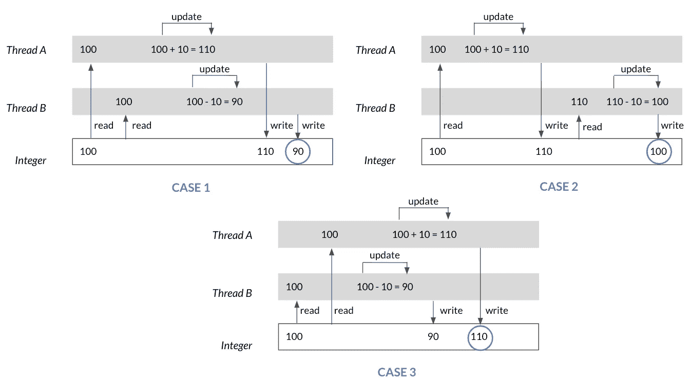

# Python 中的数据导向编程

> 原文：[`towardsdatascience.com/data-oriented-programming-with-python-ef478c43a874`](https://towardsdatascience.com/data-oriented-programming-with-python-ef478c43a874)

## Yehonathan Sharvit 关于*数据导向编程*的回顾，但以 Python 示例（而非 JavaScript 和 Java）来说明

[](https://medium.com/@tamdtranthe?source=post_page-----ef478c43a874--------------------------------)[](https://towardsdatascience.com/?source=post_page-----ef478c43a874--------------------------------) [Tam D Tran-The](https://medium.com/@tamdtranthe?source=post_page-----ef478c43a874--------------------------------)

·发表于 [Towards Data Science](https://towardsdatascience.com/?source=post_page-----ef478c43a874--------------------------------) ·12 分钟阅读·2023 年 5 月 12 日

--


图片由 [AltumCode](https://unsplash.com/@altumcode?utm_source=medium&utm_medium=referral) 提供，来源于 [Unsplash](https://unsplash.com/?utm_source=medium&utm_medium=referral)

[*数据导向编程*](https://www.manning.com/books/data-oriented-programming?utm_source=medium&utm_medium=referral&utm_campaign=book_sharvit2_data_1_29_21) 是 Yehonathan Sharvit 编写的一本很棒的书，为数据导向编程（DOP）概念提供了温和的介绍，作为传统面向对象编程（OOP）的替代方案。Sharvit 解构了在 OOP 中有时看似不可避免的复杂元素，并总结了 DOP 的主要原则，帮助我们使系统更加可管理。

正如其名，数据导向编程（DOP）将数据置于首位。这可以通过遵循四个主要原则来实现。这些原则与语言无关。它们可以在面向对象编程（OOP）语言（如 Java、C++ 等）、函数式编程（FP）语言（如 Clojure 等）或通用编程语言（如 Python、JavaScript）中表示。虽然作者用 JavaScript 和 Java 说明了他的示例，但本文尝试用 Python 展示这些思想。

跟随本文，你会发现简单的 Python 代码片段，展示了如何遵守或违背每个原则。Sharvit 还阐明了每个原则的好处和成本——其中许多在 Python 中相关，而有些则不相关。

请注意，所有提到的原则、相应的优缺点均归功于 Yehonathan Sharvit，而关于这些陈述在 Python 中的适用性以及与 Python 代码示例相关的观点则是我个人的看法。

# 原则 #1: 将代码与数据分离

> “以一种代码位于不依赖于函数上下文中封装数据的函数的方式将代码与数据分离。” — Yehonathan Sharvit

在 Python 中，遵循这一原则的自然方式是使用顶层函数（用于代码）和仅包含字段的数据类（用于数据）。虽然 Sharvit 在他的书中分别说明了如何在 OOP 和 FP（函数式编程）中遵循这一原则，但我在 Python 中的示例是 OOP 和 FP 的混合体。

请参考下面的代码片段作为代码（行为）与数据（事实/信息）分离的示例。

```py
from dataclasses import dataclass

@dataclass
class AuthorData:
    """Class for keeping track of an author in the system"""

    first_name: str
    last_name: str
    n_books: int

def calculate_name(first_name: str, last_name: str):
    return f"{first_name} {last_name}"

def is_prolific(n_books: int):
    return n_books > 100

author_data = AuthorData("Isaac", "Asimov", 500)
calculate_name(author_data.first_name, author_data.last_name)
# 'Isaac Asimov'
```

> **好处 # 1: “**代码可以在不同的上下文中重用” — Yehonathan Sharvit

从上面的示例可以看出，`calculate_name()` 不仅可以用于作者，还可以用于用户、图书馆员或任何具有名字和姓氏字段的人。处理全名计算的代码与处理作者数据创建的代码是分开的。

```py
@dataclass
class UserData:
    """Class for keeping track of a user in the system"""

    first_name: str
    last_name: str
    email: str

user_data = UserData("John", "Doe", "john.doe@gmail.com")
calculate_name(user_data.first_name, user_data.last_name)
# 'John Doe'
```

> **好处 # 2: “**代码可以在隔离的环境中进行测试” — Yehonathan Sharvit

以下是一个不符合原则 #1 的示例。

```py
class Address:
    def __init__(self, street_num: int, street_name: str,
                 city: str, state: str, zip_code: int):
        self.street_num = street_num
        self.street_name = street_name
        self.city = city
        self.state = state
        self.zip_code = zip_code

class Author:
    def __init__(self, first_name: str, last_name: str, n_books: int, 
                 address: Address):
        self.first_name = first_name
        self.last_name = last_name
        self.n_books = n_books
        self.address = address

    @property
    def full_name(self):
        return f"{self.first_name} {self.last_name}"

    @property
    def is_prolific(self):
        return self.n_books > 100

address = Address(651, "Essex Street", "Brooklyn", "NY", 11208) 
author = Author("Issac", "Asimov", 500, address)
assert author.full_name == "Issac Asimov"
```

为了测试 `Author` 类中的 `full_name()` 属性，我们需要实例化 `Author` 对象，这要求我们为所有属性提供值，包括那些与我们正在测试的行为无关的属性（如 `n_books` 和 `address` 自定义类）。这是为了测试单个方法而进行的不必要的复杂和繁琐的设置。

另一方面，在 DOP 版本中，为了测试 `calculate_name()` 代码，我们可以创建数据以隔离地传递给函数。

```py
assert calculate_name("Issac", "Asimov") == "Issac Asimov"
```

> **成本 # 1:** “无法控制哪些代码可以访问哪些数据” — Yehonathan Sharvit
> 
> “…在 OOP 中，数据封装在一个对象中，这保证了数据只能通过对象的方法访问。在 DOP 中，由于数据独立存在，它可以被任何代码访问……这本质上是不安全的。” — Yehonathan Sharvit

**这个声明在 Python 中不适用。**

在 Python 中，类持有的数据仍然可以被任何引用对象的代码访问。例如：

```py
class Author:
    def __init__(self, first_name: str, last_name: str, n_books: int):
        self.first_name = first_name
        self.last_name = last_name
        self.n_books = n_books

    @property
    def full_name(self):
        return f"{self.first_name} {self.last_name}"

    @property
    def is_prolific(self):
        return self.n_books > 100

author = Author("Issac", "Asimov", 500, address)
author.full_name
# 'Issac Asimov'
```

同样，除非我们将数据存储在全局变量中，否则我们仍然可以使用作用域（函数、循环等）来控制谁可以访问/更改 Python 中的数据。

> **成本 #2:** “没有封装” — Yehonathan Sharvit
> 
> “在 DOP 中，操控数据的代码可以在任何地方。这可能使开发者难以发现 `[某个特定函数]` 的存在，从而导致浪费时间和代码重复。” — Yehonathan Sharvit

这在我们上面的 Python 示例中是正确的。例如，我们的 `AuthorData` 数据类可能在一个文件中，而 `calculate_name()` 函数可能在另一个文件中。

# 原则 #2: 使用通用数据结构表示数据

> “在 DOP 中，数据使用通用数据结构表示，例如映射（或字典）和数组（或列表）。” — Yehonathan Sharvit

在 Python 中，我们的通用数据结构选项包括 `dict`、`list` 和 `tuple`。

在本文中，我使用 Python 的 `dataclass`，它可以被视为“带有默认值的可变命名元组”。请注意，这不是 Sharvit 所说的“通用数据结构”。Python 的 `dataclass` 是一种更接近面向对象编程（OOP）而非面向过程编程（DOP）的混合体。然而，与字典和元组相比，这种替代方案不易出现拼写错误，通过类型提示更具描述性，有助于以更清晰、更简洁的方式表示嵌套复杂结构等。此外，如果需要，也可以很容易地将其转换为字典或元组。

```py
from dataclasses import dataclass, asdict

@dataclass
class AuthorData:
    """Class for keeping track of an author in the system"""

    first_name: str
    last_name: str
    n_books: int

author_data = AuthorData("Isaac", "Asimov", 500)
asdict(author_data)
# {'first_name': 'Isaac', 'last_name': 'Asimov', 'n_books': 500}
```

> **好处 #1:** “能够使用不局限于我们特定用例的通用函数” — Yehonathan Sharvit

通过通用结构，我们可以利用丰富的内置 Python 函数集来操作 `dict`、`list`、`tuple` 等上的数据。

以下是一些可以用来操作存储在 `dict` 中的数据的通用函数示例。

```py
author = {"first_name": "Issac", "last_name": "Asimov", "n_books": 500}

# Access dict values
author.get("first_name")

# Add new field to dict
author["alive"] = False

# Update existing field
author["n_books"] = 703
```

这意味着我们不必学习和记住每个人类的自定义方法。此外，如果我们更改一些库版本，通用函数不会崩溃。它们只有在 Python 语言更改时才会崩溃（这几乎从未发生）。

> **好处 #2:** “**灵活的数据模型” — Yehonathan Sharvit
> 
> “使用通用数据结构时，数据可以创建为没有预定义形状的形式，并且可以随意修改其形状。” — Yehonathan Sharvit

在下面的示例中，列表中的字典并不是所有的都有相同的键。额外的键可以存在于第二个字典中，只要必要的字段存在即可。

```py
names = []
names.append({"first_name": "Isaac", "last_name": "Asimov"})
names.append({"first_name": "Jane", "last_name": "Doe", 
              "suffix": "III", "age": 70})
```

> **成本 #1:** “性能损失” — Yehonathan Sharvit

**这在 Python 中并不完全适用。**

在 Python 中，检索类成员的值与检索字典中与键相关的值之间的性能差异不大。与 Java 不同，Python 没有编译步骤，这意味着在访问类成员时没有编译器优化。

然而，并不是所有的通用数据结构都是相同的。`set` 和 `dict` 的查找时间比 `list` 和 `tuple` 更高效，因为集合和字典使用哈希函数来立即确定特定数据，而无需进行搜索。

> **成本 #2:** “没有数据模式” — Yehonathan Sharvit
> 
> “当数据从一个类实例化时，数据形状的信息就在类定义中。类级别的数据模式存在使得发现预期的数据形状变得容易。当数据使用通用数据结构表示时，数据模式不是数据表示的一部分。” — Yehonathan Sharvit

例如，我们可以轻松地识别下方作为类对象实例化的 `FullName` 的数据形状。

```py
class FullName:
    def __init__(self, first_name, last_name, suffix):
        self.first_name = first_name
        self.last_name = last_name
        self.suffix = suffix
```

> **成本 #3:** “没有编译时检查数据是否有效” — Yehonathan Sharvit

***这在 Python 中并不完全适用。***

在 Python 中没有像 Java 那样的编译步骤。Python 唯一的编译时检查就是运行像 [mypy](https://mypy-lang.org/) 这样的工具。

然而，夏维特关于如何通过通用数据结构中的数据形状错误可能会遗漏的例子在 Python 中仍然可以部分演示，如下所示。

当数据传递到 `FullName` 类时，如果数据不符合它所期望的形状，就会在运行时发生错误。例如，如果我们拼错了存储名字的字段（`fist_name` 而不是 `first_name`），我们会得到 `TypeError: __init__() got an unexpected keyword argument 'fist_name'`。

```py
class FullName:
    def __init__(self, first_name, last_name, suffix):
        self.first_name = first_name
        self.last_name = last_name
        self.suffix = suffix

FullName(fist_name="Jane", last_name="Doe", suffix="II")
```

然而，使用通用数据结构时，拼错字段可能不会导致错误或异常。相反，名字会神秘地从结果中省略。

```py
names = []
names.append({"first_name": "Jane", "last_name": "Doe", "suffix": "III"})
names.append({"first_name": "Isaac", "last_name": "Asimov"})
names.append({"fist_name": "John", "last_name": "Smith"})

print(f"{names[2].get('first_name')} {names[2].get('last_name')}")
# None Smith
```

> **成本 #4:** “需要显式的类型转换” — 叶洪·夏维特

**这不能转化为 Python。**

Python 是一种动态类型语言。它不需要显式的类型转换。

# **原则 #3:** 数据是不可变的

> “根据 DOP，数据不应更改！而是创建数据的新版本。” — 叶洪·夏维特

为了遵循这一原则，我们将 `dataclass` 设置为冻结（即不可变）。

```py
@dataclass(frozen=True)
class AuthorData:
    """Class for keeping track of an author in the system"""

    first_name: str
    last_name: str
    n_books: int
```

Python 内置的不可变数据类型有 `int`、`float`、`decimal`、`bool`、`string`、`tuple` 和 `range`。注意 `dict`、`list` 和 `set` 是可变的。

> **好处 #1:** “对所有人都能自信地访问数据” — 叶洪·夏维特
> 
> “当数据是可变的时，我们在将数据作为参数传递给函数时必须小心，因为它可能会被修改或克隆。” — 叶洪·夏维特

在下面的示例中，我们最初将一个空列表作为默认参数传递给函数。由于列表是一个可变对象，每次调用函数时，列表都会被修改，并且在后续调用中使用不同的默认值。

```py
def append_to_list(el, ls=[]):
    ls.append(el)
    return ls

append_to_list(1)
# [1]
append_to_list(2)
# [1, 2]
append_to_list(3)
# [1, 2, 3]
```

要修复上述用例，我们可以这样做：

```py
def append_to_list(el, ls=None):
    if ls is None:
        ls = []    
    ls.append(el)
    return ls

append_to_list(1)
# [1]
append_to_list(2)
# [2]
```

这段代码按预期工作，因为 `None` 是不可变的。

> “当数据是不可变的时，可以自信地将其传递给任何函数，因为数据永远不会改变。” — 叶洪·夏维特
> 
> **好处 #2:** “可预测的代码行为” — 叶洪·夏维特

这里是一个不可预测的代码示例：

```py
from datetime import date

dummy = {"age": 30}

if date.today().day % 2 == 0:
    dummy["age"] = 40
```

`dummy` 字典中的 `age` 值是不可预测的。它取决于你是在偶数天还是奇数天运行代码。

然而，使用不可变的数据可以保证数据永远不会改变。

```py
author_data = AuthorData("Issac", "Asimov", 500)

if date.today().day % 2 == 0:
    author_data.n_books = 100
# dataclasses.FrozenInstanceError: cannot assign to field "n_books"
```

上面的代码会出错，显示 `dataclasses.FrozenInstanceError: cannot assign to field "n_books"`。使用冻结的数据类，无论是偶数天还是奇数天，`author_data.n_books` 始终是 500。

> **好处 #3:** “快速的相等性检查” — 叶洪·夏维特

Python 有两个类似的运算符用于检查两个对象是否相等：`is` 和 `==`。`is` 通过比较内存地址的整数相等性来检查对象的身份。`==` 通过检查实际存储的内容来检查值的相等性。

```py
# String is immutable
x = "abc"

# Note that the identity of `x` and `abc` is the same
print(id(x))
# 140676188882480
print(id("abc"))
# 140676188882480

print(x == "abc")
# True
print(x is "abc")
# True

# List is mutable
y = [1, 2, 3]

# Note that the identity of `y` and `[1, 2, 3]` is different
print(id(y))
# 140676283875904
print(id([1, 2, 3])
# 140676283875584

print(y == [1, 2, 3])
# True
print(y is [1, 2, 3])
# Fasle
```

如上所示，`is` 和 `==` 对于 `x`（即不可变数据类型）表现相同，但对 `y`（即可变数据类型）表现不同。使用不可变数据对象时，`is` 的行为更可预测。而且，`is` 通常比 `==` 更快，因为比较对象地址比比较所有字段要快。因此，不可变数据通过引用比较数据实现了快速的相等性检查。

> **优点 #4:** “**免费的并发安全性**” — Yehonathan Sharvit

当数据在多线程环境中是可变的时，可能会发生竞态条件失败。例如，假设两个线程尝试通过加/减 10 来访问和修改 `x` 的值：



竞态条件失败示例。图片由作者提供。

可能的三种答案是: `x=90`，`x=100`，和 `x=110`。根据执行顺序，程序的行为每次运行时都会变化，这样不安全且容易损坏。为了确保并发安全，数据应该处于不可变状态。

> **成本 #1:** “性能损失” — Yehonathan Sharvit

由于 `list` 是可变的，而 `tuple` 是不可变的，当我们扩展这两种对象时，`list` 的身份保持不变，而一个全新的 `tuple` 被创建并具有不同的身份。

```py
list1 = [1, 2, 3]
tuple1 = (1, 2, 3)

print(id(list1))
# 140218642718848
print(id(tuple1))
# 140218642722496

list1 += [4, 5]
tuple1 += (4, 5)

print(id(list1))
# 140218642718848
print(id(tuple1))
# 140218642772352
```

每次修改不可变对象时需要将内容复制到一个新对象中，这需要额外的内存，并增加了 CPU 的负担，特别是对于非常大的集合。

> **成本 #2:** “对不可变数据结构的库要求” — Yehonathan Sharvit

**这不能转译到 Python。**

`frozenset` 和 `tuple` 是 Python 中一些基本的内置不可变数据结构。我们并不总是需要包含第三方库来遵循数据不可变性原则。

# 原则 #4: 将数据模式与数据表示分开

> “在 DOP 中，数据的期望形状表示为（元）数据，这些数据与主要的数据表示分开保存。” — Yehonathan Sharvit

以下是一个基本的 JSON 模式（本质上是一个字典），它描述了数据的格式，这些数据也以字典形式表示。该模式定义了哪些字段是必需的以及字段的数据类型，而数据则按原则 #3 由通用数据结构表示。

```py
schema = {
    "required": ["first_name", "last_name"],
    "properties": {
        "first_name": {"type": str},
        "last_name": {"type": str},
        "books": {"type": int},
    }
}

data = {
    "valid": {
        "first_name": "Isaac",
        "last_name": "Asimov",
        "books": 500
    },
    "invalid1": {
        "fist_name": "Isaac",
        "last_name": "Asimov",
    },
    "invalid2": {
        "first_name": "Isaac",
        "last_name": "Asimov",
        "books": "five hundred"
    }
}
```

数据验证函数（或库）可用于检查数据是否符合数据模式。

```py
def validate(data):
    assert set(schema["required"]).issubset(set(data.keys())), \
        f"Data must have following fields: {schema['required']}"

    for k in data:
        if k in schema["properties"].keys():
            assert type(data[k]) == schema["properties"][k]["type"], \
                f"Field {k} must be of type {str(schema['properties'][k]['type'])}"
```

`validate` 函数在数据有效时通过，或者在数据无效时以人类可读的格式返回详细错误。

```py
validate(data["valid"]))
# No error

validate(data["invalid1"])
# AssertionError: Data must have following fields: ['first_name', 'last_name']

validate(data["invalid2"])
# AssertionError: Field books must be of type <class 'int'>
```

> **优点 #1:** “可选字段” — Yehonathan Sharvit
> 
> “在 OOP 中，允许类成员为可选项并不容易。在 DOP 中，在映射中声明字段为可选是很自然的。” — Yehonathan Sharvit

**这不能转译到 Python。**

在 Python 中，即使使用 OOP，允许类成员为可选项也不难。因此，这一好处在 Python 的背景下并不强烈。例如，下面我们可以将`n_books`的默认参数设置为`None`，以表示该字段是可选的。

```py
class Author:
    def __init__(self, first_name: str, last_name: str, n_books: int = None):
        self.first_name = first_name
        self.last_name = last_name
        self.n_books = n_books

    @property
    def fullname(self):
        return f"{self.first_name} {self.last_name}"

    @property
    def is_prolific(self):
        if self.n_books:
            return self.n_books > 100

author = Author("Issac", "Asimov")
```

> **好处 #2:** “高级数据验证条件” — Yehonathan Sharvit
> 
> “在 DOP 中，数据验证发生在运行时。这允许定义超出字段类型的数据验证条件。” — Yehonathan Sharvit

与上面定义的最小模式相比，以下模式可以扩展以包含每个字段的更多属性。

```py
schema = {
    "required": ["first_name", "last_name"],
    "properties": {
        "first_name": {
            "type": str,
            "max_length": 100,
        },
        "last_name": {
            "type": str,
            "max_length": 100
        },
        "books": {
            "type": int,
            "min": 0,
            "max": 10000,
        },
    }
}
```

尽管 Sharvit 提到的 DOP 原则的所有优缺点并不直接适用于 Python，但基本原则仍然稳健。这种方法促进了更容易推理、测试和维护的代码。通过接受 DOP 的原则和技术，Python 程序员可以创建更具可维护性和可扩展性的代码，并释放数据的全部潜力。

*特别感谢* [*Eddie Pantridge*](https://medium.com/u/85a05f1243a6?source=post_page-----ef478c43a874--------------------------------) *对本文改进所作出的深思熟虑的评论和努力。*
