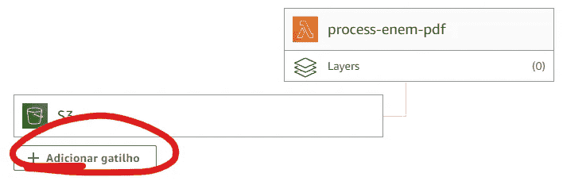

# 数据管道与 Airflow 和 AWS 工具（S3、Lambda 和 Glue）

> 原文：[`towardsdatascience.com/data-pipeline-with-airflow-and-aws-tools-s3-lambda-glue-18585d269761?source=collection_archive---------1-----------------------#2023-04-06`](https://towardsdatascience.com/data-pipeline-with-airflow-and-aws-tools-s3-lambda-glue-18585d269761?source=collection_archive---------1-----------------------#2023-04-06)

## 了解这些工具及其集成方式

[](https://joaopedro214.medium.com/?source=post_page-----18585d269761--------------------------------)[](https://towardsdatascience.com/?source=post_page-----18585d269761--------------------------------) [João Pedro](https://joaopedro214.medium.com/?source=post_page-----18585d269761--------------------------------)

·

[关注](https://medium.com/m/signin?actionUrl=https%3A%2F%2Fmedium.com%2F_%2Fsubscribe%2Fuser%2Fb111eee95c&operation=register&redirect=https%3A%2F%2Ftowardsdatascience.com%2Fdata-pipeline-with-airflow-and-aws-tools-s3-lambda-glue-18585d269761&user=Jo%C3%A3o+Pedro&userId=b111eee95c&source=post_page-b111eee95c----18585d269761---------------------post_header-----------) 发表在 [Towards Data Science](https://towardsdatascience.com/?source=post_page-----18585d269761--------------------------------) · 17 分钟阅读 · 2023 年 4 月 6 日[](https://medium.com/m/signin?actionUrl=https%3A%2F%2Fmedium.com%2F_%2Fvote%2Ftowards-data-science%2F18585d269761&operation=register&redirect=https%3A%2F%2Ftowardsdatascience.com%2Fdata-pipeline-with-airflow-and-aws-tools-s3-lambda-glue-18585d269761&user=Jo%C3%A3o+Pedro&userId=b111eee95c&source=-----18585d269761---------------------clap_footer-----------)

--

[](https://medium.com/m/signin?actionUrl=https%3A%2F%2Fmedium.com%2F_%2Fbookmark%2Fp%2F18585d269761&operation=register&redirect=https%3A%2F%2Ftowardsdatascience.com%2Fdata-pipeline-with-airflow-and-aws-tools-s3-lambda-glue-18585d269761&source=-----18585d269761---------------------bookmark_footer-----------)

图片由[Nolan Krattinger](https://unsplash.com/fr/@odes?utm_source=medium&utm_medium=referral)拍摄，发布在[Unsplash](https://unsplash.com/?utm_source=medium&utm_medium=referral)

# 介绍

几周前，当我在思考新的文章创意时，我想：*嗯，我需要更多地了解（和讨论）云计算和这些相关内容。我在本地环境中已经练习了很多，使用了开源工具，远离了专有解决方案……但世界是云的，我认为这种情况不会很快改变……*

然后我写了一篇关于创建 使用本地 Spark 和 GCP 的数据管道 的文章，这是我第一次使用云基础设施。今天的文章遵循相同的理念：将本地和云端的组件组合在一起，构建数据管道。但这次，我们将使用 AWS，而不是 GCP。

AWS 是迄今为止最受欢迎的云计算平台，它拥有大量的产品来解决你想象中的每种特定问题。至于数据工程解决方案，它也不例外：它们有数据库、ETL 工具、流媒体平台等等 — 一整套工具，让我们的生活更轻松（只要你为它们付费）。

所以，请跟随我在这篇文章中从零开始开发一个完整的数据管道，使用 AWS 工具集中的一些组件。

> 未赞助。

# 工具 — TLDR

**Lambda functions** 是 AWS 最著名的无服务器计算解决方案。“无服务器”意味着应用程序不依附于特定的服务器。相反，每当发出请求时，会快速启动一个新的计算实例，应用程序响应后，该实例将被终止。因此，这些应用程序应该是小型的、无状态的。

**Glue** 是 AWS 的一种简单的无服务器 ETL 解决方案。使用可视化界面、代码编辑器或 Jupyter notebooks 创建 Python 或 Spark 处理作业。按需运行作业，只为执行时间付费。

**S3** 是 AWS 的 blob 存储。这个概念很简单：创建一个存储桶并在其中存储文件。稍后通过它们的“路径”读取这些文件。文件夹是虚假的，对象是不可变的。

**Airflow** 是一个“工作流协调器”。它是一个开发、组织、排序、调度和监控任务的工具，使用一种称为 DAG 的结构 — 有向无环图，用 Python 代码定义。

# 数据

为了充分探索这些工具的功能，我选择使用来自巴西 ENEM（国家高中考试）的数据。这个考试每年举行，是大多数巴西公立和私立大学的主要入学门槛；它在四个主要知识领域评估学生：人文科学、自然科学、数学和语言（每个领域 45 道题目）。


ENEM 2010，人文科学及其技术。图片来源：作者。

我们的任务是从实际的考试中提取这些问题，这些考试以 PDF 形式在 MEC（教育部）网站上提供 [CC BY-ND 3.0]。


从 PDF 中提取问题。图片来源：作者。

# 实现过程

在阅读了关于 AWS 可用的数据处理工具的一两行内容后，我决定用 Lambda 和 Glue 作为数据处理组件，S3 作为存储，和本地 Airflow 来协调一切，来构建一个数据管道。

简单的想法，对吧？

嗯，可以说是这样。

正如你在这篇帖子中会注意到的那样，问题在于有很多配置、授权、角色、用户、连接和密钥需要创建，以使这些工具能够顺利协作。

我保证会尽量覆盖大部分步骤，但为了缩短帖子，我需要省略一些细节。

说到这里，让我们看看每个工具的功能，见下图。


提议的管道。图像由作者提供。

本地 Airflow 实例将负责协调所有操作，从 MEC 网站下载 PDF 并将其上传到 S3。此过程应该会自动触发 Lambda 函数执行，该函数将读取 PDF，提取其文本，并将结果保存到 S3 的“另一个地方”。然后，Airflow 应触发一个 Glue 作业，该作业将读取这些文本，提取问题，并将结果以 CSV 格式保存到 S3。

步骤：

1.  (**Airflow**) 下载 PDF 并上传到 S3

1.  (**Lambda**) 从 PDF 中提取文本，将结果以 JSON 格式写入 S3

1.  (**Airflow->Glue**) 读取文本，拆分问题，添加适当的元数据，并将结果保存为 CSV

## 0. 设置环境

本项目中使用的所有代码都可以在这个 [GitHub 仓库](https://github.com/jaumpedro214/posts)中找到。

第一步是配置本地环境。

你需要在本地机器上安装 Docker 来创建 Airflow 集群。Docker 镜像已经配置好，可以自动从头创建一个新环境，因此我们可以更多地关注实现部分。

在 **docker-compose.yaml** 文件的相同文件夹中，使用以下命令启动环境：

```py
docker compose up
```

在初始配置后，airflow Web 服务应该在 localhost:8080 启动。默认的用户名和密码都是 ‘airflow’。

> 如果在启动 Airflow 时遇到问题，请尝试为新创建的卷赋予读写权限，例如：chmod 777 <foldername>。

接下来进入云环境。

你需要一个 AWS 账户，这里有一个警告——注意账单。S3 存储和 Lambda 函数的使用将会在免费配额范围内（如果你还没有用完），但 Glue 执行会收取一些美元美分。**记得在工作完成后关闭所有服务。**

一旦你创建了账户，请按照以下步骤操作：

1.  在 S3 中创建一个名为 **enem-bucket** 的新 Bucket。

1.  创建一个新的 **IAM** 用户，授权读取和写入 S3 并运行 Glue 作业，存储生成的访问密钥对。

1.  在 airflow UI（localhost:8080）中，点击 **admin->connections** 标签，创建一个新的 AWS 连接，命名为 **AWSConnection**，使用之前创建的访问密钥对**。**


创建 AWS 连接。图像由作者提供。

可能还需要一些其他小调整，AWS 是一个疯狂的地方，但上面的列表应该涵盖了整体过程。

曾经有一个人吃了一整架飞机。秘密在于这个过程持续了 2 年，他一块一块地吃掉了它。请将这种哲学带到本文中。接下来的部分将详细介绍每个管道的实现，一步一步地构建完整的项目。

## 1\. 使用 Airflow 上传文件到 AWS

首先，在**/dags**文件夹中创建一个 Python 文件，我将其命名为**process_enem_pdf.py**。这是 Airflow 默认搜索 dags 定义的文件夹。在脚本中，导入以下依赖项：

```py
# import airflow dependencies
from airflow import DAG
from airflow.models import Variable
from airflow.operators.python_operator import PythonOperator
from airflow.providers.amazon.aws.hooks.s3 import S3Hook
from airflow.providers.amazon.aws.hooks.base_aws import AwsGenericHook

from datetime import datetime
import requests
```

在实际场景中，网络抓取应用程序会在 MEC 页面上搜索 PDF 的下载链接，但为了简化，我手动收集了这些链接（数量不多）并将它们硬编码在一个字典中。

```py
LINKS_ENEM = {
    "2010_1":'https://download.inep.gov.br/educacao_basica/enem/provas/2010/dia1_caderno1_azul_com_gab.pdf',
    "2010_2":'https://download.inep.gov.br/educacao_basica/enem/provas/2010/dia2_caderno7_azul_com_gab.pdf',
    "2010_3":'https://download.inep.gov.br/educacao_basica/enem/provas/2010/AZUL_quarta-feira_GAB.pdf',
    "2010_4":'https://download.inep.gov.br/educacao_basica/enem/provas/2010/AZUL_quinta-feira_GAB.pdf',

    "2011_1":'https://download.inep.gov.br/educacao_basica/enem/provas/2011/01_AZUL_GAB.pdf',
    "2011_2":'https://download.inep.gov.br/educacao_basica/enem/provas/2011/07_AZUL_GAB.pdf',
    "2011_3":'https://download.inep.gov.br/educacao_basica/enem/ppl/2011/PPL_ENEM_2011_03_BRANCO.pdf',
    # OMITTED TO MAKE THIS CODE BLOCK SMALLER
    # ...
}
```

> 规划创建网络抓取器时要始终负责：检查网站的使用条款和托管内容的版权。

为了更好地模拟抓取应用程序的行为，我还在 Airflow UI 中创建了一个“年”变量（admin->variables）。这个变量模拟了抓取脚本应执行的“年份”，从 2010 年开始，并在任务执行结束时自动递增（+1）。这样，每次任务运行将仅处理一年的数据。


变量列表。图像由作者提供。

Airflow 变量和连接在代码中通过其 ID（名称）引用。我通常将它们的名称作为常量：

```py
# Connections & Variables
AWS_CONN_ID = "AWSConnection"
YEAR_VARIABLE = "year"
```

在 Airflow DAGs 中执行 Python 代码最常见的方式是使用 PythonOperator，它基于 Python 函数创建任务。

因此，下载 PDF 并将其上传到 S3 桶的过程需要封装在一个函数中。见下文。

```py
AWS_CONN_ID = "AWSConnection"
YEAR_VARIABLE = "year"

def download_pdfs_from_year(
        year_variable,
        bucket
    ):

    # Create a S3 connection using the AWS Connection defined in the UI
    conn = S3Hook(aws_conn_id=AWS_CONN_ID)
    client = conn.get_conn()

    year = Variable.get(year_variable)
    year_keys = [key for key in LINKS_ENEM.keys() if year in key]

    for key in year_keys:
        print(f"Downloading {key}")
        url = LINKS_ENEM[key]
        r = requests.get(
            url, 
            allow_redirects=True,
            verify=False
        )

        client.put_object(
            Body=r.content,
            Key=f"pdf_{key}.pdf",
            Bucket=bucket,
        )

    # increase the year
    year = str(int(year)+1)
    Variable.set(year_variable, year)
```

现在，只需实例化 DAG 对象本身：

```py
# Some airflow boilerplate and blah blah blah
default_args = {
    'owner': 'ENEM_PDF',
    'depends_on_past': False,
    'start_date': datetime(2021, 1, 1),
}

dag = DAG(
    'process_enem_pdf_aws',
    default_args=default_args,
    description='Process ENEM PDFs using AWS',
    tags=['enem'],
    catchup=False,
)
```

书写任务：

```py
with dag:
    download_pdf_upload_s3 = PythonOperator(
        task_id='download_pdf_upload_s3',
        python_callable=download_pdfs_from_year,
        op_kwargs={
            'year_variable': YEAR_VARIABLE ,
            'bucket': 'enem-bucket',
        },
    )
```

DAG 将在 Airflow UI 中可见，我们可以激活它并触发执行：


DAG 列表。图像由作者提供。

这是（第一次）关键时刻，触发 dag 并查看 S3 桶。如果一切顺利，PDF 应出现在 S3 桶中。


上传 PDF 的 S3 桶。图像由作者提供。

如果没有（这很可能，因为技术领域的事情往往会出错），开始调试 DAG 日志并搜索配置错误。


DAG 运行中的错误。图像由作者提供。

## 2\. 使用 Lambda Functions 提取 PDF 文本

PDF 文件已经上传到 S3，现在是下一步：提取它们的文本。

这是使用 AWS Lambda Functions 实现的完美任务：一个无状态、小型且快速的过程。

简单回顾一下无服务器技术的工作原理。在常规“服务器”应用程序中，我们购买一个特定的服务器（机器），具有合适的 IP 地址，将我们的应用程序安装在其中，并保持 24/7 运行（或类似的状态）以满足我们的需求。

使用这种方法来处理像这样简单的文本提取预处理任务的问题在于，我们需要从头构建一个完整的健壮服务器，这需要时间，并且从长远来看可能不够成本效益。无服务器技术的到来是为了解决这个问题。

在无服务器环境中，每当发出请求时，都会快速启动一个新的小型服务器实例，应用程序响应后，该实例会被终止。

就像租车*vs*叫 Uber 去进行一次小的 5 分钟行程。

让我们回到编码。

在你的 AWS 账户中搜索 Lambda，并创建一个新的 lambda 函数，**与之前使用的 S3 桶在同一区域**，否则它将无法使用触发器与之互动（更多细节稍后说明）。


搜索 AWS Lambda。图片由作者提供。

从头创建一个新函数，将其命名为**process-enem-pdf**，选择 Python 3.9 运行时，就可以开始了。AWS 可能会指导你创建一个新的 IAM 角色用于 Lambda 函数，确保这个角色在**enem-bucket** S3 桶中拥有读写权限。

你可能还需要将函数的最大执行时间增加到大约 3 分钟，默认值是 3 秒（或接近的值），这对于我们的目的来说是不够的。

AWS 中的 Python Lambda 函数呈现为一个名为**lambda_function.py**的简单 Python 文件，其中包含一个**lambda_handler(event, context)**函数，其中‘event’是一个 JSON 对象，表示触发执行的事件。

你可以直接在 AWS 内置 IDE 中编辑 Python 文件，或使用压缩的 zip 文件上传本地文件。


Lambda 函数代码编辑器中的示例代码。图片由作者提供。

这时事情变得有点棘手。

要从 PDF 中提取文本，我们将使用 PyPDF2 包。然而，在 AWS Lambda 函数环境中安装这个依赖项并不像运行‘pip install’那么简单。

我们需要本地安装这些包，并将代码和依赖项**压缩（zip）**一起发送。

为此，按照以下步骤操作：

1.  创建一个 Python 虚拟环境，使用*venv:* **python3 -m venv pdfextractor**

1.  激活环境并安装依赖项。

```py
source pdfextractor/bin/activate
pip3 install pypdf2 typing_extensions
```

创建一个本地**lambda_function.py**文件，并包含**lambda_handler**函数。

```py
import boto3
from PyPDF2 import PdfReader    
import io
import json

def lambda_handler(event, context):
  # The code goes here blah blah blah
  # Detailed latter
  # ...
```

将**lambda_function.py**复制到**pdfextractor/lib/python3/site-packages/**路径下。

将**pdfextractor/lib/python3/site-packages/**文件夹的内容压缩成一个.zip 文件。

将这个文件上传到 Lambda 函数 UI 中。

现在你（可能）已经了解了这个过程，我们可以继续开发代码本身。

想法很简单：每当向 S3 桶添加一个新的 PDF 对象时，Lambda 函数应该被触发，提取其文本，并将结果写入 S3。

幸运的是，我们不需要*手动*编写这个触发规则，因为 AWS 提供了与其基础设施不同部分交互的内置触发器。在**process-enem-pdf**页面，点击*添加触发器*。



添加触发器。作者提供的图片。

现在，基于 S3 配置一个新规则……


配置触发器。作者提供的图片。

**桶**：enem-bucket；**事件类型**：所有对象创建事件；**后缀**：.pdf

> **正确添加后缀是非常重要的。** 我们将使用这个功能将新文件写入相同的桶中，如果后缀过滤器配置不正确，**可能会导致无限递归循环，从而消耗无限的资金**。

现在，每当 S3 桶中创建一个新对象时，它将触发一次新的执行。参数*event*将存储一个 JSON，描述这个新创建的对象，其格式大致如下：

```py
{
  "Records": [
    {
      # blah blah blah blah blah
      "s3": {
        # blah blah blah blah blah
        "bucket": {
          "name": "enem-bucket",
          "ownerIdentity": {
            # blah blah blah
          },
          "arn": "arn:aws:s3:::enem-bucket"
        },
        "object": {
          "key": "pdf_2010_1.pdf",
          "size": 1024,
        }
      }
      # blah blah blah
    }
  ]
}
```

利用这些信息，函数可以从 S3 读取 PDF，提取其文本，并保存结果。请参见下面的代码。

```py
import boto3
from PyPDF2 import PdfReader
import io
import json

def lambda_handler(event, context):
    object_key = event["Records"][0]["s3"]["object"]["key"]
    bucket = event["Records"][0]["s3"]["bucket"]["name"]

    object_uri = f"s3://{bucket}/{object_key}"

    if not object_uri.endswith(".pdf"):
        # Just to make sure that this function will not
        # cause a recursive loop
        return "Object is not a PDF"

    # Create a S3 client
    # Remember to configure the Lambda role used
    # with read and write permissions to the bucket
    client = boto3.client("s3")

    try:
        pdf_file = client.get_object(Bucket=bucket, Key=object_key)
        pdf_file = io.BytesIO(pdf_file["Body"].read())
    except Exception as e:
        print(e)
        print(f"Error. Lambda was not able to get object from bucket {bucket}")
        raise e

    try:
        pdf = PdfReader(pdf_file)
        text = ""
        for page in pdf.pages:
            text += page.extract_text()

    except Exception as e:
        print(e)
        print(f"Error. Lambda was not able to parse PDF {object_uri}")
        raise e

    try:
        # Save the results as JSON
        text_object = {
            "content": text,
            "original_uri": object_uri
        }

        client.put_object(
            Body=json.dumps(text_object).encode("utf-8"),
            Bucket=bucket,
            Key=f"content/{object_key[:-4]}.json" ,
        )
    except Exception as e:
        print(e)
        print(f"Error. Lambda was not able to put object in bucket {bucket}")
        raise e
```

创建这个功能并重复之前解释的部署步骤（venv、zip 和上传），一切应该运行良好（可能）。一旦我们的 airflow 管道将新的 PDF 保存到桶中，其文本应该被提取并作为 JSON 保存到**/content** “文件夹”（记住，文件夹是虚假的）。


提取的文本 JSON。作者提供的图片。

## 3\. 使用 Glue 处理文本

最后，我们完成了管道的最后一部分。文本已经被提取并以大多数数据处理引擎可以轻松处理的格式（JSON）存储。

最后的任务是处理这些文本以孤立出单个问题，这就是 AWS Glue 的作用。

Glue 是一对解决方案：一个数据目录，带有爬虫来查找和编目数据以及映射模式，还有无服务器 ETL 引擎，负责数据处理。

在 AWS 控制台中搜索 Glue 并选择它。


搜索 Glue。作者提供的图片。

在编写作业之前，我们将使用**爬虫**在**数据目录**中创建一个新的**数据集**。我知道新概念太多了，但过程很简单。在 Glue 的主页面，转到左侧菜单中的爬虫。


AWS Glue 侧边栏。作者提供的图片。

创建一个新的爬虫，在步骤 1 中给它命名，然后进入步骤 2。在这里，添加一个新的**数据源**，指向**s3://enem-bucket/content**，这是我们存储所有文本的“文件夹”。


配置爬虫。作者提供的图片。

进入步骤 3，如果需要，创建一个新的**IAM**角色。步骤 4 将要求你选择一个数据库，点击**添加数据库**并创建一个名为**enem_pdf_project**的新数据库。在步骤 5 中查看信息并保存爬虫。

你将被重定向到爬虫页面。现在进入**危险**区域（这会花费你几分钱 ;-;），点击**运行爬虫**，它将开始在指定的源（**s3://enem-bucket/content**）中映射数据。几秒钟后，处理完成，如果一切顺利，**enem_pdf_project** 数据库中应该会出现一个名为**content**的新表。

现在，Glue 作业将能够读取引用目录中此表的 S3 JSON 文件。

> 我认为这实际上是*不必要的*，因为你可以直接查询 S3，但这个教训仍然适用。

现在，我们准备好编码我们的作业了。

在 Jobs 任务中，你可以选择多种方式来开发新作业：可视化连接块，使用交互式 pyspark 笔记本会话，或直接在脚本编辑器中编写代码。


Glue 作业界面。图片来源：作者。

我建议你自己探索这些选项（注意笔记本会话，你需要为它们付费）。无论你选择什么，都将创建的作业命名为**Spark_EnemExtractQuestionsJSON**。我选择使用 Spark，因为我对它更熟悉。见下面的代码。

```py
from awsglue.transforms import *
from pyspark.context import SparkContext
import pyspark.sql.functions as F
from awsglue.context import GlueContext
from awsglue.job import Job

sc = SparkContext.getOrCreate()
glueContext = GlueContext(sc)
spark = glueContext.spark_session
job = Job(glueContext)

# Reading the table content from the Data Catalog
dyf = glueContext.create_dynamic_frame.from_catalog(
    database="enem_pdf_project", table_name="content"
)
dyf.printSchema()

# Just pyspark script below
df = dyf.toDF()

# Create a new column with the year
df = df.withColumn(
    "year", F.regexp_extract(F.col("original_uri"), ".+pdf_([0-9]{4})", 1)
)

# Split the text using the 'questão XX' regex
# and explode the resultant list
# resulting in one row per question
df = (
    df.withColumn("text", F.lower(F.col("content")))
    .withColumn(
        "text",
        F.regexp_replace(
            F.col("text"), "(questão [0-9]+)", "<QUESTION_START_MARKER>$1"
        ),
    )
    .withColumn("text", F.split(F.col("text"), "<QUESTION_START_MARKER>"))
    .withColumn("question", F.explode(F.col("text")))
    .withColumn(
        "question_number", F.regexp_extract(F.col("question"), "questão ([0-9]+)", 1)
    )
    .drop("content", "text")
)

# Save the result in CSV to S3
df.write.csv("s3://enem-bucket/processed/", mode="overwrite", header=True)
job.commit()
```

除了与 AWS 基础设施（读取和写入）交互所需的一些额外代码外，所有处理逻辑都是使用标准 pyspark 操作编写的。如果你对了解更多关于 Spark 的内容感兴趣，可以查看[我之前的一篇文章](https://medium.com/towards-data-science/a-fast-look-at-spark-structured-streaming-kafka-f0ff64107325)。

默认情况下，Glue 作业配置为按需运行，这意味着我们必须手动触发其执行，使用 AWS 界面或通过 API 调用。

因此，我们只需要在 Airflow DAG 中添加一个新任务来触发作业并完成管道。

幸运的是，所需的代码非常简单，所以让我们回到**process_enem_pdf.py** 文件中创建一个新函数。

```py
def trigger_process_enem_pdf_glue_job(
    job_name
):
    session = AwsGenericHook(aws_conn_id=AWS_CONN_ID)

    # Get a client in the same region as the Glue job
    boto3_session = session.get_session(
        region_name='us-east-1',
    )

    # Trigger the job using its name
    client = boto3_session.client('glue')
    client.start_job_run(
        JobName=job_name,
    )
```

并将此函数作为任务添加到 DAG 中…

```py
with dag:
    download_pdf_upload_s3 = PythonOperator(
        task_id='download_pdf_upload_s3',
        python_callable=download_pdfs_from_year,
        op_kwargs={
            'year_variable': 'year',
            'bucket': 'enem-bucket',
        },
    )

    trigger_glue_job = PythonOperator(
        task_id='trigger_glue_job',
        python_callable=trigger_process_enem_pdf_glue_job,
        op_kwargs={
            'job_name': 'Spark_EnemExtractQuestionsJSON'
        },
    )

    download_pdf_upload_s3 >> trigger_glue_job
```

而且，*瞧*，管道完成了。


DAG 的图形表示。图片来源：作者。

现在，每次运行时，管道应该会下载最新的 PDF 文件，并将它们上传到 S3，这会触发一个 Lambda 函数，该函数提取文本并将其保存到**/content** 路径。这个路径是由爬虫映射的，并在数据目录中可用。当管道触发 Glue 作业时，它读取这些文本，提取每个问题，并将结果保存为 CSV 文件在**/processed** 路径中。


‘processed’ 路径在 S3 中。图片来源：作者。

请查看下面的结果…


在 S3 中创建的 CSV 文件。图片来源：作者。

# 结论

*这是一场漫长的冒险。*

在这篇文章中，我们从头开始构建了一个完整的数据管道，混合了多种著名的数据工具的强大功能，包括 AWS 云（Lambda、Glue 和 S3）和本地环境（Airflow+Docker）。

我们探讨了 Lambda 和 Glue 在数据处理中的功能，讨论了它们的优点和使用案例。我们还学到了一些关于 Airflow 的知识，Airflow 是数据管道中最著名的编排工具。

这些工具每一个都是一个独立的世界。我试图将项目开发期间学到的所有信息压缩成尽可能小的文章，因此不可避免地，一些信息被遗漏了。如果你遇到问题或有疑问，请在评论中告诉我。

我知道所提议的数据管道可能不是*最优*的，尤其是在成本*与*效率方面，但我认为这篇文章的主要观点（对我来说，我希望对你也是如此）是学习使用所涉及工具开发数据产品的整体过程。

此外，如今大多数可用数据，特别是在互联网上，都是所谓的非结构化格式，如 PDF、视频、图像等。处理这种数据是一项关键技能，涉及到知道超出常见的 Pandas/Spark/SQL 工具集的更广泛工具。我们今天构建的管道正是解决这一问题，通过将存储在网站上的原始 PDF 转化为存储在我们云基础设施中的半结构化 CSV 文件。

对我来说，这个管道的一个*亮点*是使用 AWS Lambda 部署的文本提取步骤，因为仅仅依靠 Spark 实施这一任务可能是不可能或非常困难的（据我所知）。

我希望你从这篇文章中得到的主要信息是：构建良好的数据基础设施不仅需要对数据架构、数据建模或流媒体的理论知识，还需要对可以帮助实现你愿景的可用工具有良好的理解。

和往常一样，我并不是所讨论主题的专家，我强烈推荐进一步阅读和讨论（请参见下面的一些参考资料）。

*这让我花费了 36 美分 + 税费 ;-;*

感谢你的阅读！ ;)

# 参考文献

> 所有代码均可在[这个 GitHub 仓库](https://github.com/jaumpedro214/posts)中找到。
> 
> 使用的数据 — [ENEM PDF](https://www.gov.br/inep/pt-br/areas-de-atuacao/avaliacao-e-exames-educacionais/enem/provas-e-gabaritos)，[CC BY-ND 3.0]，巴西教育部。

[1] 亚马逊网络服务拉丁美洲. (2021 年 12 月 6 日). *使用 AWS Glue 转化和目录化数据第一部分 — 葡萄牙语* [视频]. YouTube. [链接](https://www.youtube.com/watch?v=HFFiAy2J2OQ)。

[2] Bakshi, U. (2023 年 2 月 9 日). *如何使用 Python AWS Lambda 将文件上传到 S3 — 极客文化 — Medium*. Medium. [链接](https://medium.com/geekculture/how-to-upload-file-to-s3-using-python-aws-lambda-9aa03bb2c752)。

[3] Cairocoders. (2020 年 3 月 5 日). *如何在 AWS Lambda 函数中导入自定义 Python 包* [视频]. YouTube. [链接](https://www.youtube.com/watch?v=yyBSeGkuPqk)。

[4] *如何使用 AWS Glue 提取、转换和加载数据以进行分析处理（第二部分） | 亚马逊网络服务*。（2022 年 4 月 4 日）。亚马逊网络服务。 [Link](https://aws.amazon.com/pt/blogs/database/how-to-extract-transform-and-load-data-for-analytic-processing-using-aws-glue-part-2/).

[5] *如何使用 boto3 向 S3 对象写入文件或数据*。（无日期）。Stack Overflow。 [Link](https://stackoverflow.com/questions/40336918/how-to-write-a-file-or-data-to-an-s3-object-using-boto3).

[6] *教程：使用 Amazon S3 触发器调用 Lambda 函数 — AWS Lambda*。（无日期）。 [Link](https://docs.aws.amazon.com/lambda/latest/dg/with-s3-example.html).

[7] Um Inventor Qualquer。（2022 年 1 月 10 日）。*在这个免费的实用课程中学习 AWS Lambda！| 课程 17 — #70* [视频]。YouTube。 [Link](https://www.youtube.com/watch?v=RCK9fBwrZeY).

[8] Chambers, B., & Zaharia, M.（2018 年）。*Spark: 权威指南：大数据处理变得简单*。 “O’Reilly Media, Inc.”。
