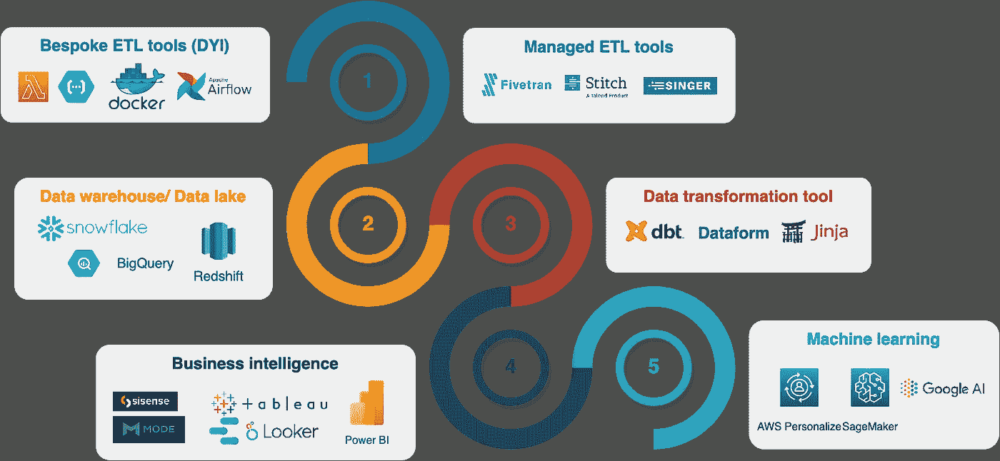
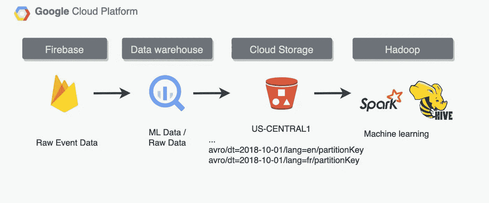

# 数据平台架构类型

> 原文：[`towardsdatascience.com/data-platform-architecture-types-f255ac6e0b7`](https://towardsdatascience.com/data-platform-architecture-types-f255ac6e0b7)

## 它在多大程度上满足你的业务需求？选择的困境。

 [💡Mike Shakhomirov](https://mshakhomirov.medium.com/?source=post_page-----f255ac6e0b7--------------------------------)

·发表于 [Towards Data Science](https://towardsdatascience.com/?source=post_page-----f255ac6e0b7--------------------------------) ·9 分钟阅读·2023 年 2 月 20 日

--

图片来源：[Brooke Lark](https://unsplash.com/@brookelark?utm_source=medium&utm_medium=referral) 在 [Unsplash](https://unsplash.com/?utm_source=medium&utm_medium=referral)

在当前市场上，数据工具琳琅满目，很容易迷失。互联网充斥着关于使用哪些数据工具和如何使我们的**数据堆栈** *在今年特别现代化*的意见故事（通常是推测性的）。*哪些数据工具是最好的？谁是领导者？如何选择合适的工具？* 这个故事是为那些在“领域”中并且正在建立世界上最佳数据平台的人准备的。

> *那么，“现代数据堆栈”是什么，它有多现代呢？*

简而言之，它是一个**工具集合**，用于处理数据。根据我们打算如何处理数据，这些工具可能包括以下内容：

- 管理的 ETL/ELT 数据管道服务

- 基于云的管理数据仓库/数据湖，作为数据的目的地

- 数据转换工具

- 商业智能或数据可视化平台

- 机器学习和数据科学能力

*有时，现代化的程度并不重要。*

> *确实，如果我们的 BI 工具非常现代，具备定制的 OLAP 数据建模和 git 集成，但无法将报告渲染到电子邮件中，这也是不重要的。*

这些小细节往往至关重要。业务需求和数据管道要求是最重要的。

在下图中，我们可以看到数据流转过程以及在数据管道的每个步骤中可以使用的一些相关工具。

数据流动和工具。图片来源：作者

> *Redshift、Postgres、Google BigQuery、Snowflake、Databricks、Hadoop、Dataproc、Spark，还是 Elastic Map Reduce？*

为你的数据平台选择哪个产品？

> *这取决于你计划用数据执行的日常* ***任务***，***数据处理和数据存储架构****，哪个最适合这些任务。*

# 数据平台架构类型

我记得几年前，互联网充斥着“Hasdoop 已死”这类的故事。数据仓库架构的趋势明显发生了变化。到 2023 年，每个人似乎都对实时数据流和可扩展性着迷，暗示 Spark 和 Kafka 很快会成为公共基准的领导者。

> *那么哪一种是最好的？谁是领导者，选择哪些数据工具？如何选择？*

我理解的是这些基准判断非常主观，应当以一种保留的态度来看待。真正重要的是这些工具与我们的业务需求对齐的程度，以便我们构建一个数据平台。

# 数据仓库

一种无服务器、分布式的 SQL 引擎（**BigQuery、Snowflake、Redshift、Microsoft Azure Synapse、Teradata**）。这是一个**以 SQL 为优先**的**数据架构**，你的数据存储在一个**数据仓库**中，你可以充分利用**去规范化星型模式**数据集的所有优势。当然，我们能做到这一点，因为大多数现代数据仓库都是分布式的，*扩展性良好*，这意味着你不需要担心表的**键和索引**。它非常适合进行与**大数据**相关的临时分析。

大多数现代数据仓库解决方案可以处理*结构化*和*非结构化*数据，如果你的用户主要是**数据分析师**且具备良好的 SQL 技能，这些解决方案确实非常方便。现代数据仓库能够轻松与业务智能解决方案如**Looker、Tableau、Sisense 或 Mode**集成，这些解决方案也大量依赖于**ANSI-SQL**。它*不设计*用于存储图像、视频或文档。然而，使用 SQL 你几乎可以做任何事情，甚至在一些供应商解决方案中训练机器学习模型。

[## 针对初学者的高级 SQL 技术](https://example.org/advanced-sql-techniques-for-beginners-211851a28488?source=post_page-----f255ac6e0b7--------------------------------)

### 在 1 到 10 的范围内，你的数据仓库技能有多好？

[towardsdatascience.com](https://example.org/advanced-sql-techniques-for-beginners-211851a28488?source=post_page-----f255ac6e0b7--------------------------------)

# 数据湖（Databricks、Dataproc、EMR）

一种架构类型是你的数据存储在云存储中，即 AWS S3、Google Cloud Storage、ABS。当然，也自然可以用于图像、视频或文档以及任何其他文件类型（JSON、CSV、PARQUET、AVRO 等），但要分析这些数据，你的用户需要编写一些*代码*。

最常用的**编程语言**是**Python**，有许多可用的库。**JAVA、Scala 或 PySpark** 也是此任务的另一种流行选择。

> *令人惊叹的好处伴随代码而来。*

这是数据处理的最高灵活性水平。我们的用户只需要知道如何做到这一点。

# 湖屋

这是数据仓库和数据湖架构的结合，兼具两者的优点，服务于程序员和普通业务用户，如数据分析师。它使业务能够运行交互式 SQL 查询，同时在定制方面保持很大的灵活性。现代数据仓库解决方案大多能够对存储在数据湖中的数据运行交互式查询，即**外部表**。例如，一个数据管道可能如下所示：

湖屋管道示例。图像来源于作者

 [## 用这个机器学习管道提升你的数据工程技能

### 数据建模、Python、DAGs、大数据文件格式、成本……它涵盖了所有内容

pub.towardsai.net](https://pub.towardsai.net/supercharge-your-data-engineering-skills-with-this-machine-learning-pipeline-b69d159780b7?source=post_page-----f255ac6e0b7--------------------------------)

# 数据网格

数据网格架构是一种去中心化的方法，使公司能够自主管理数据、进行跨团队/跨领域的数据分析并共享数据。

每个业务单元可能具有不同的编程技能组合，即**SQL 或 Python**，以及各种数据工作负载需求（灵活的数据处理与交互式 SQL 查询）。尽管如此，每个业务单元可以自由选择自己的数据仓库/数据湖解决方案，但仍能够与其他单元共享数据而无需数据移动。

 ## 数据管道设计模式

### 选择合适的架构及其示例

towardsdatascience.com

# 关系型和非关系型数据库管理系统

关系型数据库管理系统（RDS）将数据存储在一个以行作为单位的表中，列连接相关的数据元素。它旨在记录和优化以快速获取当前数据。流行的关系型数据库有**PostgreSQL, MySQL, Microsoft SQL Server 和 Oracle**。**NoSQL** 数据库不仅支持简单事务，而关系型数据库还支持复杂的事务和联接。NoSQL 数据库用于处理高速流入的数据。流行的 NoSQL 数据库有：

+   文档数据库：MongoDB 和 CouchDB

+   键值数据库：Redis 和 DynamoDB

**数据仓库**具有类似的列式结构，与 RDS 一样，它是关系型的。数据也被组织成表格、行和列。然而，它与数据库的主要不同在于数据组织和存储的方式，数据库数据按行存储，而数据仓库数据按列存储，以便进行在线分析处理（OLAP），而数据库则使用在线事务处理（OLTP）。例如，**AWS Redshift**支持数据仓库和数据湖方法，使其能够访问和分析大量数据。

数据仓库设计用于数据分析，包括大量历史数据。使用数据仓库要求用户提前创建预定义的固定模式，这大大有助于数据分析。表格必须简单（去规范化），以便计算大量数据。

**RDS 数据库表**和连接较为复杂，因为它们是**标准化的**。因此，**传统数据库**与数据仓库之间的主要区别在于，传统数据库是为*记录*数据而设计和优化的，而数据仓库是为响应*分析*而设计和优化的。当你运行一个应用程序并需要快速获取当前数据时，你会使用数据库。RDS 存储了运行应用程序所需的当前数据。

> *你需要决定哪一个适合你。*

# 商业智能堆栈

现代数据堆栈应包括帮助数据建模和可视化的 BI 工具。以下是一些高层次的概述。**当然这不是一个详尽的列表，但这些是 2023 年市场上最受欢迎的 BI 工具：**

**Looker Data Studio（Google Looker Studio）**

**主要特点：**

+   以前称为 Google Data Studio 的免费版本。这是一个出色的免费 BI 工具，具有社区支持。

+   丰富的小部件和图表

+   丰富的社区数据连接器

+   免费的电子邮件调度和投递。完美地将报告渲染到电子邮件中。

+   免费的数据治理功能

+   由于这是一个免费的社区工具，它的 API 还稍显不完善

**Looker**（付费版）

**主要特点：**

+   强大的数据建模功能和自助服务能力。适合中型和大型公司。

+   API 功能

**Tableau**

**主要特点：**

+   出色的可视化效果

+   合理的定价

+   专利 VizQL 引擎驱动其直观的分析体验

+   与许多数据源的连接，如 HADOOP、SAP 和 DB 技术，提高数据分析质量。

+   与 Slack、Salesforce 及其他众多工具的集成。

**AWS Quicksight**

**主要特点：**

+   定制品牌的电子邮件报告

+   无服务器且易于管理

+   强大的 API

+   无服务器自动扩展

+   按需付费定价

**Power BI**

**主要特点：**

+   Excel 集成

+   强大的数据摄取和连接能力

+   从 Excel 数据中轻松创建共享仪表板

+   丰富的视觉效果和图形

**Sisense**（前身为 Periscope）

Sisense 是一个端到端的数据分析平台，通过可嵌入的、可扩展的架构，使客户和员工都可以进行数据发现和分析。

**关键功能：**

+   提供几乎每个主要服务和数据源的数据连接器

+   为非技术用户提供无代码体验，尽管平台也支持 Python、R 和 SQL。

+   Git 集成和自定义数据集

+   可能会有点贵，因为它基于按许可证按用户计费的模式

+   一些功能仍在建设中，即报告电子邮件发送和报告渲染

**ThoughtSpot**

**关键功能：**

+   查询的自然语言

**Mode**

**关键功能：**

+   仪表板的 CSS 设计

+   协作功能允许在承诺高级计划之前进行快速原型制作

+   笔记本支持

+   Git 支持

**Metabase**

**关键功能：**

+   适合初学者，非常灵活

+   有 docker 镜像，因此我们可以立即运行它

+   自助分析

**Redash**

**关键功能：**

+   API

+   用自然语法编写查询并探索模式

+   使用查询结果作为数据源来连接不同的数据库

这些工具中的一些有免费版本。例如，Looker Data Studio 提供了基本的仪表板功能，如电子邮件，即拖放小部件构建器，以及良好的图表选择。其他工具则提供付费功能，即数据建模、警报、笔记本和 git 集成。

这些都是很棒的工具，各有利弊。有些工具更用户友好，有些则提供更强大的 API、CI/CD 功能和 git 集成。对于一些工具，这些功能仅在付费版本中提供。

# 结论

现代数据驱动的应用程序将需要一个数据库来存储当前的应用程序数据。所以如果你有一个应用程序要运行，请考虑 OLTP 和 RDS 架构。

数据湖、数据仓库、湖屋和数据库各有其优点，并且各司其职。

希望对历史数据执行复杂 SQL 查询的大数据分析公司可能会选择用数据仓库（或湖屋）来补充其数据库。这使得数据堆栈更灵活、更现代。

一般来说，答案总是一样的：

> *选择最便宜的或与您的开发堆栈兼容性最好的工具*

试试看，你会发现关系型数据库可以很容易地集成到数据平台中。无论是数据湖还是数据仓库，各种数据连接器将使数据提取变得简单流畅。

但是，有几个问题需要考虑。

这里的关键是尝试数据工具，看看它们能多好地与我们的业务需求对接。

> *例如，一些 BI 工具只提供按用户付费的定价方式，如果我们需要与外部用户共享仪表板，这将不太适合。*

如果有任何节省成本的好处，最好将数据工具与开发堆栈所在的同一云供应商保持一致。

我们可能需要检查工具之间是否存在功能重叠，例如，当我们已经在数据仓库中进行数据建模时，我们是否真的需要一个在其自身的 OLAP 立方体中进行数据建模的 BI 解决方案？

> *数据建模很重要*

确实，它定义了我们处理数据的频率，这将不可避免地反映在处理成本上。

向数据湖或数据仓库的转变主要取决于用户的技能水平。数据仓库解决方案将实现更多的互动，并将我们的选择范围缩小到以 SQL 为首的产品（如 Snowflake、BigQuery 等）。

数据湖适用于具有编程技能的用户，我们会选择以 Python 为首的产品，如 Databricks、Galaxy、Dataproc、EMR。

## 推荐阅读

1.  [`www.mckinsey.com/capabilities/mckinsey-digital/our-insights/how-to-build-a-data-architecture-to-drive-innovation-today-and-tomorrow`](https://www.mckinsey.com/capabilities/mckinsey-digital/our-insights/how-to-build-a-data-architecture-to-drive-innovation-today-and-tomorrow)

1.  [`aws.amazon.com/emr/`](https://aws.amazon.com/emr/)

1.  [`cloud.google.com/learn/what-is-a-data-lake`](https://cloud.google.com/learn/what-is-a-data-lake)

1.  [`medium.com/towards-data-science/data-pipeline-design-patterns-100afa4b93e3`](https://medium.com/towards-data-science/data-pipeline-design-patterns-100afa4b93e3)

1.  [`www.snowflake.com/trending/data-architecture-principles`](https://www.snowflake.com/trending/data-architecture-principles)
