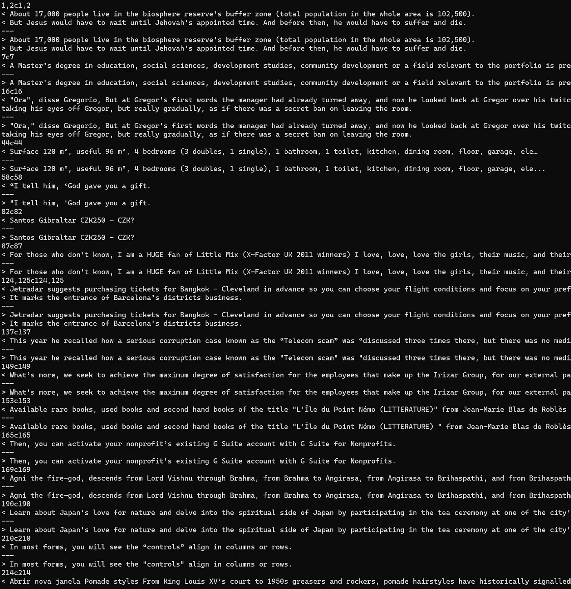

# 机器翻译的数据预处理

> 原文：[`towardsdatascience.com/data-preprocessing-for-machine-translation-fcbedef0e26a?source=collection_archive---------5-----------------------#2023-02-25`](https://towardsdatascience.com/data-preprocessing-for-machine-translation-fcbedef0e26a?source=collection_archive---------5-----------------------#2023-02-25)

## 清洗、归一化和分词

[](https://medium.com/@bnjmn_marie?source=post_page-----fcbedef0e26a--------------------------------)[](https://towardsdatascience.com/?source=post_page-----fcbedef0e26a--------------------------------) [本杰明·玛丽](https://medium.com/@bnjmn_marie?source=post_page-----fcbedef0e26a--------------------------------)

·

[关注](https://medium.com/m/signin?actionUrl=https%3A%2F%2Fmedium.com%2F_%2Fsubscribe%2Fuser%2Fad2a414578b3&operation=register&redirect=https%3A%2F%2Ftowardsdatascience.com%2Fdata-preprocessing-for-machine-translation-fcbedef0e26a&user=Benjamin+Marie&userId=ad2a414578b3&source=post_page-ad2a414578b3----fcbedef0e26a---------------------post_header-----------) 发表在 [Towards Data Science](https://towardsdatascience.com/?source=post_page-----fcbedef0e26a--------------------------------) · 14 min read · 2023 年 2 月 25 日[](https://medium.com/m/signin?actionUrl=https%3A%2F%2Fmedium.com%2F_%2Fvote%2Ftowards-data-science%2Ffcbedef0e26a&operation=register&redirect=https%3A%2F%2Ftowardsdatascience.com%2Fdata-preprocessing-for-machine-translation-fcbedef0e26a&user=Benjamin+Marie&userId=ad2a414578b3&source=-----fcbedef0e26a---------------------clap_footer-----------)

--

[](https://medium.com/m/signin?actionUrl=https%3A%2F%2Fmedium.com%2F_%2Fbookmark%2Fp%2Ffcbedef0e26a&operation=register&redirect=https%3A%2F%2Ftowardsdatascience.com%2Fdata-preprocessing-for-machine-translation-fcbedef0e26a&source=-----fcbedef0e26a---------------------bookmark_footer-----------)

图片来自 [Pixabay](https://pixabay.com/photos/coffee-pot-cup-of-coffee-filter-2139481/)。

数据预处理是任何机器学习任务中的关键步骤。数据必须是正确的、清洁的，并且符合预期的格式。

在这篇博客文章中，我解释了预处理用于训练、验证和评估机器翻译系统的数据所需的所有步骤。

我通过示例和代码片段解释每一步预处理步骤，以便你可以自行重现。

在本文的预处理示例中，我使用了西班牙语-英语（Es→En）[ParaCrawl v9](https://paracrawl.eu/)语料库的前 100,000 个段落（CC0）。我直接提供了[这个数据集](https://benjaminmarie.com/data/paracrawl100k.en-es.zip)（大小：9Mb）。

如果你想自己制作这个语料库，请按照这些步骤操作（耐心点，原始数据集已压缩，但仍重达 24Gb）：

```py
#Download the corpus
wget https://opus.nlpl.eu/download.php?f=ParaCrawl/v9/moses/en-es.txt.zip
#Uncompress it
unzip en-es.txt.zip
#Keep only the first 100,000 lines
head -n 100000 ParaCrawlV9.es.txt > train.es
head -n 100000 ParaCrawlV9.en.txt > train.en
#Discard the original files
rm en-es.txt.zip
```

在我之前的文章中，我介绍了用于训练、验证和评估的机器翻译数据集的所有主要特征：

[](/datasets-to-train-validate-and-evaluate-machine-translation-d61905d126aa?source=post_page-----fcbedef0e26a--------------------------------) ## 训练、验证和评估机器翻译的数据集

### 选择、检查和拆分

[towardsdatascience.com

# 数据格式：TXT、TSV 和 TMX

在寻找机器翻译数据集时，你通常会发现它们以不同的格式出现，这些格式试图最好地处理其多语言性质。

无论原始格式是什么，大多数用于训练机器翻译系统的框架只接受原始文本格式的数据。

因此，如果数据集不是文本文件，你可能需要对其进行转换。

你可能会发现的最常见格式有：

+   平行文本（.txt）：这是理想的格式。我们不需要进行任何转换。源语言段落在一个文本文件中，目标语言段落在另一个文本文件中。大多数接下来的预处理步骤将并行应用于这两个文件。在介绍部分，我们下载了这种格式的 ParaCrawl 数据。

+   制表符分隔值（.tsv）：这是一个单文件，每对源语言和目标语言段落在同一行中由制表符分隔。用“cut”命令将其转换为文本文件是直接的：

```py
#The source segments
cut -f1 data.tsv > train.es
#The target segments
cut -f2 data.tsv > train.en
```

+   翻译记忆交换（.tmx）：这是一种 XML 格式，专业翻译人员经常使用。这是一种非常详细的格式。这就是为什么它很少用于大型语料库。处理 TMX 稍微困难一些。我们可以先去除 XML 标签。为此，我使用了来自 Moses 项目的[脚本](https://github.com/moses-smt/mosesdecoder/blob/master/scripts/generic/strip-xml.perl)（LGPL 许可）：

```py
strip-xml.perl < data.tmx > data.txt
#Then we have to remove the empty lines:
sed -i '/^$/d' data.txt
#Finally, we have to separate source and target segments into two files. We can use "sed" to do this:
sed -n 'n;p' data.txt > train.en
sed -n 'p;n' data.txt > train.es
```

# 不要修改评估数据集的目标端

在深入之前，预处理机器翻译数据集时有一个非常重要的规则：

**绝不要对评估数据的目标端进行预处理！**

这些被称为“参考翻译”。由于它们是“参考”，我们不应对它们进行修改。

这样做有几个原因。其中最主要的原因是**评估数据的目标端应该与您希望系统生成的数据相似。**

例如，在某些预处理步骤中，我们将移除空行并对段落进行分词。

你可能希望系统返回空行，例如在翻译空文本时，当然你不希望返回标记化文本作为机器翻译系统的最终输出。

如果你从参考中删除空行，你将无法直接评估系统在需要时生成空行的能力。而如果你对参考进行标记化，你只能知道系统生成标记化文本的效果。如我们将看到的，标记化文本不是你希望系统生成的内容。

此外，参考翻译用于计算自动度量分数以评估机器翻译质量。如果我们修改这些翻译，就会修改分数。这样，分数将不再与其他已发布的参考翻译分数可比，因为我们修改了这些参考。

因此，保留原始参考翻译对于确保**可重复性和可比性**至关重要。

如果在预处理的某个点，评估数据的目标端与原始数据不同，说明出现了问题。

# 步骤 1：清理和过滤

**步骤适用于：**训练和验证数据的源端和目标端。

出于各种原因，公开的平行数据可能需要一些清理。

如果数据是从网络上抓取的文本自动创建的，这一点尤其正确。

清理通常意味着从平行数据中删除以下段落（或句子）：

+   **空白**或大多包含**不可打印字符**。

+   带有**无效 UTF8**，即未正确编码的。

+   包含**极长的标记**（或“单词”），因为它们通常无法翻译，例如 DNA 序列、数字序列、无意义的内容等。

+   有时，**重复**，即如果一个段或一对段在平行数据中出现多于一次，我们只保留一个实例。

这不是必需的，但我通常会删除训练平行数据中的段对重复项，原因有多个：

+   它们在训练中很少有用。

+   它们在训练数据中对某个特定翻译赋予更多权重，且没有充分理由。

+   它们通常是获取数据过程中出现的缺陷产品（例如爬取），换句话说，这些重复本不应该存在。

所有这些过滤规则的应用是为了只保留对训练神经模型有用的内容。它也删除了可能在后续预处理步骤中引发错误的段落。

它们也略微减少了平行数据的大小。

请记住，我们在清理/过滤**平行数据**。每条过滤规则应同时应用于数据的两侧。例如，如果源段为空且应删除，则目标段也应删除，以保持数据的平行性。

除了我上面提到的规则外，我们还应该过滤掉包含以下内容的片段对：

+   **非常长**的片段

+   **非常短**的片段

+   **高繁殖率**，即当一个片段比其对应的片段出现得不成比例地更长或更短时

这些规则继承自统计机器翻译时代，在那个时代，这些片段显著增加了计算成本，而对于训练翻译模型没有用处。

由于今天使用的神经算法进行训练，这些规则已经不再必要。然而，这些片段在训练翻译模型时仍大多无用，因此可以安全地从训练数据中移除，以进一步减少其大小。

有许多公共工具可以执行此清理操作。

[*预处理*](https://github.com/kpu/preprocess)（[LGPL](https://github.com/kpu/preprocess/blob/master/LICENSE) 许可）是一个高效的框架，可以执行许多过滤操作。它被[机器翻译研讨会](http://www2.statmt.org/wmt23/)用于准备主要国际机器翻译竞赛的数据。

我通常会用自制脚本和额外的框架来补充，比如[Moses 脚本](https://github.com/moses-smt/mosesdecoder/tree/master/scripts)（[LGPL](https://github.com/moses-smt/mosesdecoder/blob/master/COPYING) 许可）。

在接下来的段落中，我将逐步描述我通常应用于原始平行数据的整个清理和过滤过程。

## 实践

我们希望清理我们的 Paracrawl 西班牙语-英语平行数据（见本文介绍部分）。

在内存方面，最昂贵的步骤之一是删除重复项（即“去重”）。在去重之前，我们应该尽可能地移除更多的片段对。

我们可以通过应用[clean-n-corpus.perl](https://github.com/moses-smt/mosesdecoder/blob/master/scripts/training/clean-corpus-n.perl)来开始（这个脚本不需要安装 Moses），如下所示：*注意：此步骤假设源语言和目标语言中都存在空格。如果其中一种语言（大多）不使用空格，如日语或中文，你必须首先对源文本和目标文本文件进行分词。如果适用于你的用例，直接跳到“步骤 2 和 3”，然后在完成后再回来这里。*

要了解如何使用 clean-n-corpus.perl，调用脚本而不带任何参数。它应返回：

```py
syntax: clean-corpus-n.perl [-ratio n] corpus l1 l2 clean-corpus min max [lines retained file]
```

参数如下：

+   *比例*：这是繁殖率。默认情况下，它设置为 9。我们通常不需要修改它，因此不使用此参数。

+   *语料库*：这是清理数据集的路径，不包含扩展名。脚本假设你将源文件和目标文件命名为相同，使用语言 ISO 代码作为扩展名，例如，在我们的例子中是 train.es 和 train.en。如果你采用了我为 ParaCrawl 使用的相同文件名约定，你只需在那里输入：“train”（假设你在包含数据的目录中）。

+   *l1*: 其中一个平行文件的扩展名，例如“es”。

+   *l2*: 其他平行文件的扩展名，例如“en”。

+   *clean-corpus*: 清理后的文件名。例如，如果输入“train.clean”，脚本将把过滤后的平行数据保存到“train.clean.es”和“train.clean.en”。

+   *min*: 应丢弃的段落的最小标记数。

+   *max*: 应丢弃的段落的最大标记数。

+   *max-word-length*（此处未显示）：一个标记中的最大字符数。如果一个段落对包含的标记长度超过 max-word-length，则会被移除。

要清理我们的 ParaCrawl 语料库，运行的完整命令是：

```py
clean-corpus-n.perl -max-word-length 50 train es en train.clean 0 150
```

这个命令从 train.es 和 train.en 中移除带有以下条件的段落：

+   空段落

+   超过 150 个单词（或标记）的段落

+   高度的繁殖力

+   单词（或标记）包含超过 50 个字符的段落

并将结果保存到“train.clean.es”和“train.clean.en”。

脚本会显示移除的段落数量。如果你做的和我一样，数据中应该剩下 99976 个段落：

```py
clean-corpus.perl: processing train.es & .en to train.clean, cutoff 0–150, ratio 9
……….(100000)
Input sentences: 100000 Output sentences: 99976
```

注意，每次移除一个段落时，其平行段落也会被移除。train.clean.es 和 train.clean.en 应该有相同数量的行。你可以用以下命令检查：

```py
wc -l train.clean.es train.clean.en
```

接下来，我们用 *preprocess* 移除段落：

我们需要先编译它（需要 cmake）：

```py
git clone https://github.com/kpu/preprocess.git
cd preprocess
mkdir build
cd build
cmake ..
make -j4
```

然后，我们可以使用 *preprocess* 来移除包含以下内容的行：

+   无效的 UTF-8

+   控制字符（除了制表符和换行符）

+   过多的常见和继承的 Unicode 脚本字符（如数字）

+   标点符号过多或过少

+   期望脚本中的内容过少（例如移除英文数据中的中文句子）

我们使用“simple_cleaning”二进制文件来处理平行数据：

```py
preprocess/build/bin/simple_cleaning -p train.clean.es train.clean.en train.clean.pp.es train.clean.pp.en
```

过滤后的数据保存在两个新文件中，我将其命名为“train.clean.pp.es”和“train.clean.pp.en”。

并且应该打印：

```py
Kept 85127 / 99976 = 0.851474
```

最后，我们可以用“dedupe”来去除重复项：

```py
preprocess/build/bin/dedupe -p train.clean.pp.es train.clean.pp.en train.clean.pp.dedup.es train.clean.pp.dedup.en
```

并且应该打印：

```py
Kept 84838 / 85127 = 0.996605
```

我们已经完成了数据清理。

我们几乎移除了 15%的段落。这意味着神经机器翻译的每个训练周期将快 15%（大约）。

# 第 2 步：标准化

**适用步骤**：所有数据集的源侧，可能还包括训练和验证数据集的目标侧。

标准化的目标是确保在所有数据集中使用相同的符号，如标点符号、数字和空格，并且具有相同的 UTF8 编码。

实际上，这一步也可以**减少词汇量**（不同标记类型的数量），通过将具有类似作用或意义的符号映射到相同的符号。

例如，这一步可以将这些不同的引号标准化为相同的引号，如下所示：

+   ‘ **→** “

+   **« → “**

+   《 **→ “**

此步骤还可以确保您的系统不会生成具有不同标点风格的翻译，如果你将其应用于训练数据的目标侧。

当然，如果我们还规范化训练数据的目标侧，我们必须确保映射到所需的字符。

例如，如果你偏好使用“《”，因为你的目标语言使用这种类型的引号标记，那么你应该做不同的映射，如下所示：

+   ‘ **→**《

+   **« →**《

+   **“ →**《

由于在准备机器翻译数据时通常会执行此步骤，因此有多种工具可以完成它。

我使用了[sacremoses](https://github.com/alvations/sacremoses)（MIT 许可）。它是[Moses 项目](https://github.com/moses-smt/mosesdecoder/blob/master/scripts/tokenizer/normalize-punctuation.perl)的[normalize-punctuation.perl](https://github.com/moses-smt/mosesdecoder/blob/master/scripts/tokenizer/normalize-punctuation.perl)的 Python 实现。

## 实践

sacremoses [规范化工具](https://github.com/alvations/sacremoses/blob/master/sacremoses/normalize.py) 映射了来自多种语言的几十种符号。这些规则可以轻松编辑，以更好地符合你的期望。

sacremoses 可以通过 pip 安装（需要 Python 3）：

```py
pip install sacremoses
```

然后你可以使用 CLI 来规范化数据：

```py
sacremoses normalize < train.clean.pp.dedup.es > train.clean.pp.dedup.norm.es
sacremoses normalize < train.clean.pp.dedup.en > train.clean.pp.dedup.norm.en
```

差异示例（使用命令“diff”获得）：*注意：我选择截图而不是复制粘贴这些句子，因为博客编辑器会自动应用其自身的规范化规则。*



ParaCrawl V9 (CC0) 的句子在规范化前后的对比。截图由作者提供。

你可以为此命令传递多个选项，例如，如果你想规范化数字，可以添加选项“-n”。要查看所有选项，请运行：

```py
sacremoses normalize –help
```

# 第三步：分词

**适用步骤**：所有数据集的源侧，以及训练和验证数据集的目标侧。

传统上，机器翻译的数据集使用基于规则的分词器进行分词。它们通常仅使用空格来分隔词元，并附加规则来处理特殊情况。

让我们以以下英文句子为例：

```py
However, if you deactivate the cookies, you may not be able to access the full range of functions on this website.
Thirty-four retreatants gathered for a Memorial Day weekend of inspiring teachings by Ven.
Facebook: Brisbane City Council - Personal Safety
Tráiler de "The Imaginarium of Doctor Parnassus"
Smoke safety pressure gauge - UNICAL: 04953D
You can also book a holiday rental directly with the property owner or manager.
```

使用 sacremoses 分词器进行分词后，我们得到：

```py
However , if you deactivate the cookies , you may not be able to access the full range of functions on this website .
Thirty-four retreatants gathered for a Memorial Day weekend of inspiring teachings by Ven .
Facebook : Brisbane City Council - Personal Safety
Tráiler de &quot; The Imaginarium of Doctor Parnassus &quot;
Smoke safety pressure gauge - UNICAL : 04953D
You can also book a holiday rental directly with the property owner or manager .
```

分词前后的差异很难察觉。如果你看不到它们，可以注意标点符号附近的空格。

出于几个原因，这些**基于规则的分词器对神经机器翻译并不实用**。例如，它们生成了**过多的稀有词元**，这些词元无法被神经模型正确建模。

数据必须“子分词”。例如，传统分词器生成的词元被拆分为更小的词元。这就是[字节对编码方法 (BPE)](https://aclanthology.org/P16-1162.pdf)的作用。

更简单的是，[SentencePiece 方法](https://aclanthology.org/D18-2012.pdf) 甚至不需要传统的分词。因此，我们少了一个工具（传统分词器），从而减少了预处理中的潜在错误/问题来源。

SentencePiece 可以直接应用于**任何字符序列**。这对于像日语、中文和泰语这样空格稀少的语言尤其实用。

实际上，SentencePiece 目前是大语言模型（如[T5](https://arxiv.org/abs/1910.10683) 或 [FLAN](https://arxiv.org/pdf/2109.01652.pdf) 系列）中最常用的标记化算法之一。

让我们通过使用相同的英文句子来看一下它是如何工作的。我们将获得：

```py
▁However , ▁if ▁you ▁de ac tiva te ▁the ▁cookies , ▁you ▁may ▁not ▁be ▁able ▁to ▁access ▁the ▁full ▁range ▁of ▁function s ▁on ▁this ▁website .
▁Th ir ty - fo ur ▁re tre at ants ▁gather ed ▁for ▁a ▁Me mor ial ▁Day ▁weekend ▁of ▁in spi ring ▁te ach ing s ▁by ▁Ven .
▁Facebook : ▁B ris ban e ▁City ▁Council ▁- ▁Personal ▁Safety
▁T rá il er ▁de ▁" The ▁I ma gin ar ium ▁of ▁Do ctor ▁Par nas s us "
▁S mo ke ▁safety ▁pressure ▁ga u ge ▁- ▁UN ICA L : ▁ 04 95 3 D
▁You ▁can ▁also ▁book ▁a ▁holiday ▁rental ▁directly ▁with ▁the ▁property ▁owner ▁or ▁manage r .
```

这些句子对人类来说更难阅读，标记化也不直观。然而，对于神经模型，这种方法效果很好。

为了获得这个结果，你首先需要训练一个 SentencePiece 模型。然后使用该模型对数据进行标记化，以及对所有将发送到我们的机器翻译系统的新输入进行标记化。

## 实践

要训练这个模型，我们首先需要通过以下方式安装[SentencePiece](https://github.com/google/sentencepiece)：

```py
pip install sentencepiece
```

然后，将并行数据的源侧和目标侧合并到一个单独的文本文件中。这将允许我们训练**一个双语标记化模型**，而不是为源语言和目标语言训练不同的模型。

```py
cat train.clean.pp.dedup.norm.es train.clean.pp.dedup.norm.en > train.clean.pp.dedup.norm.es-en
```

在进入训练之前，我们必须决定词汇表的大小。

这个选择是一个困难但重要的决策。我们通常使用一个经验法则：**8,000 到 16,000 之间的值适用于大多数用例**。如果你有非常大的并行数据，可以选择更高的值；如果你的训练数据较小，例如少于 100,000 个片段对，则可以选择较低的值。

原因是如果你设置的词汇表大小过高，你的词汇表将包含更稀有的标记。如果你的训练并行数据中没有足够这些标记的实例，它们的嵌入会被估计得很差。

相反，如果你将值设置得过低，神经模型将不得不处理更小的标记，这些标记需要在其嵌入中携带更多信息。在这种情况下，模型可能难以生成良好的翻译。

由于我们的并行数据量较小，我随意选择了 8,000 作为词汇表的大小。

要开始训练：

```py
spm_train -input=train.clean.pp.dedup.norm.es-en -model_prefix=es-en.8kspm -vocab_size=8000
```

这应该很快（少于 2 分钟）。

参数如下：

+   *input*：用于训练 SentencePiece 模型的数据。

+   *model_prefix*：SentencePiece 模型的名称。

+   *vocab_size*：词汇表的大小。

然后，你必须将模型应用于**所有数据，除了测试集的目标侧**（记住：我们从不接触这一部分）。

对于我们的 ParaCrawl 语料库，我们做：

```py
spm_encode -model=es-en.8kspm.model < train.clean.pp.dedup.norm.es > train.clean.pp.dedup.norm.spm8k.es
spm_encode -model=es-en.8kspm.model < train.clean.pp.dedup.norm.en > train.clean.pp.dedup.norm.spm8k.en
```

就这样！我们的数据集都已预处理完毕。我们现在可以开始训练机器翻译系统了。

# **可选步骤：truecasing 和打乱**

还有两个步骤，你可能会在一些机器翻译的预处理管道中看到：truecasing 和打乱。

Truecasing 正在被淘汰，但可能会略微提高翻译质量。这个预处理步骤将仅因其在句子中的位置而大写的字符转换为小写。

例如：

```py
He will go to Canada and I will go to England.
I am not sure why.
```

以 truecased 形式表示：

```py
he will go to Canada and I will go to England.
I am not sure why.
```

“He”中的“h”被小写化，因为它只因在句中的位置而被大写。这是唯一的区别。

这一步骤略微减少了词汇表的大小。

sacremoses 实现了 truecasing。

至于打乱段落对，它可能已经集成在你用来训练机器翻译系统的框架中。

训练数据通常会在每个训练周期自动重新打乱。

# 结论

过滤和归一化是可以显著降低训练神经机器翻译计算成本的步骤。

这些步骤也可能提高翻译质量，特别是当训练数据非常嘈杂时。

我在本文中建议的过滤和归一化规则并不适用于所有用例。它们对于大多数语言对都能很好地工作，但你可能需要根据你的语言进行调整，例如，当处理日语等亚洲语言时，你可能需要更改大多数归一化规则，以避免在日语文本中生成英文标点符号。

分词尤为关键。幸运的是，这也是最直接的步骤。大多数机器翻译的预处理管道对分词的处理是一样的，只是超参数不同。

在下一篇文章中，我将解释你需要知道的一切，以使用你刚刚预处理的数据来训练机器翻译系统：框架、神经网络结构和超参数。

我所有的文章都发布在《The Kaitchup》这本通讯中。订阅以接收每周的新闻、技巧和教程，以便在你的计算机上运行大型语言模型和机器翻译系统。

[## The Kaitchup - AI on a Budget | Benjamin Marie, PhD | Substack](https://kaitchup.substack.com/?source=post_page-----fcbedef0e26a--------------------------------)

### 订阅每周的 AI 新闻、技巧和有关微调、运行和服务大型语言模型的教程……

[kaitchup.substack.com](https://kaitchup.substack.com/?source=post_page-----fcbedef0e26a--------------------------------)
