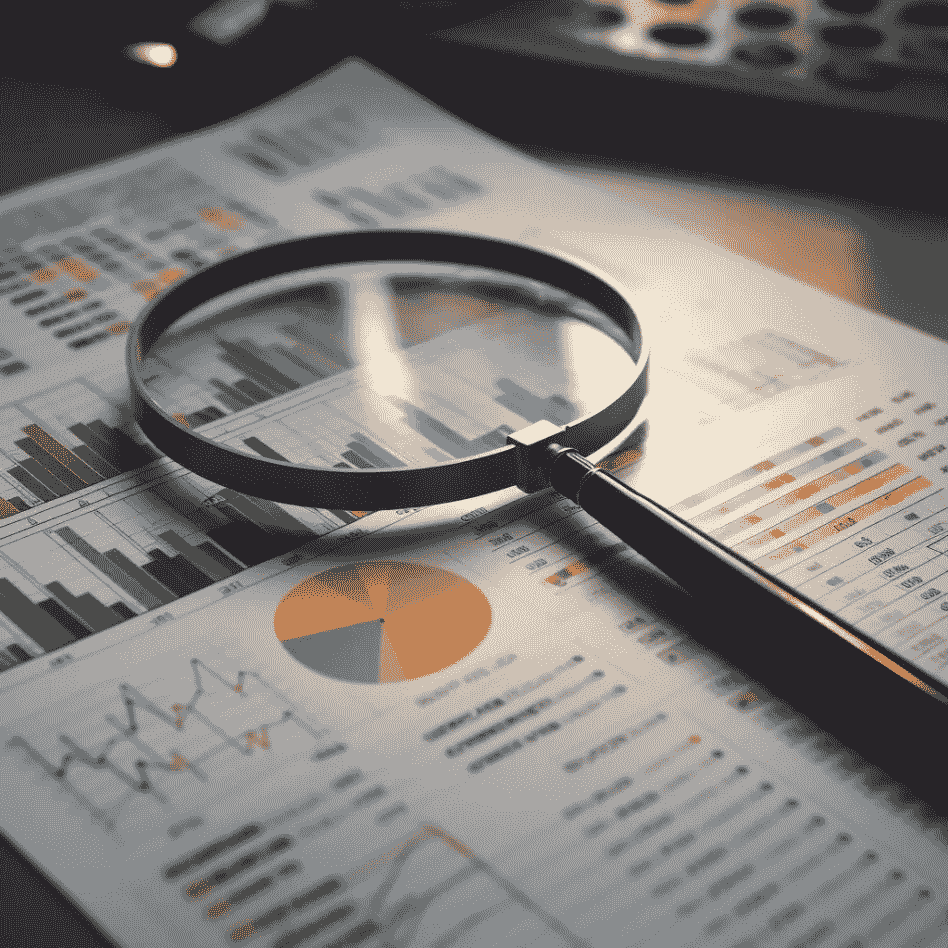

# 实用数据质量审计：综合指南

> 原文：[`towardsdatascience.com/data-quality-auditing-a-comprehensive-guide-66b7bfe2aa1a?source=collection_archive---------6-----------------------#2023-05-01`](https://towardsdatascience.com/data-quality-auditing-a-comprehensive-guide-66b7bfe2aa1a?source=collection_archive---------6-----------------------#2023-05-01)

## 探索如何利用 Python 生态系统进行数据质量审计

 [Mohamed A. Warsame](https://warsamewords.medium.com/?source=post_page-----66b7bfe2aa1a--------------------------------)

·

[关注](https://medium.com/m/signin?actionUrl=https%3A%2F%2Fmedium.com%2F_%2Fsubscribe%2Fuser%2Ff6e939f8161&operation=register&redirect=https%3A%2F%2Ftowardsdatascience.com%2Fdata-quality-auditing-a-comprehensive-guide-66b7bfe2aa1a&user=Mohamed+A.+Warsame&userId=f6e939f8161&source=post_page-f6e939f8161----66b7bfe2aa1a---------------------post_header-----------) 发表在 [Towards Data Science](https://towardsdatascience.com/?source=post_page-----66b7bfe2aa1a--------------------------------) · 8 分钟阅读 · 2023 年 5 月 1 日 

--

图片由作者提供。

> 你无法管理你无法测量的东西 — 彼得·德鲁克

# 引言

数据质量审计是我们在快速发展的、人工智能驱动的世界中不可或缺的技能。就像原油需要提炼一样，数据也需要清理和处理才能发挥作用。老话说的“*垃圾进，垃圾出*”在今天依然适用，就如同计算机早期一样。

在这篇文章中，我们将探讨 Python 如何帮助我们确保数据集符合成功项目的质量标准。我们将深入研究 Python 库、代码片段和示例，供你在自己的工作流程中使用。

## **目录**：

1.  理解数据质量及其维度

1.  使用 Pydantic 和 pandas_dq 验证数据

1.  比较 Pydantic 和 pandas_dq

1.  探索准确性与一致性

1.  使用 pandas_dq 进行数据质量审计

1.  结论

# 数据质量审计
