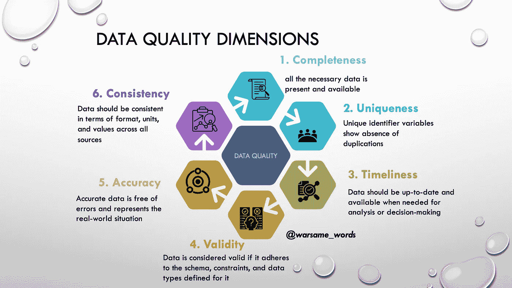
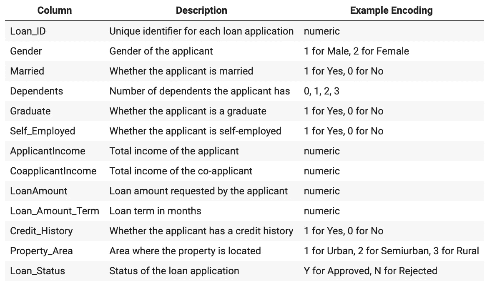
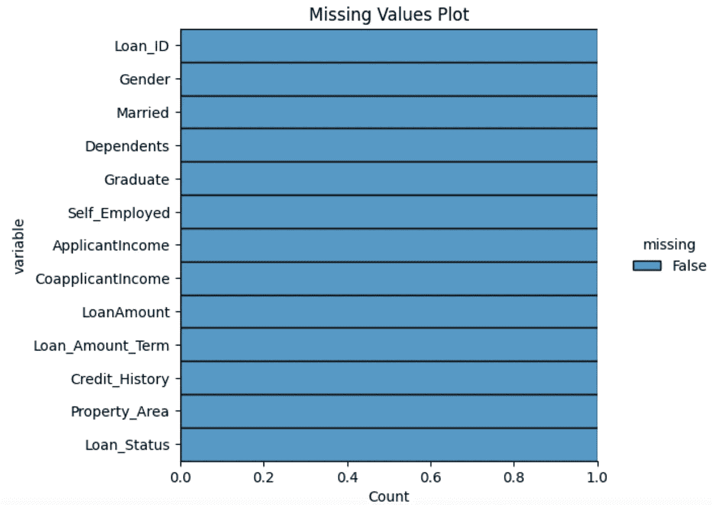
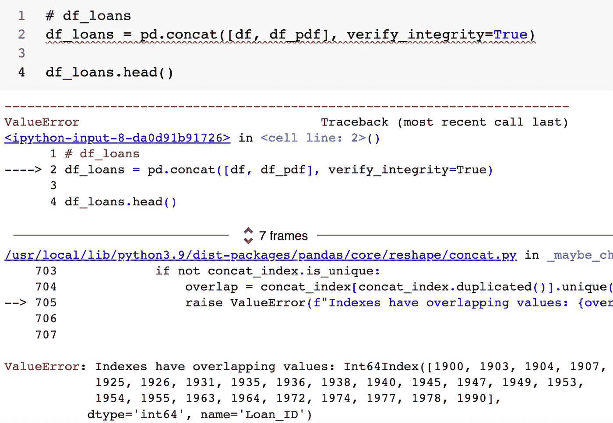
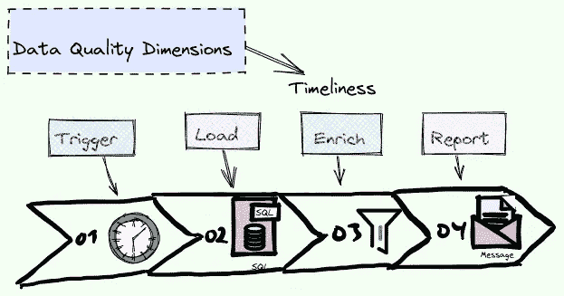
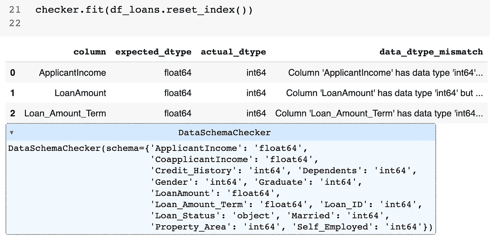
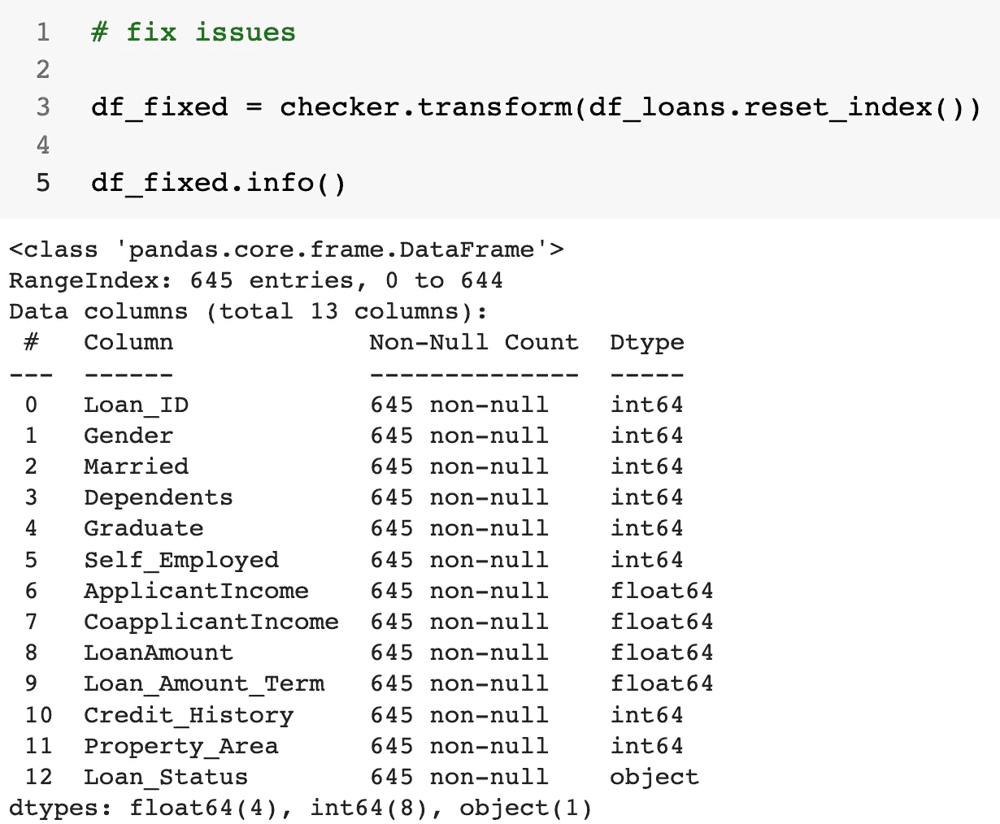
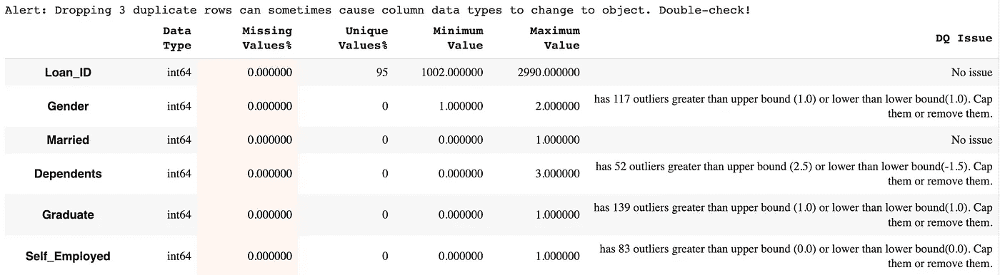

# 实用数据质量审计：综合指南

> 原文：[`towardsdatascience.com/data-quality-auditing-a-comprehensive-guide-66b7bfe2aa1a`](https://towardsdatascience.com/data-quality-auditing-a-comprehensive-guide-66b7bfe2aa1a)

## 探索如何利用 Python 生态系统进行数据质量审计

[](https://warsamewords.medium.com/?source=post_page-----66b7bfe2aa1a--------------------------------)[](https://towardsdatascience.com/?source=post_page-----66b7bfe2aa1a--------------------------------) [Mohamed A. Warsame](https://warsamewords.medium.com/?source=post_page-----66b7bfe2aa1a--------------------------------)

·发布于 [Towards Data Science](https://towardsdatascience.com/?source=post_page-----66b7bfe2aa1a--------------------------------) ·阅读时间 8 分钟·2023 年 5 月 1 日

--


图像作者提供。

> 你无法管理你无法测量的东西 —— 彼得·德鲁克

# 介绍

数据质量审计是在我们快速发展的、人工智能赋能的世界中不可或缺的技能。正如原油需要精炼，数据也需要清理和处理才能发挥作用。古老的格言“*垃圾进，垃圾出*”在今天仍然与计算机早期时代一样相关。

在本文中，我们将探讨 Python 如何帮助我们确保数据集符合成功项目的质量标准。我们将深入探讨 Python 库、代码片段和示例，供你在自己的工作流程中使用。

## **目录**：

1.  理解数据质量及其维度

1.  使用 Pydantic 和 pandas_dq 验证数据

1.  比较 Pydantic 和 pandas_dq

1.  探索准确性和一致性

1.  使用 pandas_dq 进行数据质量审计

1.  结论

# 数据质量审计

在深入探讨工具和技术之前，让我们首先回顾数据质量的概念。根据广泛接受的行业定义，数据质量指的是数据集在准确性、完整性、时效性、有效性、唯一标识属性以及一致性方面的程度。



数据质量维度。图像作者提供。

## 完整性

数据质量的完整性涵盖了**完成特定目标所需的所有关键数据**元素。例如，针对营销目的的客户数据库，如果缺少某些客户的电话或电子邮件等关键信息，则被视为不完整。

为确保数据的完整性，组织可以使用数据分析技术。

> *数据分析是系统地检查和评估数据集，以发现模式、不一致性和异常。*

通过仔细审查数据，可以识别出差距、特异性或缺失值，从而采取纠正措施，例如获取缺失的信息或实施强健的数据验证流程。结果是一个更可靠、更完整和更具可操作性的数据集，能够支持更好的决策制定、优化的营销工作，并最终推动业务成功。

但在进行全面的数据分析之前，**任何数据质量审核的第一步**都是审查数据字典：一个简明的描述性参考，定义数据集中数据元素的结构、属性和关系，作为理解和解释数据含义及目的的指南。



数据字典示例。图片由作者提供。

在手中拥有全面的审查或创建的数据字典后，当你利用如 Sweetviz、Missingno 或 Pandas_DQ 等低代码库的强大功能时，评估完整性变得轻而易举。

```py
import missingno as msno
import sweetviz as sv
from pandas_dq import dq_report

# completeness check
msno.matrix(df)

# data profiling
Report = sv.analyze(df)

Report.show_notebook()
```

就个人而言，我倾向于使用 Pandas-Matplotlib-Seaborn 组合，因为它提供了我对输出的完全控制。这使我可以制作出引人入胜且视觉上吸引人的分析。

```py
# check for missing values
import seaborn as sns
import matplotlib.pyplot as plt

def plot_missing_values(df: pd.DataFrame, 
                        title="Missing Values Plot"):
    plt.figure(figsize=(10, 6))

    sns.displot(
        data=df.isna().melt(value_name="missing"),
        y="variable",
        hue="missing",
        multiple="fill",
        aspect=1.25
    )
    plt.title(title)
    plt.show()

plot_missing_values(df)
```



缺失值图。图片由作者提供。

## 唯一性

唯一性是一个**数据质量维度**，**强调在具有唯一性约束的列中不存在重复**数据。每条记录应代表一个唯一的实体，没有冗余。例如，用户列表应为每个注册用户提供唯一的 ID；多个具有相同 ID 的记录表示缺乏唯一性。

在下面的示例中，我模拟了合并两个结构相同的数据集的数据集成步骤。如果唯一性被违反，Pandas concat 函数的参数 `verify_integrity` 将抛出错误：

```py
# verify integrity check
df_loans = pd.concat([df, df_pdf], verify_integrity=True)

# check duplicated ids
df_loans[df_loans.duplicated(keep=False)].sort_index()
```



唯一性违反。图片由作者提供。

理想情况下，你应将检查重复的存在作为数据质量审核的一部分。

```py
def check_duplicates(df, col):
    '''
    Check how many duplicates are in col.
    '''
    # first step set index
    df_check = df.set_index(col)
    count = df_check.index.duplicated().sum()
    del df_check
    print("There are {} duplicates in {}".format(count, col))
```

## 时效性

时效性是**数据质量的一个方面，关注数据的可用性和频率**。最新和随时可用的数据对准确的分析和决策至关重要。例如，及时的销售报告应包含尽可能最新的数据，而不仅仅是几个月前的数据。到目前为止我们用于示例的数据集没有时间维度，因此我们无法更深入地探索频率。



时效性示例。图片由作者提供。

## 有效性

当我们过渡到有效性的概念时，应该认识到其在确保数据遵守既定规则、格式和标准方面的作用。有效性保证数据符合为数据集指定的模式、约束和数据类型。我们可以使用强大的 Python 库 Pydantic 来实现这一点：

```py
# data validation on the data dictionary
from pydantic import BaseModel, Field, conint, condecimal, constr

class LoanApplication(BaseModel):
    Loan_ID: int
    Gender: conint(ge=1, le=2)
    Married: conint(ge=0, le=1)
    Dependents: conint(ge=0, le=3)
    Graduate: conint(ge=0, le=1)
    Self_Employed: conint(ge=0, le=1)
    ApplicantIncome: condecimal(ge=0)
    CoapplicantIncome: condecimal(ge=0)
    LoanAmount: condecimal(ge=0)
    Loan_Amount_Term: condecimal(ge=0)
    Credit_History: conint(ge=0, le=1)
    Property_Area: conint(ge=1, le=3)
    Loan_Status: constr(regex="^[YN]$")

# Sample loan application data
loan_application_data = {
    "Loan_ID": 123456,
    "Gender": 1,
    "Married": 1,
    "Dependents": 2,
    "Graduate": 1,
    "Self_Employed": 0,
    "ApplicantIncome": 5000,
    "CoapplicantIncome": 2000,
    "LoanAmount": 100000,
    "Loan_Amount_Term": 360,
    "Credit_History": 1,
    "Property_Area": 2,
    "Loan_Status": "Y"
}

# Validate the data using the LoanApplication Pydantic model
loan_application = LoanApplication(**loan_application_data)
```

一旦用示例测试过后，我们可以通过验证检查运行整个数据集，如果成功，应该会打印“没有数据验证问题”：

```py
# data validation on the data dictionary
from pydantic import ValidationError
from typing import List

# Function to validate DataFrame and return a list of failed LoanApplication objects
def validate_loan_applications(df: pd.DataFrame) -> List[LoanApplication]:
    failed_applications = []

    for index, row in df.iterrows():
        row_dict = row.to_dict()

        try:
            loan_application = LoanApplication(**row_dict)
        except ValidationError as e:
            print(f"Validation failed for row {index}: {e}")
            failed_applications.append(row_dict)

    return failed_applications

# Validate the entire DataFrame
failed_applications = validate_loan_applications(df_loans.reset_index())

# Print the failed loan applications or "No data quality issues" 
if not failed_applications:
    print("No data validation issues")
else:
    for application in failed_applications:
        print(f"Failed application: {application}")
```

我们可以用 **pandas_dq** 完成相同的操作，代码量要少得多：

```py
from pandas_dq import DataSchemaChecker

schema = {
    'Loan_ID': 'int64',
    'Gender': 'int64',
    'Married': 'int64',
    'Dependents': 'int64',
    'Graduate': 'int64',
    'Self_Employed': 'int64',
    'ApplicantIncome': 'float64',
    'CoapplicantIncome': 'float64',
    'LoanAmount': 'float64',
    'Loan_Amount_Term': 'float64',
    'Credit_History': 'int64',
    'Property_Area': 'int64',
    'Loan_Status': 'object'
}

checker = DataSchemaChecker(schema)

checker.fit(df_loans.reset_index())
```

这返回了一个易于阅读的 Pandas dataframe 风格的报告，详细说明了遇到的任何验证问题。我提供了一个不正确的 schema，其中 `int64` 变量被报告为 `float64` 变量。该库已正确识别这些：



DataSchemaChecker 输出。图片由作者提供。

数据类型不匹配通过使用从 `DataSchemaChecker` 类创建的检查器对象的一行代码得到纠正：

```py
# fix issues
df_fixed = checker.transform(df_loans.reset_index())
```



DataSchemaChecker 转换输出。图片由作者提供。

## Pydantic 还是 pandas_dq？

Pydantic 和 pandas_dq 之间有一些差异：

1.  **声明式语法**：可以说，Pydantic 允许你使用更简洁和易读的语法定义数据 schema 和验证规则。这可以使理解和维护代码变得更容易。我发现能够定义可能值的范围而不仅仅是数据类型非常有帮助。

1.  **内置验证函数**：Pydantic 提供了各种强大的内置验证函数，如 `conint`、`condecimal` 和 `constr`，这些函数允许你对数据施加约束，而无需编写自定义验证函数。

1.  **全面的错误处理**：使用 Pydantic 时，如果输入数据不符合定义的 schema，它会抛出一个 `ValidationError`，并提供关于错误的详细信息。这可以帮助你轻松识别数据问题并采取必要的措施。

1.  **序列化和反序列化**：Pydantic 自动处理数据的序列化和反序列化，使得处理不同的数据格式（如 JSON）及其之间的转换变得非常方便。

总之，Pydantic 提供了比 pandas_dq 的 `DataSchemaChecker` 类更简洁、更具功能丰富性且用户友好的数据验证方法。

Pydantic 可能是生产环境中验证数据 schema 的更好选择。但如果你只是想快速启动一个原型，可能会更喜欢 `DataSchemaChecker` 的低代码特性。

## 准确性与一致性

还有两个数据质量维度我们尚未探讨：

+   **准确性** 是一个数据质量维度，涉及数据的正确性，确保它能无误地表示现实世界的情况。例如，一个准确的客户数据库应该包含所有客户的正确和最新地址。

+   **一致性** **涉及数据在不同来源或数据集中的统一性**。数据在格式、单位和数值上应该保持一致。例如，一个跨国公司应以单一货币报告收入数据，以保持在不同国家办公室间的一致性。

你可以使用*dq_report*函数检查数据集中存在的所有数据质量问题：

```py
from pandas_dq import dq_report

dq_report(df_loans.reset_index(), target=None, verbose=1)
```

它检测以下数据质量问题：

+   强关联变量（多重共线性）

+   无差异的列（冗余特征）

+   不对称的数据分布（异常值、离群点等）

+   不频繁出现的类别



来自 pandas_dq 库的 DQ 报告。图片由作者提供。

# **结论**

执行数据质量审计对维护高质量的数据集至关重要，这反过来又推动了更好的决策和业务成功。Python 提供了丰富的库和工具，使审计过程更为便捷和高效。

通过理解和应用本文讨论的概念和技术，你将能确保你的数据集符合项目所需的质量标准。

**完整代码链接：** [`github.com/mohwarsame273/Medium-Articles/blob/main/DataQualityAudit.ipynb`](https://github.com/mohwarsame273/Medium-Articles/blob/main/DataQualityAudit.ipynb)

# 参考文献

[1] Pydantic（2023）：文档 [`docs.pydantic.dev/`](https://docs.pydantic.dev/)(访问于 2023 年 4 月 24 日)

[2] Pandas_dq（2023）：文档 [`github.com/AutoViML/pandas_dq`](https://github.com/AutoViML/pandas_dq)（访问于 2023 年 4 月 24 日）

[3] 数据质量维度（企业数据管理委员会 EDM）：[`cdn.ymaws.com/edmcouncil.org/resource/resmgr/featured_documents/BP_DQ_Dimensions_Oct17.pdf`](https://cdn.ymaws.com/edmcouncil.org/resource/resmgr/featured_documents/BP_DQ_Dimensions_Oct17.pdf)（访问于 2023 年 4 月 24 日）

[4] Batini, C., Cappiello, C., Francalanci, C. 和 Maurino, A.（2009）。数据质量评估和改进的方法论。*ACM 计算调查（CSUR）*，*41*(3)，第 1–52 页。

[5] Günther, L.C., Colangelo, E., Wiendahl, H.H. 和 Bauer, C.（2019）。改进决策制定的数据质量评估：中小型企业的方法论。*Procedia Manufacturing*，*29*，第 583–591 页。
