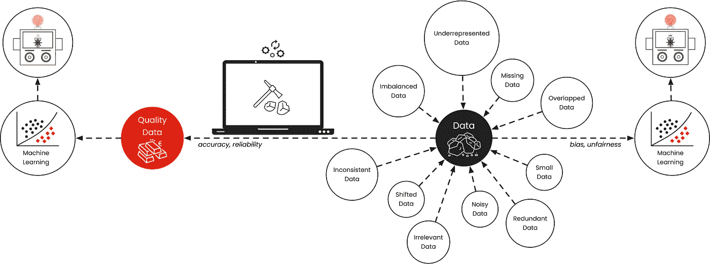
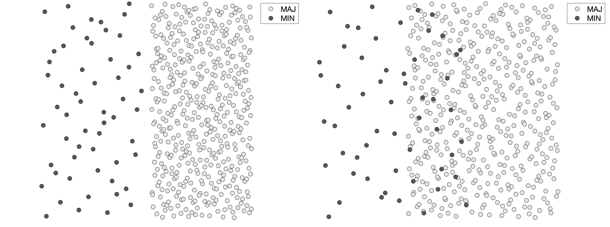
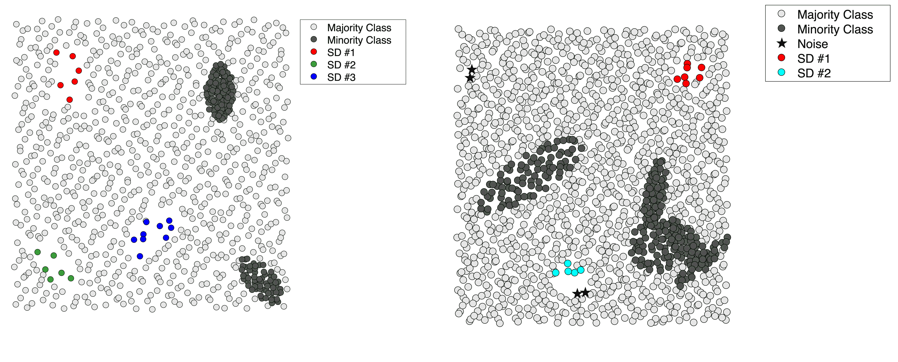
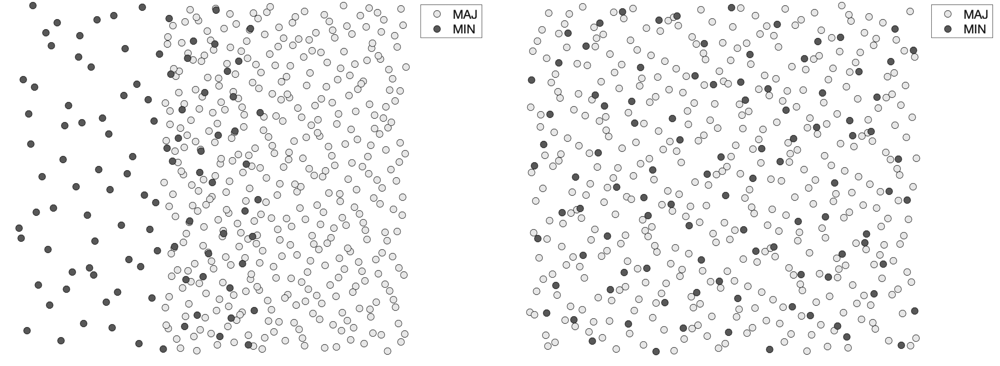

# 杀死你机器学习模型的数据质量问题

> 原文：[`towardsdatascience.com/data-quality-issues-that-kill-your-machine-learning-models-961591340b40?source=collection_archive---------4-----------------------#2023-01-19`](https://towardsdatascience.com/data-quality-issues-that-kill-your-machine-learning-models-961591340b40?source=collection_archive---------4-----------------------#2023-01-19)

## 数据质量纪实

## 应对不完美数据的复杂性

 [Miriam Santos](https://medium.com/@miriam.santos?source=post_page-----961591340b40--------------------------------)

·

[关注](https://medium.com/m/signin?actionUrl=https%3A%2F%2Fmedium.com%2F_%2Fsubscribe%2Fuser%2F243289394aaa&operation=register&redirect=https%3A%2F%2Ftowardsdatascience.com%2Fdata-quality-issues-that-kill-your-machine-learning-models-961591340b40&user=Miriam+Santos&userId=243289394aaa&source=post_page-243289394aaa----961591340b40---------------------post_header-----------) 发表在[Towards Data Science](https://towardsdatascience.com/?source=post_page-----961591340b40--------------------------------) ·8 min read·2023 年 1 月 19 日

--

*这是一个专注于数据科学数据质量的专栏系列。这是第一篇文章，重点讨论数据不平衡、数据代表性不足以及数据重叠问题。*

图片由[Sergey Sokolov](https://unsplash.com/@svsokolov?utm_source=medium&utm_medium=referral)提供，来源于[Unsplash](https://unsplash.com/?utm_source=medium&utm_medium=referral)

***垃圾进，垃圾出。* 这就是从数据中学习的诅咒。** 在这篇文章中，我将讨论为你的机器学习模型提供高质量数据的重要性，并介绍一些致命的数据质量问题，如果不加以控制，可能会彻底影响你的数据科学项目。

# 机器学习已经成为现实世界领域中的一种无处不在的工具

*从社会到医疗应用，机器学习已深深融入我们的日常生活。*

机器学习在实际应用中的情况：有了强大的能力，就有了巨大的责任。这提到了面部识别技术的“编码凝视”和 Joy Buolamwini 在[算法正义联盟](https://www.ajl.org/library/multimedia)上开展的工作。图片由[engin akyurt](https://unsplash.com/@enginakyurt?utm_source=medium&utm_medium=referral)拍摄，来源于[Unsplash](https://unsplash.com/?utm_source=medium&utm_medium=referral)

也许你今天早上 7:45 醒来，因为一个算法已经分析了你的睡眠模式，并确定这是你开始新一天而不会感到昏昏欲睡的最佳时间。然后，你可能会沿着另一个算法推荐的路线开车去工作，以避免交通拥堵。

当你打开笔记本电脑时，你的电子邮件已经被分门别类到这些所谓的“智能”文件夹中，垃圾邮件也被自动过滤（通过另一个算法！），这样你可以专注于重要的消息。

在这漫长的一天结束时，也许你会有一个盲目约会，对方的个人资料在成千上万的可能性中被另一个算法挑选（好吧，*脚本挑选？*）。再次由另一个算法完成。

*当技术变得如此普遍，如机器学习目前的状态，我们明智的做法是* ***专注于这些模型和它们的学习方式****，因为尽管 AI 具有* ***服务社会的巨大潜力****，它也具有* ***巨大的破坏和不平等的力量****。

那为什么会这样呢？

# 不完美数据：在不完美的世界中觅食

*原因在于* ***算法从我们教给它们的内容中学习****。

它们从我们提供的数据中学习，并期望这些数据在多个属性上是“表现良好”的。

**理想情况下，情况应该是这样的。但我们的世界不完美，我们不完美，我们产生的数据自然带有这些不完美。**

*数据*（或*大数据*，一个我们在过去几年中经常听到的词汇）并不等同于*优质数据*，混淆这两者可能导致开发出**有偏见和不公平的模型**，而不是**准确可靠的模型**。

数据与优质数据。图像由作者提供。

**传统上，机器学习算法*依赖于几个假设*，例如训练数据的假设：**

+   现有类别的代表性是均等的；

+   现有的数据子概念也是均等代表的；

+   来自不同类别的实例占据输入空间的不同区域；

+   数据中有足够多的训练实例来学习潜在的概念；

+   特征值一致，实例被正确标记；

+   特征对最终任务是有信息量和相关性的；

+   训练和测试数据遵循相同的分布；

+   所有特征值对所有实例都是可用的。

**自然地，在现实世界中，缺陷总是潜伏的，这些*假设往往被打破*。**

当它们被破坏时，它们表现为*数据缺陷*，具体包括：

+   不平衡数据；

+   代表性不足的数据或小型分离群体；

+   类别重叠；

+   小数据、缺乏密度或数据不足；

+   不一致数据；

+   无关数据；

+   冗余数据；

+   嘈杂数据；

+   数据集偏移；

+   缺失数据。

如果不加以处理，这些缺陷可能会危害标准机器学习模型的性能，对商业应用和人们的生活产生不良后果。

一次错误的信用卡欺诈警报导致了重要投资的损失。一项失败的肿瘤检测转变为痛苦的治疗方案或临终决定之间的艰难选择。一个对相似面部结构的错误判断错误地判处一个人面临法律，而另一个人则被释放。

> **缺陷可能让我们付出金钱、自由和生命的代价。**

在我深入讨论这些数据缺陷之前，我想澄清一下***不完美数据***的概念。

在[我的研究](https://scholar.google.com/citations?user=isaI6u8AAAAJ&hl=en)中，我将这个词作为一个总括性术语，描述*任何数据特性、特有性*或容易导致分类器行为和性能偏差的问题（其他作者将其描述为*数据内在特征*、*数据难度因素*或*数据不规则性*）。

这意味着某些“缺陷”不应字面理解（这可能在某种程度上转化为*有缺陷的数据*）。

当然，**一些缺陷可能是由于数据获取、传输和收集过程中的错误引起的，但其他缺陷是领域内在性质的自然产物。** 它们自然地出现，不论数据获取、传输或收集过程有多么完善。

这里涵盖的三种数据缺陷——*不平衡数据、代表性不足的数据和重叠数据*——就是一个很好的例子。它们往往来源于领域本身的性质，而非数据收集或存储过程中的错误。

# 不平衡数据：概念不均、预测不等

## **不平衡数据通常指的是数据集中每个类别样本数量的不均衡**

换句话说，类在领域中没有得到平等表示，这使分类器的学习过程偏向于表现良好的概念，可能忽视或忽略其余的。这是一个问题，因为在大多数应用中，少数类通常是感兴趣的类。

## **那么我们在哪里可以找到它们？**

一些示例包括[*疾病诊断*](https://dl.acm.org/doi/10.1145/2988544)、[*信用卡欺诈*](https://keras.io/examples/structured_data/imbalanced_classification/)、[*情感分析*](https://ieeexplore.ieee.org/abstract/document/8923218)和[*客户流失预测*](https://www.youtube.com/watch?v=S9iuwZxNdCk)。

## **一个有趣的转折：类不均衡*本身*可能并不是问题！**

确实，即使在高度不均衡的领域中，标准分类器也可能在*分类问题复杂度较低*（例如，考虑一个线性可分的领域）时取得令人满意的结果。

存在于单独的**不均衡数据**与**类重叠**结合的数据。两个领域包含相同数量的点（500）和不均衡比（8:1）。图像由作者提供。

尽管单独解决类不均衡可能比较容易，但在训练机器学习模型时必须始终考虑这一点，特别是在[设计合适的交叉验证方法](https://ieeexplore.ieee.org/abstract/document/8492368)和选择无偏分类[性能度量](https://dl.acm.org/doi/abs/10.1145/2907070)方面。

# 数据不均衡：小离群点的问题

## 数据不均衡是另一种形式的不均衡数据

在之前的案例中，我们提到的是*类间*不均衡，而数据不均衡与*类内*不均衡现象相关，并以*小离群点*的形式出现。

小离群点是数据中小而未充分代表的子概念，理解为类概念中的小簇。

数据不均衡的特点是数据中出现小的子簇。图像由作者提供。

与*类间*不均衡类似，小离群点问题在于分类器通常通过为表现良好的概念生成规则来学习，即*较大的离群点*。因此，它们容易对这些子概念进行过拟合，这导致新示例的分类性能较差。

## **那么在哪里可以找到它们？**

*小离群点*的出现非常普遍于[医疗数据](https://www.ncbi.nlm.nih.gov/pmc/articles/PMC8611905/)，这与一些疾病（如癌症）的异质性和患者之间的生物多样性有关。其他示例包括[面部和情感识别](https://link.springer.com/chapter/10.1007/978-3-662-48558-3_18)。

当前研究中的一个开放挑战是区分*核心概念*（即使它们在数据空间中表现为簇）、*代表性不足的子概念或小的分离点*以及*噪声实例*。这本身并不是一个简单的问题，如果数据中存在其他问题（而且通常会存在），则变得更为复杂。

# 类别重叠：离开我的（输入）空间！

## 类别重叠发生在不同类别的实例共存于数据空间的同一区域。

随着不同概念的代表填充相同的区域，机器学习分类器很难区分它们，这导致了分类性能差（特别是影响这些区域中较少表示的概念）。

类别重叠的典型示例：领域中存在越来越多的重叠示例。图片由作者提供。

多年来，研究人员处理这个问题的方式包括*仅从非重叠区域学习*（在一定程度上忽视了这个问题）、*将重叠数据视为新类别*或*为重叠和非重叠区域构建单独的分类器*。

其他作者尝试区分散布在整个输入空间中的示例与集中在概念之间决策边界上的示例，应用量身定制的策略来处理每种类型的不同。

当前研究正转向**类别重叠是一个异质概念，包含多种复杂来源**的观点。在初步工作中，我特别将其区分为 4 种主要的重叠表示，将其分为特征重叠、实例重叠、结构重叠和多分辨率重叠，每种类型与不同的复杂性概念相关联。

## **我们在哪里可以找到它？**

从[字符识别](https://link.springer.com/article/10.1007/s10032-008-0069-1)、[软件缺陷预测](https://link.springer.com/article/10.1007/s11219-016-9342-6)和[蛋白质及药物发现](https://pubmed.ncbi.nlm.nih.gov/30195659/)来看，类别重叠也是现实世界领域中的一种常见数据特征。

# 结论：我们从这里出发去哪里？

虽然过去几十年 AI 研究致力于生产更好的模型——我们称之为*模型中心 AI*——但目前的关注点已从模型优化和超参数调整转向系统识别和缓解数据质量问题——这一范式最近被称为*数据中心 AI*。

在我们当前生活的“人工智能巴别塔”中，真正理解数据并指向重要内容将比拥有大量的“信息”更具变革性。这种**指向**是新数据中心人工智能范式的基础。照片由 [Killian Cartignies](https://unsplash.com/@kikisad?utm_source=medium&utm_medium=referral) 在 [Unsplash](https://unsplash.com/?utm_source=medium&utm_medium=referral) 提供

这种新方法包含了对数据进行系统化和持续迭代的循环，从*不完美*数据转变为*智能且可操作*数据。这自然需要对数据缺陷有深入的理解，包括其识别与特征描述，以及其综合效应和高效的缓解策略。

*数据质量纪实系列*介绍了数据科学中的数据质量话题，从现实世界中常见的 3 种数据质量问题开始：*不平衡数据*、*不足数据*和*重叠数据*。系列的后续部分将致力于对其他数据质量问题进行特征描述，深入探讨每一个问题，并向读者介绍有效的工具和策略，以便在处理现实世界数据集时有效识别和衡量这些问题。

## 关于我

博士，机器学习研究员，教育者，数据倡导者，以及全能型人才。在 Medium 上，我撰写关于**数据中心人工智能和数据质量**的文章，教育数据科学与机器学习社区如何从*不完美*数据过渡到*智能*数据。

[数据中心人工智能社区](https://tiny.ydata.ai/dcai-medium) | [GitHub](https://github.com/Data-Centric-AI-Community) | [Google Scholar](https://scholar.google.com/citations?user=isaI6u8AAAAJ&hl=en) | [LinkedIn](https://www.linkedin.com/in/miriamseoanesantos/)

# 参考文献

1.  B. Krawczyk, [从不平衡数据中学习：开放挑战与未来方向](https://link.springer.com/article/10.1007/s13748-016-0094-0)（2016），*人工智能进展*，5(4)，221–232。

1.  S. Das, S. Datta, B. Chaudhuri, [处理分类中的数据不规则性：基础、趋势与未来挑战](https://www.sciencedirect.com/science/article/abs/pii/S0031320318300931)（2018），*模式识别* 81, 674–693。

1.  A. Fernández, S. García, M. Galar, M., R. Prati, B. Krawczyk, F. Herrera, [*数据内在特征*](https://www.springerprofessional.de/en/data-intrinsic-characteristics/16217922)（2018），Springer International Publishing，页 253–277。

1.  I. Triguero, D. García-Gil, J. Maillo, J. Luengo, S. García, F. Herrera, [将大数据转化为智能数据：关于使用 k-最近邻算法获取高质量数据的见解](https://wires.onlinelibrary.wiley.com/doi/abs/10.1002/widm.1289)（2019），Wiley Interdisciplinary Reviews：*数据挖掘与知识发现* 9, e1289。

1.  M. Santos, P. Abreu, N. Japkowicz, A. Fernández, J. Santos, [关于类重叠和不平衡的统一视角：关键概念、多视角全景以及研究的新领域](https://www.sciencedirect.com/science/article/pii/S1566253522001099)（2023 年），*信息融合* 89, 228–253。
