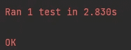
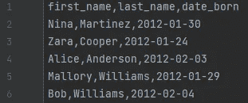
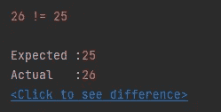

# 数据科学最佳实践，第一部分——测试你的查询

> 原文：[`towardsdatascience.com/data-science-better-practices-part-1-test-your-queries-629ad5209f28?source=collection_archive---------5-----------------------#2023-09-07`](https://towardsdatascience.com/data-science-better-practices-part-1-test-your-queries-629ad5209f28?source=collection_archive---------5-----------------------#2023-09-07)

## 如何确保我们的查询按预期工作——以及其他未来的好处。

[](https://medium.com/@scf1984?source=post_page-----629ad5209f28--------------------------------)[](https://towardsdatascience.com/?source=post_page-----629ad5209f28--------------------------------) [Shachaf Poran](https://medium.com/@scf1984?source=post_page-----629ad5209f28--------------------------------)

·

[关注](https://medium.com/m/signin?actionUrl=https%3A%2F%2Fmedium.com%2F_%2Fsubscribe%2Fuser%2F33e74b6a3393&operation=register&redirect=https%3A%2F%2Ftowardsdatascience.com%2Fdata-science-better-practices-part-1-test-your-queries-629ad5209f28&user=Shachaf+Poran&userId=33e74b6a3393&source=post_page-33e74b6a3393----629ad5209f28---------------------post_header-----------) 发表在 [Towards Data Science](https://towardsdatascience.com/?source=post_page-----629ad5209f28--------------------------------) · 11 分钟阅读 · 2023 年 9 月 7 日[](https://medium.com/m/signin?actionUrl=https%3A%2F%2Fmedium.com%2F_%2Fvote%2Ftowards-data-science%2F629ad5209f28&operation=register&redirect=https%3A%2F%2Ftowardsdatascience.com%2Fdata-science-better-practices-part-1-test-your-queries-629ad5209f28&user=Shachaf+Poran&userId=33e74b6a3393&source=-----629ad5209f28---------------------clap_footer-----------)

--

[](https://medium.com/m/signin?actionUrl=https%3A%2F%2Fmedium.com%2F_%2Fbookmark%2Fp%2F629ad5209f28&operation=register&redirect=https%3A%2F%2Ftowardsdatascience.com%2Fdata-science-better-practices-part-1-test-your-queries-629ad5209f28&source=-----629ad5209f28---------------------bookmark_footer-----------)

由 Midjourney 生成

数据科学领域根植于数学和统计学以及计算机科学。尽管在过去几十年中它有了显著的发展，但只有在过去的 10 到 15 年里，它才成为组织中的一个成熟角色，并且作为科技行业中的一个独立领域而崛起。

作为一个相对年轻的职业，数据科学中的最佳实践还没有足够的时间来凝聚，也没有得到很好的记录。这与软件工程这一相对成熟的领域形成对比，后者充满了经验丰富的指南、结构和方法论，经过时间的考验被证明是有益的。

从逻辑上讲，数据科学家应从与软件工程师的重叠和紧密合作中受益，特别是在实践方面。不幸的是，情况往往并非如此，因为许多数据科学家要么对这些方法论不了解，要么[不愿意学习它们](https://digma.ai/blog/coding-horrors-refactoring-and-feature-creep/)，声称这些方法论不相关或不在他们的职责范围内。

在这个博客系列中，我想分享一些数据科学家在工作中可以使用的技巧、窍门和系统性方法，旨在提高我们代码的正确性和稳定性，更好地管理我们的模型，并改善团队合作。

# 前提是

我们从每个处理大数据的人都在某个时刻面对的场景开始，有些人可能甚至每天都面临这个问题：

你正在使用`PySpark`并希望从一个大表中提取一些信息。你无法在内存中保持大量的相关数据，因此你被迫在查询语言中完成所有的转换、聚合、连接等操作。

你开始编写查询，并且对它感到满意，因为`PySpark`使得即使查询太复杂而难以解释给其他人，它也能轻松使用具有 Python 风格的优雅 API。即使你决定使用 SQL 接口——你仍然愉快地输入着。

然后，你意识到在`groupBy`调用中遗漏了一个关键列，于是回去修复它。

然后，你意识到一个窗口函数缺少`orderBy`子句。

然后，你决定将第四行中使用的这个神奇数字改为 1.25，而不是 1.2。

你最终会反复地查看这些 20 到 50 行的查询，来回调整 20 到 30 分钟，稍微修改一下，同时构建最终的查询结构。

然后……你运行查询，它**失败**了。

你再次遍历你刚刚生成的代码行，努力找出遗漏的逻辑需求，并逐一修复它们。

最终，查询运行并返回了一些结果。

但是……

谁能保证这些结果确实反映了你一直以来想要的内容，并且与当前你头脑中的过程相匹配？

这时测试会为我们提供帮助。

# 测试？

是的。我们做的是：

1.  手动制作一个小数据集。

1.  手动计算我们希望通过查询获得的结果。

1.  在那个小数据集上应用我们编写的查询。

1.  将查询结果与我们自己的计算结果进行匹配。

如果我们遇到不匹配的情况，我们必须修复一些东西——要么我们的手动计算错误，要么查询没有按预期执行。另一方面，如果结果匹配——我们可以继续到下一步。

现在，我将逐步向你展示我在编写这些测试时使用的结构。

# 设置环境

让我们从创建我们需要与`PySpark`一起工作的环境（即固定装置）开始。我们每次运行可能会测试许多用例，因此我们在模块级别设置`PySpark`会话。否则，我们可能需要为每个测试启动和停止会话，这会产生不可忽略的开销。

我使用 Python 内置的`*unittest*`，但如果你或你的团队其他成员使用`*pytest*`、`*nose*`或任何其他测试框架，我相信你会找到执行这些操作的方法。

`*unittest*`有两个钩子`*setUpModule*`和`*tearDownModule*`，分别在测试之前和之后运行。我们将使用这些钩子来启动和停止我们的`PySpark`会话。

# test_pyspark.py

```py
import pyspark
import unittest

spark: pyspark.sql.SparkSession | None = None

def setUpModule():
    global spark
    spark = get_spark_session('local')

def tearDownModule():
    global spark
    if spark is None:
        return
    try:
        spark.stop()
    finally:
        spark = None 
```

我喜欢我的会话创建函数是可重用的，所以这里是它（我会在适当的时候填写非本地选项）：

# query_pyspark.py

```py
import pyspark

def get_spark_session(scope='local'):
    if scope == 'local':
        return (
            pyspark.sql.SparkSession.builder
            .appName('unit-tests')
            .master('local[4]')
        ).getOrCreate()
    else:
        ...  # TODO
```

如果项目变得更大，我会将这个函数放在`PySpark`专用的工具文件中，但目前我们将项目保持扁平和小巧。

# 我们的第一个测试

我现在要测试的第一件事是运行这个测试时是否实际获得了会话。以下是测试：

# test_pyspark.py

```py
class TestPysparkQueries(unittest.TestCase):
    def test_session_created(self):
        self.assertIsNotNone(spark)
```

你瞧，我运行了测试（PyCharm 允许你直接从代码中运行，你应该会看到每个测试旁边有一个绿色的“播放”按钮），并且收到了 OK 消息：



# 创建*和*测试我们的数据

现在我们可以开始讨论数据了。你应该手头有一个小的数据集，涵盖你可能遇到的不同情况，并且仍然可以手动处理。就实际大小而言，我通常建议 20–50 行，具体取决于领域和查询的复杂性。如果涉及分组，请选择 5–10 个不同的组。

出于教学目的，我创建了一个包含名字和出生日期的数据集。为了简单起见，我假设所有具有相同姓氏的个体是兄弟姐妹。我还引入了行顺序的随机性，以防止顺序敏感的查询在不直接处理顺序的情况下获得正确的答案。数据如下所示：



现在是时候将数据加载到我们的`PySpark`会话中了。但首先，让我们为它创建一个基本的测试。顺便说一下，创建测试然后编写使测试通过的代码是测试驱动开发（TDD）方法的一部分，但我不对数据科学家传授这个方法，只关注测试部分。

对于一个理智的测试，我们可以测试列名，测试数据集大小，或者两者都测试，或者我们可以提出更深层次的测试。甚至，我们可以编写一个测试，逐行匹配 CSV 文件和`DataFrame`。

我们在编写测试时越严格，后来对代码正确性的确信就越强，但这也会使未来的更改更加困难，*例如*，如果我们想在数据集中添加/更改一行以测试特定边界情况怎么办？

在我们的工作中，平衡这些速度和正确性因素更像是一门艺术，而不是科学，这随着时间和实践会变得更加自然。

# test_pyspark.py

```py
 def test_load_data(self):
        df = get_family_data()
        self.assertEqual(25, df.count())
```

接下来，我们编写加载数据的函数：

# query_pyspark.py

```py
def get_family_data():
    return (
        get_spark_session(scope='local')
        .read.csv(os.path.join(os.path.dirname(__file__), 
                  '../assets/data_sample.csv'))
    )
```

当我运行测试时……失败了？这怎么可能？



在重新计算行数并确保为 25 后，我最终在代码中添加了`*header=True*`，测试通过了（不用担心，我会在接下来的示例中省略虚假的戏剧性）：

# query_pyspark.py

```py
def get_family_data():
    return (
        get_spark_session(scope='local')
        .read.csv(os.path.join(os.path.dirname(__file__), 
                  '../assets/data_sample.csv'), header=True)
    )
```

# 测试我们的查询

现在是查询特定测试的时间。假设我想从每个家庭中获取最年长的孩子。我查看数据集（或使用排序的电子表格）来找出我期望获得的确切名字集合，并将其硬编码到我的测试中：

# test_pyspark.py

```py
 def test_elder_child_query(self):
        df = get_elder_child(get_family_data())
        elders = {_.elder_child for _ in df.toLocalIterator()}
        self.assertEqual(elders, {'Gus', 'Rita', 'Sam', 'Trent', 'Ursula'})
```

使测试通过的代码如下：

# query_pyspark.py

```py
def get_elder_child(family_df: pyspark.sql.DataFrame):
    return (
        family_df
        .orderBy(f.col('date_born').desc())
        .groupby('last_name')
        .agg(f.first('first_name').alias('elder_child'))
    )
```

尽管我省去了戏剧性的描述，我还是要告诉你，我不得不多次修复查询才能使测试通过。例如，我按`*first_name*`分组，聚合了`*last_name*`的值，并且忘记了进行降序排序。

在我的工作中，**测试让我多次避免了丢脸**。

完成了吗？绝对没有。

我们应该考虑边界情况，比如如果有双胞胎呢？是否有没有孩子的家庭？如果数据不可靠，那么空值怎么办？

对于这些选项，我们将转到我们的数据集，将其更改为产生这样的案例，然后更新我们的测试和代码。

如果我们通过后来出现的错误遇到这些特殊情况（即使我们不是自己提出的），我们也会这样做——更改数据集以反映这些情况，然后从那里继续。

我们还应该为其他查询编写测试，并且我们会遇到不同类型的测试。在上面的测试中，我们关心的是**结果集**，但如果我们想测试简单的 1:1 转换，*即* `f(row) = y`，我们需要考虑 Spark 在行顺序上的非确定性。

例如，假设我们想要获取数据集中名字的首字母。

一种选择是对`*DataFrame*`进行排序，并在使用我们手工制作的列表进行相等断言时相信这个顺序：

# query_pyspark.py

```py
def get_initials_col():
    return (
        f.concat(
            f.substring('first_name', 0, 1),
            f.lit('. '),
            f.substring('last_name', 0, 1),
            f.lit('.'),
        )

    ).alias('initials')
```

# test_pyspark.py

```py
 def test_get_initials_col_1_by_1(self):
        df = (
            get_family_data()
            .withColumn('initials', get_initials_col())
            .orderBy('date_born')
        )
        expected_list = ['V. A.', 'W. W.', 'X. M.', 'Y. T.', 'Z. C.', 'I. M.', 'J. T.', 'K. C.', 'L. A.', 'M. W.',
                         'N. M.', 'O. T.', 'P. C.', 'Q. A.', 'A. A.', 'B. W.', 'C. M.', 'E. T.', 'F. C.', 'G. A.',
                         'H. W.', 'R. W.', 'S. M.', 'T. T.', 'U. C.']
        for expected, actual in zip(expected_list, [_.initials for _ in df.toLocalIterator()]):
            self.assertEqual(expected, actual)
```

另一种选择是编写一个**本地**函数来完成相同的工作，并进行充分测试。然后，我们可以在将结果加载到内存后应用它，并编写测试以逐行断言相等。以下是一个示例：

# query_pyspark.py

```py
def get_initials(first_name, last_name):
    return f'{first_name[:1]}. {last_name[:1]}.'
```

# test_pyspark.py

```py
 def test_get_initials(self):
        self.assertEqual('B. H.', get_initials('Bob', 'Hope'))
        self.assertEqual('C. C.', get_initials('Charlie', 'Chaplin'))
        self.assertEqual('J. L.', get_initials('Jonathan', 'Livingstone'))

    def test_get_initials_col_support_function(self):
        df = (
            get_family_data()
            .withColumn('initials', get_initials_col())
        )
        for row in df.toLocalIterator():
            self.assertEqual(get_initials(row.first_name, row.last_name), row.initials)
```

在这两个选项中，我肯定会选择后者，因为它更**灵活**，因为它不直接依赖数据，而是通过支持函数的代理——这些函数在不与数据集耦合的情况下进行测试。

当然，如果函数对你的查询负载不重，你可以选择将其用作 UDF，保持代码复杂性低。

# 等等，还有更多内容吗？

当然。有许多不同的情况，比如联接和窗口函数的结果，但我相信上述示例足以说明测试是一种重要工具，是编写查询时的有效方法，即使对像我这样的数据科学家也是如此。

请注意，我选择展示如何在使用`PySpark`时工作，因为它是一个常见的大数据工具，但这种模式不仅限于`PySpark`或大数据数据库。实际上，它应该适用于任何数据库。你也可以使用这种方法与内存数据库类似的工具，如`*pandas*`。

只要你能够：

1.  连接到数据源。

1.  加载/模拟数据源中的数据。

1.  执行查询。

1.  检索并处理查询结果。

一切准备就绪。如果你使用的工具无法执行这些步骤中的任何一个，你可能需要重新考虑使用这个工具。

而且你会发现，测试你的代码还有一个隐藏的好处。假设你发现你的某个函数在运行时间或内存消耗方面表现不佳，并决定尝试优化或重构它。现在你可以使用现有的测试来保证你的**新代码给出的输出与之前的相同**。没有这些测试，我个人会害怕改动哪怕一行代码，担心会破坏某些下游依赖。

# 总结

测试是一种强大且重要的方法，可以验证代码的正确性，并使任何重构易于管理。

在未来的帖子中，我将提供更多关于数据科学中良好实践的示例。我们将涉及如何在不相互干扰的情况下协同工作在同一个模型上，如何管理数据集版本，[如何观察我们代码在生产环境中的](https://digma.ai/blog/ci-cd-cf-the-devops-toolchains-missing-link-continuous-feedback/)性能，以及更多内容。

敬请关注。

# 常见问题解答

问：等等，什么？

答：欢迎在这里或其他地方就本博客系列中的概念展开讨论。

问：如果我的查询需要成千上万行来测试呢？

答：编写查询的参数化版本，例如`*def get_n_smalles_children(family_df, n): …*`并使参数足够小。另一个选项是通过编程方式模拟数据，但这也会带来新的问题和挑战。

问：如果我不断更改查询，这是否意味着我也需要更改测试？

A: 理想情况下，你不会随时间改变查询，但我知道我们领域的探索性。因此答案是“是的”。这也是为什么你可能会感觉编写测试时速度变慢的原因之一。然而，速度是与准确性/正确性权衡的。你可能会在后期过程中编写测试，当查询结构更加稳定时。

Q: 如果我不使用 PyCharm，怎么运行测试？

A: 在测试文件的末尾添加以下魔法行，然后使用`*python test_pyspark.py*`运行它。别忘了确保代码根目录被包含在`PYTHONPATH`中，以便导入能够正常工作（PyCharm 会自动处理这个问题）。

```py
if __name__ == '__main__':
    unittest.main()
```

Q: 如果我不想（或者无法）将数据保存在.csv 文件中怎么办？

A: 任何对你有效的数据存储和加载方式都可以，只要尽量保持整洁即可。对于非常小的数据集，我使用了 dict-to-DataFrame（或者如果你愿意，可以使用 json-to-DataFrame），对于较大的数据集，我使用了永久存储在 Hadoop 上的表。

Q: 你给出的示例函数不是非常简单吗？

A: 是的。这就是我教授的方式——通过给出简单的例子，并逐渐使其变得更加复杂。不幸的是，这篇文章的边距太小，无法容纳后面的部分。

Q: 你有没有将上述代码存储在某个仓库中，以便我可以用作参考？

A: [是的，我确实这样做了。](https://github.com/scf1984/clean-data-science/tree/main/pyspark_tests)
