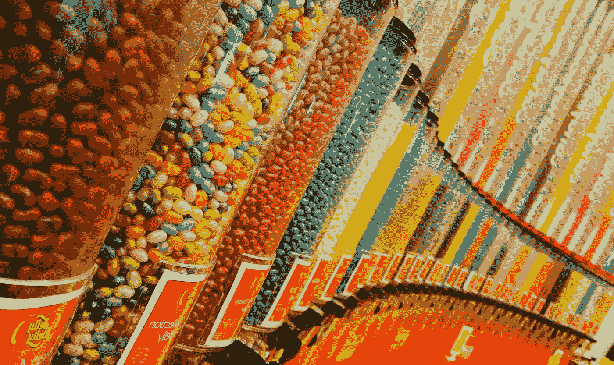

# 数据科学职业路径、技能与特别项目：我们 2023 年的最佳阅读

> 原文：[`towardsdatascience.com/data-science-career-paths-skills-and-special-projects-our-best-reads-of-2023-d3ed88b6db41?source=collection_archive---------1-----------------------#2023-12-21`](https://towardsdatascience.com/data-science-career-paths-skills-and-special-projects-our-best-reads-of-2023-d3ed88b6db41?source=collection_archive---------1-----------------------#2023-12-21)

 [TDS Editors](https://towardsdatascience.medium.com/?source=post_page-----d3ed88b6db41--------------------------------)

·

[关注](https://medium.com/m/signin?actionUrl=https%3A%2F%2Fmedium.com%2F_%2Fsubscribe%2Fuser%2F7e12c71dfa81&operation=register&redirect=https%3A%2F%2Ftowardsdatascience.com%2Fdata-science-career-paths-skills-and-special-projects-our-best-reads-of-2023-d3ed88b6db41&user=TDS+Editors&userId=7e12c71dfa81&source=post_page-7e12c71dfa81----d3ed88b6db41---------------------post_header-----------) 发表在 [Towards Data Science](https://towardsdatascience.com/?source=post_page-----d3ed88b6db41--------------------------------) · 作为 Newsletter · 5 分钟阅读 · 2023 年 12 月 21 日 

--

2023 年可能是大型语言模型（LLM）的年份——我们上周突出了我们关于 ChatGPT 的最受欢迎的文章以及相关主题——但数据科学和机器学习的领域太广泛，难以将其缩减为单一现象（尽管这可能是不可避免的）。

每天，TDS 作者都会发布涵盖各种主题的优秀作品，从最新的工具到职业见解和项目演示。为了今年的最后一期 Variable，我们决定突出一些最令人难忘和广泛阅读的帖子，围绕三个主题：数据科学家的编程、职业发展，以及创意项目和观点文章。它们出色地展示了这个领域及我们的社区是多么充满活力、多样性和动态。

我们希望你喜欢我们的精选内容，并再次感谢你在过去一年中的支持。

## 数据科学家的编程

+   **编程很难，直到我学会了这两件事**

    如何从“有抱负的开发者”成为一名受雇的开发者？[Natassha Selvaraj](https://medium.com/u/6a2ef1b1f09d?source=post_page-----d3ed88b6db41--------------------------------) 的病毒式热门文章提供了切实可行的建议和大量的灵感。

+   **Pandas 2.0：数据科学家的游戏规则改变者？** 新的 Python 库每天都在出现，但 Pandas 仍然是数据科学家的必备工具。[Miriam Santos](https://medium.com/u/243289394aaa?source=post_page-----d3ed88b6db41--------------------------------) 的有用概述带我们了解了该库 2.0 版本的显著特点。

图片由 [Sneha Chekuri](https://unsplash.com/@snehachekuri93?utm_source=medium&utm_medium=referral) 拍摄，发布在 [Unsplash](https://unsplash.com/?utm_source=medium&utm_medium=referral)。

+   **12 个将你的代码提升到新水平的 Python 装饰器**

    如果你想扩展你的 Python 知识，为什么不探索装饰器的世界呢？[Ahmed Besbes](https://medium.com/u/adc8ea174c69?source=post_page-----d3ed88b6db41--------------------------------) 介绍了 12 种你可以尝试的装饰器，以便编写更高效的代码。

+   **我在几乎所有数据科学项目中使用的 5 个 Python 装饰器** 想要更多装饰器吗？通过跟随 [Thuwarakesh Murallie](https://medium.com/u/93ce19993bef?source=post_page-----d3ed88b6db41--------------------------------) 的清晰简明指南，给你的编程工具包额外加点油。

+   **5 个区分高级开发者与初级开发者的 Python 技巧**

    解决问题的方式不止一种，但这并不意味着所有策略都等同。[Tomer Gabay](https://medium.com/u/c9c352dba00a?source=post_page-----d3ed88b6db41--------------------------------) 展示了经验丰富的开发者在代码中引入的小调整如何产生显著的影响。

## 职业发展

+   **6 个正在毁灭你数据科学生产力的坏习惯**从过度依赖笔记本到跳过数据版本管理，数据科学家常常因不良习惯而陷入困境。[多纳托·里奇奥](https://medium.com/u/e384fc71d292?source=post_page-----d3ed88b6db41--------------------------------)提供了切实可行的建议，作为强有力的解药。

+   **数据科学家角色的原型**鉴于职位描述的广泛差异和招聘广告的模糊不清，选择数据科学领域中的正确路径可能会很棘手。为了帮助你完成这一过程，[斯蒂芬妮·基尔默](https://medium.com/u/a8dc77209ef3?source=post_page-----d3ed88b6db41--------------------------------)列出了你可能会考虑的主要角色类型。

+   **在开始数据科学之旅之前，不要错过这 5 个必做步骤**对于求职者来说，这段时期充满挑战，但没有理由感到绝望。正如[胡劳德·艾拉米](https://medium.com/u/9c6a36490614?source=post_page-----d3ed88b6db41--------------------------------)在她受欢迎的帖子中所强调的，早期职业数据科学家有能力为自己创造成功的机会。

+   **让我获得数据科学家工作的作品集**通过详细讲解如何创建一个引人注目的数据科学作品集，[马特·查普曼](https://medium.com/u/bf7d13fc53db?source=post_page-----d3ed88b6db41--------------------------------)的指南引起了大量从业者的共鸣，他们希望在竞争激烈的领域中脱颖而出。

+   **使用 OpenAI 和 Python 来提升你的简历：一步一步的指南**为什么不利用新工具来简化简历制作过程？[皮耶罗·派亚隆加](https://medium.com/u/254e653181d2?source=post_page-----d3ed88b6db41--------------------------------)将 ChatGPT 和一些 Python 代码结合起来，将这一常常枯燥的任务变得更加愉快。

+   **如何制定有效的自学计划，成功学习数据科学**

    如果你为即将到来的一年设定了一些雄心勃勃的目标，你需要一个能够帮助你度过挑战时刻的计划。[麦迪逊·亨特](https://medium.com/u/6a8c6841e521?source=post_page-----d3ed88b6db41--------------------------------)详细解释了如何制定一个既有效又可持续的自学计划。

+   **我在数据科学总监职位的第一年学到了什么** 每个人当然都想在职业生涯中有所进步，但成为高级数据科学家也面临一系列挑战。[CJ Sullivan](https://medium.com/u/a9bc11f7a61b?source=post_page-----d3ed88b6db41--------------------------------) 讲述了她在担任总监级高管的第一年中需要克服的一些挑战。

## 创意项目和观点文章

+   **我如何使用 AI 生成的曲目构建了一个 Lo-fi 音乐网络播放器** 在围绕 AI 的许多炒作中被忽视的是其激发一些真正创新项目的能力。举个例子：[Aleksandra Ma](https://medium.com/u/effc1ebd4aac?source=post_page-----d3ed88b6db41--------------------------------)的有趣（且聪明）的 lo-fi 音乐播放器。

+   **监管 AI：基于机制的方法案例** 试图对 AI 发展进行规制的努力一直笨拙而棘手，众多利益相关者争夺影响力。[Viggy Balagopalakrishnan](https://medium.com/u/b3366eb9a0cf?source=post_page-----d3ed88b6db41--------------------------------) 分享了如何使这一过程变得更有效的主观见解。

+   **走向负责任的 AI 生成内容的途径** 在 AI 的广泛领域中，生成工具占据了社会和伦理问题的相当大一部分，这些问题仍需解决。[Lingjuan Lyu](https://medium.com/u/ca2f89d83dfb?source=post_page-----d3ed88b6db41--------------------------------)的深刻文章绘制了一张通向更负责任使用这一强大技术的路线图。

+   **仪表板已死：三年后** 我们过多地关注如何生成和呈现数据，以至于其在其他领域同事中的实际使用有时感觉像是事后的想法。[Taylor Brownlow](https://medium.com/u/cdc63fa2a06e?source=post_page-----d3ed88b6db41--------------------------------)重新审视了仪表板的概念，以揭示协作和沟通的长期挑战。

+   **被禁书页：美国书籍禁令的数据分析** 数据在告知和塑造重要对话方面的力量得到了充分展示，[Yennie Jun](https://medium.com/u/12ca1ab81192?source=post_page-----d3ed88b6db41--------------------------------)深入探讨了美国书籍禁令的令人担忧的趋势，“LGBTQ+社区、穆斯林家庭、科学女性、种族主义、性别歧视，甚至是关于牛的图画书的故事。”

+   **摆脱局限：在 MoMA 验证机器幻觉** 我们很高兴阅读了[Christian Burke](https://medium.com/u/764fa444fa3?source=post_page-----d3ed88b6db41--------------------------------)关于他在纽约现代艺术博物馆的协作人类/人工智能装置工作的介绍。随着人工智能在我们生活中的影响越来越大，这为各种创作者打开了新的方向，这是一次令人着迷的探索。

再次感谢你在 2023 年对我们作者工作的支持！如果你喜欢在 TDS 上阅读的文章，可以考虑[成为 Medium 会员](https://blog.medium.com/become-a-friend-of-medium-dd2fa7bf16c3)：这是一个新的会员等级，为你喜爱的作者提供更大的奖励，以回报他们的高水平写作。

《The Variable》将在假期期间短暂休息，但我们迫不及待想在新的一年里再见到你。

TDS 编辑部
