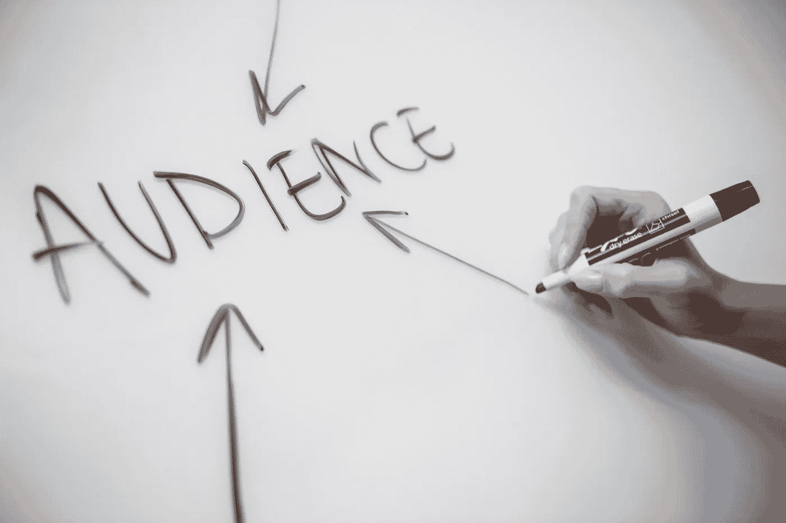

# 提升营销活动的数据科学技术

> 原文：[`towardsdatascience.com/data-science-techniques-to-improve-marketing-campaigns-f949573712d9?source=collection_archive---------13-----------------------#2023-05-10`](https://towardsdatascience.com/data-science-techniques-to-improve-marketing-campaigns-f949573712d9?source=collection_archive---------13-----------------------#2023-05-10)

## 数据科学 | 人工智能 | 营销

## 一份关于如何通过数据科学增强现有营销活动，以将您的业务提升到下一个水平的指南

 [David Farrugia](https://david-farrugia.medium.com/?source=post_page-----f949573712d9--------------------------------)

·

[关注](https://medium.com/m/signin?actionUrl=https%3A%2F%2Fmedium.com%2F_%2Fsubscribe%2Fuser%2F3916826092a6&operation=register&redirect=https%3A%2F%2Ftowardsdatascience.com%2Fdata-science-techniques-to-improve-marketing-campaigns-f949573712d9&user=David+Farrugia&userId=3916826092a6&source=post_page-3916826092a6----f949573712d9---------------------post_header-----------) 发表在 [Towards Data Science](https://towardsdatascience.com/?source=post_page-----f949573712d9--------------------------------) ·5 分钟阅读·2023 年 5 月 10 日

--

[Melanie Deziel](https://unsplash.com/@storyfuel?utm_source=medium&utm_medium=referral) 的照片，来源于 [Unsplash](https://unsplash.com/?utm_source=medium&utm_medium=referral)

说实话，在今天的世界里，营销是任何业务的命脉。营销（尤其是数字营销）有潜力生成成千上万的潜在客户。在竞争激烈的市场中，任何业务的成功都与其营销活动的有效性密切相关。

一次有效的营销活动必须针对某一群体（或多个群体）。

一次有效的营销活动必须完全了解其目标受众。他们喜欢什么，不喜欢什么。

数据科学与营销的结合获得如此强烈的关系，这一点不足为奇。

数据科学彻底改变了企业处理营销的方式。最有效的营销活动都是完全以数据驱动的。企业分析他们的流量，识别趋势，并持续渴望更好地了解他们的客户。

本文的目标是对一些最强大的技术进行高层次的讨论…
