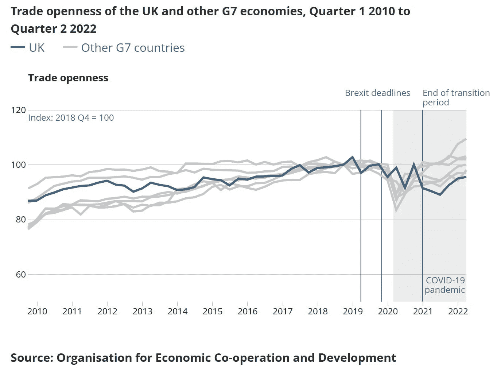
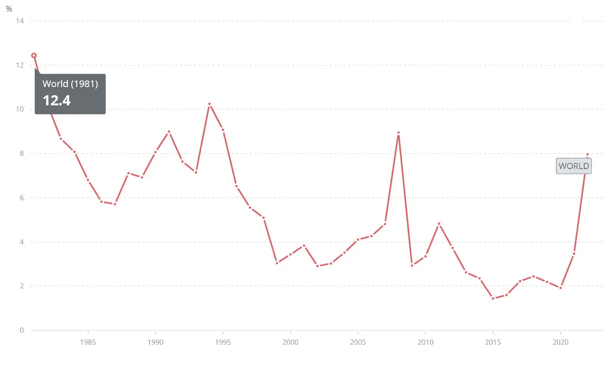
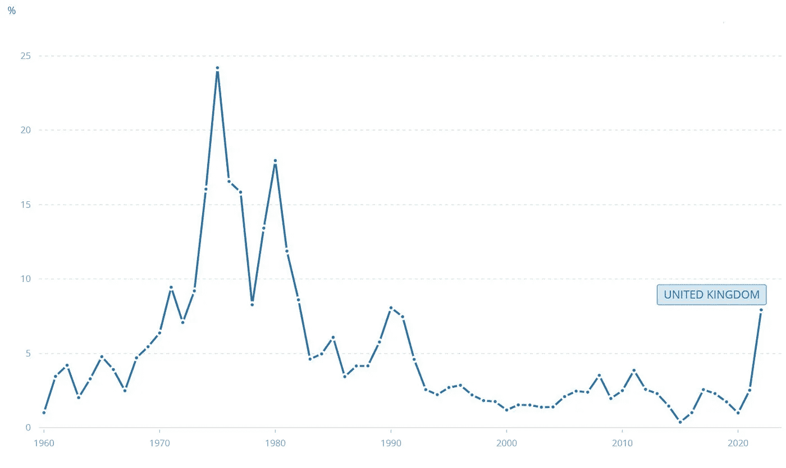

# 数据科学：现代经济学的支柱

> 原文：[`towardsdatascience.com/data-science-the-modern-day-pillar-of-economics-f5e9e6d3cb44`](https://towardsdatascience.com/data-science-the-modern-day-pillar-of-economics-f5e9e6d3cb44)

 [Petru van der Walt Félix](https://medium.com/@petru_vdwfelix?source=post_page-----f5e9e6d3cb44--------------------------------)

·发布于[Towards Data Science](https://towardsdatascience.com/?source=post_page-----f5e9e6d3cb44--------------------------------) ·6 分钟阅读·2023 年 11 月 20 日

--

图片：Shutterstock，授权（1928239373）

## 大致框架

随着近年来特别是新千年以来的技术进步，数据科学已成为一个独立的学科，区别于计算机科学，更加贴近统计学。它开辟了一个独特的领域，在这个领域中，数据科学家致力于解决依赖于数据的获取、处理和最终解释的商业问题。

这需要特定的技能组合，例如对编程语言的良好理解，例如 Python 和 R，以帮助简化访问大型离散数据集所需的分析工作流。数据科学家的技能组合与经济学家的技能结合，为那些希望在现代经济学中脱颖而出的个人提供了成功的公式。

## 事实与数据

上述发现得到了声望卓著的伦敦经济学院[1]在近年来扩展其课程的支持，增加了一项名为 BSc 数据科学与商业分析的本科课程，课程标语承诺学习者将“学习分析数据以解决现实世界问题”，这些现实世界的问题自然基于经济和商业关系。

另一个积极的指标是，世界银行前首席经济学家[2]和 2018 年诺贝尔经济学奖共同获得者**保罗·罗默**，是 Jupyter Notebook 的支持者。Jupyter Notebook 是一个开源的网络应用程序，允许用户创建和分享包含实时代码、方程式和可视化的文档，以支持跨多种编程语言的互动计算。Jupyter 的最终备注是其核心，Jupyter 的名称是一个首字母缩略词，代表 Julia、Python 和 R，这三种都是编程语言。

一个经济学领域的巨头公开支持数据科学工具意义重大——无意冒犯——这明显表明了发展方向。正如罗默在 2018 年的一篇博客中所指出的：“Jupyter 奖励透明性；Mathematica 理性化保密。Jupyter 鼓励个人诚信；Mathematica 让个人躲在企业规避后面。”[3] 在这里，他将 Jupyter 与竞争平台 Mathematica 进行比较，然而如果我们超越这些描述，可以明显看出罗默强烈认同数据科学带来的好处和可能性。

## 实时案例研究

为了说明上述主题，我们来看一个当前的现实问题，英国正接近其脱欧后欧盟-英国关系的三周年纪念，按照新实施的贸易规定进行运作。

在 2016 年 6 月 23 日英国公投决定脱离欧盟及单一市场之后，经过四年的过渡期，直到 2021 年 12 月 31 日，才实施了商定的变更。

快进到现在，即 2023 年 11 月 20 日，除了英国脱欧成为影响英国经济成败的关键因素外，还有其他几个因素加入了这个复杂的局面，使得形势更加扑朔迷离。

其中一个晚到的因素当然是新冠疫情。纯粹从金融角度来看，新冠疫情导致消费者支出的前所未有的停滞，进而增加了家庭的储蓄，这主要是因为办公人员转为在家工作，所有的社交和休闲活动，包括旅行，都被无限期推迟。

不用说，这无疑加剧了财政上的巨大失衡，在金融系统已经因 0%利率而过热的情况下，进一步限制了货币政策的灵活性，从而使经济复苏变得困难。

这涵盖了两个因素，脱欧和新冠疫情。如果这还不够，紧接着出现了由乌克兰-俄罗斯冲突引发的能源危机，这场冲突始于 2022 年 2 月 24 日俄罗斯入侵乌克兰。再一次，纯粹从经济角度来看，这场冲突导致了能源需求超过供应，进而导致所有受影响的消费品价格飙升。

总结来说，这三种因素汇聚在一起，形成了完美的经济风暴，这将要求各方共同努力，帮助我们度过前方的波涛汹涌。

数据科学和经济学都建立在统计学之上，关键的区别在于，数据科学往往更侧重于预测变量之间的未来互动，而经济学则更侧重于历史互动，即前瞻性与回顾性，预测与因果关系。

戴上经济学家的帽子，我审查了 G7 国家在 2023 年之前的贸易对 GDP 比率，数据和图表由国家统计局提供[4]。这清楚地表明，尽管所有 G7 成员国在 2020-2022 年的疫情期间贸易暴跌，但它们都恢复到了疫情前的水平，强劲反弹，唯一的例外是英国仍然落后于其他成员国，如下图所示：

图片：国家统计局 [4]

这表明，与其他六个 G7 国家相比，贸易在英国 GDP 中的比重较低，这是截至 2022 年第二季度的有效声明。与 Brexiteers 在公投前主张的促进与欧盟以外的贸易关系不同，看来英国的贸易开放度，即其贸易能力，实际上在减少，这一点得到了数据科学的支持。

健康经济体的另一个关键组成部分当然是通货膨胀的平衡，目标是将其控制在 2%以下。截至 2023 年 10 月，英国的通货膨胀率为 4.6%。[5]

如果我们回顾从 1960 年代到现在的数据，特别是跟踪通货膨胀情况，也能提供一些有趣的见解。以下数据和图表来源于世界银行集团。[6]

图片：世界银行集团 [6]

我们在 2008 年看到的峰值是全球通货膨胀跳升至 8.9%，这是对 2008-2011 年全球金融危机的反应。

这一点也可以在下面的英国通货膨胀等效图中看到：

图片：世界银行集团 [6]

尽管 2008 年的峰值在全球通货膨胀尺度上并不显著，但却跃升至 3.5%，比前一年上涨了 1.1%，比 2004 年稳定水平 1.4 上涨了 2.1%。[6]

## 结论

随着全球和英国通货膨胀水平显著上升，这支持了关于 2024-2025 年经济衰退的预期，如果历史趋势和数据是可信的话。

基于上述发现和我作为投资管理数据业务分析师的个人经验，可以明显看出数据科学和经济学学科紧密相连，数据科学实际上作为经济学及其驱动和支持的决策的一个关键支柱。

我认为可以公平地得出结论，经济学已经通过利用市场上可用的新技术和数据分析方法获得了显著回报，一切迹象表明这仍是一个处于形成阶段的趋势。

**参考文献：**

[1] 伦敦经济学院，提供[BSc 数据科学与商业分析](https://onlinecourses.london.ac.uk/undergraduate/bsc-data-science-business-analytics-degree-online/)学位作为其课程的一部分

[2] 保罗·罗默，[维基百科](https://en.wikipedia.org/wiki/Paul_Romer)

[3] P. Romer，[Jupyter、Mathematica 和研究论文的未来](https://paulromer.net/jupyter-mathematica-and-the-future-of-the-research-paper/)（2018）

[4] 国家统计办公室，2022 年 10 月 10 日发布，ONS 网站，[G7 经济体国际贸易流动的近期趋势](https://www.ons.gov.uk/businessindustryandtrade/internationaltrade/articles/recenttrendsintheinternationaltradeflowsofg7economies/2022-10-10)

[5] 国家统计办公室，2023 年 10 月发布，ONS 网站，[通货膨胀和价格指数](https://www.ons.gov.uk/economy/inflationandpriceindices)

[6] 通货膨胀数据和视觉图表，[世界数据集团](https://data.worldbank.org/)
