# 数据科学家面试指南

> 原文：[`towardsdatascience.com/data-scientist-technical-interview-guide-part-1-84e286fd4bae`](https://towardsdatascience.com/data-scientist-technical-interview-guide-part-1-84e286fd4bae)

## 第一部分：统计学和概率

 [Daniel Foley](https://medium.com/@dannyf16?source=post_page-----84e286fd4bae--------------------------------)

·发布于[Towards Data Science](https://towardsdatascience.com/?source=post_page-----84e286fd4bae--------------------------------) ·阅读时间 18 分钟·2023 年 2 月 9 日

--

照片由[Maranda Vandergriff](https://unsplash.com/@mkvandergriff?utm_source=unsplash&utm_medium=referral&utm_content=creditCopyText)拍摄，来自[Unsplash](https://unsplash.com/s/photos/interview?utm_source=unsplash&utm_medium=referral&utm_content=creditCopyText)

# 介绍

现在有很多关于数据科学面试的博客文章，但由于我最近又开始面试了，我觉得分享一下我以前和现在的经历，并希望能为正在经历这段旅程的你们提供一些指导，会是很有意义的。毫无疑问，数据科学面试是非常困难的。部分挑战在于你可能被问到的主题范围非常广泛。你几乎需要将软件工程师、数据分析师和产品经理的角色合为一身。

好消息是，一旦你提醒自己这些基础知识，你会发现经常被问到相同类型的问题。在这份技术面试指南的第一部分，我想提供一些概率和统计问题的题目和深入解决方案，你在技术面试中很可能会被考到这些问题。所以不再赘述，让我们开始吧。

# 统计学和概率

统计学和概率学是任何数据科学家必备的基础，复习这些基本概念对于在技术面试中表现出色至关重要。有很多主题经常出现，特别是下面列出的这些。

+   **概率**：期望值、组合和排列、递归关系

+   **统计学：** p 值、假设检验、效能、置信区间、概率与似然、中心极限定理、大数法则

+   **分布：** 均匀分布、二项分布和正态分布是最重要的

在我看来，更难的面试将专注于解决涉及这些概念中的一个或多个问题，这是这篇文章的主要重点。然而，能够以非技术性的方式解释这些概念也极其重要，因此我将涵盖一些我认为有用的主题。我希望，通过展示我在解决这些问题时的思维过程，能够为那些准备技术面试的人提供有用的指南。

这里有一本[参考书](http://stat88.org/textbook/content/intro.html)，我发现对回忆基本概念很有帮助。

***中心极限定理***

假设我想测量人们的收入。如果我们取一个收入样本并绘制这些数据点，我们很可能会看到一个偏斜的分布，其中一些人有很高的收入，而大多数人的收入较小且更为集中。假设我们基于这个样本计算平均值。如果我们继续抽取收入样本并计算平均值并绘制数据，我们将得到样本均值的抽样分布（如下图所示）。由于**中心极限定理**，这个分布看起来像正态分布。至关重要的是，基础的总体分布不必是正态的。下面的图示说明了这一点。

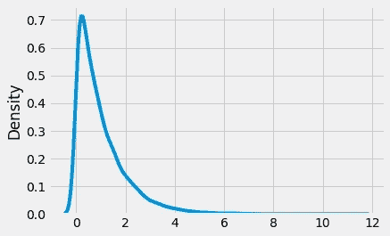

来源：作者的指数分布

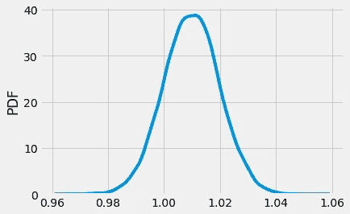

来源：作者的正态分布

这很重要，因为它使我们能够基于单个样本进行统计推断。例如，在假设检验和回归分析中，我们可以使用 CLT 定理对我们的测试统计量/系数的行为进行推断。因为我们知道它是正态分布的，所以我们可以计算置信区间和 p 值，并做出可靠的推断。

***大数法则***

LLN 表明，随着样本大小的增加，样本均值会收敛于总体均值。可以将总体和样本视为两个集合，其中样本是总体集合的一个子集。随着样本大小的增加，样本集合的大小会越来越大，最终会与总体相同。这就是为什么样本均值会收敛于总体均值的原因。

LLN 和 CLT 之间的关键区别在于，LLN 讲述的是样本均值的情况，而 CLT 则与样本均值的分布相关。

***二项分布***

二项分布是一个极其重要的分布，并且在面试中经常出现。用直观的高层次方式从基本原理推导分布是展示你对其理解的好方法。

假设我们网站上有 10 个用户，我们想预测他们中有多少人会购买某物。我们可以将其视为重复的独立试验，每个用户要么购买要么不购买。设 p 为购买的概率，1-p 为不购买的概率，因为概率需要加起来为 1。考虑没有人购买的情况：(1-p)*(1-p)*… = (1-p)¹⁰。

如果一个人购买了呢？我们有 p¹(1-p)⁹。即 1 次成功和 9 次失败。我们不知道是哪位用户进行了购买。它可能是用户 1、用户 2、…或用户 10。为了解决这个问题，我们有 10 种可能性，并且我们要选择其中 1 种。将这些信息综合起来，就得到了下面的通用二项式公式。

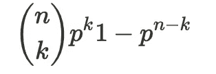

二项式公式

***p 值***

p 值是一个相当有争议的话题，我认为即使是数据科学家也不容易直观理解，更不用说非技术人员了。但让我试着用一个例子来解释它们是如何使用的。

我们使用 p 值来确定假设检验是否显著。通常我们选择 p 值为 0.05 或 5%。例如，如果我们进行了一次假设检验，并获得了 0.03 的 p 值，这意味着***假设原假设为真，我们观察到的检验统计量与此一样极端或更极端的概率是 3%***。换句话说，如果原假设为真，我们观察到这种效果的可能性非常小，因此它很可能是错误的。我们也可以这样考虑 p 值：如果我们进行 100 次实验，我们期望观察到至少与此一样大的检验统计量 5 次。最后，另一种看待 p 值的方法是，它是一个条件概率。在这种情况下，它是**在**原假设为真的情况下观察到的检验统计量与此一样极端或更极端的概率。

在接下来的这些问题中，我将展示我们如何在实践中使用一些这些主题来解决技术面试中的问题集风格的问题。

# 解决问题

以下问题来源于我以前在面试中被问到的问题或在准备面试时遇到的各种书籍和互联网资源（例如 glassdoor）。这些问题的选择基于反映技术面试中最重要和最常见的概念。我还突出了一些我认为在每个问题中需要认识的关键概念。

**问题 1**

***你和一个朋友轮流掷一个公平的六面骰子，第一个掷出 6 的人获胜。第一个掷骰子的人获胜的概率是多少？***

***关键概念：递归关系，概率树，独立性，均匀分布***

如果我们在开始之前稍微思考一下问题陈述，直观上看来，先行似乎会给我们带来优势，所以我们期望这个概率大于 1/2。我们还知道关于掷骰子的什么？好吧，我们知道掷骰子的结果是均匀分布的。每个结果的可能性是一样的，得到特定数字的概率是 1/6。

对于这些类型的问题，我喜欢画一个概率树。至少对我来说，这简化了问题，并给了我一个可以用来解决不立即显而易见的问题的一般方法。那么从我们的角度来看，我们来做这个。有两种可能的情况

+   我们赢：将获胜的概率定义为 x。

+   我们输：概率为 1-x。

在第一次掷骰子时，我们有以下情况，

+   我们要么掷出 6 的概率是 1/6，然后我们以 1 的概率获胜。

+   **或者**我们掷其他数字的概率是 5/6。

第二种情况很有趣，因为现在是我们朋友的回合。为了使我们获胜，我们需要他们**不**掷出 6，这种情况的概率为 5/6。***请注意，当这种情况发生时，我们实际上是重新开始游戏***。即再轮到我们掷骰子，我们的获胜概率是 x。

让我们用一个方程使这一点更具体。为了得到我们的概率，我们只需要解方程 x。

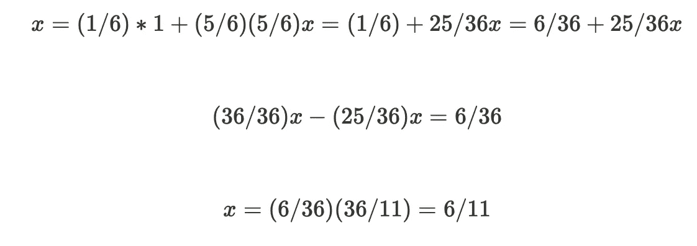

因此，如果我们先行，获胜的概率是 6/11，而我们朋友在第二个回合获胜的概率是 5/11（1–6/11）。请参见下面的树状图。

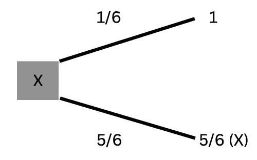

**问题 2**

***你从一个 8*6 的网格底部开始。你只能向上或向右移动。你通过中心的概率是多少？***

***关键概念：组合（顺序无关），计数的乘法规则***

对于这些类型的问题，通常将概率定义为频率，即（相关事件的数量）/（总事件的数量）是有帮助的。这样做可以帮助我们将问题分解，并尝试求解分子和分母。

让我们首先尝试找出分母，即可能事件的总数。在这种情况下，我们可以从起点（0，0）移动到终点（8，6）的总方式数。我们需要做多少步才能到达这一点？我们需要做 8 次向上移动和 6 次向右移动，总共 14 步。如果我们将向上移动定义为 U，向右移动定义为 R，那么一种移动方式是

UUUUUUUURRRRRR，即 8 次向上移动后跟 6 次向右移动。

这会将我们带到目的地。然而，我们也可以这样做。

RRRRRRUUUUUUUU，即 6 次向右移动后跟 8 次向上移动。

我们可以继续列举所有可能性，但可能有更简单的方法。总的来说，我们从（0，0）到（8，6）有 14!种移动方式，（第一次移动有 14 种方式，然后第二次有 13 种方式，依此类推）。

然而，这会导致重复计算，因为我们可以重新排列初始的 6 个 R，而不会改变结果，即***顺序无关紧要***。因此，我们必须将总数除以排列这 6 个 R 的方式数，即 6!。同样，我们也将总数除以排列 8 个 U 的方式数（8!）。这给我们：

14! / (8!6!) = 3003。

你们中的一些人可能会认识到这是组合公式。没错。因为顺序无关紧要，这与 14 选 8 是一样的。好的，我们知道了分母的值，但分子呢？记住，我们需要找到通过网格中心点（即点（4, 3））到达点（8, 6）的所有路径。解决这个问题的最简单方法是将旅程分成两部分。

首先，我们需要找到从（0, 0）到（4, 3）的移动方式数，然后找到从（4, 3）到（8, 6）的移动方式数。然后将这些值相乘以得到分子的总数。

我们可以使用与分母相同的思维过程。在这里，我们必须总共进行 4 次右移和 3 次上移，或者 4+3 = 7 次总移动。一个可能的路径是：RRRRUUU。再次，排列这些字母有 7!种方法，我们需要除以排列 4 个 R 的方式数（4!）和排列 3 个 U 的方式数（3!）。

(0, 0) -> (4, 3)：7!/(4!3!) = 35

我们再次应用相同的原则来计算从（4, 3）到（8, 6）的路径数。这与第一部分完全相同，即 7 次总移动，4 次右移和 3 次上移。

(4, 3) -> (8, 6)：7!/(4!3!) = 35

因此，我们的答案是***(35*35) / 3003 = 1225 / 3003 = 175 / 429.***

**问题 3**

***给两个骑手发放了一张折扣券。使用优惠券的概率为 P。给定至少一个骑手使用了优惠券，两者都使用优惠券的概率是多少？***

***关键概念：贝叶斯定理，二项分布，独立性***

解决这个问题的方法不止一种，我将在这里讨论两种。第一种方法是使用贝叶斯定理，我们通常可以通过一些条件语句识别这些类型的问题。在这种情况下，**给定**至少一个骑手使用了优惠券的情况下，两者都使用优惠券的概率是多少？我们可以将这些事件定义如下：

+   ***至少一个骑手使用了优惠券（A）***

+   ***两名骑手都使用了优惠券（B）。***

我们想找到给定 A 的情况下 B 的概率，我们可以使用下面的贝叶斯定理来计算。

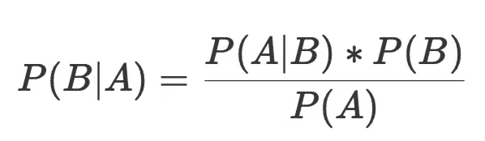

贝叶斯定理

剩下的就是计算每个组件并将它们代入方程。让我们从 P(A|B) 开始，即在两名骑手都使用优惠券的情况下，至少有一名骑手使用优惠券的概率。这显然是 1，因为如果两名骑手都使用优惠券，至少有一名骑手会使用。P(B) 是什么？我们知道使用优惠券的概率是 P，并且假设每名骑手是独立的，我们可以说两名骑手都使用优惠券的概率是 P*P=P²（乘法规则）。

+   P(B) = 骑手 1 使用优惠券的概率 **且** 骑手 2 使用优惠券的概率 = P*P = P²

计算 A 的概率（P(A)）会有点复杂。至少有 1 个骑手使用优惠券的概率等于 1 个骑手使用优惠券 **或** 2 个骑手使用优惠券的概率。由于每个骑手使用或不使用优惠券的概率是相同的，我们可以使用二项分布来描述这个问题。

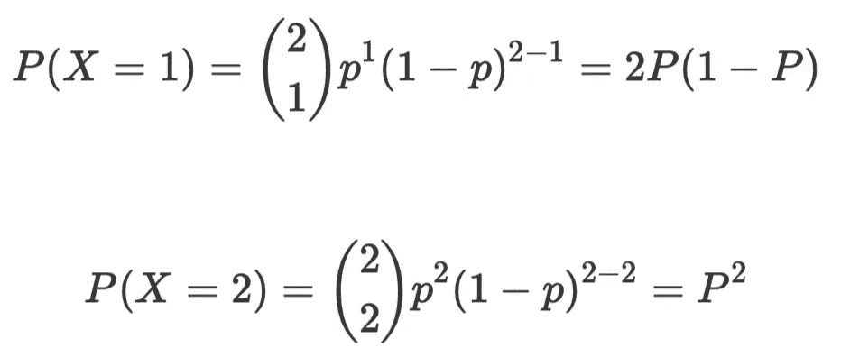

二项分布

要获得总概率，我们只需将这些值相加（加法规则）。将这些值代入公式中，我们得到下面的答案。

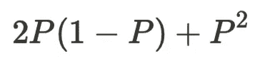

P(A)

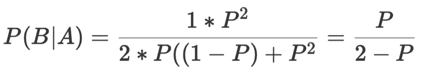

解决方案

**替代解决方案**

如上所述，还有一种更简单的解决方案。我们可以列出所有可能性。如果我们让 X 代表骑手使用优惠券，Y 代表骑手不使用优惠券，我们有：

+   ***XX: 两名骑手都使用了优惠券***

+   ***XY: 骑手 1 使用优惠券而骑手 2 不使用优惠券***

+   ***YX: 骑手 1 不使用优惠券而骑手 2 使用优惠券***

+   ***YY: 两名骑手都没有使用优惠券***

现在，如果我们条件化在至少一名骑手使用了优惠券的情况下，我们只剩下前 3 种可能性。现在的概率就是我们想要的事件除以所有可能事件的总数。

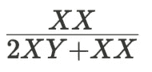

代入 P 作为骑手使用优惠券的概率，我们得到与第一个解决方案相同的结果。

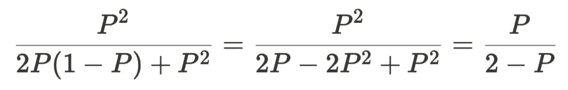

替代解决方案

**问题 4**

***假设你* 观察了 3 个连续的 5 次抛硬币序列。至少有一个序列全是正面。这枚硬币有偏吗？***

***关键概念：假设检验，二项分布，独立性***

第二个问题是一个有趣的问题，我在面试中遇到过，可能会有点棘手。在我看来，解决这个问题的最简单方法是尝试将问题分解成几个步骤。首先，我们定义硬币有偏的含义。一个硬币有偏的定义是得到正面的概率不是 1/2。接下来，我们需要考虑如何测试这个问题。为了评估硬币是否有偏，我们基本上需要进行假设检验。

为了制定我们的假设检验，我们首先假设硬币是公平的，即我们的原假设是 p = 0.5（即掷出正面的概率），我们的备择假设是 p ≠ 0.5。然后我们在这个假设下计算观察到这个事件序列的概率。如果概率非常低（低于某个阈值，即 p < 0.05），我们拒绝我们的假设并得出结论：硬币有偏。我们如何计算观察到这个事件序列的概率？

***记住，得到至少一个全正面的序列的概率与得到 0 个全正面序列的概率的 1 减去相同。或者，我们可以计算得到正好 1 个全正面序列 + 2 个全正面序列 + 3 个全正面序列的概率。***

为了找到这个概率，我们需要计算以下内容

+   ***5 次翻转中得到 5 个正面的概率：即 HHHHH***

+   ***得到恰好 0 个全正面序列中的 3 个序列的概率。***

+   ***我们需要从 1 中减去这个概率，以得到至少一个全正面序列。***

这个问题由两个二项分布组成两个部分。第一个部分是 5 次翻转中得到 5 个正面。然后我们可以将这个概率作为输入用于我们的第二个二项分布，3 个 5 次翻转的序列，其中 p 是第一个部分的答案。

考虑第一次序列包含 5 次翻转。我们试图计算什么？我们想知道在 5 次翻转中得到 5 个正面的概率。如果我们定义成功的概率为得到一个正面，我们有

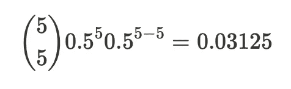

好的，现在我们知道 5 次翻转中得到 5 个正面的概率。对于第二部分，我们可以再次应用二项式公式，因为每个序列具有相同的概率且都是独立的。我们有 3 次试验，我们希望其中 0 次是 HHHHH。

现在我们有 n = 3，k = 0，p = 0.03124 和 1-p = 0.96875。

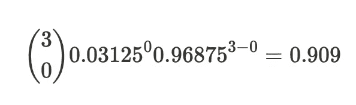

记住，这是看到所有零个正面序列的概率，因此得到至少一个全正面**1–0.909 = 0.09**。

这本质上是我们的假设检验的 p 值。这个值没有低于我们 0.05 的阈值，因此我们没有足够的证据来拒绝硬币是公平的假设。这也应该有直观意义，因为你通常需要更多的硬币翻转来确定它是否有偏。

**问题 5**

***你每天从一个正态分布的随机变量 X — N(0,1)中抽取一次。你获得大于 2 的值的预期天数是多少？***

***关键概念：期望值，正态分布，经验法则，几何分布***

要解决这个问题，我们需要认识到我们正在计算某个事件发生之前的期望时间。我们也可以将其框架化为***第一次成功之前的试验次数，你可能会认识到这是一个几何分布***。换句话说，我们需要找到几何分布的期望值。几何分布的均值是 1/p。这个问题与我们期望在掷骰子之前看到 4 的次数是完全一样的。答案是 1/(1/6) = 6 次掷骰子。

解决这个问题的关键是找到正确的 p 值。我们知道我们的分布是均值为 0，标准差为 1 的正态分布。如果我们从这个分布中抽样，得到值为 2 的可能性有多大？

好吧，2 是距离均值 2 个标准差。根据经验法则，我们知道曲线> 2 个标准差的面积大约是 0.025。因此，我们在任何给定的一天观察到值> 2 的概率是 0.025。这就是我们的 p 值。

现在，我们只需计算 1/0.025 = 40。换句话说，我们期望等到 40 天后才能看到一个 2。

**问题 6**

***你掷 100 枚公平的硬币。如果 60 枚或更多正面朝上，你赢得$10，其他所有结果都不赢。你应该为$1 玩这个游戏吗？***

***关键概念：期望值，二项分布，中心极限定理，经验法则***

你应该将这个问题识别为一个期望值问题。我们想知道玩这个游戏获得的期望收益是否大于玩游戏的期望成本。

我们可以如下定义游戏的期望值：即，玩这个游戏的成本是$1，如果我们得到 60 次或更多的正面，我们将赢得$10，如果得到少于 60 次正面，我们将赢得$0。

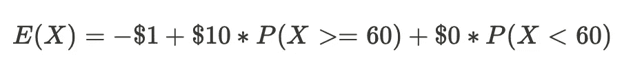

好的，这个问题归结为寻找 P(X≥60)。经过一点思考，我们可以认识到，在 100 次掷币中获得 60 次或更多正面应该是二项分布，N = 100，p = 0.5（假设是公平的硬币）。现在，我们只需要使用二项分布找到获得 60 次或更多正面的概率。做这个的长方法是逐一计算获得 60 + 61 + 62 + … + 100 次正面的概率。这似乎有点低效，那么有没有其他方法可以使这个计算更容易呢？

请注意，我们的样本量是 100 次掷币。希望你能认识到中心极限定理（CLT）可以在这里帮助我们，因为 N > 30。我承认，这并不是世界上最显而易见的洞见，但你练习这些问题越多，就越容易发现像这样的情况。为什么 CLT 在这里有用？我们知道如果应用 CLT，那么采样分布将大致是正态分布。由于这是一个表现良好的分布，我们只需要知道均值和标准差即可定义整个分布。如果我们知道分布，我们就可以轻松计算所需的概率。

我们首先需要计算硬币投掷的均值和标准差。由于它们遵循[二项分布](https://online.stat.psu.edu/stat414/lesson/28/28.1)，我们有：

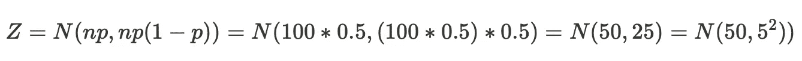

因此，我们的均值为 50，标准差为 5。关于正态分布我们还知道什么？如果你记得经验规则，它指出大约 95% 的分布在均值的 2 个标准差范围内，我们可以利用这一点计算所需的概率。60 距离均值 2 个标准差，我们知道大约 2.5% 的分布在这一点之上。

因此，P(X≥60) 大约是 0.025。现在我们可以直接将其代入上述期望值方程中。

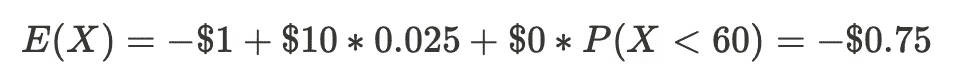

这个游戏的期望值为负，因此我们不应该玩它。我非常喜欢这个问题，因为它需要应用概率和统计的几个方面才能解决。

**问题 7**

***在不盈利的时期，公司有时会暂停支付股息。假设在支付股息后，下一个股息支付的概率为 0.9，而在暂停股息后，下一个股息也会以 0.6 的概率暂停。长期来看，将支付的股息的比例是多少？***

***关键概念：马尔可夫链，平稳分布***

这个问题可以被表述为具有 2 个状态的马尔可夫链。

+   支付股息

+   支付股息 暂停

为什么可以表示为马尔可夫链？因为这个问题具有马尔可夫性质（无记忆性）。在时间 t+1 进入任何状态的概率仅取决于你在时间 t 时的状态。即我们是在支付股息状态还是暂停股息状态？时间 t-1、t-2 等的状态不会影响我们下一个状态的概率。

问题给出了这两个状态之间的转移概率。如果我们处于支付股息状态，我们将在该状态下保持的概率为 0.9，因此以概率 0.1 转移到暂停状态。如果我们处于暂停股息状态，我们将以 0.6 的概率保持在该状态，并以 0.4 的概率转移到另一个状态。我们可以将其表示为以下转移矩阵：

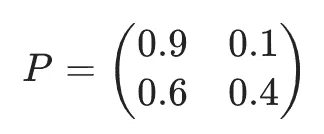

转移矩阵

问题要求我们解决马尔可夫链的平稳分布，即长期均衡状态。在这种情况下，随着时间的推移，概率分布保持不变。即如果我将当前状态与转移矩阵相乘，我会得到相同的值。这种情况在以下方程中描述。

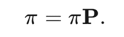

平稳分布

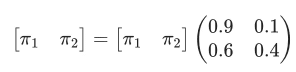

平稳分布

我们在这里要做的就是解这组方程以求出 pi1 和 pi2。由于概率必须加起来等于 1，因此 pi1+pi2 = 1。

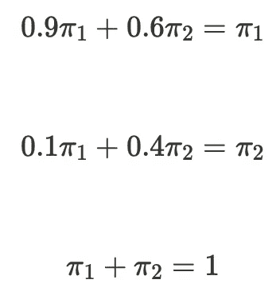

方程

如果我们解这个方程组，我们会得到如下结果

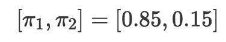

解答

因此股息将会支付 ***长期来看大约 85%的股息将会支付。***

# **结论**

下面是一些额外的参考资料，我认为它们将有助于你的准备，并深入探讨我在这里没有涵盖的话题。

# **参考文献**

[1] [Joseph K. Blitzstein 和 Jessica Hwang 的《概率论导论》](https://drive.google.com/file/d/1VmkAAGOYCTORq1wxSQqy255qLJjTNvBI/view)

[2] [Zenefits Glassdoor 面试问题](https://www.glassdoor.com/Interview/Alice-and-Bob-take-turns-in-rolling-a-fair-dice-Whoever-gets-6-first-wins-the-game-Alice-starts-the-game-What-are-the-QTN_1831416.htm)

[2] [`www.stat.berkeley.edu/~aldous/150/takis_exercises.pdf`](https://www.stat.berkeley.edu/~aldous/150/takis_exercises.pdf)

[3] [Lyft Glassdoor 面试问题](https://www.glassdoor.com/Interview/1-Lyft-wants-to-launch-ride-share-program-What-are-the-most-important-KPIs-would-you-track-2-Lyft-is-trying-to-optimiz-QTN_4697390.htm)

[4] [递归方法](https://www.probabilitycourse.com/chapter14/Chapter_14.pdf)

[5] [中心极限定理](http://stat88.org/textbook/content/Chapter_08/00_Central_Limit_Theorem.html)

[6] [二项分布](http://stat88.org/textbook/content/Chapter_03/03_The_Binomial_Distribution.html)

# 你可能会对我的其他帖子感兴趣

 ## 构建流数据管道

### Apache Beam 和 DataFlow 实时数据管道

towardsdatascience.com  ## 使用 Snowflake 和 Dask 构建机器学习管道

### 引言

towardsdatascience.com  ## 贝叶斯时间序列预测方法

### 今天我们将从零开始在 R 中实现贝叶斯线性回归，并用它来预测美国 GDP 增长…

towardsdatascience.com
