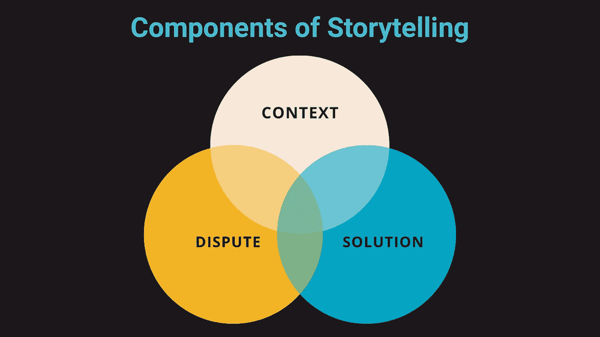
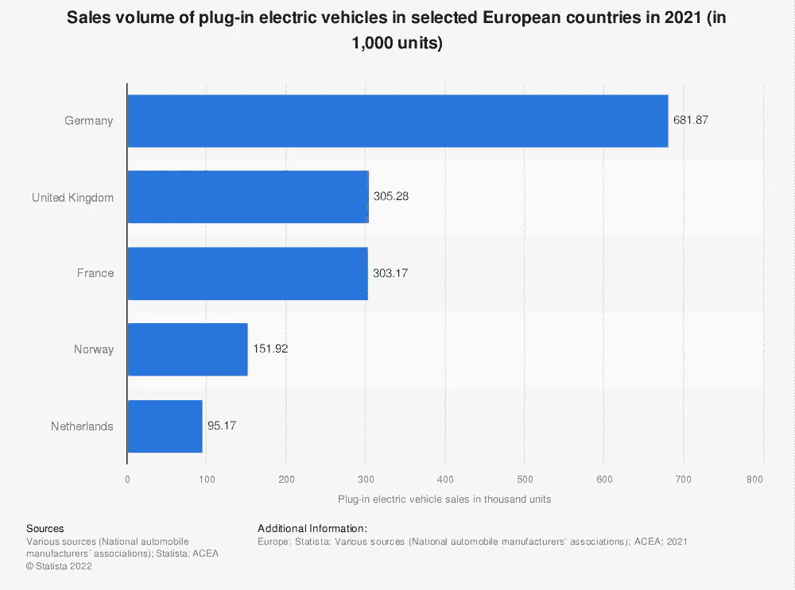
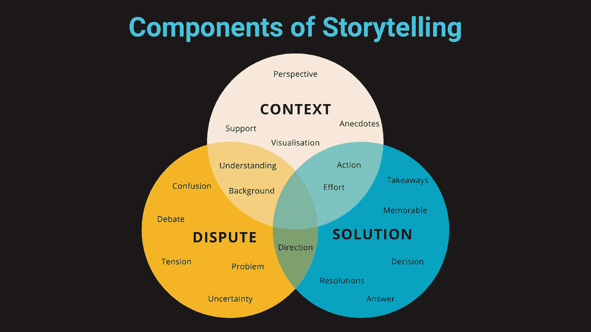

# 数据讲故事基础：数据科学家和 AI 从业者的核心策略

> 原文：[`towardsdatascience.com/data-storytelling-101-essential-strategies-for-data-scientists-and-ai-practitioners-b6843891ec8d`](https://towardsdatascience.com/data-storytelling-101-essential-strategies-for-data-scientists-and-ai-practitioners-b6843891ec8d)

## 向同事和客户展示枯燥无味的数据的时代已经结束！

 [Richmond Alake](https://richmondalake.medium.com/?source=post_page-----b6843891ec8d--------------------------------)

·发布在 [Towards Data Science](https://towardsdatascience.com/?source=post_page-----b6843891ec8d--------------------------------) ·13 分钟阅读·2023 年 1 月 10 日

--

发掘数据讲故事的力量，将你的职业生涯提升到新的高度！在这篇文章中，你将学习如何利用数据讲故事来吸引观众，让你的信息深入人心，并从竞争中脱颖而出。

无论你是经验丰富的专家还是刚刚起步，这些技巧将帮助你将数据转化为引人入胜的叙事，从而推动结果。通过阅读本文，你将获得一个框架，将数据讲故事的关键要素融入你的下一次演示、提案或提议中。

> *但你为什么需要关心呢？*

作为一名 AI 或数据从业者，你将技术概念和数据见解转化为易于理解的术语的能力对于赢得利益相关者的支持和推动项目成功至关重要。

交叉口上的一个人 - 图片由作者在（Canva Text-to-Image）创建

**你正站在两条道路的交汇处；道路#1 尽是从数据中提取的见解和智慧，而道路#2 则是项目利益相关者、业务经理以及那些决定你命运的人（有点戏剧化，但你明白了）。**

为了确保利益相关者理解技术需求、附加值以及数据科学团队工作的影响，数据科学家、数据工程师和机器学习（ML）工程师必须有效沟通。你本质上控制着这两条道路交汇处的流量。

## 本文旨在：

+   在数据科学和机器学习的背景下引入讲故事技巧

+   提供培养讲故事技能的技巧

+   强调有效讲故事在数据科学中的好处

+   提供一个框架，你可以采用这个框架在各种场景中融入讲故事的元素，例如向非技术性利益相关者展示数据集。

# 数据驱动的讲故事

我们首先提出问题：

> *卓越讲故事的要素是什么？*

照片由[Product School](https://unsplash.com/@productschool?utm_source=unsplash&utm_medium=referral&utm_content=creditCopyText)提供，来源于[Unsplash](https://unsplash.com/s/photos/speaking-to-crowd?utm_source=unsplash&utm_medium=referral&utm_content=creditCopyText)

为了理解数据讲故事的力量，让我们看一个案例研究，展示一个讲述良好的数据故事的关键元素。通过分析一个实际的例子，你将更好地理解有效的数据讲故事的样子，以及如何在你的工作中使用这些技巧。

作为背景，这篇文章的作者使用数字、数据和信息来阐述全球普遍问题的影响以及缺乏行动的负面后果。在这种情况下，利用数据讲述特定的故事，使所呈现的问题变得真实，同时也使提出的解决方案变得既切实又可实现。

在这篇文章中，作者利用数据将全球问题生动呈现，并使提出的解决方案变得切实可行。通过使用数字、数据和信息来说明这些问题的影响及不作为的后果，作者有效地讲述了一个故事，使所呈现的问题变得真实，解决方案也变得可以实现。

# 解剖一个用数据讲述的好故事

图片来自 Canva

随着全球人口继续增长，特别是在非洲，我们看到了一系列后果，包括经济繁荣、收入差距扩大和财富分配不均。人口规模的增加对一个国家、地区或大陆可能产生各种影响。

[Ashley Kirk](https://www.linkedin.com/in/ashleyjkirk/)，曾是《电讯报》的数据记者，在文章[*非洲在 100 年后的模样*](https://s.telegraph.co.uk/graphics/projects/Africa-in-100-years/index.html)中讨论了人口规模的增加对非洲经济的意义。

Ashley 从拉各斯、达喀尔和开罗等主要城市的视角，利用数据和动态可视化将非洲的持续变革生动呈现。讲故事的方式不仅在战略上构建了任何优秀数据驱动叙述的基本结构，还将事实信息、轶事、数据、图表和图形无缝结合，创造出引人入胜且信息丰富的主题叙述。

文章的开头部分描述了情况的背景和要点：

*“非洲能否将其庞大的人口增长转化为经济发展和生活质量的提升？”*

开篇部分提供了背景并为主要观点奠定了基础，而事实信息和关键日期、数字以及第一手陈述则使叙事扎根于现实中。图表和图形帮助可视化非洲主要城市的转变，突出显示人口增长、教育水平和预期寿命等关键数据点。

文章的中段深入探讨了这些城市面临的冲突和问题，利用数据、轶事和个人经历来描绘挑战和机遇的复杂图景。最终，这篇文章展示了数据实践者如何利用数据讲述一个强有力的人性化故事，与读者产生共鸣。

数据科学中的讲故事不仅仅是呈现事实和数字——它是关于创建一个与观众产生共鸣的相关且卓越的叙事。这就是为什么 Ashley 的文章包含了来自焦点城市中个人的亲身经历和轶事，为数据驱动的分析增添了人性化的色彩。

在整篇文章中，Ashley 还结合了专家访谈，以提供额外的背景和理解这些变化如何影响人们的生活。

Ashley 的文章提出了许多问题，但通过讨论已经实施或正在提议的解决方案，最终达到了高潮。机构采取行动解决教育、气候和冲突等问题的存在，增强了 Ashley 对读者的叙事。

在下一节中，我们将为你提供一个逐步框架，帮助你构建自己的数据驱动故事，以便在下一个演示、文章或视频中有效地向利益相关者展示你的发现。

# 数据科学讲故事的有效框架

故事讲述的成功可以归结为三个关键要素：背景、叙事和数据。将这些元素结合起来，可以创建一个引人入胜的故事，打动你的观众并推动你的议程。无论你讲述的是事实还是虚构的故事，这些组件都是构建有意义、数据驱动的叙事的必需要素。

有效的数据故事讲述依赖于三个关键要素：**背景**、**争议**和**解决方案**。这些元素在下面的图像中进行了说明，并为构建引人入胜的故事奠定了基础。在本节中，我们将探讨这些关键组件，并了解如何使用它们来提升你的数据故事讲述技巧。考虑到这些组件作为基本要素，显而易见的是，实践者如何将它们与其他方法结合起来，以创建一个用数据讲述的引人入胜的故事，并提升他们的数据故事讲述技能。

讲故事组件的示意图：背景、争议和解决方案 — 作者图

## #1\. 背景

有效的数据讲述的第一步是设定背景。没有背景信息，数据可能会令人困惑和误导，导致项目取消和商业损失。

这就是为什么为你的数据提供背景如此重要——它有助于赋予数字意义，并使你的观众更好地理解当前的问题或主题。记住，仅凭数据不足以提供可操作的见解或有意义的解决方案。必须包括其他支持性元素，使你的数据真正具有意义和影响力。

**故事讲述中的背景信息是为了强化、支持和揭示从数据样本中提取的关键发现，从而提供视角。** 这可以通过多种方式实现，包括使用演员、轶事、可视化、数据标签、图表等。目标是让观众更好地理解数据收集的背景及其与大局的关系。通过包括这些强化材料，你可以帮助你的观众理解数据，并看到你的发现的重要性。

*“2021 年，英国销售了 305,300 辆插电式电动车，同比增长约 140%。” —* [*Statista, acea.auto*](https://www.statista.com/statistics/804772/sales-volume-electric-vehicles-eu/)

上述材料很吸引人，但这些数据在整体上意味着什么？没有背景或个人经历，理解这一数字的意义可能很困难。这就是故事讲述的作用。通过使用轶事、可视化和其他支持材料，我们可以赋予数据意义，并帮助观众更深入地与数据连接。让我们用一个名叫詹姆斯的演员来说明这一点。

> ***作者说明：请注意，以下故事是虚构的，用于说明本文所要表达的观点。***

*“2020 年 2 月，詹姆斯在 M24 高速公路上通勤时，收听了他的早间广播节目《UK today》。节目中的讨论集中在激进分子对石油公司抗议的不断增加，以及向公众普及气候变化的意识。詹姆斯印象深刻的一句话是：“英国的碳足迹是全球平均水平的两倍，这意味着在个人层面上，我们在英国排放的碳气体比地球上大多数人都要多。”*

*这个说法让詹姆斯记忆犹新，他决定采取行动，或者至少做出自己的贡献。詹姆斯回忆起曾听同事谈论电动车，尽管当时因为缺乏兴趣而没有在意。但现在，詹姆斯的兴趣激增，经过对购买大众 ID.3 所需定金的调查，他做出了购买的决定。于是他购买了一辆。到 2021 年中，詹姆斯拥有了一辆电动车。詹姆斯并不是唯一一个决定采取行动的人；还有数百万名英国居民也采取了行动。无论是通过增加回收努力、减少电力和天然气使用还是购买电动车。英国公众对气候变化影响的意识促进了 2021 年电动车销售的增长。因此，2021 年销售的电动车数量超过了 300,000 辆，比去年增长了一倍多。而詹姆斯就是新电动车车主之一。如今，英国在电动车销售数量方面已成为领先国家之一。”*

*“未来主义风格的男人给电动车充电” — 图片由作者提供于* [*MidJourney*](https://www.midjourney.com/app/)

增加的背景信息使用了角色和轶事，使初始数据点更具生命力。图表和图示也是提供背景的重要工具，如下图所示。

图表显示了 2021 年选定欧洲国家的插电式电动车销售量。来源：[欧洲；Statista；各类来源（国家汽车制造商协会）；ACEA；2021](https://www.statista.com/statistics/804772/sales-volume-electric-vehicles-eu/)（CC BY-ND 4.0）

## #2\. 争议

讲故事中的争议是你故事的反派，而解决方案则是迎接挑战的英雄。理解争议为需要解决的问题、冲突或难题会更容易。这是你故事的推动力，也是为什么需要解决方案的原因。没有争议，就不需要解决方案，你的故事就会变得平淡。因此，在构建基于数据的叙事时，明确识别争议以及你的解决方案如何解决它。这将帮助你创建一个引人入胜、富有影响力的故事，与观众产生共鸣。

让我们继续创建一个争议，以有效讲述一个故事，并有效地推动初始数据点的重点：

“*2021 年，英国销售了 305,300 辆插电式电动车，相比去年增长了约 140%。”*

*“英国是一个化石燃料的净进口国，这些燃料用于能源和电力生产。化石燃料驱动我们的交通、电子和技术服务，甚至是依赖化石燃料能源输出的家庭用品。问题在于，英国决心在 2050 年前显著减少对化石燃料的依赖。因此，问题是英国如何减少化石燃料消耗并转向低碳能源来源。除此之外，化石燃料是气候变化的重大贡献者，导致全球气温升高和极端天气。”*

未来主义的图像描绘了化石燃料使用和依赖对世界产生负面影响的场景 *— 图片由作者提供于* [*MidJourney*](https://www.midjourney.com/app/)

## #3\. 解决方案

解决方案是你基于数据讲述故事的核心——它是数据存在的目的，也是背景和争议的原因。在 Ashley Kirk 的文章中，解决方案结合了旨在改善非洲经济的因素的倡议和行动。它包括基础设施发展、改善安全、现代化和国际援助。

解决方案可以有多种形式，例如重新配置现有系统、实施新方法、提高对教育材料的认知。

在数据驱动的故事中展示解决方案时，重要的是要直接、明显和难忘。模糊的解决方案可能会引发更多问题，并削弱你的信心和呈现效果。清晰、可操作的解决方案允许后续步骤，并帮助你的计划在竞争激烈的领域中脱颖而出。是时候不再把自己当作个体，而是将自己视为通过每个项目完成销售自己及其服务的公司。

让我们根据我们正在构建的初步数据点和解决方案将要解决的争议来完成解决方案的制定。以下是初步数据点和争议的提醒。

数据点：

*“2021 年，英国售出了 305,300 辆插电式电动车，同比增长约 140%。”*

争议：

*“英国是一个化石燃料的净进口国，这些燃料用于能源和电力生产。化石燃料驱动我们的交通、电子和技术服务，甚至是依赖化石燃料能源输出的家庭用品。问题在于，英国决心在 2050 年前显著减少对化石燃料的依赖。因此，问题是英国如何减少化石燃料消耗并转向低碳能源来源。除此之外，化石燃料是气候变化的重大贡献者，导致全球气温升高和极端天气。”*

以下是提议的解决方案：

“詹姆斯减少碳足迹的旅程始于意识。公众对化石燃料依赖问题及其对环境的损害的认识是实现英国到 2050 年减少化石燃料依赖的国家目标的第一步。为了覆盖像詹姆斯这样的更多人群，我们提议扩展 WWF 碳足迹应用程序，加入 AI 驱动的功能，实现基于历史数据和预测的能源需求的家庭能源消耗预测。这个扩展计划将需要 1 亿英镑的资金，并将在项目批准后一年向公众发布。”

再次说明，我提出的解决方案是虚构的，仅用于说明目的。为了明确，提出的解决方案引用了故事，使其更易记忆。我包括了有关项目成本和时间表的信息，以显示它的直接性。如果我们愿意，我们可以轻易发现我快速整理的这个虚构解决方案中的缺陷，但你应该从中得到的是构成一个理想解决方案的元素：难忘和简单明了。

“数据讲述既是一门艺术，也是一门科学，作为 AI/数据从业者，我们可以将其拆解成易于遵循的步骤。正如广泛讨论的，一个引人注目的数据驱动故事应包括以下组件：

1.  **背景** — 为你的叙述奠定基础并提供一些背景信息。

1.  **争议** — 讨论与背景相关的问题。

1.  **解决方案** — 最终，解释和讨论能够解决或缓解所识别问题的解决方案。

# 将这些部分整合在一起

图片由 [Mourizal Zativa](https://unsplash.com/@mourimoto?utm_source=unsplash&utm_medium=referral&utm_content=creditCopyText) 提供，来源于 [Unsplash](https://unsplash.com/s/photos/lego?utm_source=unsplash&utm_medium=referral&utm_content=creditCopyText)

总结一下，这是你在编写数据驱动故事时可以遵循的框架：

1.  **开头部分**：以一个突显争议影响或解决方案价值的事实陈述开头。用几段文字扩展，介绍和解释背景。

1.  **中间部分**：在背景中介绍和扩展争议。使用轶事、事实、数据、图表和图解来说明问题。然后，介绍并扩展有关解决方案的争议。使用轶事、事实、数据、图表和图解展示提出的解决方案的影响和附加价值。

1.  **结束部分**：总结时，通过对比现实情况来展示没有解决方案的负面后果和拥有解决方案的好处。包括一个行动呼吁作为下一步，概括用数据讲述的故事的期望结果。

结合有效的数据驱动故事所需的关键组件、元素和考虑因素，你将得到下方所示的图表。

讲故事的组件、元素和考虑因素的完整图示 *— 图片由作者提供*

当我们在争议和解决方案的旁边提供背景时，我们创建了一个强大的三位一体，帮助个人理解问题、感到有动力去解决问题，并知道如何采取行动。

通过将数据进行情境化并用背景信息支持关键消息，我们可以创造出一个更具信息性和参与感的公众。无论是通过轶事、可视化还是数据标签，目标是提供增强数据驱动故事影响力和理解的背景。

# 摘要

随着公司、社会和世界变得越来越数据驱动，我们将看到对人工智能可解释性和数据简化的需求上升。所有层次的 AI 和数据行业从业者和专业人士需要培养数据讲故事的技能，以弥合技术领域、数据集和技术与非技术利益相关者、客户以及广泛社会之间的理解差距。

你的数据讲故事之旅并不会在这里结束。还有许多其他方面的技能培养未在本文中涉及，如通过数据可视化、设计考虑、文档等来提升数据讲故事的演示和提案。然而，本文中的三个步骤将为你提供一个坚实的基础，帮助你开始建立数据讲故事的技能。

下一步是将本文中的学习应用到你的下一个项目、实践或组织中。我将在接下来的文章中深入探讨增强数据讲故事演示材料的内容。

# 希望你觉得这篇文章有用。

要与我联系或找到更多类似于本文的内容，请执行以下操作：

1.  [**支持我的写作**](https://richmondalake.medium.com/membership) 通过成为推荐的 Medium 会员

1.  订阅我的[**YouTube 频道**](https://www.youtube.com/channel/UCNNYpuGCrihz_YsEpZjo8TA)

1.  订阅我的播客 [**Apple Podcasts**](https://apple.co/3tbXlIa) **|** [**Spotify**](https://spoti.fi/38IIC06) **|** [**Audible**](https://amzn.to/3m62Vb3)

1.  订阅我的[**电子邮件列表**](https://richmond-alake.ck.page/c8e63294ee) 以获取我的新闻通讯

## **接下来阅读什么 👇🏾**

 ## Ken Jee 的 数据科学职业建议

### 关于在人工智能和数据领域内学术及职业路径的建议

towardsdatascience.com

[**本文的一个版本已发布在 Nvidia 数据科学博客**](https://developer.nvidia.com/blog/data-storytelling-best-practices-for-data-scientists-and-ai-practitioners/)。
