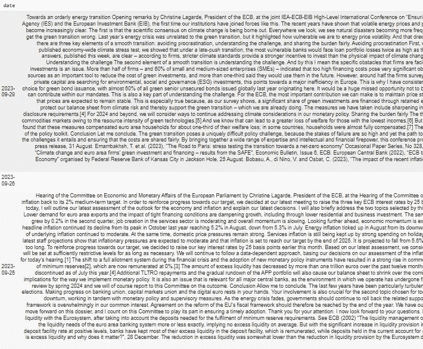

# 数据讲故事与动态词云

> 原文：[`towardsdatascience.com/data-storytelling-with-animated-word-clouds-1889fdeb97b8`](https://towardsdatascience.com/data-storytelling-with-animated-word-clouds-1889fdeb97b8)

## 动态词云将经典词云转换为动态可视化。了解更多关于在 Python 中讲述数据故事的信息。

[](https://petrkorab.medium.com/?source=post_page-----1889fdeb97b8--------------------------------)[](https://towardsdatascience.com/?source=post_page-----1889fdeb97b8--------------------------------) [Petr Korab](https://petrkorab.medium.com/?source=post_page-----1889fdeb97b8--------------------------------)

·发表于 [Towards Data Science](https://towardsdatascience.com/?source=post_page-----1889fdeb97b8--------------------------------) ·阅读时间 5 分钟·2023 年 11 月 22 日

--

来源：[AnimatedWordCloud](https://pypi.org/project/AnimatedWordCloud) 库。图片由作者提供。

# 引言

动态词云展示了 n-gram（连续文本样本项的序列）**随时间变化的绝对频率，以视频文件中的一系列图像呈现。** 它给予在源文本中出现频率较高的词语更多的重要性。n-gram 的显示越大越粗体，它在文本中出现的频率就越高。它基于经典词云的直观逻辑，并为可视化添加了时间视角。

由于如今许多文本数据集作为多个时期的文本观察被收集，如何可视化数据随时间的变化成为一个特别的挑战。与其为多个不同的时期制作汇总表或图表，不如准备一个 MP4 视频，讲述故事，吸引观众，并为展示增添“哇”的效果。

本文将描述如何在 Python 中从文本数据生成动态词云。以下是[AnimatedWordCloud 库](https://pypi.org/project/AnimatedWordCloud/)的一些独特功能：

+   *提供所有拉丁字母语言的 n-gram 频率可视化*

+   *从标点符号、数字和* [*NLTK 停用词列表*](https://pythonspot.com/nltk-stop-words/) *中清理文本数据集*

+   *生成每年或每月的 n-gram 频率。*

图片 1\. [经济学研究趋势的动态词云](https://www.youtube.com/watch?v=-2gH7Xfn0AI)

# 如何使用

要使用该库，请遵循以下步骤：

## 1\. 安装

为项目创建一个新的 Python 3.8 虚拟环境，以避免任何依赖冲突。*AnimatedWordCloud* 依赖 Python 3.8，因为其可视化 [要求](https://github.com/PetrKorab/Animated-Word-Cloud/blob/main/requirements.txt)。要使用 pip 安装，请使用：

```py
pip install AnimatedWordCloud
```

> 在 Pycharm 社区版中进行了测试。建议使用此 IDE，并在 .py 文件中运行代码，而不是在 jupyter notebook 中。

## 2\. 生成帧

我们将关注欧洲中央银行（ECB）的沟通，并了解银行委员会成员在 1997–2023 年期间讨论的概念。数据集来自 [ECB 网站](https://www.ecb.europa.eu/press/key/html/downloads.en.html)，发布时具有灵活的 [许可](https://www.ecb.europa.eu/services/using-our-site/disclaimer/html/index.en.html#c)。

数据包含 2846 行，并具有 NaN 值，*AnimatedWordCloud* 可以有效处理。数据如下所示：



图片 2\. ECB 演讲数据集

让我们导入数据。

```py
import pandas as pd

data = pd.read_csv('dataset.csv')
```

然后导入 *animated_word_cloud* 方法。

> **编辑 2023 年 12 月**：AnimatedWordCloud 已不断更新新参数。查看 [PiPy](https://pypi.org/project/AnimatedWordCloud/) 以获取当前版本。

它提供以美国 (*MM/DD/YYYY)* 或欧洲风格 (*DD/MM/YYYY)* 日期和时间格式读取数据。它在输入时自动清理数据中的标点符号和数字。它还可以移除 [NLTK](https://www.nltk.org/) 语料库中语言的标准停用词列表。

```py
from AnimatedWordCloud import animated_word_cloud

animated_word_cloud(text=data['contents'],  # Read text column
          time=data['date'],                # Read date column
          date_format = 'us',               # Read dates in US date format
          ngram=1,                          # Show individual word frequencies
          freq='Y',                         # Calculate yearly frequencies
          stopwords=['english', 'french',   # Clean from English, French,
                     'german', 'spanish'])  # German and Spanish stop words
```

该代码每个周期生成 90 个 PNG 帧，并在工作目录中创建一个 *.postprocessing/frames* 文件夹来存储这些图像。

## 3\. 从图像创建视频

最后一步是将单独的帧制作成视频文件。此步骤将在未来版本中自动化，但目前：

从 [这里](https://github.com/thisIsMikeKane/WordSwarm/tree/master/3-Postprocessing) 下载 *ffmpeg* 文件夹和 *frames2video.bat* 文件，并将其放入 *postprocessing* 文件夹中。接下来，运行 *frames2video.bat*，这将生成一个 *wordSwarmOut.mp4* 文件，这是所需的输出。

图片 3\. [欧洲中央银行家演讲的动画词云](https://www.youtube.com/watch?v=oOgEpGtsJaI)

让我们通过中央银行家的视角讲述欧元区的故事：

+   在 **1999 — 2002** 年期间，关键主题是欧元引入 *（“加入”、 “欧元”）*

+   **2003 — 2006** 年间，银行家们主要讨论了标准货币政策实施问题 *（“货币”、 “金融”、 “市场”、 “政策”）*

+   在即将到来的金融危机中，**2008 — 2012** 年的关键主题是 *“流动性”、 “危机” 和 “银行”*

+   重要时期出现在 **2021** 年，COVID-19 经济影响 (*“大流行”*) 和乌克兰战争导致通货膨胀成为主要话题。

这些发展对任何对欧元历史感兴趣的人来说都是显而易见的。但呈现这些信息是一项具有挑战性的任务。例如，我们可以使用（1）关键词的 n-gram 频率分析，并生成多个关键词频率表，或（2）显示一个热图（或一个[矩阵图](https://www.betterevaluation.org/methods-approaches/methods/matrix-chart#:~:text=A%20matrix%20chart%20shows%20relationships%20between%20two%20or,a%20crosstabulation%20that%20divides%20data%20between%20the%20variables.)），x 轴上为时间段，y 轴上为单词，矩阵中的项为单词频率。另一种选择（3）是为每个时期生成多个词云。这些方法都不适合较大的数据集，而动态词云为传递信息提供了另一种选择。

# 实际应用

该库主要用于**演示**和**教学**。文本挖掘现在与经济学、政治学或商业等其他学科相融合，教师、分析师和学生现在可以使用一种不同、更具吸引力的方式来呈现事实。

+   你是一位对科学历史感兴趣的历史学家吗？那么，尝试从像[Constellate](https://www.constellate.org)这样的平台下载文本数据集，如文章标题或期刊摘要，准备一个视频文件，并告诉你的学生 AI 在已发表研究中的历史。从 1900 到 2018 年的经济数据研究趋势分析项目可能会为你提供一些灵感，我们在[这篇文章](https://python.plainenglish.io/animated-word-cloud-a-novel-way-for-the-visualization-of-word-frequencies-6505418acbb3)中有描述。

+   你想展示你的营销团队客户对你产品的看法吗？那就使用来自外部平台（如 Amazon）的产品评论，解释客户提到的词汇。是*“快速”*和*“交付”*，还是*“好”*和*“棒”*？还是频繁出现的词汇是*“差”*、*“坏”*和*“质量”*？讲述一个故事以传达信息，并观察其随时间的变化。

我们与 Jarko Fidrmuc 和 David Štrba 合作的早期 TDS 文章概述了词云如何用于**总结**和**探索性**文本**数据分析**。以动态形式展示文本数据集的结构，可以更好、更易理解地呈现时间序列数据。

其他有趣的应用案例，如使用 X-tweets 对**COVID-19 相关讨论**或**美国总统辩论**进行建模，可能在学士论文或研讨会论文中也很值得检查。

# 技术说明

在[**WordsSwarm**](https://github.com/thisIsMikeKane/WordSwarm)项目中，[Michael Kane](https://github.com/thisIsMikeKane)开发了用于库中词频动画的核心框架。*AnimatedWordCloud*是我创建的一个[Apache-2.0 许可证](https://github.com/PetrKorab/Animated-Word-Cloud)项目，使代码能够高效地处理各种拉丁字母语言的文本数据集。

它使用了我早期的一个项目，[𝐀𝐫𝐚𝐛𝐢𝐜𝐚](https://pypi.org/project/arabica/)库，用于处理（文本清理和词频汇总）。它依赖于一些比较古老的可视化需求，这些需求非常适合这个项目。[**PyBox2D**](https://pypi.org/project/Box2D/)用于群体中单词的物理和碰撞检测。[**Pyglet**](https://pypi.org/project/pyglet/)（跨平台窗口和多媒体库）以及[**PyGame**](https://pypi.org/project/pygame/)用于创建动画。

它显示了绝对词频，但会对数据进行缩放，以便在不同大小的数据集上显示词云。通过这种方式，词频较大的数据集会被一个常数缩放，从而使词云仍然可以在视频中显示。它处理缺失值，并且使用[***ftfy***](https://pypi.org/project/ftfy)来处理乱码错误。

另一方面，*AnimatedWordCloud*可能在 Jupyter Notebook 和其他 IDE（如 Pycharm）中运行时会遇到困难。我将在下一个版本中查看这些不足之处。在未来的版本中，*AnimatedWordCloud*还将提供**双字频率**，以便更详细地查看人们在文本中讨论的叙述和主题。同时，我还将扩展库的文档。

*PS: 让我知道它在你的项目中效果如何！:)*

*如果你喜欢我的工作，你可以* [*请我喝咖啡*](https://www.buymeacoffee.com/petrkorab) *并支持我的写作。你也可以订阅我的* [*邮件列表*](https://medium.com/subscribe/@petrkorab) *以获得我新文章的通知。谢谢！*
