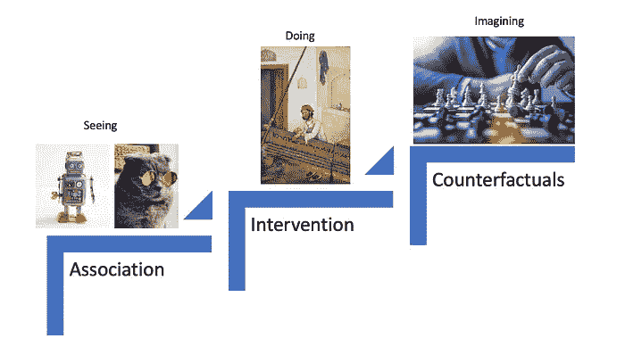

# 数据告诉我们“是什么”，我们总是寻求“为什么”

> 原文：[`towardsdatascience.com/data-tells-us-what-and-we-always-seek-for-why-66da7dc3f24d?source=collection_archive---------6-----------------------#2023-11-08`](https://towardsdatascience.com/data-tells-us-what-and-we-always-seek-for-why-66da7dc3f24d?source=collection_archive---------6-----------------------#2023-11-08)

图片由 [Kelly Sikkema](https://unsplash.com/@kellysikkema?utm_source=medium&utm_medium=referral) 提供，来源于 [Unsplash](https://unsplash.com/?utm_source=medium&utm_medium=referral)

## 《为什么的书》 第一章和第二章，跟我一起阅读系列

 [Zijing Zhu, PhD](https://zzhu17.medium.com/?source=post_page-----66da7dc3f24d--------------------------------)

·

[关注](https://medium.com/m/signin?actionUrl=https%3A%2F%2Fmedium.com%2F_%2Fsubscribe%2Fuser%2F7d83c09fb5d4&operation=register&redirect=https%3A%2F%2Ftowardsdatascience.com%2Fdata-tells-us-what-and-we-always-seek-for-why-66da7dc3f24d&user=Zijing+Zhu%2C+PhD&userId=7d83c09fb5d4&source=post_page-7d83c09fb5d4----66da7dc3f24d---------------------post_header-----------) 发表在 [Towards Data Science](https://towardsdatascience.com/?source=post_page-----66da7dc3f24d--------------------------------) ·9 分钟阅读·2023 年 11 月 8 日 

--

在我的 [上一篇文章](https://medium.com/towards-data-science/read-with-me-a-causality-book-club-edd7085d6ae6) 中，我启动了“与我一起阅读”书友会，以探讨 Judea Pearl 的《为什么的书》。感谢所有表现出兴趣并 [报名](https://zzhu17.medium.com/subscribe) 加入书友会的人。我希望我们可以通过共同阅读和分享见解，深入理解因果关系。两周后，正如承诺的，我将分享从前两章中提取的一些要点。

在这两章中，Judea 首先解释了因果关系的阶梯，并回顾了因果理论的历史发展。我们将进一步深入探讨这三个阶梯。

因果关系的阶梯参考了 Judea Pearl 的理论。

# 阶梯 1：关联

回到 1800 年，从 Galton 到 Pearson，当他们试图理解人类如何遗传基因特征时，他们发现相关性在科学意义上已足够。毕竟，“***数据就是科学的一切***。”对他们来说，因果关系只是相关性的一个特例，永远无法证明。另一方面，相关性足够强大，能够解释为什么高父亲的儿子会比…
