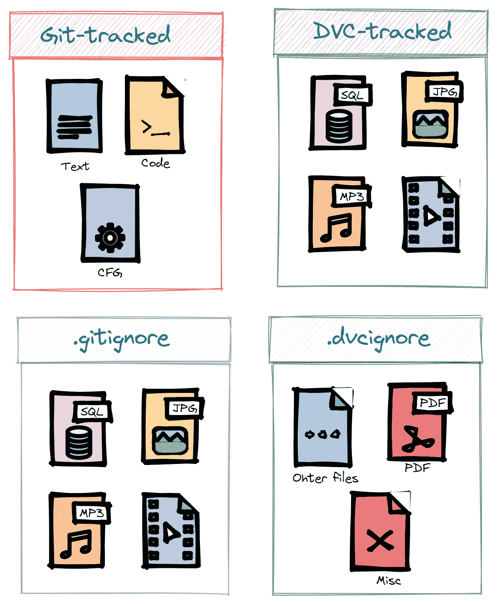
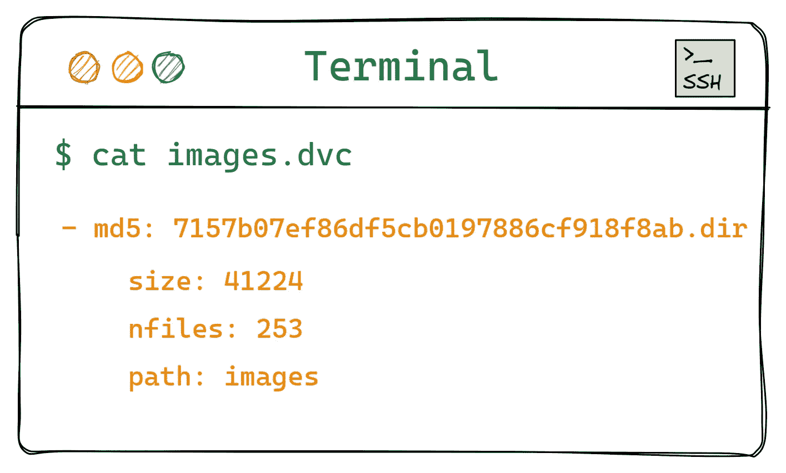
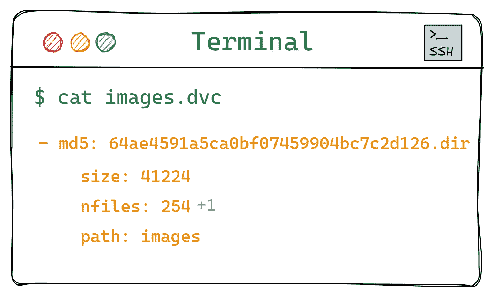
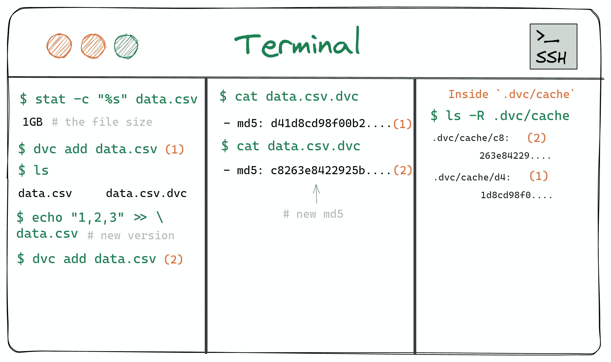
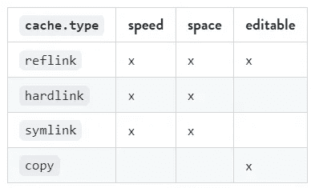
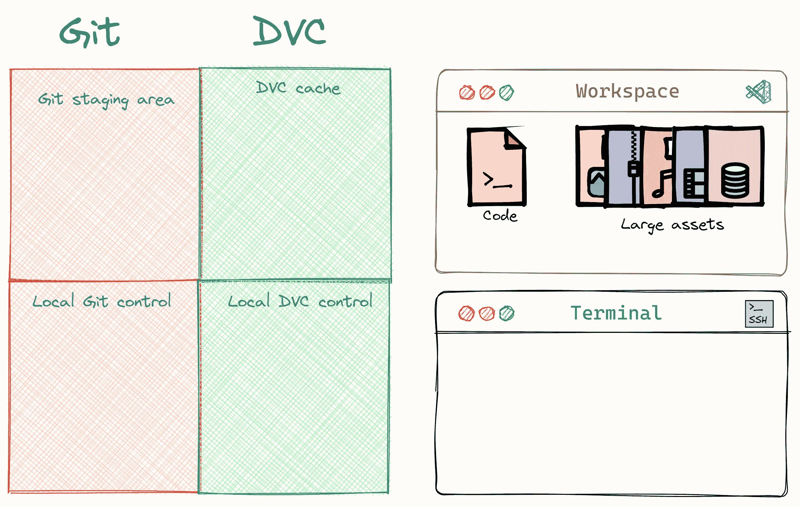
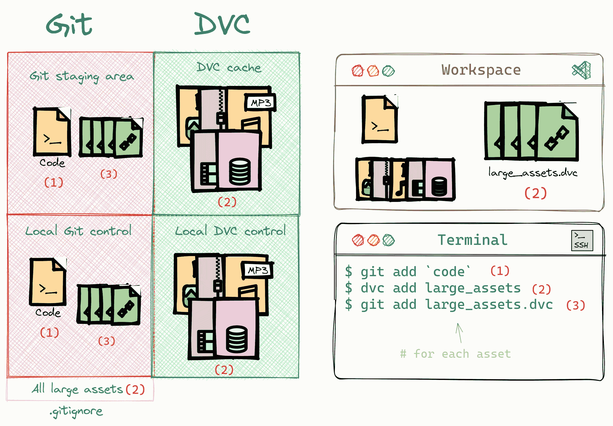
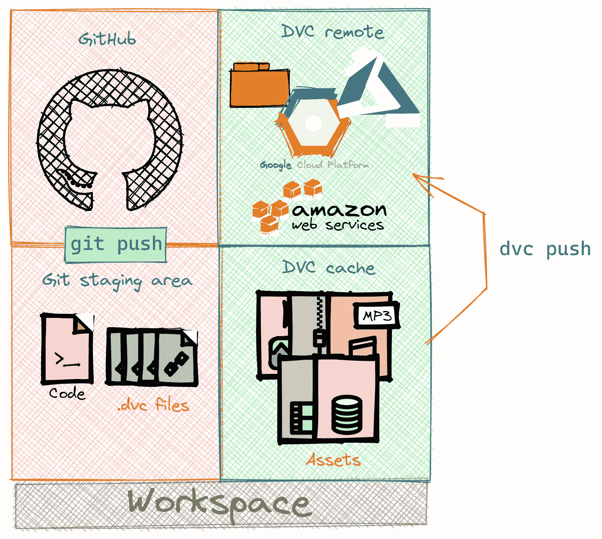

# 现代数据科学家的数据版本控制：你不能忽视的 7 个 DVC 概念

> 原文：[`towardsdatascience.com/data-version-control-for-the-modern-data-scientist-7-dvc-concepts-you-cant-ignore-bb2433ccec88`](https://towardsdatascience.com/data-version-control-for-the-modern-data-scientist-7-dvc-concepts-you-cant-ignore-bb2433ccec88)

## 数据科学中一种必备实践的详细插图指南

[](https://ibexorigin.medium.com/?source=post_page-----bb2433ccec88--------------------------------)[](https://towardsdatascience.com/?source=post_page-----bb2433ccec88--------------------------------) [Bex T.](https://ibexorigin.medium.com/?source=post_page-----bb2433ccec88--------------------------------)

·发表于 [Towards Data Science](https://towardsdatascience.com/?source=post_page-----bb2433ccec88--------------------------------) ·11 分钟阅读·2023 年 5 月 25 日

--


图片由我使用 Midjourney 制作。

2020 年 5 月 31 日

多么美好的一天啊！我正坐在车里听着**Data Beats FM**，这时一个广告引起了我的注意。

> 数据科学家们对软件工程师羡慕已久。虽然纯粹的软件工程师——我们戏称他们为邪恶的编程巫师——在可信赖的 Git 下轻松处理代码提交和分支，我们却常常不得不与巨大的数据集和 ML 模型搏斗，让 Git 无法招架。但不用担心，DVC 以闪亮的铠甲出现了…

我把音量调高，脸上带着好奇的表情。

> DVC 以其卓越的能力，解放了成千上万的数据科学家摆脱 Git 在处理那些似乎无论如何都无法有效版本控制的大文件时的挣扎（Git-LFS 简直糟糕透了）。

我此时面带微笑。

> 现在是告别疯狂删除和重新上传数据以规避 Git 大小限制的日子的时候了。有了 DVC，我们终于可以恢复理智，自信地推进我们的数据驱动工作。

你本可以数清我的所有牙齿。

> 免费查看请访问…

我进入了隧道，信号丢失。几乎喜极而泣，我在隧道出口处立即停车，拿出旅行中的 MacBook。我在搜索框中输入 DVC 并…

这段文字摘自一位虚构数据科学家的虚构日记。日记中详细描述了使用 DVC 进行数据版本控制的乐趣，以及它如何巧妙地解决了 Git 在处理大文件时的难题。

我决定跳过那部分，展示其余内容，其中我们的虚拟朋友解释了八个最重要的 DVC 概念，没有自尊的数据科学家是无法忽视的。我必须说，这些解释非常精彩 :)

让我们继续阅读。

## 0\. DVC 作为版本控制系统

当你开始使用 DVC 时，它并不是一个版本控制系统。相反，它模仿 Git 对大文件的功能，同时作为一个与 Git 并行运行的元数据管理工具。

DVC 并不是直接处理大量数据集和 ML 模型（大型资产），而是为它们生成元数据文件占位符。这些轻量级文件允许你在开始用 Git 跟踪它们时进行伪跟踪。

比如，假设你刚刚编写了一个脚本来应用图像增强，从而增加了图像数据集中的样本数量。

由于 DVC 已经为包含你的图像的文件夹创建了一个占位符文件，它会及时检测到操作并相应地更新元数据文件。随后，由于 Git 正在跟踪那个元数据文件，它也会识别到这个变化。

通过这种方式，大文件的修改可以成为你的 Git 提交和历史的一部分，而不会导致 Git 崩溃。

稍后会详细讲解。

## 1\. 跟踪和未跟踪文件

当在一个 Git 跟踪的仓库中[初始化 DVC](https://dvc.org/doc/start)时，文件可以被分类为三类。

类别 0 包含仅由 Git 使用 `git add filename` 命令跟踪的文件。DVC 与这些文件无关。通常，它们包括源代码文件（`.py`、`.jl`、`.R` 等）、配置文件（`.ini`、`.cfg`、`.yaml`、`.json`）、文档文件（Markdown、README 和其他文本格式）或测试文件。



图片由我提供

类别 1 包括 `.gitignore` 文件中列出的文件。这些是 Git 永远不会跟踪的文件。

在类别 2 中，我们有 DVC 跟踪的文件，这些文件是使用 `dvc add asset` 命令的结果。

作为一个例子，我们考虑一个名为 `tuned.joblib` 的模型文件和存储在 `images` 文件夹中的图像数据集。一旦你执行 `dvc add images tuned.joblib`，该文件和文件夹都会被 DVC 监控，并添加到 `.gitignore` 文件中，以防止意外的 Git 跟踪。

此外，还会生成两个 `.dvc` 扩展名的新文件：`images.dvc` 和 `tuned.joblib.dvc`。

这些轻量级的元数据文件属于类别 0，这意味着你应该使用 `git add images.dvc tuned.joblib.dvc` 命令跟踪它们。

类别 2 中典型的文件包括笔记本（可能包含视觉和表格，导致文件较大）、数据集（如图像、视频、音频、CSV、parquets、数据库等）和 ML 模型。

最后，在类别 3 中，我们有可选的 `.dvcignore` 文件。类似于 `.gitignore` 文件，你可以使用它们来指定 DVC 永远不应该跟踪的文件。

## 2\. `.dvc` 文件

`.dvc`文件使用[ YAML 1.2](https://yaml.org/)文件格式，这是一种对所有编程语言友好的数据序列化格式。

正如我之前提到的，DVC 为每个用 DVC 跟踪的文件或文件夹创建一个轻量级的`.dvc`文件。

当你查看`images.dvc`的内容时，你将看到以下条目：



图片由我提供

最有趣的部分是`md5`。MD5 是一种流行的哈希函数。它接受任意大小的文件，并使用其内容生成一个固定长度的字符字符串（在我们的例子中是 32 个字符）。

这些字符可能看起来随机，但如果你多次重新运行哈希函数在文件上，它们将始终保持相同。但是，即使文件中的一个比特发生变化，生成的哈希值也会完全不同。

DVC 使用这些哈希（也称为校验和）来区分两个文件是否相同、完全不同或是同一文件的不同版本。

例如，如果我将一个新的假图片添加到`images`文件夹中，`images.dvc`中的 MD5 哈希值将会不同：



图片由我提供

如前所述，你应该用 Git 跟踪所有`.dvc`文件，这样对大型资产的修改将成为你 Git 提交和历史记录的一部分。

```py
$ git add images.dvc
```

了解更多关于`.dvc`文件如何工作的内容，请参考[DVC 用户指南](https://dvc.org/doc/user-guide/project-structure/dvc-files)的[此页面](https://dvc.org/doc/user-guide/project-structure/dvc-files)。

## 3\. DVC 缓存

当你在一个大型资产上调用`dvc add`时，它会被复制到一个特殊的目录中，称为 DVC 缓存，位于`.dvc/cache`下。

缓存是 DVC 在不同版本下保持数据和模型原始记录的地方。当前工作目录中的`.dvc`文件可能显示最新的或其他版本的大型资产，但缓存将包含自你开始用 DVC 跟踪它们以来，所有资产的不同状态。

例如，假设你将一个 1 GB 的`data.csv`文件添加到 DVC 中。默认情况下，该文件将同时出现在你的工作区和`.dvc/cache`文件夹中，占用两倍的空间（2 GB）。



图片由我提供

任何后续通过`dvc add data.csv`跟踪的更改都会在`.dvc/cache`中创建一个新版本的`data.csv`，并占用另外一个 GB 的内存。

所以，你可能会问——这不是效率非常低吗？答案是肯定的！至少对于单个文件来说是如此，但我们将在下一部分看到缓解这一问题的方法。

对于文件夹，情况有点不同。

当你使用`dvc add dirname`跟踪不同版本的文件夹时，DVC 足够智能，只检测目录内发生变化的文件。这意味着，除非你更新目录中的每一个文件，否则 DVC 将只缓存变化文件的版本，这不会占用太多空间。

总之，可以将 DVC 缓存视为[Git 的暂存区](https://medium.com/towards-data-science/git-for-the-modern-data-scientist-9-git-concepts-you-cant-ignore-b4eaf7a154c2#:~:text=a%20commit.-,3.%20Staging%20area,-By%20talking%20about)的对应物。

了解更多关于缓存和内部 DVC 文件的信息，请访问[本用户指南部分](https://dvc.org/doc/user-guide/project-structure/internal-files)。

## 4\. DVC 中的缓存策略

DVC 中有三种缓存策略。

我们已经看过策略 0，它简单地将跟踪的文件复制到缓存中。这是最安全且始终可用的选项，即使它很慢且内存效率低。但它允许你在原地编辑跟踪的文件，因为它们在你的工作区中物理存在。

在策略 1 中，DVC 使用硬链接将缓存中的大型资产链接到你的工作区，而无需重复它们。可以将硬链接视为跟踪文件的双胞胎。

这就像是同一个房间有多个门，但它们仍然是同一个空间。每扇门（或链接）提供对房间（或文件）的访问，而无需重复其内容。

第二种策略，创建软链接，实际上和硬链接类似。不过，如果你的仓库和 DVC 缓存位于不同的文件系统或驱动器上，软链接效果更好，而硬链接则在它们位于相同分区或存储设备上时表现最佳。

硬链接和软链接的缺点是你不能在原地编辑它们，因为这会导致缓存损坏。为了保护你不进行编辑，DVC 将这些文件的权限限制为只读。

最后一种第三策略是 reflinks。它们是最好的、最有效的，但仅在最新的文件系统中可用。例如，它在我的[WSL2](https://medium.com/towards-data-science/how-to-create-perfect-machine-learning-development-environment-with-wsl2-on-windows-10-11-2c80f8ea1f31)中甚至不可用，因此 DVC 从不单独使用这种策略。

但当它可用时，reflinks 带来了其他所有策略的好处。被跟踪的文件实际上在缓存中，但它们像是副本一样链接到工作区。如果你想在原地编辑这些文件，文件系统会将原始文件从缓存中复制到工作区，直到你完成编辑。



图片来自 DVC 文档。Apache-2.0 许可证。

默认策略是`copy`，当你初始化 DVC 时。要更改它，你可以运行：

```py
$ dvc config cache.type hardlink[reflink, symlink, copy]
```

了解更多关于缓存策略之间的差异以及如何禁用硬/软链接的*不可编辑*缺点，请访问[这里](https://dvc.org/doc/user-guide/data-management/large-dataset-optimization)和[这里](https://dvc.org/doc/user-guide/how-to/update-tracked-data)。

## 5\. DVC 工作流程

数据版本控制的总体思想是将对大型文件所做的更改包含在你的 Git 提交和分支中，而不触及 Git 的大小限制。我们提到 DVC 通过创建小的 `.dvc` 占位符来实现这一点，这些占位符在你更新 DVC 跟踪的大型文件时会发生变化。



由我制作

所以，基本工作流程如下：

1.  你可以通过 `dvc add large_assets` 开始跟踪大型资产。

1.  DVC 将资产添加到 `.gitignore` 中，因此 Git 不会看到它，同时创建 `large_assets.dvc` 文件。

1.  你可以使用 `git add large_assets.dvc` 将 `large_assets.dvc` 文件添加到 Git 中。



由我制作

1.  如果你更改了其他文件，比如 `train.py`，你也需要添加该更改：`git add train.py`，或者你可以简单地使用 `git add --all` 来捕捉 Git 可见的所有更改。

1.  你使用 `git commit -m "Message"` 进行提交。

这样，你可以在 Git 历史中记录你的代码更改和大型资产更改。如果你使用 `git checkout branch_name/commit_hash` 切换分支或提交，DVC 必须显示这些特定提交或分支的资产版本。为此，你必须在 `git checkout` 后调用 `dvc checkout`：

```py
$ git checkout branch_name
$ dvc checkout
```

该命令将使用 `.dvc` 文件和其中的 MD5 哈希从缓存中获取 DVC 资产的版本。

## 6\. DVC 远程存储

Git 使用像 GitHub 这样的托管平台在线存储你的代码仓库，以便其他人可以协作你的项目。但就像 Git 不能处理你的大型资产一样，GitHub 也不能。因此，DVC 通过拥有自己的远程存储来解决这个问题。



由我制作

这个远程存储与缓存分开，可以在与你的仓库同一台机器上，也可以在任何云服务提供商上。DVC 支持所有主要的云服务提供商，包括 AWS、GCP 和 Azure。类似于你经常将 Git 提交推送到 GitHub，你应该使用 `dvc push` 将 DVC 缓存中的资产发送到远程，以保持其最新。

你选择的远程存储将在你的 DVC 配置文件 `.dvc/config` 中声明。当某人克隆或分叉你的 GitHub 仓库时，他们将获得此配置文件以及 `.dvc` 占位符文件，但他们的 DVC 缓存将为空。因此，他们将使用 `dvc pull` 从远程下载所有大型资产及其版本到他们的缓存和工作区。

这就是协作 DVC 启用仓库的工作流程。

[DVC 用户指南中的远程存储](https://dvc.org/doc/start/data-management/data-versioning#storing-and-sharing)展示了设置代码。

## 7\. DVC 流水线

DVC 最棒的功能之一是智能流水线。一个典型的机器学习项目包括许多步骤，如收集数据、清洗和转换数据、选择模型、调整选择的模型，最后部署它。每个步骤都可能消耗和生成不同的资产，如数据集、模型、指标、图表、docker 镜像等。

DVC 管道的目标是通过单一命令`dvc repro`（即*DVC 重现*）来依次运行所有这些步骤，让 DVC 在后台处理所有资产的组合。这听起来很棒，对吧？

我不会详细讲解如何设置这些管道，因为过去某位作者已经做过这件事：

[](https://pub.towardsai.net/how-to-create-highly-organized-ml-projects-anyone-can-reproduce-with-dvc-pipelines-fc3ac7867d16?source=post_page-----bb2433ccec88--------------------------------) [## 如何创建高度组织化的 ML 项目，任何人都可以使用 DVC 管道重现

### 编辑描述

pub.towardsai.net](https://pub.towardsai.net/how-to-create-highly-organized-ml-projects-anyone-can-reproduce-with-dvc-pipelines-fc3ac7867d16?source=post_page-----bb2433ccec88--------------------------------)

但我认为只要你知道当你调用`dvc repro`时，DVC 就会省去每次运行管道时调用`dvc add`的需要，这就足以引起你的兴趣。我强烈推荐阅读这篇文章。

或者你也可以阅读[关于管道的优秀用户指南](https://dvc.org/doc/user-guide/pipelines)。

## 结论

我要用对这个库的巨大希望来结束这篇日记。现在是 2020 年，库的版本是 1.0.0，但我预测在 2023 年某个随机的年份，它的[v3.0.0](https://github.com/iterative/dvc/releases/tag/3.0.0a0)将会带来许多新功能和改进。

我猜他们也会在不久的将来（可能是今年 11 月）添加一个功能来跟踪[机器学习实验](https://medium.com/towards-artificial-intelligence/how-to-track-ml-experiments-with-dvc-inside-vscode-to-boost-your-productivity-a654ace60bab)，但这只是痴心妄想。

何等美好的一天。

喜欢这篇文章吗？让我们面对现实，它的写作风格确实很奇特。想象一下，有几十篇类似的文章都由一个聪明、迷人、机智的作者（顺便说一下，就是我）所写。

仅需 4.99 美元的会员费，你将不仅能访问我的故事，还能获得来自 Medium 上最杰出思想者的知识宝库。如果你使用[我的推荐链接](https://ibexorigin.medium.com/membership)，你将获得我**超级新星的感谢**和一个虚拟的击掌，以支持我的工作。

[](https://ibexorigin.medium.com/membership?source=post_page-----bb2433ccec88--------------------------------) [## 使用我的推荐链接加入 Medium — Bex T.

### 获取对我所有⚡高级⚡内容的独家访问权限，在 Medium 上无限制地浏览。通过给我买一杯…

ibexorigin.medium.com](https://ibexorigin.medium.com/membership?source=post_page-----bb2433ccec88--------------------------------) 

图片由我提供。通过 Midjourney 制作。

参考文献：

[1] RealPython, [使用 Python 和 DVC 的数据版本控制](https://realpython.com/python-data-version-control/), 2020, realpython.com
