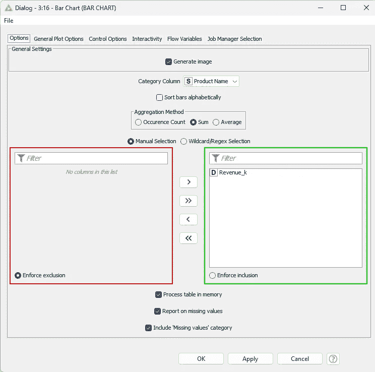
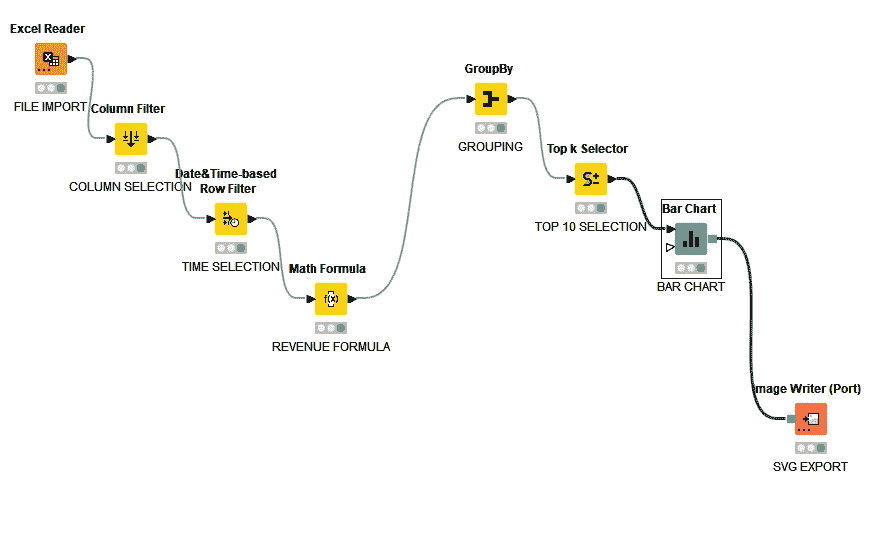
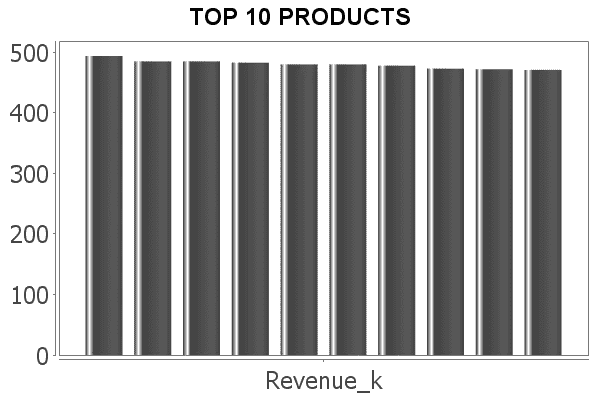
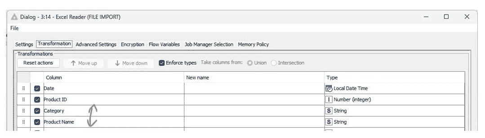
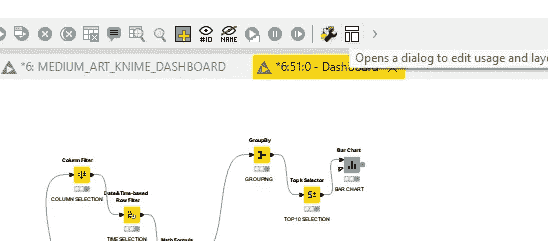

# KNIME 的数据可视化

> 原文：[`towardsdatascience.com/data-visualization-with-knime-2b86548736d7`](https://towardsdatascience.com/data-visualization-with-knime-2b86548736d7)

## 一步一步的全面指南

 [Michal Szudejko](https://medium.com/@michalszudejko?source=post_page-----2b86548736d7--------------------------------)

·发表于 [Towards Data Science](https://towardsdatascience.com/?source=post_page-----2b86548736d7--------------------------------) ·14 分钟阅读·2023 年 11 月 17 日

--

来源：作者在 ChatGPT 和 DALL-E 3 中生成的图像。

2007 年，诺贝尔和平奖授予了阿尔·戈尔和政府间气候变化专门委员会（IPCC），以表彰他们提高了对气候变化危害的认识。由[戴维斯·古根 heim](https://en.wikipedia.org/wiki/Davis_Guggenheim)执导的纪录片**《难以忽视的真相》**在将气候变化问题置于公众意识的前沿方面发挥了重要作用。该片展示了戈尔多次向全球观众展示的幻灯片¹。

**值得特别注意的是阿尔·戈尔在那个演讲中使用的图表。尽管有一些批评，这些可视化在向广大观众传达气候危机的紧迫性方面起到了关键作用。** 戈尔巧妙地使用了引人入胜的视觉效果，有效提高了意识，并强调了应对气候变化的必要性。**这些可视化将抽象概念转化为清晰、易于理解的信息，在讨论复杂问题时证明了其价值²。**

> *我推荐给任何对* ***数据可视化*** *感兴趣的人，* *也许更重要的是，气候变化。*

# 那么，这篇文章讲了什么呢？

**惊讶，惊讶，这讲的是可视化。** 更准确地说，它涉及使用最近引起我注意的工具 KNIME 来制作可视化、报告和仪表板。如果你读过我之前的一些文章，你会知道我已经深入探索了替代可视化的世界，使用各种[免费的实用工具进行创建](https://ai.gopubby.com/free-visualization-tools-for-your-writing-07ff819ddeac)。

**其中一个工具 KNIME 值得单独写一篇文章。至少在我谦逊的观点中是这样。所以，这里就有它。**

对许多人来说，KNIME 可能是一个熟悉的名字。在准备这篇文章时，我遇到了大量描述这个工具能力和功能的文章。然而，我得到的印象是，大多数关于 KNIME 和可视化的文章处理的是碎片化的功能（例如制作单一图表），而缺乏全面的视角。**我希望能填补这个空白。**

**当我开始使用 KNIME 时，我对这个工具一无所知。** 然而，由于其易用性，学习它并没有特别的挑战。希望我能证明，这趟旅程绝对值得。

**这篇文章是针对那些熟悉数据可视化但对 KNIME 新手的人。我希望这将是任何希望快速了解 KNIME 在可视化方面能力的人的完美起点。**

# 什么是 KNIME？

KNIME 是一个开源的数据分析和可视化平台。它特别适合数据操作，使得排序、合并和分析数据变得简单，无需编码。它还提供了广泛的统计工具。

[Knime 在 Gartner Peer Insights 上获得了 4.6 的评分](https://www.gartner.com/reviews/market/data-science-and-machine-learning-platforms/vendor/knime)，并且新评论仍在不断涌入。[根据 6sense 的数据，KNIME 拥有 2038 名客户，占分析平台市场份额的大约 1%（市场排名第 12 位）](https://6sense.com/tech/predictive-analytics/knime-platform-market-share)。因此，它是一个知名品牌，但不是主要玩家。**它能提供什么好处？**

## 易用性

KNIME 的基于工作流的方法使其易于使用，即使对于数据技能有限的人群也是如此。这种方法通过将复杂的数据过程分解为可管理的步骤来简化复杂的数据处理过程。它是一种比纯 Python 编程更易于访问的替代方案。

## 机器学习和预测建模

KNIME 是一个强大的机器学习和预测建模工具。它可以高效地处理异常检测和回归等任务，还可以连接各种数据源并自动化工作流程，从而简化数据工程任务。

## 可视化

KNIME 的可视化功能由 JavaScript 库提供支持，提供了一个灵活的数据展示工具箱。这使得用户能够创建清晰且富有洞察力的数据可视化。**我希望在稍后展示它。**

## 可重用性

KNIME 工作流的一个主要好处是它们的可重用性。这意味着工作流可以轻松地安排并重复运行，新的数据集可以根据需要上传。这些工作流还可以集成到报告和仪表板中。

# 使用 KNIME 进行可视化：一步一步来

首先，我将向你展示如何制作下面的可视化。这是一个展示前 10 种产品收入的柱状图。虽然最终产品可能看起来并不特别，但必须遵循几个步骤才能实现这个结果。

> 顺便提一下，阿尔·戈尔使用的大多数图表都相当简单，其中许多是折线图或面积图。

作者生成的图表。

## 第 1 步\. KNIME 安装

第一步是下载并启动 KNIME。你可以从他们的网站[`www.knime.com/download`](https://www.knime.com/download)下载必要的文件集。有时下载时会遇到困难，例如在 Windows 11 系统上。如果你遇到问题，建议查看[`www.knime.com/installation-problems-on-windows`](https://www.knime.com/installation-problems-on-windows)上的信息。KNIME 不需要传统的安装方式。你只需将文件解压到选择的目录中并运行程序。

## 第 2 步\. 数据准备

我为这个练习准备了一个数据集，可以从[这里](https://docs.google.com/spreadsheets/d/1Xup7vSw7-lXFySSuVm8c3hbM77UBcyFy/edit?usp=sharing&ouid=118005843277749243224&rtpof=true&sd=true)下载。它是一个包含了 2018 年至 2022 年间一家快消品公司收入和成本的合成数据。

一旦我们获得数据，就可以在 KNIME 中输入和处理它。

首先，我们需要创建一个新的工作空间。选择“文件”，然后选择“新建...”，最后选择“新建 KNIME 工作流”。

我们首先上传数据。用鼠标左键单击你保存的数据集文件，并将其拖放到 KNIME 的工作流区域中。“Excel 读取器”节点将自动创建。

我们需要在工作流中使用以下节点：

1.  “列筛选器”**:** 在这里，我们将选择第一个可视化所需的列。

1.  “日期和时间基于的行筛选器”：在这一步，我们将选择合适的时间范围（我选择了 2022 年）。

1.  “数学公式”**:** 我们将用这个来重新计算收入度量，以千为单位，四舍五入到一个小数位。

添加所有这些节点后，我们必须连接它们。用鼠标左键选择两个节点，然后选择“连接所选节点”。你也可以为节点分配特征名称。双击默认名称并输入你自己的名称。

**数据导入和处理是我们工作流的一部分。** 来源：作者提供的图片。

在“Excel 读取器”节点中，我们配置将文件导入到工作流中。在这一节点中，我没有做其他操作。

在“列筛选器”节点中，我取消选择了“产品 ID”、“类别”、“COGS”、“市场支出”、“其他费用”和“<任何未知的新列>”。

在“日期和时间基于的行筛选器”中，我选择了一个包括从 2022 年 1 月 1 日到 2022 年 12 月 31 日的日期范围。

最后，在“数学公式”节点中，我添加了以下公式：`round($Revenue$/1000,1)`。我想将其写入一个新列，因此选择了“附加列”选项，并将新列命名为“Revenue_k”。不过，如果你愿意，也可以覆盖现有的列。

## 第 3 步\. 设计可视化

**附注：** 如果您不确定选择哪个可视化方式，可以寻求 ChatGPT（或其他大型语言模型）的帮助。只需在提示中描述数据和您的目标，您将获得有用的建议。

**向 ChatGPT 请求图表建议。** 来源：作者截屏。

**ChatGPT 生成的图表创意。** 来源：作者截屏。

在我们的情况下，我们已经知道要制作什么可视化。作为提醒，我们将创建一个显示前 10 个收入生成产品的图表。

**工作流的视觉部分设计。** 来源：作者截屏。

为此，我们需要向我们的工作流中添加三个额外的节点：

1.  ‘GroupBy’: 我们将根据产品名称对收入进行分组。

1.  ‘Top K Selector’: 这允许我们从给定的数据集中选择前 ‘x’ 项。

1.  ‘条形图’: 用于绘制实际的图表。

让我们稍微关注一下‘GroupBy’ 节点。要应用分组，我们首先需要指定分组列。在我们的情况下，它将是产品。

来源：作者截屏。

接下来，我们添加聚合。在我们的情况下，选择的聚合方法是‘求和’。

来源：作者截屏。

要设置条形图，请按照以下简单步骤操作：

1.  进入‘选项’选项卡。选择‘生成图像’，并指定‘产品名称’作为‘类别列’。对于‘聚合方法’，选择‘求和’。

1.  在‘常规选项’选项卡中，为您的图表输入标题。我建议选择‘绘制水平条形图’。

**条形图配置窗口。** 来源：作者截屏。

抓住机会深入探讨其他配置设置。实验这些选项可以帮助您发现一系列潜在的结果和可能性。

## **步骤 4\. 发布结果**

要完成这个过程，请配置导出设置。一种有效的方法是使用‘Image Writer (Port)’ 节点。此步骤将完成您的工作，并为展示或进一步使用做好准备。

**完整工作流。** 来源：作者截屏。

我将‘Image Writer’配置为将文件保存为 *.svg。另一个选项 *.png 在我的电脑上无法使用。我从 KNIME 相关论坛了解到，这个问题相当普遍。

来源：作者截屏。

最后，我们可以通过点击顶部菜单中的‘执行所有可执行节点’来运行我们的工作流。

来源：作者截屏。

如果一切顺利，我们应该会看到节点下方的绿色指示灯。如果对 KNIME 初步生成的结果不满意，你可以随时在 KNIME Hub 中探索更多选项。一个值得考虑的替代方案是[KNIME JFreeChart](https://hub.knime.com/knime/extensions/org.knime.features.ext.jfreechart/latest)，如下所示。

**相同的图表但使用 JFreeCHarts 生成。** 来源：作者生成的图像。

另外，你可以深入探索社区选项，比如[这个](https://hub.knime.com/alexanderfillbrunn/spaces/Public/Components/Custom%20Range%20Barchart~PMYyKHEQ2oQx4Psc/current-state)。最后一个选项的额外好处是相较于我上面展示的基本图表，提供了更多对 y 轴的控制。

**自定义范围条形图。** 来源：作者提供的图像。

**总结本节内容，我们使用 KNIME 创建了一个简单的可视化效果。当然，这个效果还有很大的提升空间，但要注意，过程可能会变得复杂，从而迅速提高入门门槛。**

# 使用 KNIME 的可视化：替代可视化方案

## 旭日图

我们刚刚在 KNIME 中创建的第一个视觉效果并不惊艳。现在，让我们探讨是否可以创建一些更高级的东西。

在我最近的帖子中，我探讨了替代可视化的世界，重点关注除了标准条形图、折线图和饼图之外的视觉效果。让我们调查一下 KNIME 是否也能在这一领域提供有趣的选项。

 ## 数据驱动故事讲述的替代可视化

### 选择它们的原因，以及如何创建它们

towardsdatascience.com

为此，我们将再次使用之前的文件作为起点。这一次，我们将创建一个**旭日图**。

**在 KNIME 中生成的旭日图。** 来源：作者提供的动画。

旭日图是一种用于显示分层数据的可视化图表，数据以同心圆环的形式呈现。图表中的每个环代表一个层级，分段显示每个组成部分的比例。这种布局有助于直观理解数据中的部分与整体关系³。

为了创建旭日图，我制定了以下工作流程。我在‘列过滤器’节点中选择了‘类别’和‘产品名称’列。

**旭日图工作流程。** 来源：作者提供的截图。

在此步骤中，检查列顺序是否与我们打算在图表中展示的内容一致是至关重要的。具体来说，如果“类别”列要呈现在旭日图的内环中，则必须在列列表中排在“产品名称”之上。我们可以在“Excel Reader”节点中轻松调整，如下图所示。

**在 Excel 读取节点中更改列顺序。** 来源：作者截屏。

## 互动表格

接下来我将展示的是一个互动表格。下面的动画图片显示了最终产品。

**在 KNIME 中制作的互动表格。** 来源：作者提供的图片。

这是创建上述表格的工作流。在此过程中，“提取日期和时间字段”节点是一个新元素。

**在 KNIME 中创建表格的工作流。** 来源：作者截屏。

我们需要这个新节点从“日期”列中提取年份。然后，使用“GroupBy”节点，我们可以利用该数字对值进行分组。如果没有这一步，表格中将显示每一天的数据，这会使其毫无用处。

**从“日期”列中提取年份。** 来源：作者截屏。

## 折线图

好的，这不是一种替代可视化。然而，我想评估一下 KNIME 在趋势分析中的表现。不幸的是，我必须说这很令人失望。看看下面显示的图表。我最大的抱怨是控制图表轴的难度，特别是在决定最低和最高点时。在制作这个图表时，我还没找到一个简单的方法来做到这一点。**但我会继续寻找！**

**在 KNIME 中制作的折线图。** 来源：作者生成的图片。

**用于生成折线图的工作流。** 来源：作者截屏。

在图表中，我展示了月平均价格。为了计算这一点，我创建了一个“数学公式”节点，并输入了以下方程式：`Price = Revenue / Units Sold`。

为了在图表中生成多条线，我首先从“日期”列中提取了年份和月份值，然后应用了透视。在透视过程中，我将“月份（数字）”放在行中（参见“组”标签下的第 1 个截图），将“年份”放在列中（参见“透视”标签下的第 2 个截图）。

**透视表，步骤 1。** 来源：作者截屏。

**透视表，步骤 2。** 来源：作者截屏。

最后一步是为“价格”创建聚合规则。我选择了“均值”作为聚合方法。

**数据透视表，第 2 步。** 来源：作者打印屏幕截图。

如果您希望图表从 y 轴的零点开始缩放，请记得在“线图”节点的配置设置中勾选“始终显示原点”选项。

来源：作者打印屏幕截图。

另一种方法是使用小多重图表。在此示例中，我展示了 2022 年不同产品的平均价格。用于创建此图表的节点从 [KNIME Hub](https://hub.knime.com/knime/spaces/Examples/00_Components/Visualizations/Small%20Multiples%20View~EfzPbz9l-xzY_TE_/most-recent) 下载。

**小多重可视化。** 来源：作者打印屏幕截图。

# 使用 KNIME 进行可视化：使用报告设计器⁴

**我在 KNIME 中制作的报告的第 1 页。** 来源：作者打印屏幕截图。

## 第 1 步：报告设计器的安装

在这一点上，我将向您展示如何使用我们之前创建的可视化来设计报告。如果我们还没有添加“报告扩展”，我们必须添加。首先，从文件菜单中选择“安装 KNIME 扩展……”，然后在搜索框中输入“report”，并选择“KNIME Report Designer”。

**报告设计器的安装。** 来源：作者打印屏幕截图。

## 第 2 步：将报告节点添加到您的可视化中

我们需要添加报告节点以获取来自不同工作流的结果。

**将报告节点添加到工作流中。** 来源：作者打印屏幕截图。

在这个阶段需要注意的一个关键方面是使用报告节点中的自定义图像缩放选项。否则，您的可视化可能无法正确显示——它们可能会很小且分辨率低。我选择了高度和宽度设置为 400，并选择了 *.png 作为导出格式。

## 第 3 步：设计报告

您可以在 [这里](https://drive.google.com/file/d/1sfi7H53fIQ_scpiUDKnpjproR_e0P30H/view?usp=sharing) 找到我生成的示例报告。要查看它，请首先打开报告编辑器。为此，点击顶部菜单中的图标。

**启动报告编辑器。** 来源：作者打印屏幕截图。

制作报告的第一步是将视图设置为“横向”，以在“母版页”布局中为我的可视化留出更多垂直空间。

**报告方向配置。** 来源：作者打印屏幕截图。

然后，我添加并格式化了标题标签，并排列了网格以定位我的可视化。

**我使用了“网格”进行整体布局。** 来源：作者打印屏幕截图。

让我们添加第一个可视化——条形图。为此，拖放‘Image’图标，选择‘BAR CHART TO REPORT’数据源，然后选择‘Image’。

**将图表添加到报告中。** 来源：作者的打印屏幕。

你可以通过调整网格属性来控制图表的对齐。

**在网格单元格中控制对齐。** 来源：作者的打印屏幕。

然后，我类似地添加了 Sunburst 图表，并点击了顶部菜单中的‘View Report’按钮。我在下面的图像中展示了结果。

**首次添加到报告中的图表。** 来源：作者的打印屏幕。

接下来，我想在一个工作流中添加我们创建的表（‘TABLE TO REPORT’节点）。我决定在‘Cross Tab’中进行操作。为了使这样的表正常工作，我们必须首先构建一个立方体。这个过程很简单。首先，将‘Cross Tab’拖放到网格中。然后，从数据源中拖动任何维度或度量。这将启动‘Cross Tab Cube Builder’。你必须在构建器中指示组（维度）和汇总字段（度量）。你可以为它们分配新名称，以便以后更容易找到。

**Cross tab 立方体构建器。** 来源：作者的打印屏幕。

你可以在‘Data Explorer’中查看立方体。从那里，你可以将字段拖放到表格中。你可以将度量（‘Revenue’）显示为图表。

**在交叉表中设置图表视图。** 来源：作者的打印屏幕。

## 第 4 步。发布报告

发布报告简单易行。从‘View Report’菜单中选择一个选项即可。

**报告发布选项。** 来源：作者的打印屏幕。

# 使用 KNIME 进行可视化：构建交互式仪表板

**我在 KNIME 中创建的交互式仪表板。** 来源：作者生成的图像。

我从一个稍作修改的可视化教程工作流开始，其中我移除了报告节点和表格工作流。我只留下了每个节点的一个可视化。**如果你希望保留之前生成的工作空间，我建议你制作一个副本。** 开发仪表板的第一步是选择所有节点，然后点击‘Create component’⁵。

**在 KNIME 中创建组件。** 来源：作者的打印屏幕。

首先打开组件以修改你的工作流和/或设计仪表板布局。

**修改仪表板布局步骤 1。** 来源：作者的打印屏幕。

**修改仪表板布局步骤 2。** 来源：作者的打印屏幕。

# **我对 KNIME 的评估**

## **我喜欢什么？**

在使用 KNIME 几天后，我必须说我看到了这个应用程序的许多优点。首先，它是**相对易于使用**的。正如你所见，创建可视化或甚至互动仪表板非常简单。我很欣赏**你可以在本地使用 KNIME 并将其作为自动化工具**，例如定期更新的仪表板。**安装简便、开源基础和社区支持无疑是巨大的优势**。

## 我不喜欢什么？

然而，也存在一些缺点。**一些基本功能不可用或复杂**，即使有社区帮助。例如，修改图表轴、扩展图表的颜色选项或实现互动切片器⁶可能会很有挑战性。此外，**可视化效果可能更具视觉吸引力**。尽管大多数问题是可以解决的，但**时间和学习曲线可能迅速变得陡峭**。

# 摘要

**在这篇文章中，我探讨了在 KNIME 中制作可视化的过程。我描述了创建有效视觉效果、制作详细报告和构建互动仪表板所需的步骤。** KNIME 的用户友好界面，以拖放功能和广泛的配置选项为特征，使其成为数据可视化的多功能且强大的工具。此外，它的开源性质和活跃的社区使我们在遇到问题时能够不断改进和获得指导。

尽管有这些优点，KNIME 在某些功能上偶尔会表现出局限性。毫无疑问，还有进一步改进的空间。

总体而言，KNIME 证明是一个有价值的数据可视化工具，提供了一种简单直观的方法来从数据中提取有意义的洞察。**我打算继续探索 KNIME 的分析能力，并在未来的文章中分享我的发现。**

> **你喜欢这篇文章吗？**
> 
> 考虑订阅以获取我的新故事通知，关注我，或留下 👏。

# 参考文献

[1]. **维基百科**，[不便的真相](https://en.wikipedia.org/wiki/An_Inconvenient_Truth)

[2]. **罗伯特·科萨拉**，[图表的诺贝尔奖](https://eagereyes.org/blog/2007/nobel-prize-for-charts)

[3]. **FusionCharts**，[旭日图](https://www.fusioncharts.com/resources/chart-primers/sunburst-chart)

[4]. [KNIME 报告设计师用户指南](https://docs.knime.com/latest/report_designer_user_guide/#_introduction)

[5]. [KNIME 组件指南](https://docs.knime.com/2023-07/analytics_platform_components_guide/index.html#introduction)

[6]. [带过滤功能的条形图](https://forum.knime.com/t/bar-chart-with-filter-functionality/32132)
