# 数据库和数据建模 — 一个快速入门课程

> 原文：[`towardsdatascience.com/databases-and-data-modelling-a-quick-crash-course-546891a49b67`](https://towardsdatascience.com/databases-and-data-modelling-a-quick-crash-course-546891a49b67)

## 数据仓库 101：初学者实用指南

[](https://col-jung.medium.com/?source=post_page-----546891a49b67--------------------------------)[](https://towardsdatascience.com/?source=post_page-----546891a49b67--------------------------------) [Col Jung](https://col-jung.medium.com/?source=post_page-----546891a49b67--------------------------------)

·发表于 [Towards Data Science](https://towardsdatascience.com/?source=post_page-----546891a49b67--------------------------------) ·阅读时间 12 分钟·2023 年 5 月 12 日

--


作者提供的图片

在我 五年的企业分析工作中，我观察到很多数据科学家在进入工作时对数据仓库和数据建模的了解有限。

这不应该让人感到惊讶。

数据科学家来自数学、统计学、心理学和编程等不同背景。许多人可能在大学时不会深入研究数据库系统的复杂性。

这包括我，一个从数学家转行的数据科学家。

我通过在线课程自学数据科学——这是获得 *数据科学* 职位的必要前提，我想——但只是在工作中才掌握了数据库基础。

况且，数据湖现在这么流行，谁还需要仓库呢，对吧？（这只是个玩笑！）

我写这篇文章是为了给那些刚刚进入分析工作且对数据仓库和数据建模了解不多的人提供一个快速的入门课程。

我们将讨论三个主题：

+   **企业数据仓库工作流** 的样子是这样的**；**

+   数据库 **规范化** 实现的目标；

+   **NoSQL** 数据库的试验。

**更新**：我现在在 [YouTube](https://www.youtube.com/@col_builds) 上发布分析教程。

# 1\. 数据仓库工作流

具体细节可能因解决方案而异，但企业级分析的常见架构如下：

1.  数据存放在 *数据湖* 中。

1.  数据被加载到一个 *数据仓库* 中。

1.  创建一个 *数据模型*。

1.  分析师消费数据。

让我们更详细地看看这个过程。

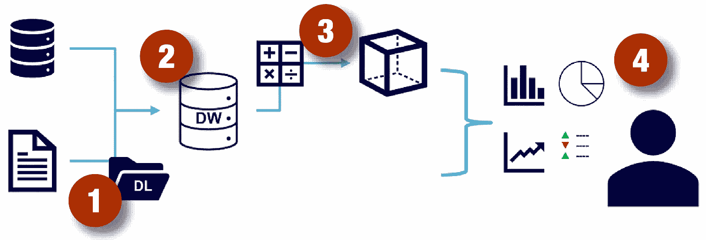

分析数据处理。作者提供的图片

## 分析数据处理

来自操作或事务数据存储（通常来自 OLTP 数据库）、文件、实时流或其他来源的数据被加载到一个集中式的*数据湖*中。

数据湖在大规模数据分析处理场景中很常见，其中需要收集和分析大量基于文件的数据。

从**操作数据平面**到**分析数据平面**的负载操作通常涉及一个*提取、转换和加载*（ETL）或*提取、加载和转换*（ELT）过程，在该过程中，数据被清洗、过滤和重组以供分析。最终的数据结构针对分析查询进行了优化。

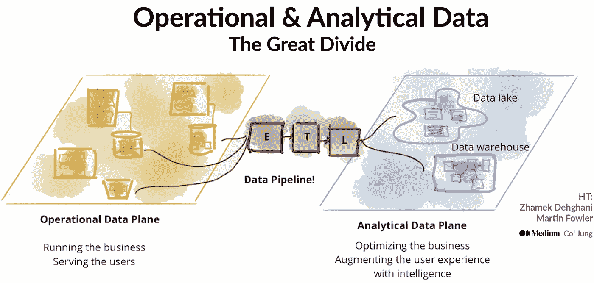

企业数据格局的 30,000 英尺俯瞰图。来源：Z. Dehghani 于[MartinFowler.com](https://martinfowler.com/articles/data-mesh-principles.html)，作者进行了修订

由于数据湖通常属于*大数据*领域，这涉及通过像*Apache Hadoop*这样的框架进行分布式计算和存储，ETL 处理由**数据工程师**负责，他们设置*Hive*或*Spark*作业，以使用多节点集群并行处理大量数据。这些数据管道包括静态数据的批处理和流数据的实时处理。

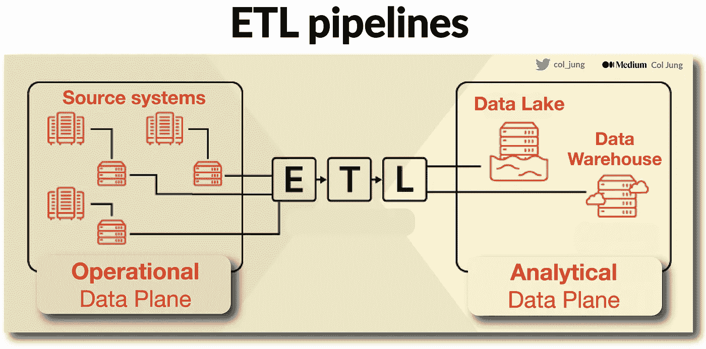

ETL 管道连接操作数据存储和分析数据存储。图片由作者提供

数据湖中的数据已经准备好进一步的分析使用。这包括由**数据科学家**进行的探索、整理和建模，或由**数据分析师**处理以创建报告和可视化。

查看我的解释文章，了解从数据仓库到数据湖再到数据网格的*整个*企业数据格局。

对数据分析不熟悉？请查看这里，[这里](https://col-jung.medium.com/intro-to-power-bi-from-data-modelling-to-stunning-reports-b34aac43d8a1) 和[这里](https://medium.com/swlh/power-of-storytelling-in-business-data-analytics-your-data-is-only-half-the-story-f50fadf9712b)。

对数据科学不熟悉？请查看这里，这里，这里 和这里。

## 数据仓库、表格、模式与规范化

好了，继续。是时候丰富我们在湖中的数据了。

首先，数据被复制到一个针对读操作进行优化的**数据仓库**中。

数据仓库是**关系型数据库**，其中数据存储在一个为数据分析而优化的**模式**中，而不是为事务工作负载优化的。仓库的设计优化了*读取*操作——主要是查询，以支持*商业智能（BI）*，包括创建报告、仪表板和可视化，这些在[优秀数据讲述者的帮助下](https://medium.com/swlh/power-of-storytelling-in-business-data-analytics-your-data-is-only-half-the-story-f50fadf9712b)可以传达价值并影响决策。

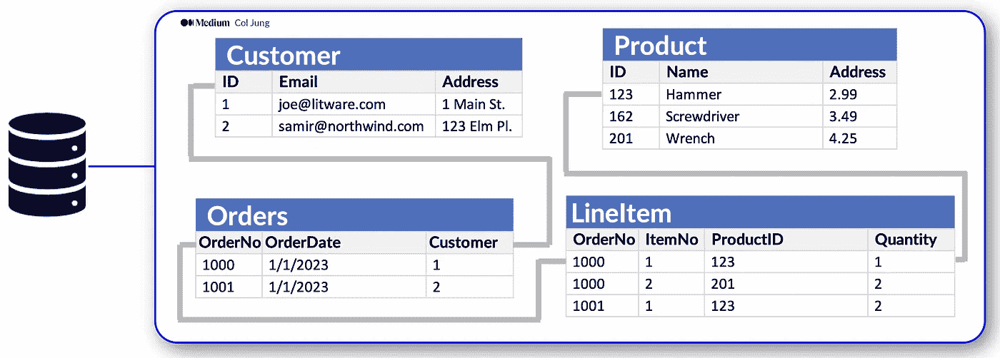

关系型数据库。图片由作者提供

关系型数据库通常用于存储和查询**结构化**数据。数据存储在表示**实体**的**表格**中，如*顾客*、*产品*或*销售订单*。每个实体的实例被分配一个*主键*，以唯一标识它，这些键用于在其他表中引用该实体实例。

这使得通过*连接*表来丰富数据成为可能。

例如，顾客的主键可以在销售订单记录中被引用，以指示哪个顾客下了该订单：

```py
-- Joining two tables using SQL
SELECT * FROM Customer C
JOIN Orders O
ON C.ID = O.Customer
```

使用键来引用数据实体使关系型数据库能够**规范化**——这部分意味着消除重复的数据值，例如，一个顾客的详细信息只存储一次，而不是每次顾客下订单时都存储。

关于规范化的内容稍后会讲解。

表格的管理和查询使用**结构化查询语言（SQL）**，它基于 ANSI 标准，因此在多个数据库系统中类似。我们上面看到的简单查询连接了两个表。

让我们进一步讨论数据库模式。

数据湖采用*Schema-on-Read*方法，不需要预先定义模式，而数据仓库采用更计算密集但更有组织的*Schema-on-Write*范式，其中表模式*必须*提前定义。

这些模式由数据建模师和解决方案架构师在与下游分析和业务用户咨询后设计。

在常见的做法中，建模师将数据从事务存储转化为一种模式，其中数值被存储在中央**事实表**中。

这些数据然后与一个或多个**维度表***相关*，这些表代表你希望用来聚合这些数值度量的实体——例如*产品*或*顾客*。

每个实体由具有唯一**键值**的行表示。

剩下的列代表实体的**属性**——例如，产品有名称和类别，顾客有地址和城市。在大多数分析模型中，包含*时间*维度是常见的，以便能够聚合与事件相关的数值度量。

所以这所有内容的样子是这样的：

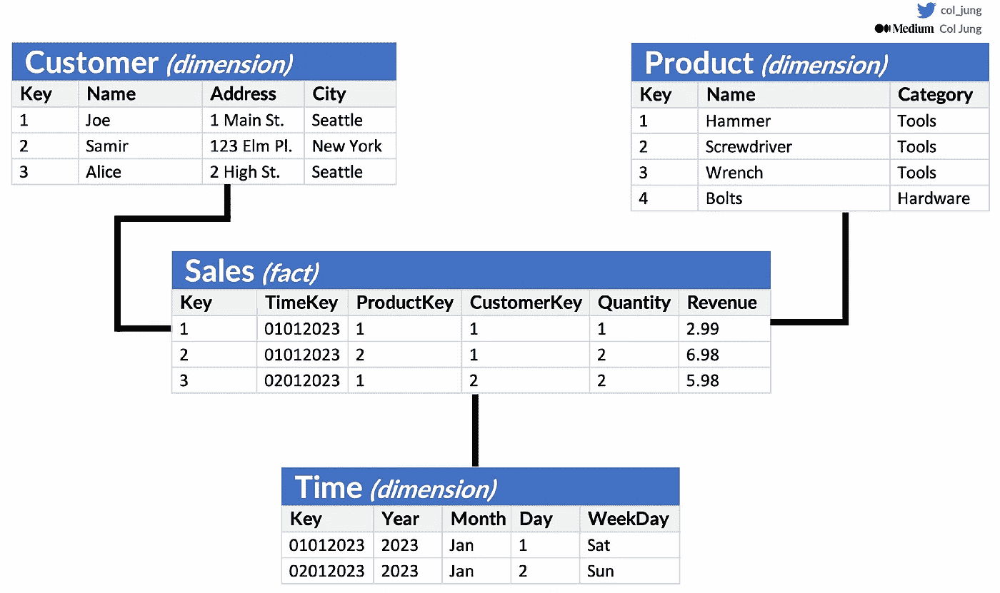

常见的星型模式。图片由作者提供

我们可以看到，模型中通过各种维度（*Customer*、*Product*、*Time*）汇总的数值度量（例如*收入*）位于一个中心事实表中，*Sales*。

更具体地说：

事实表中的每一行代表一个**记录事件**，附有数值度量。在这里，我们的**星型模式**中的*Sales*表代表单个项目的销售交易，包括销售数量和收入的数值。

销售可以按*客户*、*产品*、*商店*和*时间*维度进行汇总，使你可以轻松找到每个商店按产品划分的月度总销售收入。

这是洞察力得以揭示的地方。

总结：

**通过键连接表格可以丰富数据，而聚合则提供洞察。**

```py
-- Find total sales for each customer and product in 2022
SELECT c.name, p.name, s.sum(s.Revenue) FROM Sales s
JOIN Customer s
ON c.Key = s.CustomerKey
JOIN Product p
ON p.Key = s.ProductKey
JOIN Time t
ON t.Key = s.TimeKey
GROUP BY 1, 2
WHERE t.Year = '2023'
```

星型模式是最常见的模式类型，可以通过添加与现有维度表相关的附加表扩展为*雪花模式*——通常用来表示维度**层级**。例如，产品有自己的子类别。

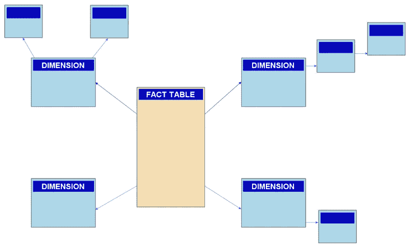

*雪花模式*。来源：[维基百科](https://en.wikipedia.org/wiki/Snowflake_schema)

总体而言，当你有可以组织成结构化表格模式的事务性数据，并且希望在高性能环境中使用 SQL 查询时，数据仓库是一个很好的选择。

查看我的 PowerBI 教程了解数据建模的实际示例。

## 分析数据模型

尽管数据分析师和数据科学家可以直接在数据仓库中处理数据，但通常会创建一个或多个分析数据模型，这些模型*预聚合*数据以便更容易生成报告、仪表板和交互式可视化。

这些被称为**在线分析处理（OLAP）**模型或**立方体**。

数据汇总跨越不同层级或**层级**的维度，使你能够*向上/向下钻取*，以在多个层级上查看汇总——例如，找到按地区、城市或单个地址的总销售额。

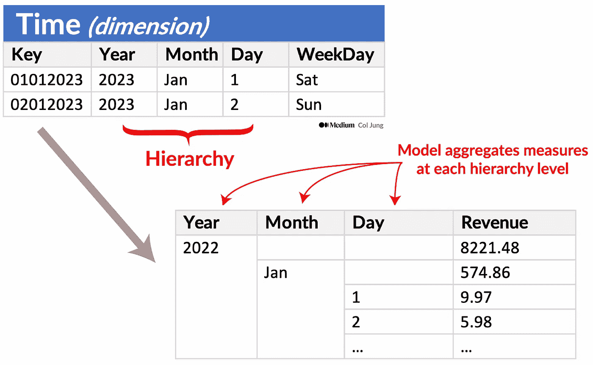

层级允许向上和向下钻取。图片由作者提供

由于 OLAP 数据是预先汇总的，因此可以快速运行查询以返回其中包含的摘要信息。

从事实表中汇总的数值（**度量**）是针对维度表中维度的*交集*计算的。从概念上讲，这意味着模型形成了一个多维结构，其中维度交汇的任何点代表这些维度的汇总度量。

例如，如前所述，销售收入可能按日期、客户和产品汇总，产生的查询输出看起来像立方体中的笛卡尔坐标。

非常酷对吧？！

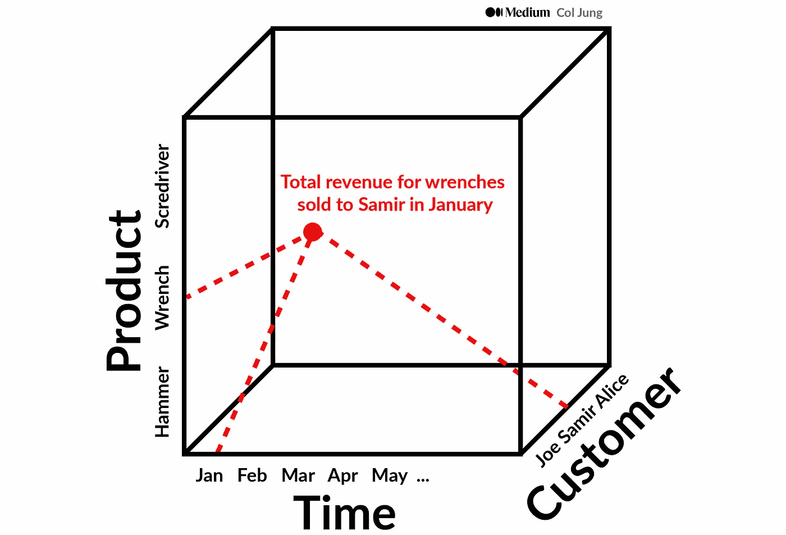

“cube”。度量（例如销售）按时间、客户和产品维度进行汇总。作者提供的图片

*重要！* 尽管我们通常将分析模型称为*cube*，但其维度可以多于（或少于）三个——我们只是难以可视化超过三个的维度！

## 准备好供使用！

**数据分析师**从这些分析模型（步骤 3）中——或直接从数据仓库（步骤 2）——甚至从数据湖中的‘原始’数据集（步骤 1）中获取数据，以探索数据并创建仪表板、报告和可视化，以生成洞见。

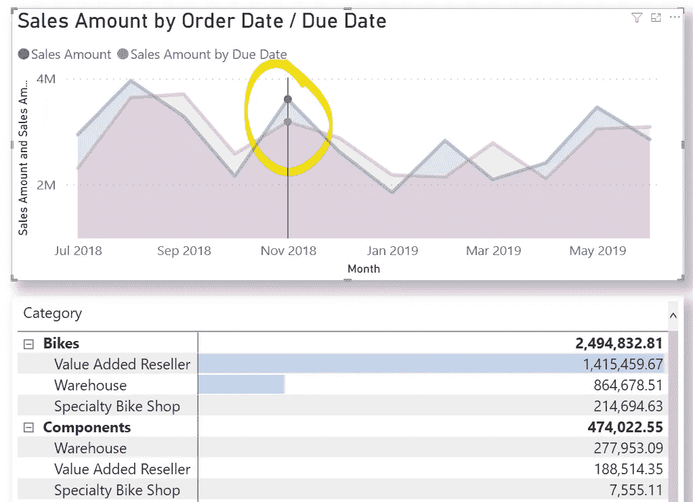

一个 PowerBI 仪表板。请参阅[我的教程](https://col-jung.medium.com/intro-to-power-bi-from-data-modelling-to-stunning-reports-b34aac43d8a1)获取操作指南！

组织中的**非技术专业人员**可以对数据进行自助数据分析和报告，特别是当数据已经在 BI 工具中可视化时，如 PowerBI 或 Tableau。

这些建立在良好分析数据模型基础上的可视化展示比较、趋势和关键绩效指标（KPIs），可以呈现为图表、图形、报告，通常以文档和[*PowerPoint*演示文稿](https://medium.com/swlh/power-of-storytelling-in-business-data-analytics-your-data-is-only-half-the-story-f50fadf9712b)、基于网页的仪表板和交互式环境（例如 PowerBI 和 Tableau）的形式传播，在这些环境中，即使是高管也能轻松地以可视化方式探索数据，并做出基于数据的决策。

# 2\. 数据库规范化

现在让我们深入探讨一些数据库规范化的细节。

这是组织我们关系型数据库中的数据，以减少冗余和提高数据完整性的过程。它包括将**每个表**分解为较小的表，并定义它们之间的关系，以消除重复数据和不一致性。

规范化的目标是创建一个更高效、灵活且不易发生数据异常的数据库模式。我们从一组表开始，通常会得到更多“更清洁”的表。

规范化有多个级别，每个级别都有一套规则。最常见的有：

## **第一范式（1NF）**

表格的每一列必须包含原子（不可分割）值。也就是说，任何一列都不应包含列表或值集合。

例如，假设你有一个客户订单表。在每一行中，有一个客户姓名列和一个他们所订购商品的列表列。在 1NF 中，你会将这些商品列表拆分成单独的行，这样每行只包含关于一个商品的信息。这有助于防止信息重复。

## **第二范式（2NF）**

如果一个表在 1NF 中，并且所有非关键列完全依赖于主键，则该表处于 2NF。换句话说，应该不存在部分依赖，其中非关键列仅依赖于主键的一部分。

继续以客户订单为例，假设你有一个新列用于记录订单日期。如果该日期仅依赖于客户的名字，则表中可能会出现重复。在 2NF 中，你会将表分为两个——一个表用于客户信息，一个表用于订单信息。这确保每条信息仅存储一次，并防止部分依赖。

## **第三范式 (3NF)**

如果一个表在 2NF 中，并且所有非关键列彼此独立，则该表处于 3NF。换句话说，应该不存在非关键列依赖于另一个非关键列的传递依赖。

现在假设你有一个新列用于每个订单项的价格。如果价格依赖于项本身，而不是表中的其他列，那么你已经在 3NF 中了。但如果价格依赖于其他列，比如项的制造商，那么你需要将表分为多个表，以消除这些传递依赖。目标是确保每列仅依赖于表的主键，而不依赖于其他非关键列。

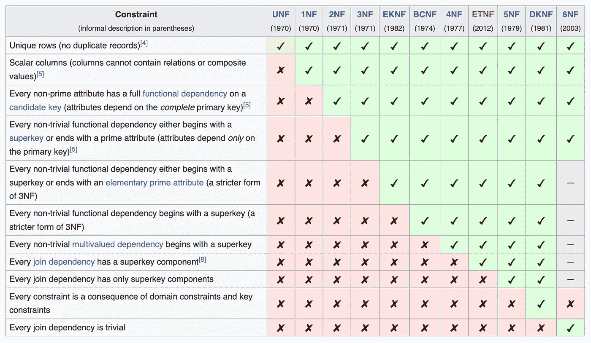

维基百科上有关于规范化的光辉[详细信息](https://en.wikipedia.org/wiki/Database_normalization)。

除了 3NF，还有额外的规范化级别，但在实践中不常用。

享受这个故事吗？当我发布类似文章时，请获取[电子邮件](https://col-jung.medium.com/subscribe)。

# 3\. 非关系型数据库

顺便说一下，让我们快速介绍一下***非***关系型数据库。

这些是数据管理系统，它们不对数据应用关系模式。非关系型数据库通常被称为**NoSQL**数据库，即使有些支持 SQL 语言的变体。

常用的非关系型数据库有四种常见类型。

+   **键值数据库**，其中每条记录由唯一键和一个关联的值组成，值可以是任何格式。

+   **文档数据库**是一种特定形式的键值数据库，其中值是 JSON 文档，系统被优化以解析和查询这些文档。

+   **列族数据库**，存储由行和列组成的表格数据，但你可以将列划分为称为列族的组。每个列族包含一组逻辑上相关的列。

+   **图形数据库**，将实体存储为节点，通过链接定义它们之间的关系。

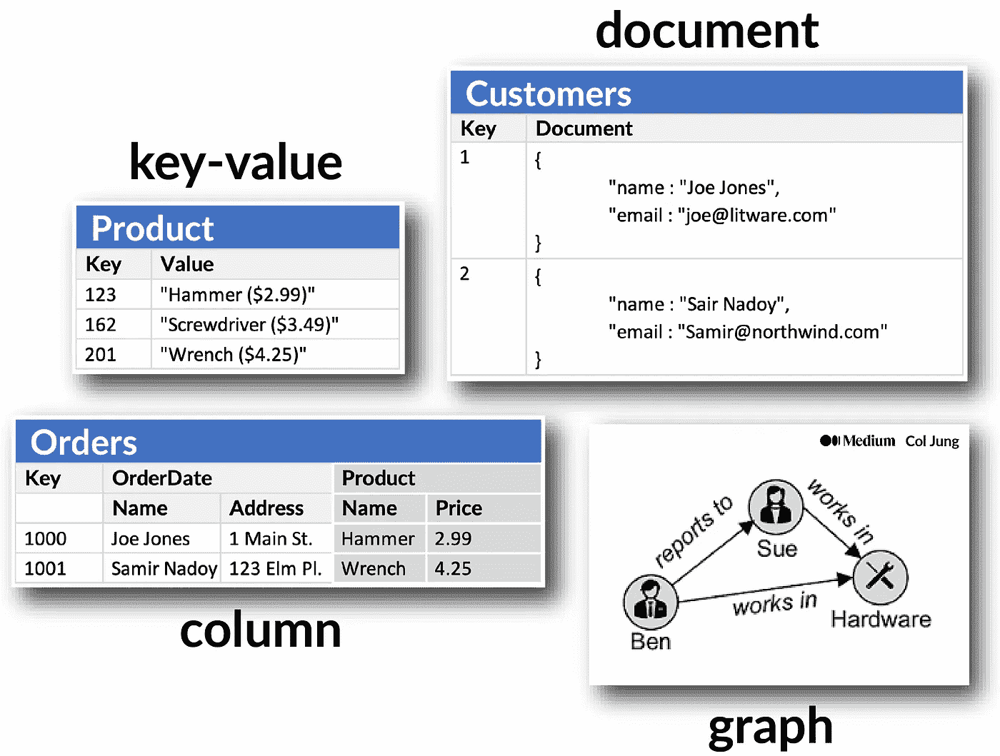

NoSQL 数据库。图像由作者提供

# 4\. 总结

分析模型使你能够结构化数据以支持分析。

分析数据从操作系统迁移到*数据湖*，然后到*数据仓库*。在这里，得到的*关系数据库*被**建模**，这包括为了效率进行*规范化*并制定适合你业务用例的*模式*。

这些模型基于拥有*相关*的数据表，并定义了你希望分析或报告的数值（*度量*）以及你希望聚合它们的实体（*维度*）。

规范化有三种常见级别，它将每个表拆分为更小、更具体的表，这些表以更逻辑和高效的方式相互连接。

为了进一步提高效率，数据可能会被预先聚合到**OLAP 模型**或**立方体**中。从直观上看，这些模型形成了多个维度结构，当你正好在 3 个维度上进行聚合时，它们类似于一个立方体，例如*销售收入*在*客户*、*产品*和*时间*上的表现。

然后，通过**丰富**所选择的数据（通过*连接*表格）并进行**感兴趣的聚合**，数据分析师和下游用户可以获得见解。

通过[说服性数据讲述](https://medium.com/swlh/power-of-storytelling-in-business-data-analytics-your-data-is-only-half-the-story-f50fadf9712b)，分析师和商业专业人士将他们的发现展示给决策者，决策者可以基于这些数据做出行动。

如果你觉得这篇文章有用，请告诉我！

在[Twitter](https://twitter.com/col_jung)和 YouTube 上找到我，[点击这里](https://youtube.com/@col_builds)、[点击这里](https://youtube.com/@col_invests)和[点击这里](https://youtube.com/@col_shoots)。

# 我的热门 AI、机器学习与数据科学文章

+   AI 与机器学习：快速入门 — [点击这里](https://col-jung.medium.com/ai-revolution-your-fast-paced-introduction-to-machine-learning-914ce9b6ddf)

+   机器学习与机械建模 — [点击这里](https://medium.com/swlh/differential-equations-versus-machine-learning-78c3c0615055)

+   数据科学：现代数据科学家的新时代技能 — 点击这里

+   生成 AI：大公司如何争相采用 — [点击这里](https://generativeai.pub/how-big-companies-are-scrambling-to-adopt-generative-ai-d52456fb4c69)

+   ChatGPT 与 GPT-4：OpenAI 如何赢得 NLU 战争 — [点击这里](https://col-jung.medium.com/the-road-to-chatgpt-gpt-4-how-deep-learning-revolutionised-natural-language-processing-835d89560577)

+   GenAI 艺术：DALL-E、Midjourney 和 Stable Diffusion 解释 — [点击这里](https://col-jung.medium.com/generative-ai-art-the-road-to-dall-e-midjourney-stable-diffusion-3b3219d97f02)

+   超越 ChatGPT：寻找真正智能的机器 — [点击这里](https://col-jung.medium.com/from-chatgpt-to-singularity-the-search-for-a-truly-intelligent-machine-856c8f4c5e63)

+   现代企业数据战略解读 — [这里](https://generativeai.pub/modern-enterprise-data-strategy-a-guide-for-analysts-data-scientists-engineers-2d4b45a31427)

+   从数据仓库和数据湖到数据网格 — 这里

+   从数据湖到数据网格：最新架构指南 — 这里

+   Azure Synapse Analytics 实战：7 个用例解析 — [这里](https://generativeai.pub/azure-synapse-analytics-in-action-7-real-world-use-cases-explored-c73ef231b408)

+   云计算 101：为你的业务利用云计算 — [这里](https://generativeai.pub/cloud-computing-unleashed-how-to-harness-the-power-of-cloud-for-your-business-f72e8e23be9)

+   数据仓库与数据建模 — 快速入门课程 — 这里

+   数据产品：为分析建立坚实基础 — [这里](https://generativeai.pub/data-products-why-your-organisation-needs-them-4ac7bf2e5953)

+   数据民主化：5 个“大数据皆可用”策略 — 这里

+   数据治理：分析师的 5 个常见痛点 — 这里

+   数据讲故事的力量 — 销售故事，而非数据 — [这里](https://medium.com/swlh/power-of-storytelling-in-business-data-analytics-your-data-is-only-half-the-story-f50fadf9712b)

+   数据分析入门：谷歌方法 — 这里

+   Power BI — 从数据建模到惊艳报告 — 这里

+   回归分析：使用 Python 预测房价 — 这里

+   分类：使用 Python 预测员工流失 — 这里

+   Python Jupyter 笔记本与 Dataiku DSS — 这里

+   常见机器学习性能指标解读 — 这里

+   在 AWS 上构建生成 AI — 我的第一次体验 — [这里](https://generativeai.pub/how-big-companies-are-scrambling-to-adopt-generative-ai-d52456fb4c69)

+   数学建模与 COVID-19 机器学习 — [这里](https://medium.com/swlh/math-modelling-and-machine-learning-for-covid-19-646efcbe024e)

+   未来的工作：在 AI 时代你的职业安全吗 — [这里](https://col-jung.medium.com/future-of-work-is-your-career-safe-in-the-age-of-chatgpt-gpt-4-122d5996bd57)
