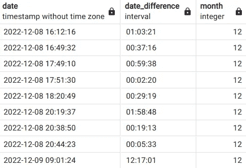
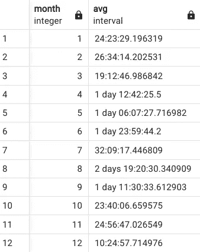

# SQL 中的日期和子查询

> 原文：[`towardsdatascience.com/dates-and-subqueries-in-sql-eaf58a3c6cf9`](https://towardsdatascience.com/dates-and-subqueries-in-sql-eaf58a3c6cf9)

## 在 SQL 中处理日期

[](https://mgcodesandstats.medium.com/?source=post_page-----eaf58a3c6cf9--------------------------------)[](https://towardsdatascience.com/?source=post_page-----eaf58a3c6cf9--------------------------------) [Michael Grogan](https://mgcodesandstats.medium.com/?source=post_page-----eaf58a3c6cf9--------------------------------)

·发布于[数据科学前沿](https://towardsdatascience.com/?source=post_page-----eaf58a3c6cf9--------------------------------) ·阅读时长 4 分钟·2023 年 1 月 27 日

--


来源：[webandi](https://pixabay.com/users/webandi-1460261/)提供的照片，来自[Pixabay](https://pixabay.com/photos/calendar-dates-schedule-days-1990453/)

在处理 SQL 数据库时，通常需要处理包含日期列的表，这些日期列显示每个相关记录的日期。

然而，SQL 处理日期并从这些数据类型中提取有价值见解的能力常常不被充分理解。

## 天气数据示例

我们考虑以下示例。假设存在一个天气数据库，其中记录了日期和相关的天气信息。以下是数据的片段：


来源：作者使用 PostgreSQL 创建的表（及数据）。表格显示在 pgAdmin4 中。

同时，假设表中定义了一个月份变量，并从表中提取了相关值，如下所示：

```py
update weatherdata set month=extract(month from date);
```

现在，为了确保我们每个月都有足够的温度记录，并且记录之间的间隔不至于过长——我们假设希望计算表中每两个连续记录之间的**平均持续时间**，并按月分组。

这个任务将通过以下方式完成：

1.  使用 LAG()函数计算每两个连续日期之间的差异

1.  使用子查询计算步骤 1 中计算的每个记录之间的平均持续时间，然后按月分组

## 计算日期之间的持续时间

通过使用 LAG 函数，我们可以计算每两个连续日期之间的持续时间。然而，我们还希望在新表中显示日期和月份列——我们在随后按月分组平均持续时间时需要使用月份列。

为了实现这一点，我们必须：

+   通过使用 LAG 函数，计算连续日期之间的持续时间

+   通过使用 INNER JOIN 函数将相关表与自身进行内连接

具体操作如下：

```py
select t1.date, t1.date - lag(t1.date) over (order by t1.date) as date_difference, t1.month from weatherdata as t1 inner join weatherdata as t2 on t1.date=t2.date;
```

这是从上述查询生成的表格：



来源：表格（和数据）由作者使用 PostgreSQL 创建。表格在 pgAdmin4 中显示。

我们可以看到，对于上个月记录的天气数据——大多数条目的持续时间不到一天——这意味着天气模式被定期记录，我们很可能获得了该月的代表性样本！

## 使用带有 GROUP BY 函数的子查询

在计算了上述表格后，我们现在希望按月份计算记录日期之间的平均持续时间。

为了使用我们刚刚生成的数据——我们必须现在使用子查询。也就是说，我们将把上述查询纳入一个更广泛的聚合查询中，该查询可以使用 GROUP BY 函数。

为了按月份分组持续时间，运行以下查询：

```py
select month, avg(date_difference) from (select t1.date as date, t1.date - lag(t1.date) over (order by t1.date) as date_difference, t1.month as month from weatherdata as t1 inner join weatherdata as t2 on t1.date=t2.date) as subquery group by month order by month;
```

这是生成的数据：



来源：表格（和数据）由作者使用 PostgreSQL 创建。表格在 pgAdmin4 中显示。

从上面可以看出，在第 1 个月到第 12 个月（1 月到 12 月）之间——我们计算了每个月记录日期之间的平均持续时间。

## 结论

在这篇文章中，你已经看到：

+   如何从日期中提取月份值

+   如何使用 LAG 函数计算连续日期之间的持续时间差

+   使用子查询以便使用诸如 GROUP BY 之类的聚合函数

非常感谢阅读，如有任何问题或反馈，欢迎提出！你还可以在[这里](https://www.michael-grogan.com/articles/dates-subqueries)找到原始文章，以及更多有用的 SQL 实践示例。

*免责声明：本文是以“原样”基础和无担保的方式编写的。它旨在提供数据科学概念的概述，不应被解读为专业建议。本文中的发现和解释仅代表作者本人，并未得到文中提到的任何第三方的认可或关联。作者与本文提到的任何第三方没有任何关系。*
