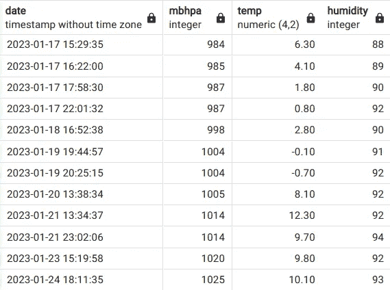

# SQL 中的日期和子查询

> 原文：[`towardsdatascience.com/dates-and-subqueries-in-sql-eaf58a3c6cf9?source=collection_archive---------3-----------------------#2023-01-27`](https://towardsdatascience.com/dates-and-subqueries-in-sql-eaf58a3c6cf9?source=collection_archive---------3-----------------------#2023-01-27)

## 在 SQL 中处理日期

[](https://mgcodesandstats.medium.com/?source=post_page-----eaf58a3c6cf9--------------------------------)[](https://towardsdatascience.com/?source=post_page-----eaf58a3c6cf9--------------------------------) [Michael Grogan](https://mgcodesandstats.medium.com/?source=post_page-----eaf58a3c6cf9--------------------------------)

·

[关注](https://medium.com/m/signin?actionUrl=https%3A%2F%2Fmedium.com%2F_%2Fsubscribe%2Fuser%2Feec017a8b178&operation=register&redirect=https%3A%2F%2Ftowardsdatascience.com%2Fdates-and-subqueries-in-sql-eaf58a3c6cf9&user=Michael+Grogan&userId=eec017a8b178&source=post_page-eec017a8b178----eaf58a3c6cf9---------------------post_header-----------) 发布于[Towards Data Science](https://towardsdatascience.com/?source=post_page-----eaf58a3c6cf9--------------------------------) ·4 分钟阅读·2023 年 1 月 27 日[](https://medium.com/m/signin?actionUrl=https%3A%2F%2Fmedium.com%2F_%2Fvote%2Ftowards-data-science%2Feaf58a3c6cf9&operation=register&redirect=https%3A%2F%2Ftowardsdatascience.com%2Fdates-and-subqueries-in-sql-eaf58a3c6cf9&user=Michael+Grogan&userId=eec017a8b178&source=-----eaf58a3c6cf9---------------------clap_footer-----------)

--

[](https://medium.com/m/signin?actionUrl=https%3A%2F%2Fmedium.com%2F_%2Fbookmark%2Fp%2Feaf58a3c6cf9&operation=register&redirect=https%3A%2F%2Ftowardsdatascience.com%2Fdates-and-subqueries-in-sql-eaf58a3c6cf9&source=-----eaf58a3c6cf9---------------------bookmark_footer-----------)

来源: 由[webandi](https://pixabay.com/users/webandi-1460261/)提供的[Pixabay](https://pixabay.com/photos/calendar-dates-schedule-days-1990453/)的照片

通常在使用 SQL 数据库时，工作内容通常涉及包含日期列的表，这些列显示每条相关记录的日期。

然而，SQL 在处理日期并从这些数据类型中提取有价值的见解的能力常常不被充分理解。

## 天气数据示例

让我们考虑以下示例。假设存在一个天气数据库，其中记录了日期和相关的天气信息。以下是数据的一部分：



来源: 作者使用 PostgreSQL 创建的表（及数据）。表在 pgAdmin4 中显示。

此外，假设表中已经定义了一个月份变量，并且相关的值已从表中提取如下：

```py
update weatherdata set month=extract(month from date);
```

现在，为了确保我们每个月都有足够的温度记录，并且记录之间的间隔不至于过长——让我们假设我们希望计算表中每个连续记录之间的**平均持续时间**，并按月进行分组。
