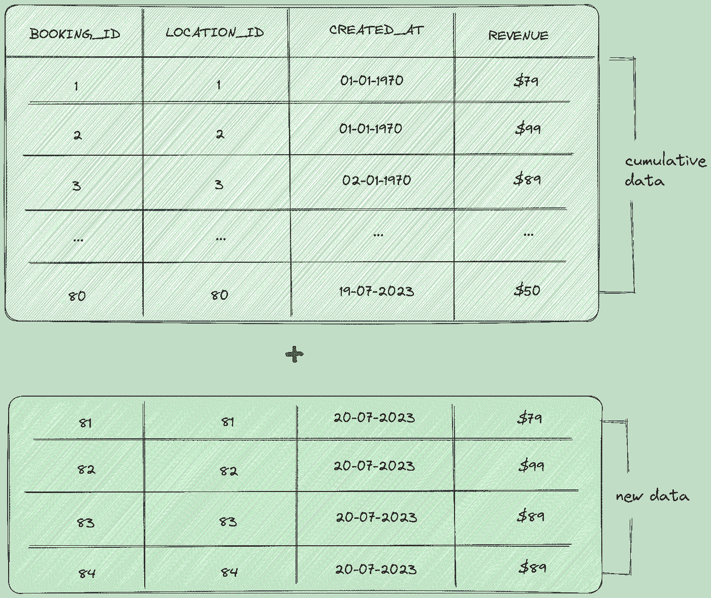
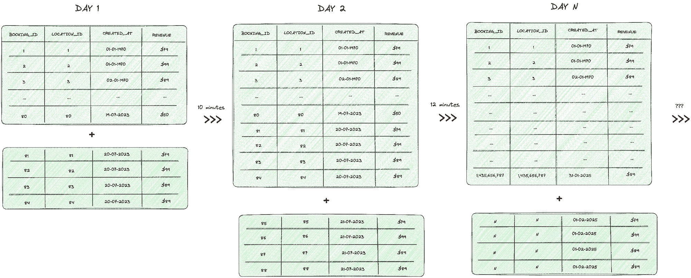
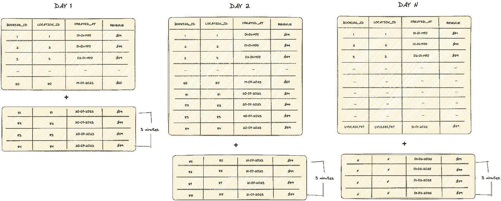

# dbt 增量模型——正确的方式

> 原文：[`towardsdatascience.com/dbt-incremental-the-right-way-63f931263f4a?source=collection_archive---------1-----------------------#2023-07-21`](https://towardsdatascience.com/dbt-incremental-the-right-way-63f931263f4a?source=collection_archive---------1-----------------------#2023-07-21)

## 从全面加载的痛苦到增量收益（以及途中一些错误）

[](https://medium.com/@ndleah?source=post_page-----63f931263f4a--------------------------------)[](https://towardsdatascience.com/?source=post_page-----63f931263f4a--------------------------------) [Leah Nguyen](https://medium.com/@ndleah?source=post_page-----63f931263f4a--------------------------------)

·

[关注](https://medium.com/m/signin?actionUrl=https%3A%2F%2Fmedium.com%2F_%2Fsubscribe%2Fuser%2F7ee083e5e515&operation=register&redirect=https%3A%2F%2Ftowardsdatascience.com%2Fdbt-incremental-the-right-way-63f931263f4a&user=Leah+Nguyen&userId=7ee083e5e515&source=post_page-7ee083e5e515----63f931263f4a---------------------post_header-----------) 发表在[Towards Data Science](https://towardsdatascience.com/?source=post_page-----63f931263f4a--------------------------------) ·9 分钟阅读·2023 年 7 月 21 日[](https://medium.com/m/signin?actionUrl=https%3A%2F%2Fmedium.com%2F_%2Fvote%2Ftowards-data-science%2F63f931263f4a&operation=register&redirect=https%3A%2F%2Ftowardsdatascience.com%2Fdbt-incremental-the-right-way-63f931263f4a&user=Leah+Nguyen&userId=7ee083e5e515&source=-----63f931263f4a---------------------clap_footer-----------)

--

[](https://medium.com/m/signin?actionUrl=https%3A%2F%2Fmedium.com%2F_%2Fbookmark%2Fp%2F63f931263f4a&operation=register&redirect=https%3A%2F%2Ftowardsdatascience.com%2Fdbt-incremental-the-right-way-63f931263f4a&source=-----63f931263f4a---------------------bookmark_footer-----------)

图片来源：[Lukas Tennie](https://unsplash.com/es/@luk10?utm_source=medium&utm_medium=referral)在[Unsplash](https://unsplash.com/?utm_source=medium&utm_medium=referral)

当我在 GlamCorner 的团队开始从传统的 MySQL 数据库过渡到使用 dbt 作为转换和建模层的 Postgres 数据库的 ELT 时，我们感到非常高兴。我们设置了 dbt 项目和配置文件，为我们的模型专门编写了宏，并构建了更多的数据集市以满足下游需求。我们以为一切都完成了——我以为一切都完成了，直到我们遇到第一个障碍：模型运行时间。在这篇文章中，我解释了如何通过采用 dbt 增量模型来克服当时最艰难的性能挑战，犯错（谁没有呢？）并在过程中学到宝贵的经验教训。

# 进化中的怪物

在 GlamCorner，我们玩的是循环时尚游戏。我们的“后端”团队在仓库里使用 RFID 扫描器，像专业人士一样扫描进出商品。我们还使用像 Zendesk 和 Google Analytics 这样的高级平台，让我们的客户感觉特别棒。更棒的是，我们有自己内部的库存系统——多亏了我们出色的软件工程师——将所有前端和后端系统连接在一起。这就像是天作之合。但随着我们的成长和运营年限的增加，我们的数据库越来越大。可以说，传统的全表加载开始感觉有点像是个麻烦。

# 痛苦

你要么理解“我希望数据在早上 9 点前准备好”的痛苦，要么不理解。


图片来自作者

团队付出了努力来创建无瑕的**(E)**xtract 和**(L)**oad，我们一起庆祝。然后有一天，**(T)**ransformation 就像“哎，这里不是这样运作的”一样，把总运行时间从 10 分钟提高到 90 分钟。我可能夸张了 10 分钟到 90 分钟的部分，因为是的，一切都有其原因，但当你还没喝第一杯咖啡，早上 8:55 商务团队就敲门问：“最新数据在哪里？”这种感觉真的是每天上班的地狱。这就像把所有的辛勤工作扔进垃圾桶，我自己无法接受这个现实。

回到我说的事情：每件事都有它的理由，而曾经只需要 10 分钟的童话故事现在却变成了 90 分钟的红角魔鬼。为了说明这一点，我们以**fct_booking**数据表为例。这个表包含了每天从网站上获取的所有预订信息。每个`**booking_id**`代表一个在网站上预订的订单。



图片来自作者

每天，大约有 4 个订单被添加到预订表中，而该表已经包含 80 个订单。当使用 dbt 运行这个模型时，它会删除前一天的整个表，用 84 条记录（包括旧订单和新订单）替换所有记录（80 个历史累计订单+最新一天增加的 4 个新订单）。另外，每新增 4 条记录，查询时间会增加约 0.5 秒。



图片来自作者

> 现在，想象一下 4 个订单等于每天 4000 条记录，而 80 个订单实际上代表 80 万条记录。你能猜到转换 fct_bookings 表需要多长时间吗？例如，三个月后我们会在哪里？
> 
> **好吧，** **我会把数学留给你。**

# 金蛋

所以，在无目的地浏览 dbt 社区线程并半心半意地浏览 dbt 文档之后（我意思是，谁没这样做过？），我发现了 dbt 增量的圣杯。这就像在稻草堆中找针，只不过那根针是金色的，而稻草堆是由代码组成的。

用通俗的话说，dbt 增量意味着你不必从头开始处理所有数据。你只需处理新数据和修改过的数据，从而节省时间和资源。这就像一个实际有效的快捷方式，不会让你在老板面前出丑。



作者提供的图片

*如果你想了解更多关于 dbt 增量的细节，可以查看这个博客和文档：*

[](/the-power-of-dbt-incremental-models-for-big-data-c8ba821eb078?source=post_page-----63f931263f4a--------------------------------) ## dbt 增量模型在大数据中的强大作用

### 在 BigQuery 上的实验

towardsdatascience.com [](https://docs.getdbt.com/docs/build/incremental-models?source=post_page-----63f931263f4a--------------------------------) [## 增量模型 | dbt 开发者中心

### 阅读此教程，了解如何在构建 dbt 时使用增量模型。

docs.getdbt.com](https://docs.getdbt.com/docs/build/incremental-models?source=post_page-----63f931263f4a--------------------------------)

要在你的 dbt 模型中设置这个模型，你需要在模型脚本的开头添加一个配置块，同时考虑这两个组件：

+   **Materialized（物化视图）：** 默认情况下，dbt 模型的物化视图等于 ‘table’，当没有配置时。要设置增量模式，请将物化视图设置为 ‘incremental’。有关其他 dbt 物化视图的信息，请访问：

[](https://docs.getdbt.com/docs/build/materializations?source=post_page-----63f931263f4a--------------------------------) [## 物化视图 | dbt 开发者中心

### 阅读此教程，了解如何在构建 dbt 时使用物化视图。

docs.getdbt.com](https://docs.getdbt.com/docs/build/materializations?source=post_page-----63f931263f4a--------------------------------)

+   **Unique_key（唯一键）：** 尽管根据 dbt 文档设置唯一键是可选的，但合理考虑如何设置这一点是极其重要的。实际上，唯一键将是主要驱动因素，帮助 dbt 确定记录是否应添加或更改。需要考虑的一些问题包括：

+   唯一键真的唯一吗？

+   这是两个或更多列的组合吗？

未设置唯一键可能导致数据丢失和模糊值，**所以要小心！**

这是一个如何为单个唯一键设置配置块的示例：

如果唯一键是多个列的组合，你可以调整配置为：

> **注意：** 如果你使用 BigQuery 或 Snowflake 存储数据，你可能可以调整更多的配置，如设置 sync_mode。但由于我们公司的数据库基于 Redshift，具体来说是 Postgres，我们没有这些高级配置。

一旦解决了这个问题，我们还需要在 dbt 增量模型的脚本中添加一个重要步骤：为 `**is_incremental()**` 宏添加一个条件块。

**is_incremental()** 宏在满足以下条件时返回 *True*：

+   目标表已经存在于数据库中。

+   dbt 没有以 `**full-refresh**` 模式运行。

+   运行的模型配置为 `**materialized=’incremental’**`

请注意，无论 `**is_incremental()**` 计算结果是 ***True*** 还是 ***False***，你的模型中的 SQL 需要是有效的。

回到 fct_booking 的例子，以下是原始查询：

在应用上述增量设置后，我们有一个模型，其中包括唯一键、模型标签和 `**is_incremental()**` 宏的条件块，如下所示：

如代码中所示，unique_key 已设置为 `**booking_id**`，因为一个 booking_id 对应一个订单。

为了使其更高端，我还为任何其他与增量物化集成的模型添加了一个模型标签 **incremental_model**。主要原因是，通常当 dbt 模型增量出现问题时，它们往往会成批出现问题。因此，为了刷新这些模型而不影响其他模型，并且不需要记住每个启用了增量模式的模型，我可以运行上述代码，而不是单独指定每个模型名称。

```py
dbt run — select tag:incremental_model --full-fresh
```

还要注意，如果增量模型设置不正确并且在生产表中更新了错误的数据，我需要使用 `--full-refresh` 命令重新运行模型。然而，你应该记住，以全量加载刷新而不是增量模式运行会更慢，因此记得选择合适的时间进行此操作 (*提示：不要在早上 9 点进行*)。

# 反击

到目前为止，生活再次美好！我完美地设置了表，性能查询显著提高。终于，我可以安然入睡。我的手可以触摸草地，dbt 增量模型也没有错过小 Leah —— 这是一个梦想成真。然而，不久之后，财务团队的一名员工急匆匆地跑到我的桌前，手里拿着一份报告，激动地声称：“你给了我错误的数据！”

结果是增量模型在一天中意外跳过了许多订单，然后进入了第二天。“这怎么可能发生？我按照专家教程操作——这不可能错！”我在心里低语。除非上游发生了一些我可能遗漏的事情。经过一番挖掘，问题浮出水面。

每天，在午夜进行数据提取和加载过程，以同步直到那一刻的所有数据。同步通常发生在午夜，但其时间可能会受到启动时间和包缓存等因素的影响。需要注意的是，提取过程可能会在午夜之后稍微开始。

考虑一种情况：提取在凌晨 12:02 开始，而某人决定在凌晨 12:01 进行预订。在这种情况下，数据也将包括当天的一小部分订单，这在更技术性的术语中被称为“迟到数据”。

然而，当前 WHERE 筛选器的逻辑存在一个缺点。筛选器的效率受到影响，因为它仅从 `**created_at**` 的最新日期值中追加新记录。这意味着它不会捕捉到整天的数据。

为了修复这个问题，我们将稍微调整这个逻辑：

新的筛选器涉及同步过去 7 天的所有数据。任何新数据将被添加到现有数据集中，而任何旧数据的更新字段值将被替换。

# 权衡

既然你已经跟随到了这里，你可能会想：“我应该使用 `is_incremental` 筛选器回溯多少天？为什么我选择了 7 天？如果我需要过去 30 天的数据怎么办？”答案并不简单——这取决于你的具体情况。

在我的情况中，我确保每天至少有一个订单。由于过去 7 天的数据可能会发生内部变化，我将筛选器设置为在该时间范围内追加新数据和更新现有数据。然而，如果你对你的查询性能有信心并且想要回溯更长的时间，比如过去 365 天，你可以自由选择！只需注意需要考虑的权衡。

使用增量模型的主要原因是降低模型运行性能的成本。然而，根据数据的大小和公司具体的使用案例，扫描过去 7 天的大数据集可能会降低性能。根据你的需求，找到合适的平衡是至关重要的。

对于更通用的方法，我建议将 7 天作为标准规则。你可以设置每周或每年进行一次完整刷新，以更新 dbt 增量模型。这种方法允许你考虑到意外问题，因为无论你的设置多么完善，仍然可能会有偶尔的停机时间。

在我的使用案例中，我通常会在周末安排增量运行的完整刷新，因为那时操作任务较少。然而，这个时间表可以根据你的团队要求进行自定义。

请记住，关键是找到数据新鲜度和查询性能之间的最佳平衡，确保数据保持准确和最新，同时优化模型的效率。
