# 处理 Python 数据框中的日期，第一部分 — 日期系列创建

> 原文：[`towardsdatascience.com/dealing-with-dates-in-pythons-dataframe-part-1-date-series-creation-f4a800db9ae`](https://towardsdatascience.com/dealing-with-dates-in-pythons-dataframe-part-1-date-series-creation-f4a800db9ae)

## Python 数据处理

## Pandas 日期系列创建方法

[](https://kahemchu.medium.com/?source=post_page-----f4a800db9ae--------------------------------)[](https://towardsdatascience.com/?source=post_page-----f4a800db9ae--------------------------------) [KahEm Chu](https://kahemchu.medium.com/?source=post_page-----f4a800db9ae--------------------------------)

·发布于 [Towards Data Science](https://towardsdatascience.com/?source=post_page-----f4a800db9ae--------------------------------) ·阅读时间 10 分钟·2023 年 1 月 4 日

--


[Jon Tyson](https://unsplash.com/@jontyson?utm_source=unsplash&utm_medium=referral&utm_content=creditCopyText) 摄影，来自 [Unsplash](https://unsplash.com/s/photos/time?utm_source=unsplash&utm_medium=referral&utm_content=creditCopyText)

大多数情况下，DateTime 对象是从数据中获取洞察的重要元素。我们可以通过日期理解数据中的趋势、周期和季节模式。基于这些模式，我们可以准备报告，并进一步研究和分析数据。

DateTime 对象在分析中的重要性激励我进一步研究在 `pandas` 模块中可以用 DateTime 对象做什么。然后，我记录下了我经常使用的方法和属性，以及我可能需要使用的一些方法。此外，我根据自己的理解将其分成了两个部分，具体如下：


图片来源于作者。

为了更好的阅读体验，我决定将这一组内容拆分为 2 篇文章。这是第一篇，你可以在这里找到 第二篇文章。

让我们从第一部分开始，*处理 DateTime 系列的基础知识*。

## 第一部分 — 处理 DateTime 系列的基础知识

DateTime 系列创建

+   pandas.date_range

+   pandas.bdate_range

+   pandas.period_range

+   pandas.timedelta_range

# DateTime 系列创建

当你想创建一个示例数据集以测试你正在编写的几个新功能时，创建 DateTime 系列是很实用的。以下是 `pandas` 模块中四种 DateTime 系列创建方法。

+   [pandas.date_range](https://pandas.pydata.org/pandas-docs/stable/reference/api/pandas.date_range.html?highlight=date_range#pandas.date_range) — 返回固定频率的 DatetimeIndex。

+   [pandas.bdate_range](https://pandas.pydata.org/pandas-docs/stable/reference/api/pandas.bdate_range.html) — 返回固定频率的 DatetimeIndex，默认频率为工作日。

+   [pandas.period_range](https://pandas.pydata.org/pandas-docs/stable/reference/api/pandas.period_range.html) — 返回固定频率的 PeriodIndex。默认频率为天（历法）。

+   [pandas.timedelta_range](https://pandas.pydata.org/pandas-docs/stable/reference/api/pandas.timedelta_range.html) — 返回固定频率的 TimedeltaIndex，默认频率为天。

上述频率指的是生成日期之间的间隔，可能是每小时、每日、每月、每季度、每年等。你可以了解更多关于[频率字符串别名的内容](https://pandas.pydata.org/pandas-docs/stable/user_guide/timeseries.html#offset-aliases) [1]。

让我们一个一个看吧！

## **1\. pandas.date_range**

`pandas.date_range()`方法根据以下四个参数中的三种组合返回 DateTime 序列：

1.  `start` — 生成的日期范围的开始日期

1.  `end` — 生成的日期范围的结束日期

1.  `periods` — 生成的日期数量

1.  `freq` — 默认为“D”，日期之间的间隔，可能是每小时、每月或每年

*注意：* `freq = “D”` *表示每日频率。*

要生成 DateTime 序列，以上 4 个参数中的至少三个必须指定。由于`freq`默认为“D”，如果你使用`freq=D`，只需指定其他两个参数。如果省略`freq`，即只指定`start`、`end`和`period`参数，则生成的日期将具有从开始日期到结束日期的线性间隔元素。在该方法中还有其他参数，但本文将重点关注这 4 个主要参数。

对于**第一个示例**，通过指定开始日期和周期生成日期。如上所述，默认情况下频率设置为每日。因此，将生成 10 个日期，频率为每日。

```py
import pandas as pd
df = pd.DataFrame()
df["date_range"] = pd.date_range(start="2022/1/1", periods=10)
print(df.head(10))
print("Data Type: ", df.dtypes)
```

输出：

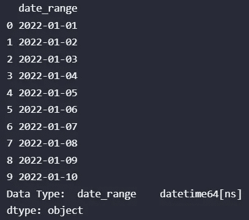

图片由作者提供。

对于**第二个示例**，指定了开始日期、周期和频率。以下示例创建了一个从 2020/1/1 开始的日期序列，共 10 个日期，每个日期之间间隔 3 个月。

```py
import pandas as pd
df = pd.DataFrame()
df["date_range"] = pd.date_range(start="2022/1/1", periods=10, freq="3M")
print(df.head(10))
print("Data Type: ", df.dtypes)
```

输出：

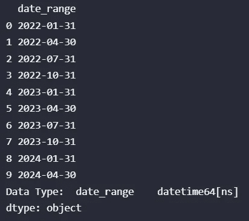

图片由作者提供。

> 为什么日期从月末开始？🤨

其实这是因为“M”频率指的是月末频率，而“MS”指的是月初频率 [[1]](https://pandas.pydata.org/pandas-docs/stable/user_guide/timeseries.html#offset-aliases)。

对于**第三个示例**，提供了开始日期和结束日期，以及频率。如前所述，当你省略频率时，生成的日期将是线性间隔的。如果省略了周期，生成的日期将是开始日期和结束日期之间按指定频率间隔的日期。

```py
import pandas as pd
df = pd.DataFrame()
df["date_range"] = pd.date_range(start="2022/1/1", end="2022-12-31", freq="3M")
print(df.head(10))
print("Data Type: ", df.dtypes)
```

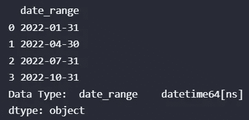

图片来自作者。

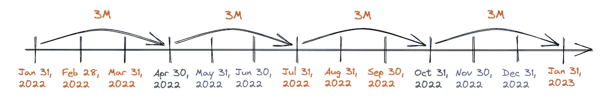

图片来自作者。创建于 Excalidraw。

由于下一个周期将是 2023 年 1 月 31 日，因此在第三个示例中只生成了 4 个日期 😉。

> **这里是一个简单指南：**
> 
> 当你确定要生成的日期数量时，使用 **period** 参数。
> 
> 当你不确定确切的日期数量但知道结束时间或不应超过时，使用 **end** 参数。

## **2\. pandas.bdate_range**

与 `pandas.date_range()` 方法类似，`pandas.bdate_range()` 也有 4 个主要参数，即 `start`、`end`、`periods` 和 `freq`，但 `pandas.bdate_range()` 中 `freq` 默认为 “B”。“B” 指的是工作日频率，即跳过周末如星期六和星期天。

让我们看看**第一个示例**！在以下示例中，指定了开始日期和周期，并且如前所述，频率默认为 “B”。

```py
import pandas as pd
df = pd.DataFrame()
# frequency is default to B, the weekend will be skipped
df["bdate_range"] = pd.bdate_range(start="2022/1/1", periods=10)
print(df.head(10))
print("Data Type: ", df.dtypes)
```

输出：

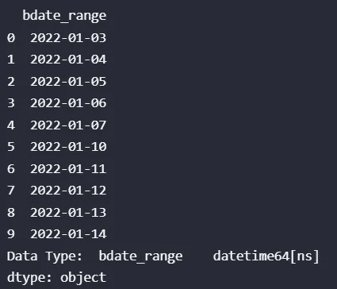

图片来自作者。

被跳过的两个日期，“2022–01–08”和“2022–01–09”分别是星期六和星期天。

你可能会注意到，`pandas.date_range()` 方法在设置 `freq= “B”` 时也可以只返回工作日，那么我们为什么还需要使用 `pandas.bdate_range()` 呢？🤷‍♀️

这是因为 `pandas.bdate_range()` 默认返回工作日，并且 `pandas.bdate_range()` 有 `weekmask` 和 `holidays` 参数。

**注意：** 要使用 `holidays` 或 `weekmask` 参数，必须使用**自定义工作日频率**，其中 `freq= “C”`。[[2]](https://stackoverflow.com/questions/55248600/pandas-specifying-custom-holidays)

现在，让我们深入了解 `holidays` 参数。`Holidays` 指的是要从有效工作日集合中排除的日期列表。

对于**第二个示例**，指定了开始日期、周期、频率和假期参数。

```py
import pandas as pd
df = pd.DataFrame()
# frequency is set to C, the weekend and holidays will be skipped
# only can set holiday when freq is set to "C"
holidays = [pd.datetime(2022,1,7)]
df["bdate_range"] = pd.bdate_range(start="2022/1/1", periods=10, freq="C", holidays=holidays)
print(df.head(10))
print("Data Type: ", df.dtypes)
```

输出：

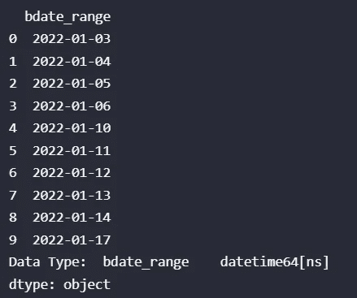

图片来自作者。

指定的假期日期不在生成的日期列表中，由于 “C” 指的是自定义工作日频率，因此创建的日期范围中周末仍会被跳过。

**注意：** Holidays 参数仅接受 datetime 对象的列表。

现在，让我们看看 `weekmask` 参数。Weekmask 指的是对于不遵循传统工作日（如周一至周五）的企业有效的工作日。此外，`weekmask` 的默认值相当于 ‘Mon Tue Wed Thu Fri’。

对于**第三个示例**，我们指定了开始日期和自定义的工作日，`weekmask = “Tue Wed Thu Fri Sat Sun”`。

```py
import pandas as pd
df = pd.DataFrame()
df["bdate_range"] = pd.bdate_range(start="2022/1/1", periods=10, freq="C", weekmask="Tue Wed Thu Fri Sat Sun")
print(df.head(10))
print("Data Type: ", df.dtypes)
```

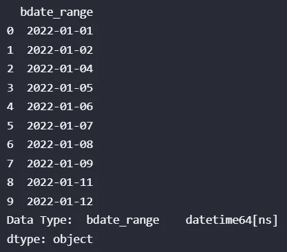

图片来源：作者。

星期一的日期（2022–01–10）将不会包含在生成的日期中。这个参数在业务不按正常工作日运行时非常有用。

结合这两个参数，你可以根据业务操作日生成 DateTime 系列，如下面的示例所示。

```py
import pandas as pd
df = pd.DataFrame()
df["bdate_range"] = pd.bdate_range(start="2022/1/1", periods=10, freq="C", weekmask="Tue Wed Thu Fri Sat Sun", holidays=[pd.datetime(2022,1,7)])
print(df.head(10))
print("Data Type: ", df.dtypes)
```

输出：

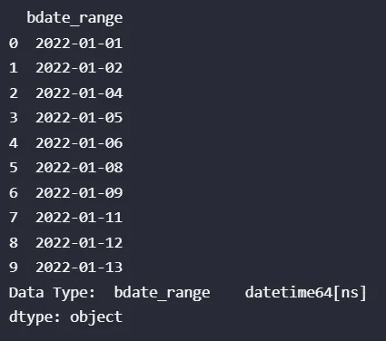

图片来源：作者。

从输出中可以看出，星期一的日期（2022–01–10）和节假日的日期（2022–01–07）没有包含在生成的列表中。

## **3\. pandas.period_range**

`pandas.period_range()` 方法与之前的两个方法，即 `pandas.date_range()` 和 `pandas.bdate_range()`，之间存在一些相似之处和不同之处。

类似于之前的两种方法，`pandas.period_range()` 可以通过指定四个主要参数中的三个，即 `start`、`end`、`periods` 和 `freq`，来生成日期系列。同时，频率仍默认为每日。

一个需要注意的不同点是，`pandas.period_range()` 生成的是周期对象，而不是 DateTime 对象。

对于**第一个示例**，我们生成了一系列按日频率的 5 个周期，默认从 2022–01–01 开始。

```py
import pandas as pd
df = pd.DataFrame()
df["period_range"] = pd.period_range(start="2022/1/1", periods=5)
print(df.head(10))
print("Data Type: ", df.dtypes)
```

输出：

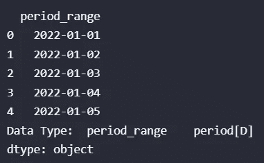

图片来源：作者。

对于**第二个示例**，我们生成了一系列的 5 个周期，频率为每月一次，从 2022–01–01 开始。

```py
import pandas as pd
df = pd.DataFrame()
df["period_range"] = pd.period_range(start="2022/1/1", periods=5, freq="M")
print(df.head(10))
print("Data Type: ", df.dtypes)
```

输出：

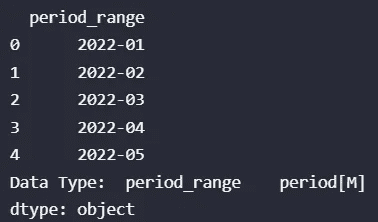

图片来源：作者。

对于**第三个示例**，我们生成了一系列按年频率的 5 个周期，从 2022–01–01 开始。

```py
import pandas as pd
df = pd.DataFrame()
df["period_range"] = pd.period_range(start="2022/1/1", periods=5, freq="Y")
print(df.head(10))
print("Data Type: ", df.dtypes)
```

输出：

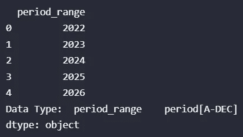

图片来源：作者。

对于**最后一个示例**，我们生成了一系列按年为频率的周期，从 2022–01–01 到 2027–01–01。

```py
import pandas as pd
df = pd.DataFrame()
df["period_range"] = pd.period_range(start="2022/1/1", end="2027/1/1", freq="Y")
print(df.head(10))
print("Data Type: ", df.dtypes)
```

输出：

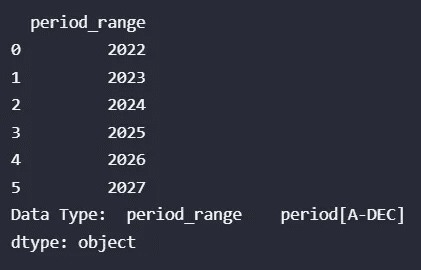

图片来源：作者。

period_range 方法的工作方式与 `pandas.date_range()` 相同，只是它返回的是周期而不是日期。因此，如果省略 `periods` 参数，则创建的周期将是指定频率间隔的开始和结束日期之间的周期。

## **4\. pandas.timedelta_range**

类似于上述三种方法，`pandas.timedelta_range()` 方法根据四个主要参数中的三个参数组合返回日期系列，即 start、end、periods 和 frequency。频率仍默认为每日。与之前的三个示例方法不同的一点可以通过下面的例子进行解释。

以下示例来自我在运行脚本时犯的一个错误，以及随后发生的错误。

```py
import pandas as pd
df = pd.DataFrame()
df["timedelta_range"] = pd.timedelta_range(start="2022/1/1", periods=5, freq="Y")
print(df.head(10))
print("Data Type: ", df.dtypes)
```

上面的脚本返回了如下的键错误和数值错误。

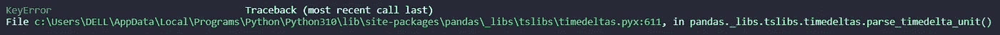

键错误。图片来源：作者。

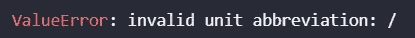

值错误。图片由作者提供。

从错误脚本中，我们可以看到错误来源于我们为“start”参数提供的值。由于我们正在生成时间增量对象，因此为“start”参数提供的值也应该是 timedelta 格式。

因此，正确的示例应如下所示，其中起始时间以 timedelta 格式指定，周期数被指定，并使用默认的每日频率。

```py
import pandas as pd
df = pd.DataFrame()
df["timedelta_range"] = pd.timedelta_range(start="1 days", periods=5)
print(df.head(10))
print("Data Type: ", df.dtypes)
```

输出：

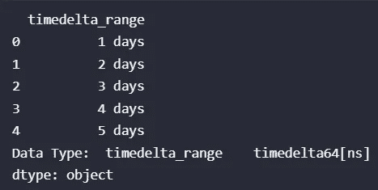

图片由作者提供。

对于第二个示例，指定了起始时间增量、周期和频率。

```py
import pandas as pd
df = pd.DataFrame()
df["timedelta_range"] = pd.timedelta_range(start="1 day", periods=5, freq="6H")
print(df.head(10))
print("Data Type: ", df.dtypes)
```

输出：

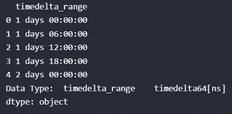

图片由作者提供。

对于第三个示例，指定了起始时间增量、结束时间增量和频率。

```py
import pandas as pd
df = pd.DataFrame()
df["timedelta_range"] = pd.timedelta_range(start="1 day", end="5days", freq="8H")
print(df.head(10))
print("Data Type: ", df.dtypes)
```

输出：

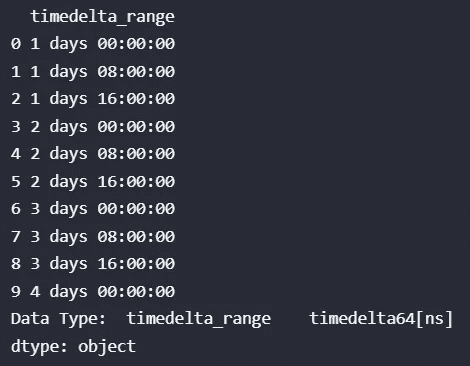

图片由作者提供。

对于第四个示例，指定了起始时间增量、结束时间增量和周期。当没有设置频率时，生成的时间增量系列将会是线性分布的。

```py
import pandas as pd
df = pd.DataFrame()
df["timedelta_range"] = pd.timedelta_range(start="1 day", end="5days", periods=3)
print(df.head(10))
print("Data Type: ", df.dtypes)
```

输出：

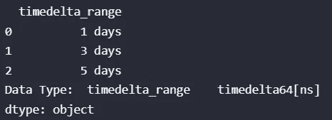

图片由作者提供。

注意：对于`pandas.timedelta_range()`方法，“start”参数仅接受时间增量对象，而对于其他三种方法，“start”参数则接受 DateTime 对象作为输入。

## 5\. **使用时间戳创建 DateTime**

在 pandas 模块中，我们还可以使用时间戳方法创建 datetime 对象。

创建 DateTime 对象有两种方法，第一种是使用如下的 datetime 参数。

```py
# https://pandas.pydata.org/pandas-docs/stable/reference/api/pandas.Timestamp.html
import pandas as pd
timestampsample = pd.Timestamp(year=2022,month=12,day=13,hour=21,minute=48, second=23, microsecond=35, nanosecond=58)
timestampsample
```

输出：

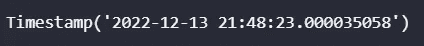

图片由作者提供。

第二种方法是从 DateTime 字符串创建时间戳。

```py
import pandas as pd
str_timestamp = '2022-12-13 21:48:23.000035058'
timestampsample2 = pd.Timestamp(str_timestamp)
timestampsample2
```

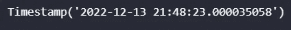

图片由作者提供。

好的，上述内容演示了如何使用时间戳方法来创建一个 DateTime 对象。

# **结论**

总之，我们已经看到与 DateTime 系列创建相关的 4 种方法，包括标准日期创建、工作日日期创建、周期创建和时间增量创建。此外，还演示了使用时间戳的日期创建方法。

关于 Python 中的 DateTime 系列创建就是这些了。希望你喜欢阅读这篇文章，并希望它能帮助你更好地理解 DataFrame 中的 DateTime 系列创建。谢谢！😊

# 保持联系

订阅 [YouTube](https://www.youtube.com/channel/UCiMtx0qbILP41Ot-pkk6eJw)

# 附注

本文第二部分，处理 Python DataFrame 中的日期（第二部分）——基础知识。

我在[处理 Python 中的日期](https://medium.com/towards-data-science/dealing-with-dates-in-python-1b4069a07a0f)中解释了你可以对 DateTime 变量进行的可能操作。

在使用 Python 进行报告自动化技巧中，我解释了一些关于报告自动化的技巧。查看一下吧！

# 参考

[1] [时间序列/数据功能 — 偏移别名。*pandas*：有用的常见时间序列频率的字符串别名](https://pandas.pydata.org/pandas-docs/stable/user_guide/timeseries.html#offset-aliases)

[2] [pandas-指定自定义假期](https://stackoverflow.com/questions/55248600/pandas-specifying-custom-holidays)：在`pandas.bdate_range()`方法中指定自定义假期

感谢你阅读到最后 😊！


照片由 [JOSHUA COLEMAN](https://unsplash.com/@joshstyle?utm_source=unsplash&utm_medium=referral&utm_content=creditCopyText) 拍摄，来源于 [Unsplash](https://unsplash.com/s/photos/thank-you?utm_source=unsplash&utm_medium=referral&utm_content=creditCopyText)
