# 处理 Python DataFrame 中的日期 第二部分——基础知识

> 原文：[`towardsdatascience.com/dealing-with-dates-in-pythons-dataframe-part-2-the-basics-9ad5edacd2f8`](https://towardsdatascience.com/dealing-with-dates-in-pythons-dataframe-part-2-the-basics-9ad5edacd2f8)

## 数据处理在 Python 中

## 本文解释了处理数据框中 DateTime 系列的基本 pandas 方法和属性。

[](https://kahemchu.medium.com/?source=post_page-----9ad5edacd2f8--------------------------------)[](https://towardsdatascience.com/?source=post_page-----9ad5edacd2f8--------------------------------) [KahEm Chu](https://kahemchu.medium.com/?source=post_page-----9ad5edacd2f8--------------------------------)

·发表于 [Towards Data Science](https://towardsdatascience.com/?source=post_page-----9ad5edacd2f8--------------------------------) ·8 分钟阅读·2023 年 1 月 4 日

--


图片由 [Lukas Blazek](https://unsplash.com/@goumbik?utm_source=unsplash&utm_medium=referral&utm_content=creditCopyText) 提供，来自 [Unsplash](https://unsplash.com/s/photos/time?utm_source=unsplash&utm_medium=referral&utm_content=creditCopyText)

正如标题所述，这篇文章是我处理 Python DataFrame 中日期系列的第二部分。以下展示了处理 Python DataFrame 中日期系列的每一部分内容。

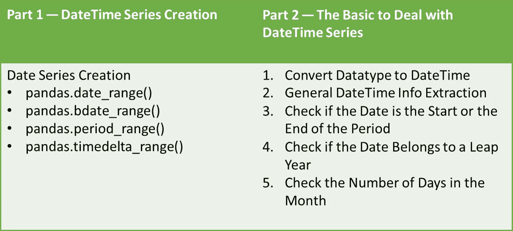

图片来自作者。

在 我之前的文章 中，我展示了 DateTime 系列的创建方法。接下来，在这篇文章中，我将展示处理数据框中 DateTime 系列的基本属性和方法。

有了这些，这篇文章将按如下结构安排：

1.  将数据类型转换为 DateTime

1.  通用 DateTime 信息提取

1.  检查日期是否为周期的开始或结束

1.  检查日期是否属于闰年

1.  检查月份中的天数

> 让我们开始吧！

# 将数据类型转换为 DateTime

在我之前的文章中展示的日期创建方法中，系列被创建为 DateTime 对象。当你从 Excel 或其他数据源读取数据时，如果没有将其解析为日期，DateTime 列将作为字符串对象读取。要从 DateTime 系列中提取 DateTime 信息，列需要先转换为 DateTime 数据类型。

有两种方法可以将数据类型转换为 DateTime。

+   `pandas.Series.astype(“DateTime”)`

+   `pandas.datetime(pandas.SeriesSeries)`

我用下面的脚本创建了一个 *demo.csv* 文件，以演示本节的方法和属性。

```py
import pandas as pd
import datetime as dt
df = pd.DataFrame()
initial_date = pd.Timestamp("2023-01-04 21:55:00")
df["timedelta_range"] = pd.timedelta_range(start="1 day", end="5days", freq="4H")
df.insert(loc=0, column="initial_date",value=initial_date)
df.insert(loc=2, column="next_date",value=df["initial_date"] + df["timedelta_range"])
print(df.head(10))
print("Data Type: ", df.dtypes)
df.to_csv("demo.csv")
```

输出的数据框如下截图所示。

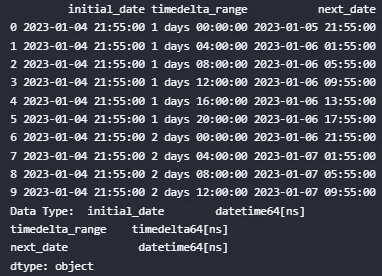

图像来源于作者。

现在，我们将读取生成的文件。

```py
import pandas as pd
df = pd.read_csv(r"demo.csv", usecols=["next_date"])
print(df.info())
df.head()
```

为演示目的，仅读取 `next_date` 列。

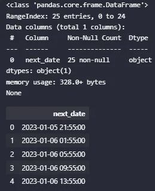

图像来源于作者。

如你所见，当直接导入列而未将其解析为 DateTime 时，该列将是一个字符串列，其中 Dtype 为对象。以下是两种将列转换为 DateTime 数据类型的常用方法。

+   pandas.to_datetime(pandas.Series)

```py
df["next_date"] = pd.to_datetime(df["next_date"])
df.info()
```

+   pandas.Series.astype(“datetime64”)

```py
df["next_date"] = df["next_date"].astype("datetime64")
df.info()
```

上述两个脚本的输出结果：

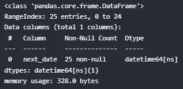

图像来源于作者。

另外，你可以在导入数据时使用 `parse_dates` 参数将列解析为 DateTime 对象。

```py
import pandas as pd
df = pd.read_csv(r"demo.csv", usecols=["next_date"], parse_dates=["next_date"])
print(df.info())
df.head()
```

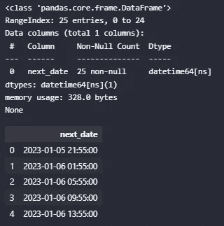

图像来源于作者。

# 一般的日期时间信息提取

从日期时间系列中可以获得大量信息。

+   时间戳

+   周

+   年中的天数

+   季度

+   ISO 日历

## 提取时间戳信息

以下是返回时间戳信息的属性和方法列表。

+   [pandas.Series.dt.date](https://pandas.pydata.org/pandas-docs/stable/reference/api/pandas.Series.dt.date.html) — 返回时间戳的日期部分，不包括时间和时区信息。

+   [pandas.Series.dt.time](https://pandas.pydata.org/pandas-docs/stable/reference/api/pandas.Series.dt.time.html) — 返回时间戳的时间部分。

+   [pandas.Series.dt.year](https://pandas.pydata.org/pandas-docs/stable/reference/api/pandas.Series.dt.year.html) — 返回日期时间的年份。

+   [pandas.Series.dt.month](https://pandas.pydata.org/pandas-docs/stable/reference/api/pandas.Series.dt.month.html) — 返回月份，1 月为 1，12 月为 12。

+   [pandas.Series.dt.month_name()](https://pandas.pydata.org/pandas-docs/stable/reference/api/pandas.Series.dt.month_name.html) — 返回指定语言环境的 Series 或 DatetimeIndex 的月份名称。

+   [pandas.Series.dt.day](https://pandas.pydata.org/pandas-docs/stable/reference/api/pandas.Series.dt.day.html) — 返回日期时间的天数。

+   [pandas.Series.dt.hour](https://pandas.pydata.org/pandas-docs/stable/reference/api/pandas.Series.dt.hour.html) — 返回日期时间的小时数。

+   [pandas.Series.dt.minute](https://pandas.pydata.org/pandas-docs/stable/reference/api/pandas.Series.dt.minute.html) — 返回日期时间的分钟数。

+   [pandas.Series.dt.second](https://pandas.pydata.org/pandas-docs/stable/reference/api/pandas.Series.dt.second.html) — 返回日期时间的秒数。

+   [pandas.Series.dt.microsecond](https://pandas.pydata.org/pandas-docs/stable/reference/api/pandas.Series.dt.microsecond.html) — 返回日期时间的微秒数。

+   [pandas.Series.dt.nanosecond](https://pandas.pydata.org/pandas-docs/stable/reference/api/pandas.Series.dt.nanosecond.html) — 返回日期时间的纳秒。

```py
import datetime as dt
```

在使用 `series.dt` 下的方法或属性之前，需要导入 datetime 模块。以下是提取时间戳信息的示例。

```py
df.insert(loc=1, column="Date_",value=df["next_date"].dt.date)
df.insert(loc=2, column="Time",value=df["next_date"].dt.time)
df.insert(loc=3, column="year",value=df["next_date"].dt.year)
df.insert(loc=4, column="month",value=df["next_date"].dt.month)
# note that the month_name is a method instead of properties
df.insert(loc=5, column="month_name",value=df["next_date"].dt.month_name())
df.insert(loc=6, column="day",value=df["next_date"].dt.day)
df.insert(loc=7, column="hour",value=df["next_date"].dt.hour)
df.insert(loc=8, column="minute",value=df["next_date"].dt.minute)
df.head()
```

输出：

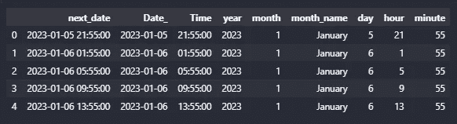

图片来自作者。

需要注意的一点是创建的列不是 DateTime 对象，即使是“Date_”列也是如此。

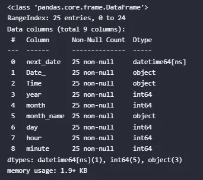

图片来自作者。

你可能会注意到，第二、微秒和纳秒的示例没有展示。这是因为它们不适用于数据集。此外，应用的方式是相同的。列类型需要在使用属性或方法返回相应的值之前转换为 datetime。

## 提取周信息/年中的天数/季度/ISO 日历

以下是返回周数、年中的天数、季度和基于 ISO 日历的信息的属性和方法列表，用于 DateTime 系列。

**周信息**

+   [pandas.Series.dt.dayofweek](https://pandas.pydata.org/pandas-docs/stable/reference/api/pandas.Series.dt.dayofweek.html) — 星期几，星期一=0，星期日=6。

+   [pandas.Series.dt.day_of_week](https://pandas.pydata.org/pandas-docs/stable/reference/api/pandas.Series.dt.day_of_week.html) — 星期几，星期一=0，星期日=6。

+   [pandas.Series.dt.weekday](https://pandas.pydata.org/pandas-docs/stable/reference/api/pandas.Series.dt.weekday.html) — 星期几，星期一=0，星期日=6。

+   [pandas.Series.dt.day_name()](https://pandas.pydata.org/pandas-docs/stable/reference/api/pandas.Series.dt.day_name.html#pandas.Series.dt.day_name) — 返回指定地区的 Series 或 DatetimeIndex 的日期名称。

**一年中的天数**

+   [pandas.Series.dt.dayofyear](https://pandas.pydata.org/pandas-docs/stable/reference/api/pandas.Series.dt.dayofyear.html) — 一年的序数天。

+   [pandas.Series.dt.day_of_year](https://pandas.pydata.org/pandas-docs/stable/reference/api/pandas.Series.dt.day_of_year.html) — 一年的序数天。

**季度**

+   [pandas.Series.dt.quarter](https://pandas.pydata.org/pandas-docs/stable/reference/api/pandas.Series.dt.quarter.html) — 日期的季度。

**ISO 日历**

+   [pandas.Series.dt.isocalendar()](https://pandas.pydata.org/pandas-docs/stable/reference/api/pandas.Series.dt.isocalendar.html) — 根据 ISO 8601 标准计算年、周和日。（返回年、周和日列）

为了展示我们可以用上述方法/属性做的有趣的事情，我创建了一个日期列表，其中包含分布在全年中的随机日期，如下所示。

```py
import pandas as pd
import datetime as dt
date_list = ["2022-10-03", "2022-11-17", "2022-12-14", "2023-01-23", "2023-02-14", "2023-03-23", "2023-04-11", "2023-05-28", "2023-06-24", "2023-07-04", "2023-08-06", "2023-09-08"]
df = pd.DataFrame(date_list, columns=["Date"])
df["Date"] = pd.to_datetime(df["Date"])
df.head(12)
```

由于我们不是从文件中读取，因此没有 `parse_dates` 函数可用。因此，必须手动将列转换为 datetime。

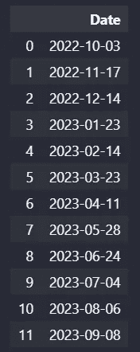

图片由作者提供。

以下是提取周、年中的天数、季度和 ISO 日历的示例。为了更好地理解，列名基于属性或方法名称。

```py
df.insert(loc=1, column="Day of Week",value=df["Date"].dt.day_of_week)
df.insert(loc=2, column="Weekday",value=df["Date"].dt.weekday)
# note that the month_name is a method instead of properties
df.insert(loc=3, column="Day Name",value=df["Date"].dt.day_name())
# day of the year
df.insert(loc=4, column="Day of Year",value=df["Date"].dt.day_of_year)
# quarter
df.insert(loc=5, column="Quarter",value=df["Date"].dt.quarter)
# iso calendar
df.insert(loc=6, column="ISO Year",value=df["Date"].dt.isocalendar().year)
df.insert(loc=7, column="ISO Week",value=df["Date"].dt.isocalendar().week)
df.insert(loc=8, column="ISO Day",value=df["Date"].dt.isocalendar().day)
df[["Date", "Day of Week", "Weekday", "Day Name", "Day of Year", "Quarter", "ISO Year", "ISO Week", "ISO Day"]].head(12)
```

输出：

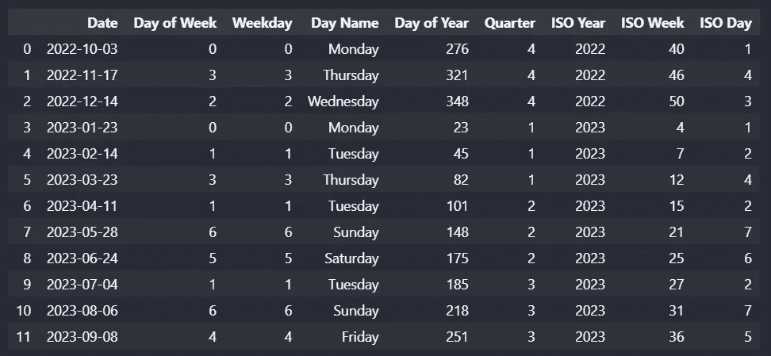

图片由作者提供。

以下是上述表格的总结：

1.  对于`day_of_week`和`weekday`属性，它们返回从 0 开始计数的星期几。

1.  对于`day_of_year`、`quarter`属性和`isocalendar()`方法，它们的返回值以从 1 开始的索引计数。

`isocalendar()`方法中，计算星期几的索引从 1 开始，而`weekday`从 0 开始。它们都以星期一为星期的起点。换句话说，第一个索引指的是星期一。

# 检查日期是否为周期的开始或结束

对于这一部分，将创建一个不同的日期列表，以更好地展示下面的属性。

+   [pandas.Series.dt.is_month_start](https://pandas.pydata.org/pandas-docs/stable/reference/api/pandas.Series.dt.is_month_start.html) — 指示日期是否为月份的第一天。

+   [pandas.Series.dt.is_month_end](https://pandas.pydata.org/pandas-docs/stable/reference/api/pandas.Series.dt.is_month_end.html) — 指示日期是否为月份的最后一天。

+   [pandas.Series.dt.is_quarter_start](https://pandas.pydata.org/pandas-docs/stable/reference/api/pandas.Series.dt.is_quarter_start.html) — 指示日期是否为季度的第一天。

+   [pandas.Series.dt.is_quarter_end](https://pandas.pydata.org/pandas-docs/stable/reference/api/pandas.Series.dt.is_quarter_end.html) — 指示日期是否为季度的最后一天。

+   [pandas.Series.dt.is_year_start](https://pandas.pydata.org/pandas-docs/stable/reference/api/pandas.Series.dt.is_year_start.html) — 指示日期是否为年的第一天。

+   [pandas.Series.dt.is_year_end](https://pandas.pydata.org/pandas-docs/stable/reference/api/pandas.Series.dt.is_year_end.html) — 指示日期是否为年的最后一天。

**示例：**

```py
date_list = ["2023-01-01", "2023-01-23", "2023-01-31", "2023-02-01", "2023-02-28", "2023-04-01", "2023-06-30", "2023-09-30", "2023-11-30", "2023-12-31"]
df = pd.DataFrame(date_list, columns=["Date"])
df["Date"] = pd.to_datetime(df["Date"])
df.insert(loc=1, column="Month Start",value=df["Date"].dt.is_month_start)
df.insert(loc=2, column="Month End",value=df["Date"].dt.is_month_end)
df.insert(loc=3, column="Quarter Start",value=df["Date"].dt.is_quarter_start)
df.insert(loc=4, column="Quarter End",value=df["Date"].dt.is_quarter_end)
df.insert(loc=5, column="Year Start",value=df["Date"].dt.is_year_start)
df.insert(loc=6, column="Year End",value=df["Date"].dt.is_year_end)
df.head(12)
```

输出：

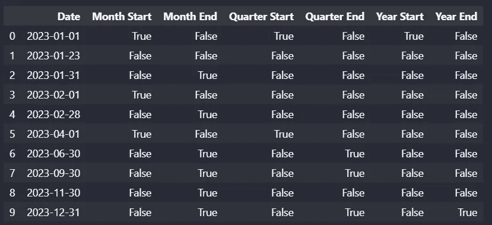

图片由作者提供。

**思考：** 我认为这些属性对于需要每月、每季度或每年准备新报告的人来说是最有用的。

这些属性将帮助他们基于创建的自动化逻辑来刷新报告。除此之外，上述属性在需要定期重新开始的计算中也可能很有用。

# 检查日期是否属于闰年

+   [pandas.Series.dt.is_leap_year](https://pandas.pydata.org/pandas-docs/stable/reference/api/pandas.Series.dt.is_leap_year.html) — 布尔值指示日期是否属于闰年。

闰年是指一年有 366 天（而不是 365 天），包括 2 月 29 日作为闰日。闰年是四的倍数的年份，但除去能被 100 整除但不能被 400 整除的年份。

我们可以通过创建的周期范围的日期来演示这个函数。

```py
df = pd.DataFrame()
df["Year"] = pd.period_range(start="2022/1/1", periods=10, freq="Y")
df.insert(loc=1, column="Leap Year",value=df["Year"].dt.is_leap_year)
print(df.head(10))
```

输出：

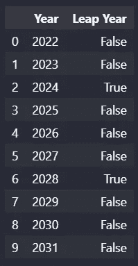

图片由作者提供。

# 检查一个月中的天数

以下这两个属性都可以返回一个月中的天数。

+   [pandas.Series.dt.daysinmonth](https://pandas.pydata.org/pandas-docs/stable/reference/api/pandas.Series.dt.daysinmonth.html) — 一个月中的天数。

+   [pandas.Series.dt.days_in_month](https://pandas.pydata.org/pandas-docs/stable/reference/api/pandas.Series.dt.days_in_month.html) — 一个月中的天数。

```py
df = pd.DataFrame()
df["Month"] = pd.period_range(start="2022/1/1", periods=12, freq="M")
df.insert(loc=1, column="Days in Month",value=df["Month"].dt.days_in_month)
df.head(12)
```

输出：

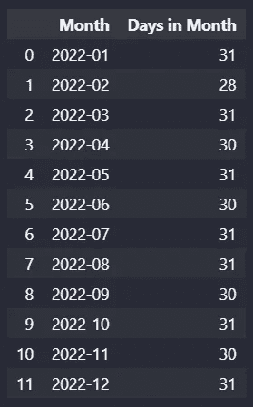

图片由作者提供。

# 结论

总结来说，解释了一些处理 DateTime 系列的基本属性和方法。展示了将包含日期时间对象的列的数据类型转换为日期时间的方法。然后，演示了提取或返回日期时间信息的基本属性和方法。日期时间信息如星期几在不同的方法中有不同的索引。

此外，还展示了一些检查日期属性的方法，例如日期是否为一个时期的开始或结束，或者日期是否属于闰年。最后，还介绍了检查一个月中日期的数量的方法。这些方法和属性可能对报告用途很有帮助。

这就是处理 Python 中日期的基础内容。希望你喜欢这篇文章，并且希望它能帮助你更好地理解如何处理 DataFrame 中的 DateTime 系列。谢谢！ 😊

# 保持联系

订阅 [YouTube](https://www.youtube.com/channel/UCiMtx0qbILP41Ot-pkk6eJw)

# 旁注

本文的第一部分，在 Python 的 DataFrame 中处理日期的第一部分 — 日期系列创建。

我在[在 Python 中处理日期](https://medium.com/towards-data-science/dealing-with-dates-in-python-1b4069a07a0f)中解释了你可以对 DateTime 变量执行的操作。

在 使用 Python 进行报告自动化技巧 中，我解释了一些报告自动化的技巧。快去看看吧！

感谢你阅读到最后 😊！

祝你 2023 年快乐！


[Adnan Mistry](https://unsplash.com/@adnan_visuals?utm_source=unsplash&utm_medium=referral&utm_content=creditCopyText) 在 [Unsplash](https://unsplash.com/s/photos/happy-new-year-2023?utm_source=unsplash&utm_medium=referral&utm_content=creditCopyText) 上的照片
