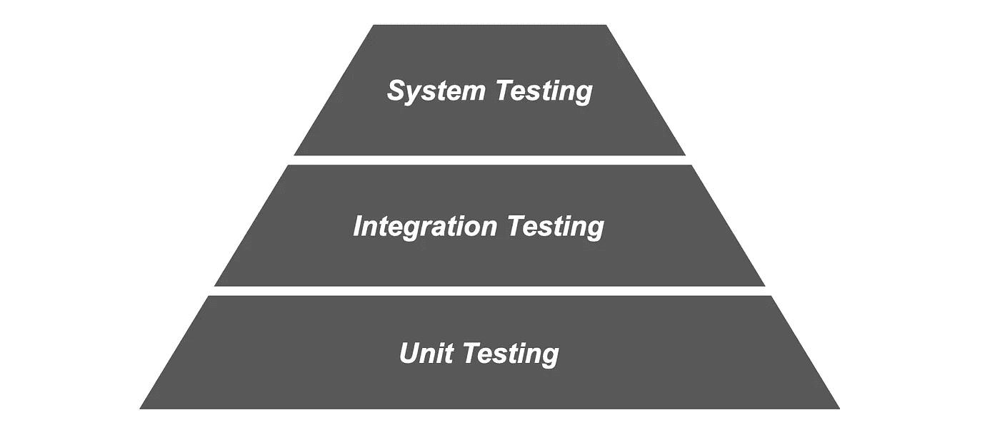
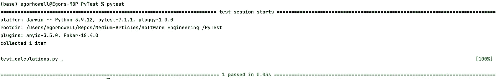
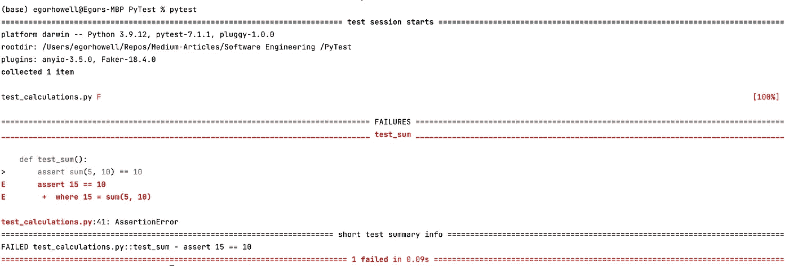
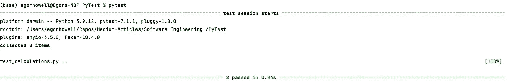
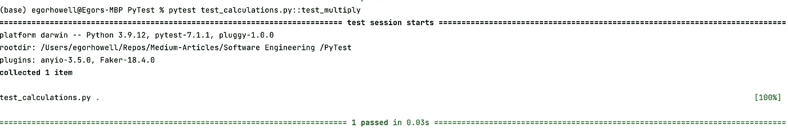
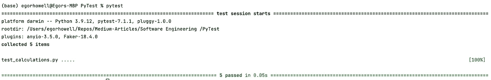

# Pytest 教程：单元测试简介

> 原文：[`towardsdatascience.com/debugging-made-easy-use-pytest-to-track-down-and-fix-python-code-ecbad62057b8`](https://towardsdatascience.com/debugging-made-easy-use-pytest-to-track-down-and-fix-python-code-ecbad62057b8)

## 如何使用 Pytest fixtures 和 mock 进行单元测试

[](https://medium.com/@egorhowell?source=post_page-----ecbad62057b8--------------------------------)[](https://towardsdatascience.com/?source=post_page-----ecbad62057b8--------------------------------) [Egor Howell](https://medium.com/@egorhowell?source=post_page-----ecbad62057b8--------------------------------)

·发布于 [Towards Data Science](https://towardsdatascience.com/?source=post_page-----ecbad62057b8--------------------------------) ·7 min read·2023 年 4 月 18 日

--


照片由 [Yancy Min](https://unsplash.com/@yancymin?utm_source=medium&utm_medium=referral) 提供，来源于 [Unsplash](https://unsplash.com/?utm_source=medium&utm_medium=referral)

# 背景

想象一下，你是一名数据科学家，刚刚开发了一个出色的新模型，这将为公司带来丰厚的利润。接下来的步骤是将其投入生产。你花了几天时间将代码调整为 [***PEP***](https://peps.python.org/pep-0008/) 标准，应用 [***linting***](https://en.wikipedia.org/wiki/Lint_%28software%29) 等等。最后，你在 GitHub 上创建了一个 [***pull request***](https://docs.github.com/en/pull-requests/collaborating-with-pull-requests/proposing-changes-to-your-work-with-pull-requests/about-pull-requests)，对你的新发布感到兴奋。然后，一位软件工程师问道：‘*我看不到任何测试？*’

这种情况发生在我身上，并且在初级数据科学家中相当频繁。[***测试***](https://realpython.com/python-testing/) 是任何软件项目的核心部分，数据科学也不例外。因此，掌握这个重要概念和工具将对你的职业生涯非常宝贵。在这篇文章中，我深入探讨了测试的必要性以及如何通过使用 [***Pytest***](https://docs.pytest.org/en/7.3.x/) 来轻松进行测试。

# 什么是测试？

测试是我们自然进行的，通过简单地推断输出是否符合预期，这被称为 [***exploratory testing***](https://www.guru99.com/exploratory-testing.html)。然而，这并不理想，尤其是当你有一个大型代码库和众多步骤时，因为很难检测问题发生的具体位置。

因此，通常会编写代码测试。你会有一些输入和预期输出。这[***自动化***](https://en.wikipedia.org/wiki/Test_automation)测试过程，并加快调试过程。

最常见和频繁编写的测试是[***单元测试***](https://en.wikipedia.org/wiki/Unit_testing)。这些是测试小块代码的测试，通常是函数和类，以验证该块代码是否按预期工作。

单元测试的一般优点包括：

+   *加快调试和发现问题的速度*

+   *更早识别错误*

+   *代码更健壮且易于维护*

+   *导致更好的代码设计，复杂度更低*

单元测试是测试周期中的基础测试，随后是[***集成测试***](https://en.wikipedia.org/wiki/Integration_testing)和[***系统测试***](https://en.wikipedia.org/wiki/System_testing)。



软件测试金字塔。图示由作者提供。

# Pytest 是什么？

Pytest 是一个易于使用的 Python 包，用于进行单元测试。它是最受欢迎的测试包之一，与 Python 原生的[***单元测试***](https://docs.python.org/3/library/unittest.html)框架并列。Pytest 相对于其他测试框架有几个优点：

+   *开源*

+   *跳过并标记测试*

+   *并行测试执行*

+   *使用起来非常简单直观*

现在让我们开始测试吧！

# 安装和设置

你可以通过[粗体 pip](https://pypi.org/project/pytest/)安装`pytest`，只需输入：

```py
pip install pytest
```

在你的终端或命令行中。如果你需要特定版本：

```py
pip install pytest==<version>
```

你可以通过以下命令验证它是否已安装在你的机器上：

```py
pytest --version
```

最佳实践是将测试放在与主要代码分开的目录中，例如`tests/`。另一个要求是所有测试文件都以`test_*.py`为前缀或以`*_test.py`为后缀，使用[***蛇形命名法***](https://en.wikipedia.org/wiki/Snake_case)。类似地，所有测试函数和类应以`test_`或`Test`（[***驼峰命名法***](https://en.wikipedia.org/wiki/Camel_case)）开头。这确保了`pytest`知道哪些函数、类和文件是测试。

# 基本示例

让我们来看一个非常简单的例子。

首先，我们将创建一个新的目录`pytest-example/`，其中包含两个文件：`calculations.py`和`test_calculations.py`。在`calculations.py`文件中，我们将编写以下函数：

```py
def sum(a: float, b: float) -> float:
    """
    Calculate the sum of the two numbers.

    :param a: The first number to be added.
    :param b: The second number to be added.
    :return: The sum of the two numbers.
    """
    return a + b
```

在`test_calculations.py`文件中，我们编写相应的单元测试：

```py
from calculations import sum

def test_sum():
    assert sum(5, 10) == 15
```

这个测试可以通过执行以下任意一个命令来运行：

```py
pytest
pytest test_calculations.py
```

输出如下：



图片来自作者。

*好消息，我们的测试通过了！*

但是，如果我们的`assert`不正确：

```py
def test_sum():
    assert sum(5, 10) == 10
```

输出将是：



图片来自作者。

# 若干测试

对于不同的函数，可以有几个测试。例如，让我们在`calculations.py`中添加另一个函数：

```py
def sum(a: float, b: float) -> float:
    """
    Calculate the sum of the two numbers.

    :param a: The first number to be added.
    :param b: The second number to be added.
    :return: The sum of the two numbers.
    """
    return a + b

def multiply(a: float, b: float) -> float:
    """
    Calculate the product of the two numbers.

    :param a: The first number to be added.
    :param b: The second number to be added.
    :return: The product of the two numbers.
    """
    return a * b
```

然后在 `test_calculations.py` 中添加 `multiply` 函数的测试：

```py
from calculations import sum, multiply

def test_sum():
    assert sum(5, 10) == 15

def test_multiply():
    assert multiply(5, 10) == 50
```

执行 `pytest`：



图片来自作者。

*两个测试都通过了！*

然而，如果你只想运行 `test_multiply` 函数呢？你只需在执行 `pytest` 时将该函数名作为参数传递即可：

```py
pytest test_calculations.py::test_multiply 
```



图片来自作者。

正如我们所见，`pytest` 只运行了 `test_multiply`，这正是我们所期望的！

如果我们现在想添加一个 `divide` 函数，最好将它们转换为类：

```py
class Calculations:
    def __init__(self, a: float, b: float) -> None:
        """
        Initialize the Calculation object with two numbers.

        :param a: The first number.
        :param b: The second number.
        """
        self.a = a
        self.b = b

    def sum(self) -> float:
        """
        Calculate the sum of the two numbers.

        :return: The sum of the two numbers.
        """
        return self.a + self.b

    def multiply(self) -> float:
        """
        Calculate the product of the two numbers.

        :return: The product of the two numbers.
        """
        return self.a * self.b

    def divide(self) -> float:
        """
        Calculate the quotient of the two numbers.

        :return: The quotient of the two numbers.
        """
        return self.a / self.b
```

```py
from calculations import Calculations
import pytest

class TestCalculations:
    def test_sum(self):
        calculations = Calculations(5, 10)
        assert calculations.sum() == 15

    def test_multiply(self):
        calculations = Calculations(5, 10)
        assert calculations.multiply() == 50

    def test_divide(self):
        calculations = Calculations(5, 10)
        assert calculations.divide() == 0.5
```

# Pytest Fixtures

在上面的 `TestCalculations` 类中，注意到我们多次初始化了 `Calculations` 类。这并不是最优的，幸运的是，`pytest` 有 [***fixtures***](https://docs.pytest.org/en/6.2.x/fixture.html) 来解决这种情况：

```py
from calculations import Calculations
import pytest

@pytest.fixture
def calculations():
    return Calculations(5, 10)

class TestCalculations:
    def test_sum(self, calculations):
        assert calculations.sum() == 15

    def test_multiply(self, calculations):
        assert calculations.multiply() == 50

    def test_divide(self, calculations):
        assert calculations.divide() == 0.5
```

与其多次初始化`Calculations`，我们可以将 fixture 作为一个 [***装饰器***](https://realpython.com/primer-on-python-decorators/) 附加，以包含输入数据的信息。

# Pytest 参数化

到目前为止，我们只为每个测试函数通过了一个测试用例。然而，可能有多个边缘情况你想要测试和验证。Pytest 通过 [***parametrize***](https://docs.pytest.org/en/6.2.x/parametrize.html) 装饰器使这一过程变得非常简单：

```py
from calculations import Calculations
import pytest

@pytest.fixture
def calculations():
    return Calculations(5, 10)

class TestCalculations:

    @pytest.mark.parametrize("a, b, expected_output",
                             [(1, 3, 4), (10, 50, 60), (100, 0, 100)])
    def test_sum(self, a, b, expected_output):
        assert Calculations(a, b).sum() == expected_output

    def test_multiply(self, calculations):
        assert calculations.multiply() == 50

    def test_divide(self, calculations):
        assert calculations.divide() == 0.5
```

我们使用了 `pytest.mark.parametrize` 装饰器来测试 `sum` 函数的多个输入。输出结果如下：



图片来自作者。

注意到我们有 5 个测试通过而不是 3 个，这是因为我们对 `sum` 函数传递了两个额外的测试。

# 总结与进一步思考

测试，特别是单元测试，是数据科学家必须学习和理解的重要技能，因为它有助于防止 bug 并加快开发速度。在 Python 中，最常见的测试包是 Pytest。这是一个易于使用的框架，具有直观的测试过程。在本文中，我们展示了如何使用 Pytest 的 *fixtures* 和 *parametrize* 功能。

本文中使用的完整代码可以在这里找到：

[](https://github.com/egorhowell/Medium-Articles/tree/main/Software%20Engineering%20/pytest-example?source=post_page-----ecbad62057b8--------------------------------) [## Medium-Articles/Software Engineering /pytest-example at main · egorhowell/Medium-Articles

### 目前你无法执行该操作。你在另一个标签页或窗口中已登录。你在另一个标签页或窗口中已登出…

[github.com](https://github.com/egorhowell/Medium-Articles/tree/main/Software%20Engineering%20/pytest-example?source=post_page-----ecbad62057b8--------------------------------)

# 另外的事情！

我有一个免费的新闻通讯，[**Dishing the Data**](https://dishingthedata.substack.com/)，在其中我分享成为更好数据科学家的每周技巧。

[](https://newsletter.egorhowell.com/?source=post_page-----ecbad62057b8--------------------------------) [## 数据分享 | Egor Howell | Substack

### 如何成为更好的数据科学家。点击阅读由 Egor Howell 发布的 Substack 刊物《数据分享》…

newsletter.egorhowell.com](https://newsletter.egorhowell.com/?source=post_page-----ecbad62057b8--------------------------------)

# 联系我！

+   [**YouTube**](https://www.youtube.com/@egorhowell)

+   [**LinkedIn**](https://www.linkedin.com/in/egor-howell-092a721b3/)

+   [**Twitter**](https://twitter.com/EgorHowell)

+   [**GitHub**](https://github.com/egorhowell)

# 参考文献及进一步阅读

+   [`www.tutorialspoint.com/pytest/index.htm`](https://www.tutorialspoint.com/pytest/index.htm)

+   [`docs.pytest.org/en/7.3.x/`](https://docs.pytest.org/en/7.3.x/)

+   [`machinelearningmastery.com/a-gentle-introduction-to-unit-testing-in-python/`](https://machinelearningmastery.com/a-gentle-introduction-to-unit-testing-in-python/)

+   [`www.datacamp.com/tutorial/pytest-tutorial-a-hands-on-guide-to-unit-testing`](https://www.datacamp.com/tutorial/pytest-tutorial-a-hands-on-guide-to-unit-testing)
