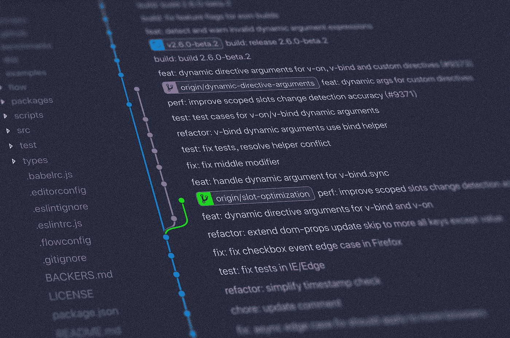

# Pytest 教程：单元测试简介

> 原文：[`towardsdatascience.com/debugging-made-easy-use-pytest-to-track-down-and-fix-python-code-ecbad62057b8?source=collection_archive---------14-----------------------#2023-04-18`](https://towardsdatascience.com/debugging-made-easy-use-pytest-to-track-down-and-fix-python-code-ecbad62057b8?source=collection_archive---------14-----------------------#2023-04-18)

## 如何使用 Pytest 固件和 mock 进行单元测试

 [Egor Howell](https://medium.com/@egorhowell?source=post_page-----ecbad62057b8--------------------------------)

·

[查看](https://medium.com/m/signin?actionUrl=https%3A%2F%2Fmedium.com%2F_%2Fsubscribe%2Fuser%2F1cac491223b2&operation=register&redirect=https%3A%2F%2Ftowardsdatascience.com%2Fdebugging-made-easy-use-pytest-to-track-down-and-fix-python-code-ecbad62057b8&user=Egor+Howell&userId=1cac491223b2&source=post_page-1cac491223b2----ecbad62057b8---------------------post_header-----------) 发表在 [Towards Data Science](https://towardsdatascience.com/?source=post_page-----ecbad62057b8--------------------------------) ·7 分钟阅读·2023 年 4 月 18 日

--

图片由 [Yancy Min](https://unsplash.com/@yancymin?utm_source=medium&utm_medium=referral) 提供，来源于 [Unsplash](https://unsplash.com/?utm_source=medium&utm_medium=referral)

# 背景

想象一下你是一名数据科学家，刚刚开发了一个了不起的新模型，将为公司带来丰厚的利润。下一步是将其投入生产。你花了几天时间使代码符合[***PEP***](https://peps.python.org/pep-0008/)规范，应用[***linting***](https://en.wikipedia.org/wiki/Lint_%28software%29)等。最后，你在 GitHub 上创建了一个[***拉取请求***](https://docs.github.com/en/pull-requests/collaborating-with-pull-requests/proposing-changes-to-your-work-with-pull-requests/about-pull-requests)，对你的新发布感到兴奋。然后，一位软件工程师问：‘*我看不到任何测试？*’

这种情况曾经发生在我身上，并且在初级数据科学家中相当常见。[***测试***](https://realpython.com/python-testing/)是任何软件项目中不可或缺的一部分，数据科学也不例外。因此，掌握这一重要概念和工具将对你的职业生涯大有裨益。在这篇文章中，我将深入探讨测试的必要性，并介绍如何通过使用[***Pytest***](https://docs.pytest.org/en/7.3.x/)来轻松地进行测试。

# 什么是测试？

测试是我们自然会进行的操作，通过简单地推断输出是否符合预期，这种方法被称为[***探索性测试***](https://www.guru99.com/exploratory-testing.html)。然而，这种方法在拥有大量代码和多个步骤时并不理想，因为很难检测到问题出现的地方。

因此，编写代码测试是常见的实践。你…
