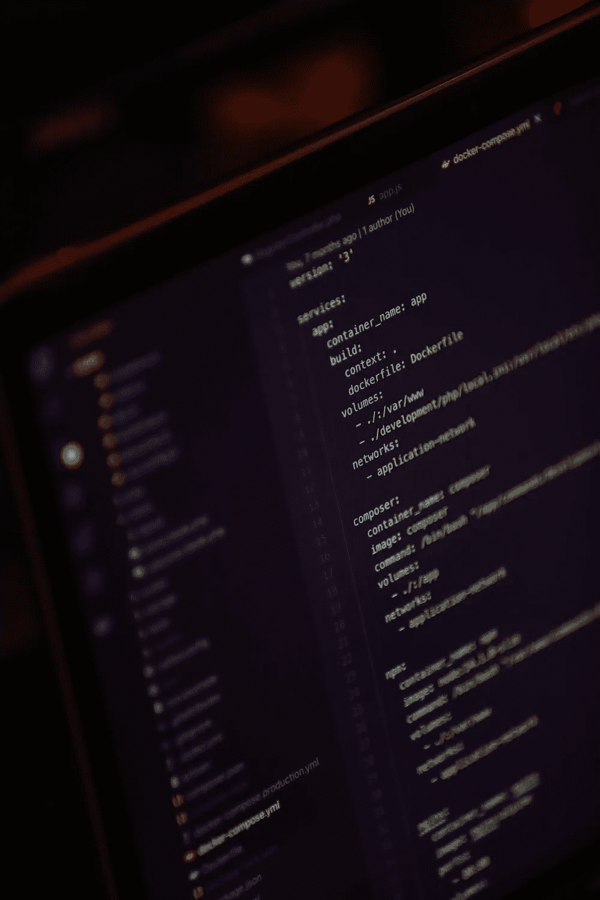
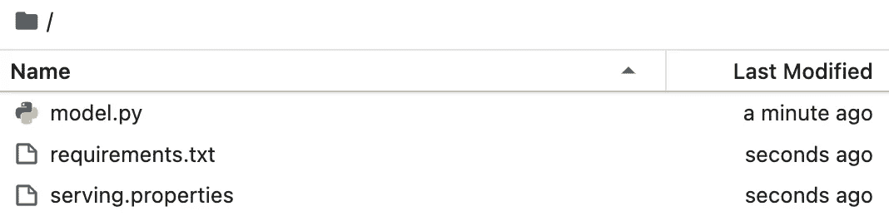
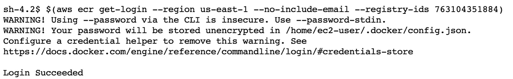
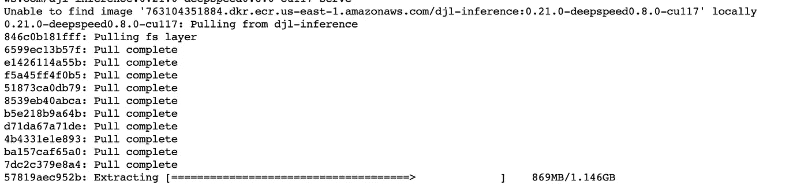
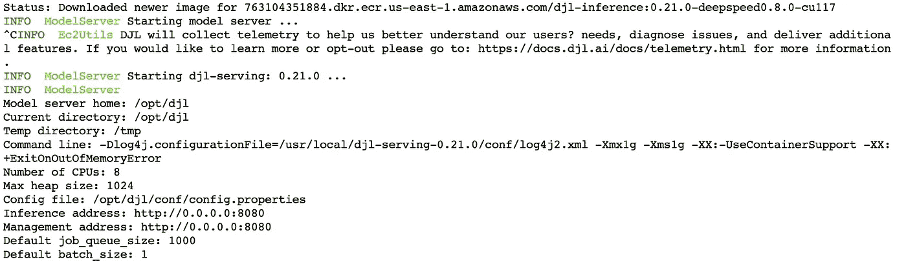
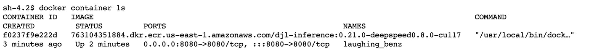
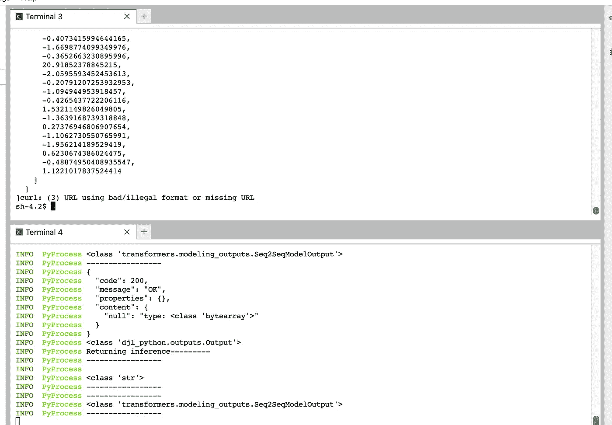
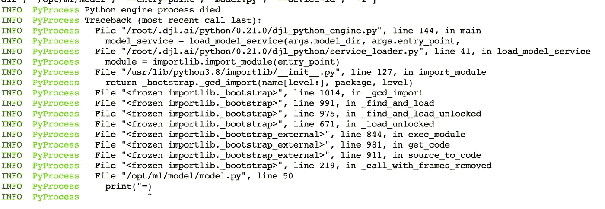

# 使用 Docker 调试 SageMaker 端点

> 原文：[`towardsdatascience.com/debugging-sagemaker-endpoints-with-docker-7a703fae3a26`](https://towardsdatascience.com/debugging-sagemaker-endpoints-with-docker-7a703fae3a26)

## SageMaker 本地模式的替代方案

[](https://ram-vegiraju.medium.com/?source=post_page-----7a703fae3a26--------------------------------)[](https://towardsdatascience.com/?source=post_page-----7a703fae3a26--------------------------------) [Ram Vegiraju](https://ram-vegiraju.medium.com/?source=post_page-----7a703fae3a26--------------------------------)

·发表于[Towards Data Science](https://towardsdatascience.com/?source=post_page-----7a703fae3a26--------------------------------) ·阅读时长 6 分钟·2023 年 6 月 16 日

--



图片来自[Unsplash](https://unsplash.com/photos/1VW6HLOQE5A)，作者[**Mohammad Rahmani**](https://unsplash.com/@afgprogrammer)

启动[SageMaker 实时推理](https://docs.aws.amazon.com/sagemaker/latest/dg/realtime-endpoints.html)的痛点之一是有时很难调试。当创建端点时，需要确保有许多因素得到了妥善处理，以便成功部署。

+   根据您使用的模型服务器和容器，正确的模型工件文件结构至关重要。本质上，您提供的 model.tar.gz 必须符合模型服务器的格式。

+   如果您有一个自定义推理脚本，实现了模型的前处理和后处理，您需要确保实现的处理程序与模型服务器兼容，并且代码级别没有脚本错误。

之前我们讨论了 SageMaker 本地模式，但在本文撰写时，本地模式不支持所有 SageMaker 部署可用的托管选项和模型服务器。

为了克服这个限制，我们将探讨如何使用[Docker](https://www.docker.com/)及示例模型，以及如何在 SageMaker 部署之前测试/调试我们的模型工件和推理脚本。在这个具体示例中，我们将利用[**BART 模型**](https://huggingface.co/facebook/bart-large)，这是我在上一篇文章中介绍过的，看看如何使用 Docker 托管它。

**注意**：对于那些刚接触 AWS 的用户，如果你想跟随本文，请确保在以下 [链接](https://aws.amazon.com/console/) 上创建一个账户。本文还假设你对 SageMaker 部署有中级了解，我建议你阅读这篇 [文章](https://aws.amazon.com/blogs/machine-learning/part-2-model-hosting-patterns-in-amazon-sagemaker-getting-started-with-deploying-real-time-models-on-sagemaker/) 以更深入地理解部署/推理。对 Docker 有中级了解也将有助于你完全理解这个示例。

## SageMaker 托管是如何工作的？

在进入本文的代码部分之前，让我们先看看 SageMaker 实际是如何处理请求的。SageMaker Inference 的核心有两个构件：

+   **Container**：这建立了模型的运行时环境，它还与您正在使用的模型服务器集成。你可以使用现有的 [深度学习容器](https://github.com/aws/deep-learning-containers/blob/master/available_images.md)（DLCs）之一，也可以 构建你自己的容器。

+   **模型工件**：在 [CreateModel](https://boto3.amazonaws.com/v1/documentation/api/latest/reference/services/sagemaker/client/create_model.html) API 调用中，我们指定了一个包含模型数据的 S3 URL，格式为 model.tar.gz（tarball）。这些模型数据被加载到容器上的 opt/ml/model 目录中，这也包括你提供的任何推理脚本。

关键在于容器需要实现一个 Web 服务器，响应端口 8080 上的 /invocations 和 /ping 路径。我们实现的一个 Web 服务器示例是 Flask，在 自定义容器 示例中提供了这些路径。

使用 Docker 时，我们将暴露这个端口，并指向我们的本地脚本和模型工件，这样我们就可以模拟 SageMaker Endpoint 预期的行为。

## 使用 Docker 进行测试

为了简单起见，我们将使用我上一篇文章中的 BART 示例，你可以从这个 [仓库](https://github.com/RamVegiraju/SageMaker-Docker-Local) 获取相关工件。在这里，你应该能看到以下文件：



+   **model.py**：这是我们正在使用的推理脚本。在这种情况下，我们使用 DJL Serving，它期望一个包含处理推理的 handler 函数的 model.py。**你的推理脚本仍然需要与模型服务器期望的格式兼容。**

+   **requirements.txt**：任何你的 model.py 脚本所需的额外依赖项。对于 DJL Serving，PyTorch 已经预先安装，我们使用 numpy 进行数据处理。

+   **serving.properties**：这是一个 DJL 特有的文件，你可以在这里定义模型级别的任何配置（例如：每个模型的工作线程数）。

我们已经有了模型工件，现在需要我们将要使用的容器。在这种情况下，我们可以检索现有的 DJL DeepSpeed 镜像。有关 AWS 已提供的镜像的详细列表，请参考这个[指南](https://github.com/aws/deep-learning-containers/blob/master/available_images.md)。你也可以在本地构建自己的镜像并指向它。在这种情况下，我们在一个[ SageMaker Classic Notebook 实例](https://docs.aws.amazon.com/sagemaker/latest/dg/nbi.html)环境中操作，该环境中也预装了 Docker。

要使用 AWS 提供的现有镜像，我们首先需要登录到 AWS Elastic Container Registry (ECR)以检索镜像，你可以使用以下 shell 命令来完成这一步。

```py
$(aws ecr get-login --region us-east-1 --no-include-email --registry-ids 763104351884)
```

你应该看到类似于以下的登录成功消息。



登录成功（作者截图）

一旦登录成功，我们可以进入存储模型工件的路径，并运行以下命令来启动模型服务器。如果你还没有检索镜像，这也会从 ECR 中拉取镜像。

```py
docker run \
-v /home/ec2-user/SageMaker:/opt/ml/model \
--cpu-shares 512 \
-p 8080:8080 \
763104351884.dkr.ecr.us-east-1.amazonaws.com/djl-inference:0.21.0-deepspeed0.8.0-cu117 \
serve
```

这里有几个关键点：

+   我们暴露了 8080 端口，因为 SageMaker 推理期望如此。

+   我们还指向现有的镜像。这个字符串取决于你所在的区域和操作的模型。你还可以使用 SageMaker Python SDK 的[retrieve image_uri API 调用](https://sagemaker.readthedocs.io/en/stable/api/utility/image_uris.html)来识别合适的镜像以进行拉取。



图像正在检索中（作者截图）

在镜像拉取完成后，你会看到模型服务器已启动。



DJL 服务器已启动（作者截图）

我们还可以通过使用以下 Docker 命令来验证容器是否正在运行。

```py
docker container ls
```



容器已启动（作者截图）

我们看到 API 通过 8080 端口暴露，我们可以通过 curl 向其发送示例请求。注意，我们指定了 SageMaker 容器期望的 /invocations 路径。

```py
curl -X POST http://localhost:8080/invocations -H "Content-type: text/plain"
 "This is a sample test string"
```

然后我们看到推理返回了请求，并且模型服务器正在跟踪响应并从我们的推理脚本中发出日志语句。



示例请求（作者截图）

让我们拆解 `model.py`，看看是否能通过 Docker 早期捕获到错误。在推理函数中，我添加了一个语法错误的打印语句，并重启模型服务器以查看是否能捕获到这个错误。

```py
def inference(self, inputs):
        """
        Custom service entry point function.

        :param inputs: the Input object holds the text for the BART model to infer upon
        :return: the Output object to be send back
        """

        #sample error
        print("=)
```

然后我们可以看到，当我们执行 docker run 命令时，模型服务器捕获了这个错误。



模型服务器捕获的错误（作者截图）

注意，你不仅限于使用 curl 来测试你的容器。我们还可以使用类似于 [Python requests](https://pypi.org/project/requests/) 库来与容器进行交互和操作。一个示例请求可能如下所示：

```py
import requests

headers = {
    'Content-type': 'text/plain',
}

response = requests.post('http://localhost:8080/invocations', headers=headers)
```

利用类似 requests 的工具，你可以对容器进行大规模负载测试。请注意，你运行容器的硬件就是正在被利用的（可以将其视为 SageMaker Endpoint 后面的实例）。

## 额外资源与结论

[## GitHub - RamVegiraju/SageMaker-Docker-Local: 如何使用 Docker 本地测试 SageMaker 推理](https://github.com/RamVegiraju/SageMaker-Docker-Local/tree/master?source=post_page-----7a703fae3a26--------------------------------)

### 如何使用 Docker 本地测试 SageMaker 推理 - GitHub - RamVegiraju/SageMaker-Docker-Local：如何本地测试…

[github.com](https://github.com/RamVegiraju/SageMaker-Docker-Local/tree/master?source=post_page-----7a703fae3a26--------------------------------)

你可以在上面的链接找到整个示例的代码。使用 SageMaker Inference，你希望避免等待端点创建以捕捉错误的痛苦。通过这种方法，你可以使用任何 SageMaker 容器来测试和调试你的模型工件和推理脚本。

随时欢迎留下反馈或提问，感谢阅读！

*如果你喜欢这篇文章，欢迎通过* [*LinkedIn*](https://www.linkedin.com/in/ram-vegiraju-81272b162/) *与我联系，并订阅我的 Medium* [*Newsletter*](https://ram-vegiraju.medium.com/subscribe)*。如果你是 Medium 的新用户，可以通过我的* [*Membership Referral*](https://ram-vegiraju.medium.com/membership)*注册。*
