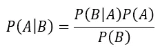
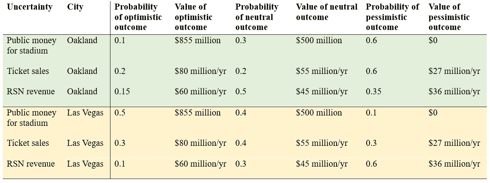
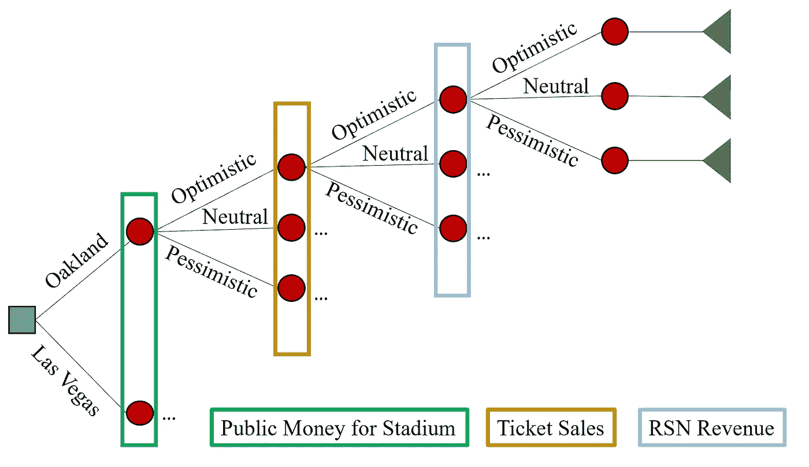
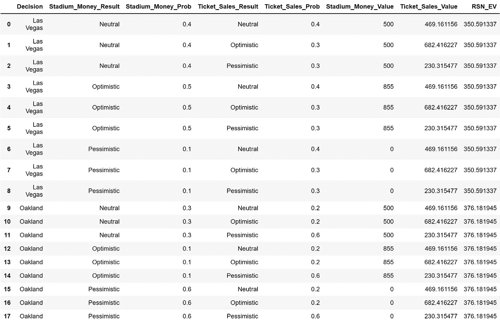
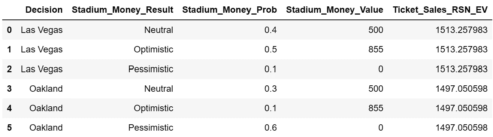
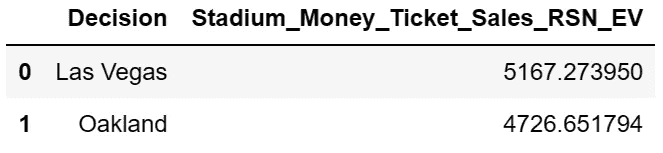
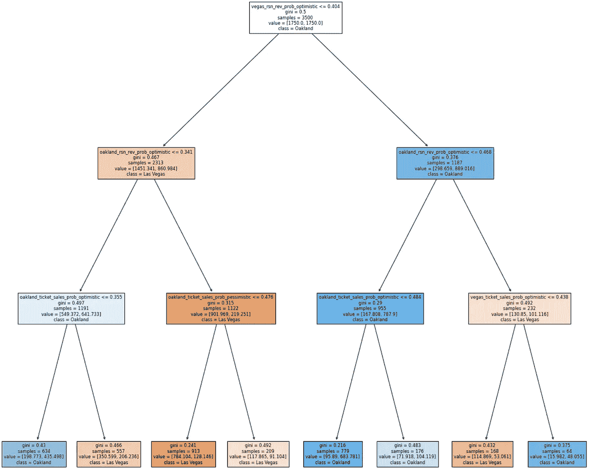

# 决策分析与 Python 中的决策树——奥克兰运动员队的案例

> 原文：[`towardsdatascience.com/decision-analysis-and-trees-in-python-the-case-of-the-oakland-as-786d746cdfb2`](https://towardsdatascience.com/decision-analysis-and-trees-in-python-the-case-of-the-oakland-as-786d746cdfb2)

## 使用 Python 中的决策树来洞察奥克兰运动员队（A’s）迁往拉斯维加斯的决策

[](https://medium.com/@gspmalloy?source=post_page-----786d746cdfb2--------------------------------)[](https://towardsdatascience.com/?source=post_page-----786d746cdfb2--------------------------------) [Giovanni Malloy](https://medium.com/@gspmalloy?source=post_page-----786d746cdfb2--------------------------------)

·发表在[数据科学前沿](https://towardsdatascience.com/?source=post_page-----786d746cdfb2--------------------------------) ·阅读时长 17 分钟·2023 年 5 月 24 日

--


图片由[Rick Rodriguez](https://unsplash.com/@rickro?utm_source=medium&utm_medium=referral)提供，来源于[Unsplash](https://unsplash.com/?utm_source=medium&utm_medium=referral)

最近，奥克兰运动员队的所有者约翰·费舍尔宣布球队已在内华达州拉斯维加斯购买了近 50 英亩的土地。[1] 这使得奥克兰最后一支职业体育球队的未来岌岌可危。在过去 5 年中，奥克兰见证了金州勇士（NBA）和拉斯维加斯突袭者（NFL）迁往其他城市的新球场（尽管金州勇士只是跨越湾桥迁往旧金山）。虽然奥克兰运动员队管理层的决策过程对我仍然是一个谜，但数据科学和决策分析的结合可以揭示约翰·费舍尔迁往拉斯维加斯的动机。

决策分析对于所有数据科学家都非常重要，因为它是概率和统计模型的高度技术工作与商业决策之间的桥梁。了解商业决策的制定过程有助于框定我们的工作及向非技术观众展示我们的发现，同时提供可行的建议和发现。运筹学与管理科学研究所（INFORMS）甚至有一个[专门致力于决策分析的学会](https://connect.informs.org/das/home)。

此外，机器学习可以通过解锁概率敏感性分析的见解来帮助推广决策分析的结果。在使用决策分析初步构建分析奥克兰与拉斯维加斯情境的模型后，我们将使用机器学习挖掘可能揭示可操作建议的模式，以便在决策情况发生变化时为 A 队提供帮助。

**什么是决策分析？**

决策分析是致力于“系统性、定量化和可视化方法来解决和评估重要选择”的研究领域。[2] 它可以在数据较少的环境中成为强大的工具，并帮助个人利用主题领域的专业知识和先前知识来改善复杂决策的预期价值。它被广泛应用于经济学、管理学和政策分析等多个领域。

通常，在决策分析领域，我们采取贝叶斯视角。贝叶斯定理的基本公式如下：



图片由作者创建。

其中 P(A) 是事件 A 发生的概率，P(B) 是事件 B 发生的概率，P(A|B) 是在事件 B 发生的情况下事件 A 发生的概率，而 P(B|A) 是在事件 A 发生的情况下事件 B 发生的概率。通常，P(A) 代表关于 A 发生的先验信念，而 B 代表一些新数据。P(A|B) 是在观察到 B 之后对 A 发生概率的更新后验信念。

例如，假设我们去奥克兰-阿拉米达县体育场看比赛，但我们没有跟踪球员统计数据。我们从以下知识开始：外场手上垒的概率是 0.35，内场手上垒的概率是 0.25，而指定击球手上垒的概率是 0.4。设 A 为下一个击球员是外场手的事件，B 为下一个击球员是内场手的事件，C 为下一个击球员是指定击球手的事件。由于我们知道棒球队的名单，我们已经知道 P(A) = 0.33，P(B) = 0.56，和 P(C) = 0.11。现在，下一个击球员上场，令我们高兴的是，他成功上垒（事件 D）！根据我们之前的棒球知识，我们知道 P(D|A) = 0.35，P(D|B) = 0.25，和 P(D|C) = 0.4。利用全概率定理，我们可以计算出 P(D) = P(D|A)P(A) + P(D|B)P(B) + P(D|C)P(C) = 0.3。现在，我们可以更新我们对击球员类型的信念：P(A|D) = 0.39，P(B|D) = 0.47，和 P(C|D) = 0.15。看到球员上垒后，我们现在更倾向于相信这名球员不是内场手。既然你已经调整了心态，让我们继续。

决策分析中的关键工具是决策树（不要与同名的机器学习算法混淆）。[3] 决策树有两个基本组成部分：决策节点和选择节点。[3] 在这篇博客中，我将向你展示如何构建决策树，如何在 Python 中评估它，并理解奥克兰 A 队迁往拉斯维加斯的决策。

**决策是什么？**

霍华德和阿巴斯将决策定义为“在两个或更多备选方案之间做出选择，并涉及不可撤销的资源分配。”[3] 这是一个宽泛的定义，但在我们以奥克兰 A 队为例的情况下，决策是：*运动家棒球队应该留在奥克兰还是迁往拉斯维加斯？* 在这种情况下，决策是不可撤销的，因为无论选择哪个城市，他们都会建造一个新体育场。

**不确定性是什么？**

每个决策都存在不确定性。在是否留在奥克兰还是迁往拉斯维加斯的决策中，A 队不确定新体育场的成本和随后的运营收入：1）他们将获得多少公共资金用于建造新体育场，2）他们将从票务销售中产生多少收入，以及 3）他们将从地方电视合同中产生多少收入。

A 队目前希望在拉斯维加斯建造一座价值 15 亿美元的体育场。[1] 回到 2021 年，该组织曾要求 855 百万美元的公共资金来帮助在奥克兰建造新体育场，尽管之前与市政府和县政府达成了新体育场将由私人资金资助的协议。[1] 因此，我们可以合理地假设，建造体育场的成本在两个地方大致相同。唯一的不确定性是有多少纳税人的钱将用于资助体育场。

票务收入在不同球队之间差异巨大，从 2700 万到 1.31 亿美元不等，中位数约为 7500 万。[4] 奥克兰的票务收入估计为约 5500 万。[4]

MLB 的电视收入通过 MLB 谈判的全国电视合同均匀分配。然而，个别球队电视收入的一个重要组成部分来自地区体育网络（RSN）。球队可以保留来自地方电视合同的大部分收入，尽管仍有大量的收入共享。经过收入共享后，RSN 的电视合同收入从 3600 万到 1.31 亿美元不等，除了最有价值的球队之外，其余球队的收入都少于 6000 万。[4]

多亏了几年前突袭者（NFL）从奥克兰迁往拉斯维加斯，我们知道拉斯维加斯市愿意提供 7.5 亿美元的公共资金来建造一座全新的足球场。[5] 我们还知道，无论是当地人还是游客，都愿意加入并支持一支新的职业球队，因为突袭者在 2021 年以 1.19 亿美元的票务收入领先 NFL。[6]

有些方法超出了本博客的范围，这些方法旨在询问决策者对这些不确定性可能结果及其概率的先验信念。此外，我怀疑 John Fischer 是否准备为我的博客做出评论。因此，在此期间，我将使用从这些网络来源中汇总的信息，提供每个不确定性的一些可能场景。



图片由作者创建。

**我们的决策时间范围是什么？**

当然，收入是年度数据，体育场应该使用远超过一年。时间范围可以根据决策的背景和决策者对景观变化可能性的看法而有所不同。从数据科学的角度来看，这与数据漂移相符，其中用于训练模型的数据与当前数据不同。现在，假设这些估计在十年内保持相对稳定，我们将使用 10 年的时间范围以及 3%的折现率来计算我们的年度成本。

**决策树是什么样的？**

现在我们已经定义了决策树的所有组件，是时候建立树了。概念上，它看起来是这样的：



图片由作者创建。

方形节点是决策节点，圆形节点是机会节点，三角形节点是终端节点。由于空间限制，图像中无法显示整个树，但每个节点都有相关的概率和值。

**我们如何在 Python 中构建模型？**

在决策分析中，建立决策树的构造后，我们可以通过“回滚”树来识别最佳决策。在此示例中，我们假设决策者是理性的（即期望值）决策者。因此，我们首先列出终端状态的相关值（如果适用），这将成为我们的累计总额或期望值。在这种情况下，这不适用，因此我们从$0 开始。然后，我们迭代计算终端节点左侧每组节点的期望值，并将其添加到累计总额或期望值中。最后，我们将得到一个留在奥克兰的决策期望值和一个迁移到拉斯维加斯的决策期望值。

让我们从一个简单的基本情况设置开始。我们将创建一个包含所有可能的决策、公款、票务销售和 RSN 收入情景的数据框。

```py
import numpy as np
import pandas as pd

# Create data frame of all possible outcomes
decision_list = ['Oakland', 'Las Vegas']

# First Node
chance_node_stadium_money_scenarios = ['Optimistic', 'Neutral', 'Pessimistic']
chance_node_stadium_money_probabilities_oakland = [0.1, 0.3, 0.6]
chance_node_stadium_money_probabilities_vegas = [0.5, 0.4, 0.1]
chance_node_stadium_money_values = [855, 500, 0]

#Second Node
chance_node_ticket_sales_scenarios = ['Optimistic', 'Neutral', 'Pessimistic']
chance_node_ticket_sales_probabilities_oakland = [0.2, 0.2, 0.6]
chance_node_ticket_sales_probabilities_vegas = [0.3, 0.4, 0.3]
chance_node_ticket_sales_values_per_year = [80, 55, 27]

# Third Node
chance_node_rsn_revenue_scenarios = ['Optimistic', 'Neutral', 'Pessimistic']
chance_node_rsn_revenue_probabilities_oakland = [0.15, 0.5, 0.35]
chance_node_rsn_revenue_probabilities_vegas = [0.1, 0.3, 0.6]
chance_node_rsn_revenue_values_per_year = [60, 45, 36]

# Convert annual values to NPV of 10 year time horizon
time_horizon = 10 # years
discount_rate = 0.03 # per year
chance_node_ticket_sales_values = [val * (1 - (1/((1 + discount_rate)**time_horizon)))/discount_rate for val in chance_node_ticket_sales_values_per_year]
chance_node_rsn_revenue_values = [val * (1 - (1/((1 + discount_rate)**time_horizon)))/discount_rate for val in chance_node_rsn_revenue_values_per_year]

# Create data frame of all possible scenarios
decision_list_list_for_df = []
chance_node_stadium_money_list_for_df = []
chance_node_stadium_money_probability_list_for_df = []
chance_node_stadium_money_value_list_for_df = []
chance_node_ticket_sales_list_for_df = []
chance_node_ticket_sales_probability_list_for_df = []
chance_node_ticket_sales_value_list_for_df = []
chance_node_rsn_revenue_list_for_df = []
chance_node_rsn_revenue_probability_list_for_df = []
chance_node_rsn_revenue_value_list_for_df = []

for i in decision_list:
    for j in range(len(chance_node_stadium_money_scenarios)):
        for k in range(len(chance_node_rsn_revenue_scenarios)):
            for m in range(len(chance_node_rsn_revenue_scenarios)):
                decision_list_list_for_df.append(i)
                chance_node_stadium_money_list_for_df.append(chance_node_stadium_money_scenarios[j])
                chance_node_stadium_money_value_list_for_df.append(chance_node_stadium_money_values[j])
                chance_node_ticket_sales_list_for_df.append(chance_node_ticket_sales_scenarios[k])
                chance_node_ticket_sales_value_list_for_df.append(chance_node_ticket_sales_values[k])
                chance_node_rsn_revenue_list_for_df.append(chance_node_rsn_revenue_scenarios[m])
                chance_node_rsn_revenue_value_list_for_df.append(chance_node_rsn_revenue_values[m])

                if i == 'Oakland':
                    chance_node_stadium_money_probability_list_for_df.append(chance_node_stadium_money_probabilities_oakland[j])
                    chance_node_ticket_sales_probability_list_for_df.append(chance_node_ticket_sales_probabilities_oakland[k])
                    chance_node_rsn_revenue_probability_list_for_df.append(chance_node_rsn_revenue_probabilities_oakland[m])
                elif i == 'Las Vegas':
                    chance_node_stadium_money_probability_list_for_df.append(chance_node_stadium_money_probabilities_vegas[j])
                    chance_node_ticket_sales_probability_list_for_df.append(chance_node_ticket_sales_probabilities_vegas[k])
                    chance_node_rsn_revenue_probability_list_for_df.append(chance_node_rsn_revenue_probabilities_vegas[m])

decision_tree_df = pd.DataFrame(list(zip(decision_list_list_for_df, chance_node_stadium_money_list_for_df,
                                         chance_node_stadium_money_probability_list_for_df,
                                         chance_node_stadium_money_value_list_for_df,
                                         chance_node_ticket_sales_list_for_df,
                                         chance_node_ticket_sales_probability_list_for_df,
                                         chance_node_ticket_sales_value_list_for_df,
                                         chance_node_rsn_revenue_list_for_df,
                                         chance_node_rsn_revenue_probability_list_for_df,
                                         chance_node_rsn_revenue_value_list_for_df)),
                               columns = ['Decision',
                                          'Stadium_Money_Result', 'Stadium_Money_Prob', 'Stadium_Money_Value',
                                          'Ticket_Sales_Result', 'Ticket_Sales_Prob', 'Ticket_Sales_Value', 
                                          'RSN_Revenue_Result', 'RSN_Revenue_Prob', 'RSN_Revenue_Value'])
```

现在，如果你打印你的决策树，你将得到一个包含 54 行和 10 列的 pandas dataframe。我们可以通过创造性地使用 groupby 和 merge 函数轻松地回滚决策树。我们从为每种决策、体育场资金和票务销售的组合列出 RSN 收入的期望值开始：

```py
decision_tree_df['RSN_EV'] = decision_tree_df['RSN_Revenue_Prob'] * decision_tree_df['RSN_Revenue_Value']

# Consolidate the RSN_EV values
RSN_rollback_df = decision_tree_df.groupby(['Decision', 'Stadium_Money_Result', 'Stadium_Money_Prob', 'Ticket_Sales_Result', 'Ticket_Sales_Prob'])['RSN_EV'].sum().reset_index()

# Keep the rest of the columns
decision_tree_df = decision_tree_df.groupby(['Decision', 'Stadium_Money_Result', 'Stadium_Money_Prob', 'Ticket_Sales_Result', 'Ticket_Sales_Prob'])['Stadium_Money_Value', 'Ticket_Sales_Value'].mean().reset_index()

# merge two dataframes
decision_tree_df = pd.merge(decision_tree_df, RSN_rollback_df, on = ['Decision', 'Stadium_Money_Result', 'Stadium_Money_Prob', 'Ticket_Sales_Result', 'Ticket_Sales_Prob'])
```

结果表格已经缩小，现在你可以直观地看到回滚的 RSN 收入节点的期望值。



图片由作者创建

重复处理票务销售。我们有以下代码：

```py
decision_tree_df['Ticket_Sales_RSN_EV'] = decision_tree_df['Ticket_Sales_Prob'] * decision_tree_df['Ticket_Sales_Value'] + decision_tree_df['RSN_EV']

# Consolidate the Ticket Sales and RSN_EV values
ticket_sales_rollback_df = decision_tree_df.groupby(['Decision', 'Stadium_Money_Result', 'Stadium_Money_Prob'])['Ticket_Sales_RSN_EV'].sum().reset_index()

# Keep the rest of the columns
decision_tree_df = decision_tree_df.groupby(['Decision', 'Stadium_Money_Result', 'Stadium_Money_Prob'])['Stadium_Money_Value'].mean().reset_index()

# merge two dataframes
decision_tree_df = pd.merge(decision_tree_df, ticket_sales_rollback_df, on = ['Decision', 'Stadium_Money_Result', 'Stadium_Money_Prob'])
```

结果如下：



图片由作者创建。

最后，重复进行公共资金贡献的标准计算：

```py
decision_tree_df['Stadium_Money_Ticket_Sales_RSN_EV'] = decision_tree_df['Stadium_Money_Prob'] * decision_tree_df['Stadium_Money_Value'] + decision_tree_df['Ticket_Sales_RSN_EV']

# Consolidate the Stadium Money, Ticket Sales, and RSN_EV values
decision_tree_df = decision_tree_df.groupby(['Decision'])['Stadium_Money_Ticket_Sales_RSN_EV'].sum().reset_index()
```



图片由作者创建

在这里，我们可以看到模型计算出在 10 年的时间范围内，留在奥克兰的预期价值为 47 亿美元，而搬到拉斯维加斯的预期价值为 52 亿美元。

**我们如何将模型进行概括？**

当然，我们的数据和模型中都有不确定性，我们可以测试许多不同的情景。自然，我们可能会定义一些阈值或情景，在这些情况下，决策从留在奥克兰变为搬到拉斯维加斯（或反之）。这些决策点可以作为决策者的“业务规则”集合，并帮助我们作为数据科学家从分析中提取可操作的建议。

有很多方法可以实现这一目标，但在本博客中，我们将使用机器学习元建模。元建模涉及开发一个比原始数学或模拟模型更快（有时更简单）的模型，该模型采用相同的输入并产生非常相似的输出[7]。在这种情况下，我们将使用概率敏感性分析来测试决策分析决策树的大量参数空间，并记录每个参数集的结果决策。然后，我们将使用参数集作为特征，并将结果决策作为标签来训练机器学习决策树分类模型。机器学习模型的好处在于它可以揭示复杂的关系，这些关系仅靠多变量敏感性分析是难以解读的。我们的希望是，能从一个浅层树中获得足够的准确性，以描述 A 应该留在奥克兰还是搬到拉斯维加斯的情景。

首先，我们开始设计一个概率敏感性分析。对于这个例子，我们将假设机会节点的美元值保持不变，但各种结果的概率会有所不同。由于我们知道概率将在 0 到 1 之间变化，我们将假设所有情景概率是等可能的，并使用均匀分布进行建模，最小值为 0，最大值为 1。经过三次从均匀分布中抽样（分别对应乐观、中性和悲观情景），我们将结果归一化，使三个概率的总和为 1。

```py
# Number of simulations
n_sim = 5000

# Track scenarios
oakland_stadium_money_probabilities_optimistic_list = []
oakland_stadium_money_probabilities_neutral_list = []
oakland_stadium_money_probabilities_pessimistic_list = []

oakland_ticket_sales_probabilities_optimistic_list = []
oakland_ticket_sales_probabilities_neutral_list = []
oakland_ticket_sales_probabilities_pessimistic_list = []

oakland_rsn_revenue_probabilities_optimistic_list = []
oakland_rsn_revenue_probabilities_neutral_list = []
oakland_rsn_revenue_probabilities_pessimistic_list = []

vegas_stadium_money_probabilities_optimistic_list = []
vegas_stadium_money_probabilities_neutral_list = []
vegas_stadium_money_probabilities_pessimistic_list = []

vegas_ticket_sales_probabilities_optimistic_list = []
vegas_ticket_sales_probabilities_neutral_list = []
vegas_ticket_sales_probabilities_pessimistic_list = []

vegas_rsn_revenue_probabilities_optimistic_list = []
vegas_rsn_revenue_probabilities_neutral_list = []
vegas_rsn_revenue_probabilities_pessimistic_list = []

oakland_EV_list = []
vegas_EV_list = []

decision_list = []

# Create data frame of all possible outcomes
decision_list = ['Oakland', 'Las Vegas']

# First Node
chance_node_stadium_money_scenarios = ['Optimistic', 'Neutral', 'Pessimistic']
chance_node_stadium_money_values = [855, 500, 0]

#Second Node
chance_node_ticket_sales_scenarios = ['Optimistic', 'Neutral', 'Pessimistic']
chance_node_ticket_sales_values_per_year = [80, 55, 27]

# Third Node
chance_node_rsn_revenue_scenarios = ['Optimistic', 'Neutral', 'Pessimistic']
chance_node_rsn_revenue_values_per_year = [60, 45, 36]

# Convert annual values to NPV of 10 year time horizon
time_horizon = 10 # years
discount_rate = 0.03 # per year
chance_node_ticket_sales_values = [val * (1 - (1/((1 + discount_rate)**time_horizon)))/discount_rate for val in chance_node_ticket_sales_values_per_year]
chance_node_rsn_revenue_values = [val * (1 - (1/((1 + discount_rate)**time_horizon)))/discount_rate for val in chance_node_rsn_revenue_values_per_year]

# Run the probabilistic sensitivity analysis n_sim times
for n in range(n_sim):

    ## Set up tree
    #First node
    chance_node_stadium_money_probabilities_oakland = np.random.uniform(0,1,3)
    chance_node_stadium_money_probabilities_oakland = chance_node_stadium_money_probabilities_oakland / np.sum(chance_node_stadium_money_probabilities_oakland)

    chance_node_stadium_money_probabilities_vegas = np.random.uniform(0,1,3)
    chance_node_stadium_money_probabilities_vegas = chance_node_stadium_money_probabilities_vegas / np.sum(chance_node_stadium_money_probabilities_vegas)

    #Second Node
    chance_node_ticket_sales_probabilities_oakland = np.random.uniform(0,1,3)
    chance_node_ticket_sales_probabilities_oakland = chance_node_ticket_sales_probabilities_oakland / np.sum(chance_node_ticket_sales_probabilities_oakland)

    chance_node_ticket_sales_probabilities_vegas = np.random.uniform(0,1,3)
    chance_node_ticket_sales_probabilities_vegas = chance_node_ticket_sales_probabilities_vegas / np.sum(chance_node_ticket_sales_probabilities_vegas)

    # Third Node
    chance_node_rsn_revenue_probabilities_oakland = np.random.uniform(0,1,3)
    chance_node_rsn_revenue_probabilities_oakland = chance_node_rsn_revenue_probabilities_oakland / np.sum(chance_node_rsn_revenue_probabilities_oakland)

    chance_node_rsn_revenue_probabilities_vegas = np.random.uniform(0,1,3)
    chance_node_rsn_revenue_probabilities_vegas = chance_node_rsn_revenue_probabilities_vegas / np.sum(chance_node_rsn_revenue_probabilities_vegas)

    # Evaluate Tree
    # Create data frame of all possible scenarios
    decision_list_list_for_df = []
    chance_node_stadium_money_list_for_df = []
    chance_node_stadium_money_probability_list_for_df = []
    chance_node_stadium_money_value_list_for_df = []
    chance_node_ticket_sales_list_for_df = []
    chance_node_ticket_sales_probability_list_for_df = []
    chance_node_ticket_sales_value_list_for_df = []
    chance_node_rsn_revenue_list_for_df = []
    chance_node_rsn_revenue_probability_list_for_df = []
    chance_node_rsn_revenue_value_list_for_df = []

    for i in decision_list:
        for j in range(len(chance_node_stadium_money_scenarios)):
            for k in range(len(chance_node_rsn_revenue_scenarios)):
                for m in range(len(chance_node_rsn_revenue_scenarios)):
                    decision_list_list_for_df.append(i)
                    chance_node_stadium_money_list_for_df.append(chance_node_stadium_money_scenarios[j])
                    chance_node_stadium_money_value_list_for_df.append(chance_node_stadium_money_values[j])
                    chance_node_ticket_sales_list_for_df.append(chance_node_ticket_sales_scenarios[k])
                    chance_node_ticket_sales_value_list_for_df.append(chance_node_ticket_sales_values[k])
                    chance_node_rsn_revenue_list_for_df.append(chance_node_rsn_revenue_scenarios[m])
                    chance_node_rsn_revenue_value_list_for_df.append(chance_node_rsn_revenue_values[m])

                    if i == 'Oakland':
                        chance_node_stadium_money_probability_list_for_df.append(chance_node_stadium_money_probabilities_oakland[j])
                        chance_node_ticket_sales_probability_list_for_df.append(chance_node_ticket_sales_probabilities_oakland[k])
                        chance_node_rsn_revenue_probability_list_for_df.append(chance_node_rsn_revenue_probabilities_oakland[m])
                    elif i == 'Las Vegas':
                        chance_node_stadium_money_probability_list_for_df.append(chance_node_stadium_money_probabilities_vegas[j])
                        chance_node_ticket_sales_probability_list_for_df.append(chance_node_ticket_sales_probabilities_vegas[k])
                        chance_node_rsn_revenue_probability_list_for_df.append(chance_node_rsn_revenue_probabilities_vegas[m])

    decision_tree_df = pd.DataFrame(list(zip(decision_list_list_for_df, chance_node_stadium_money_list_for_df,
                                             chance_node_stadium_money_probability_list_for_df,
                                             chance_node_stadium_money_value_list_for_df,
                                             chance_node_ticket_sales_list_for_df,
                                             chance_node_ticket_sales_probability_list_for_df,
                                             chance_node_ticket_sales_value_list_for_df,
                                             chance_node_rsn_revenue_list_for_df,
                                             chance_node_rsn_revenue_probability_list_for_df,
                                             chance_node_rsn_revenue_value_list_for_df)),
                                   columns = ['Decision',
                                              'Stadium_Money_Result', 'Stadium_Money_Prob', 'Stadium_Money_Value',
                                              'Ticket_Sales_Result', 'Ticket_Sales_Prob', 'Ticket_Sales_Value', 
                                              'RSN_Revenue_Result', 'RSN_Revenue_Prob', 'RSN_Revenue_Value'])
    decision_tree_df['RSN_EV'] = decision_tree_df['RSN_Revenue_Prob'] * decision_tree_df['RSN_Revenue_Value']

    # Consolidate the RSN_EV values
    RSN_rollback_df = decision_tree_df.groupby(['Decision', 'Stadium_Money_Result', 'Stadium_Money_Prob', 'Ticket_Sales_Result', 'Ticket_Sales_Prob'])['RSN_EV'].sum().reset_index()

    # Keep the rest of the columns
    decision_tree_df = decision_tree_df.groupby(['Decision', 'Stadium_Money_Result', 'Stadium_Money_Prob', 'Ticket_Sales_Result', 'Ticket_Sales_Prob'])['Stadium_Money_Value', 'Ticket_Sales_Value'].mean().reset_index()

    # merge two dataframes
    decision_tree_df = pd.merge(decision_tree_df, RSN_rollback_df, on = ['Decision', 'Stadium_Money_Result', 'Stadium_Money_Prob', 'Ticket_Sales_Result', 'Ticket_Sales_Prob'])

    decision_tree_df['Ticket_Sales_RSN_EV'] = decision_tree_df['Ticket_Sales_Prob'] * decision_tree_df['Ticket_Sales_Value'] + decision_tree_df['RSN_EV']

    # Consolidate the Ticket Sales and RSN_EV values
    ticket_sales_rollback_df = decision_tree_df.groupby(['Decision', 'Stadium_Money_Result', 'Stadium_Money_Prob'])['Ticket_Sales_RSN_EV'].sum().reset_index()

    # Keep the rest of the columns
    decision_tree_df = decision_tree_df.groupby(['Decision', 'Stadium_Money_Result', 'Stadium_Money_Prob'])['Stadium_Money_Value'].mean().reset_index()

    # merge two dataframes
    decision_tree_df = pd.merge(decision_tree_df, ticket_sales_rollback_df, on = ['Decision', 'Stadium_Money_Result', 'Stadium_Money_Prob'])

    decision_tree_df['Stadium_Money_Ticket_Sales_RSN_EV'] = decision_tree_df['Stadium_Money_Prob'] * decision_tree_df['Stadium_Money_Value'] + decision_tree_df['Ticket_Sales_RSN_EV']

    # Consolidate the Stadium Money, Ticket Sales, and RSN_EV values
    decision_tree_df = decision_tree_df.groupby(['Decision'])['Stadium_Money_Ticket_Sales_RSN_EV'].sum().reset_index()

    # Fill out lists for meta-model inputs
    oakland_stadium_money_probabilities_optimistic_list.append(chance_node_stadium_money_probabilities_oakland[0])
    oakland_stadium_money_probabilities_neutral_list.append(chance_node_stadium_money_probabilities_oakland[1])
    oakland_stadium_money_probabilities_pessimistic_list.append(chance_node_stadium_money_probabilities_oakland[2])

    oakland_ticket_sales_probabilities_optimistic_list.append(chance_node_ticket_sales_probabilities_oakland[0])
    oakland_ticket_sales_probabilities_neutral_list.append(chance_node_ticket_sales_probabilities_oakland[1])
    oakland_ticket_sales_probabilities_pessimistic_list.append(chance_node_ticket_sales_probabilities_oakland[2])

    oakland_rsn_revenue_probabilities_optimistic_list.append(chance_node_rsn_revenue_probabilities_oakland[0])
    oakland_rsn_revenue_probabilities_neutral_list.append(chance_node_rsn_revenue_probabilities_oakland[1])
    oakland_rsn_revenue_probabilities_pessimistic_list.append(chance_node_rsn_revenue_probabilities_oakland[2])

    vegas_stadium_money_probabilities_optimistic_list.append(chance_node_stadium_money_probabilities_vegas[0])
    vegas_stadium_money_probabilities_neutral_list.append(chance_node_stadium_money_probabilities_vegas[1])
    vegas_stadium_money_probabilities_pessimistic_list.append(chance_node_stadium_money_probabilities_vegas[2])

    vegas_ticket_sales_probabilities_optimistic_list.append(chance_node_ticket_sales_probabilities_vegas[0])
    vegas_ticket_sales_probabilities_neutral_list.append(chance_node_ticket_sales_probabilities_vegas[1])
    vegas_ticket_sales_probabilities_pessimistic_list.append(chance_node_ticket_sales_probabilities_vegas[2])

    vegas_rsn_revenue_probabilities_optimistic_list.append(chance_node_rsn_revenue_probabilities_vegas[0])
    vegas_rsn_revenue_probabilities_neutral_list.append(chance_node_rsn_revenue_probabilities_vegas[1])
    vegas_rsn_revenue_probabilities_pessimistic_list.append(chance_node_rsn_revenue_probabilities_vegas[2])

    oakland_EV_list.append(decision_tree_df['Stadium_Money_Ticket_Sales_RSN_EV'][0])
    vegas_EV_list.append(decision_tree_df['Stadium_Money_Ticket_Sales_RSN_EV'][1])

    print(n)
```

现在我们可以将结果放入一个新的数据框中，以便用于训练我们的机器学习模型：

```py
decision_tree_psa_data_df = pd.DataFrame(list(zip(oakland_stadium_money_probabilities_optimistic_list, 
                                         oakland_stadium_money_probabilities_neutral_list,
                                         oakland_stadium_money_probabilities_pessimistic_list,
                                         oakland_ticket_sales_probabilities_optimistic_list,
                                         oakland_ticket_sales_probabilities_neutral_list,
                                         oakland_ticket_sales_probabilities_pessimistic_list,
                                         oakland_rsn_revenue_probabilities_optimistic_list,
                                         oakland_rsn_revenue_probabilities_neutral_list,
                                         oakland_rsn_revenue_probabilities_pessimistic_list,
                                         vegas_stadium_money_probabilities_optimistic_list,
                                         vegas_stadium_money_probabilities_neutral_list, 
                                         vegas_stadium_money_probabilities_pessimistic_list,
                                         vegas_ticket_sales_probabilities_optimistic_list,
                                         vegas_ticket_sales_probabilities_neutral_list,
                                         vegas_ticket_sales_probabilities_pessimistic_list,
                                         vegas_rsn_revenue_probabilities_optimistic_list,
                                         vegas_rsn_revenue_probabilities_neutral_list, 
                                         vegas_rsn_revenue_probabilities_pessimistic_list,
                                         oakland_EV_list, vegas_EV_list)),
                                   columns = ['oakland_stad_mon_prob_optimistic',
                                              'oakland_stad_mon_prob_neutral',
                                              'oakland_stad_mon_prob_pessimistic',
                                              'oakland_ticket_sales_prob_optimistic',
                                              'oakland_ticket_sales_prob_neutral',
                                              'oakland_ticket_sales_prob_pessimistic',
                                              'oakland_rsn_rev_prob_optimistic',
                                              'oakland_rsn_rev_prob_neutral',
                                              'oakland_rsn_rev_prob_pessimistic',
                                              'vegas_stad_mon_prob_optimistic',
                                              'vegas_stad_mon_prob_neutral',
                                              'vegas_stad_mon_prob_pessimistic',
                                              'vegas_ticket_sales_prob_optimistic',
                                              'vegas_ticket_sales_prob_neutral',
                                              'vegas_ticket_sales_prob_pessimistic',
                                              'vegas_rsn_rev_prob_optimistic',
                                              'vegas_rsn_rev_prob_neutral',
                                              'vegas_rsn_rev_prob_pessimistic',
                                              'oakland_EV', 'vegas_EV'])

# Add decision based on EV
decision_tree_psa_data_df['decision'] = 'Oakland'
decision_tree_psa_data_df.loc[decision_tree_psa_data_df['vegas_EV'] > decision_tree_psa_data_df['oakland_EV'],'decision'] = 'Las Vegas'
```

我们将使用[sci-kit learn 包](https://scikit-learn.org/stable/modules/generated/sklearn.tree.DecisionTreeClassifier.html#sklearn.tree.DecisionTreeClassifier)来训练一个基本的机器学习决策树。由于输入数据是 0 到 1 之间的概率，并且我们使用的是基于树的模型，所以不需要进行特征缩放或工程。为了博客的可视化目的，我将树的深度限制为 3。然而，树的深度越大，越有可能实现更高的准确度。

```py
from sklearn.datasets import load_iris
from sklearn.model_selection import cross_val_score
from sklearn.model_selection import train_test_split
from sklearn import tree

#Features
X = decision_tree_psa_data_df.drop(['oakland_EV', 'vegas_EV', 'decision'], axis = 1)
#labels
y = decision_tree_psa_data_df['decision']

# split into train (70%) and test set (30%)
X_train, X_test, y_train, y_test = train_test_split(X, y, test_size=0.3, random_state=32)

# Create decision tree model with maximum depth of 3 to keep recommendation managable
dec_tree_model = tree.DecisionTreeClassifier(random_state=32, max_depth = 3, class_weight = 'balanced')
dec_tree_model = dec_tree_model.fit(X_train, y_train)
```

我们的模型最终得到了一个不错但不完美的 AUC，接近 0.8。 （AUC 是基于真正和假正率来衡量模型准确性的一种方法。有关模型准确性度量的更多信息，请查看我之前关于评估 ESPN 幻想足球预测分数准确性的博客[这里](https://medium.com/dev-genius/ml-model-evaluation-measuring-the-accuracy-of-espn-fantasy-football-projections-in-python-9c81780b1625)。） 这对于我们继续进行练习来说足够尊重。当然，还有很多方法可以提高决策树分类器的准确性，包括增加最大深度、超参数调整或运行更多的模拟以增加数据量。

```py
from sklearn.metrics import roc_auc_score
roc_auc_score(y_test, dec_tree_model.predict_proba(X_test)[:, 1])
```

现在我们对性能满意，可以直观地检查训练的决策树。树中的每个分裂表示一组业务规则的另一个维度。在打印的树中的每个框（或叶子）中，第一行将表示模型用于分割数据的规则，第二行是基尼指数，它描述了叶子中的类别分布（其中 0.5 表示每个类别的数量相等，0 或 1 表示只有一个类别），第三行显示每个类别的样本数量，第四行显示模型分配给该叶子中所有样本的标签。我们可以打印出结果树如下：

```py
# Plot decision tree results to see how decisions were made
import matplotlib.pyplot as plt
fig = plt.figure(figsize = (14,14))
tree.plot_tree(dec_tree_model, filled = True, feature_names = X.columns, fontsize = 8, class_names = ['Las Vegas', 'Oakland'])
plt.show()
```



图片由作者创建。

从我们的机器学习决策树中，我们可以看到，A 队是否应该留在奥克兰或迁移到拉斯维加斯的分类首先依赖于乐观的 RSN 收入概率，其次是与奥克兰票务销售相关的概率。

拉斯维加斯可能是首选目的地，当：

+   拉斯维加斯的乐观 RSN 收入的概率大于 0.4（除非奥克兰的乐观 RSN 收入的概率大于 0.341 并且奥克兰的乐观票务销售的概率大于 0.355）

+   或者乐观的 RSN 收入在奥克兰的概率小于或等于 0.468，并且乐观的票务销售在拉斯维加斯的概率大于 0.438。

有趣的是，尽管媒体对新球场的公共或私人资金进行了一番喧哗，我们的模型却指向了 RSN 收入和票务销售。这种差异可能是由于我们 10 年的时间范围，或者可能是组织寻找一个经过 MLB 批准的借口来离开奥克兰。不管怎样，*这种方法突显了数据科学团队可以向决策者提供的一个重要见解，以便为商业战略提供信息。* 这种方法可以将你的模型从有趣的理论练习转变为改变 C-suite 中的思维。

**我们如何验证机器学习模型？**

鉴于我们正在尝试提供一个极其重要的决策信息，确保我们的模型对输入数据的差异或标签的不平衡类集具有鲁棒性非常重要。为了考虑后者，你会注意到，我们在创建机器学习模型时包含了 class_weight = ‘balanced’。为了考虑前者以及模型验证，我们可以使用交叉验证得分来查看其他训练/测试分割性能指标是什么：

```py
# 10-fold cross-validation scores
cross_val_score(dec_tree_model, X, y, cv=10)
```

输出如下：array([0.724, 0.722, 0.718, 0.72 , 0.722, 0.708, 0.732, 0.726, 0.76, 0.702])，这告诉我们，在 10 种不同的训练/测试分割中，我们的模型表现相似。

**我们学到了什么？**

有了这一点，我们已经从关于 A 队棒球队搬迁的商业问题，回溯决策分析决策树模型，揭示为什么 A 队可能会前往拉斯维加斯，再到利用机器学习决策树将我们的结果推广成管理层可以用来决定是否重新定位的可消化商业规则。希望你能利用类似的方法或方法来通知你自己组织或日常生活中的决策者。

**参考文献**

[1] Sutelan, E, [亚特兰大运动员拉斯维加斯搬迁时间表：球场挫折，资金失败通往 A 队离开奥克兰的道路](https://www.sportingnews.com/us/mlb/news/athletics-las-vegas-relocation-timeline-oakland-stadium-funding/dp4vrey0rmq53jnjdudl7e3d) (2023), 体育新闻

[2] Kenton, W, [决策分析（DA）：定义、用途和示例](https://www.investopedia.com/terms/d/decision-analysis.asp) (2022), Investopedia

[3] Howard, R. 和 Abbas, A, *决策分析基础* (2014)

[4] Morss, E., [大联盟棒球财务：数字告诉我们什么](https://www.morssglobalfinance.com/major-league-baseball-finances-what-the-numbers-tell-us/) (2019), Morss 全球金融

[5] Greer, J., [为什么突袭者队迁移到拉斯维加斯？解释 2020 年从奥克兰迁移到罪恶之城的球队](https://www.sportingnews.com/us/nfl/news/raiders-las-vegas-move-explained/26kge720q0dv1stx8mwfqij0q) (2020), 体育新闻

[6] Andre, D. [报告：突袭者队在 2021 年 NFL 票务收入中排名第一](https://www.fox5vegas.com/2022/07/20/report-raiders-first-2021-nfl-ticket-revenue/) (2022), Fox 5 拉斯维加斯

[7] Malloy, G. 和 Brandeau, M. [何时大规模预防对流行病控制具有成本效益？决策方法的比较](https://journals.sagepub.com/doi/abs/10.1177/0272989X221098409?journalCode=mdma) (2022), *医学决策制定*

对我的内容感兴趣吗？请考虑[在 Medium 上关注我](https://medium.com/@gspmalloy)。

所有代码和数据可以在 GitHub 上找到： [gspmalloy/oakland_as_decision_trees: 我博客“决策分析和 Python 中的决策树——奥克兰 A 队的案例”的代码 (github.com)](https://github.com/gspmalloy/oakland_as_decision_trees)

在 Twitter 上关注我：@malloy_giovanni

你认为 A 队应该留在奥克兰吗？搬到拉斯维加斯？还是尝试其他城市？你使用机器学习进行元建模的体验如何？我很想听听你的想法！通过评论保持讨论的进行。
