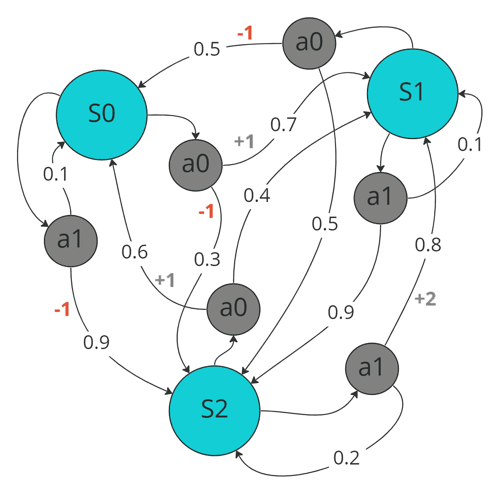
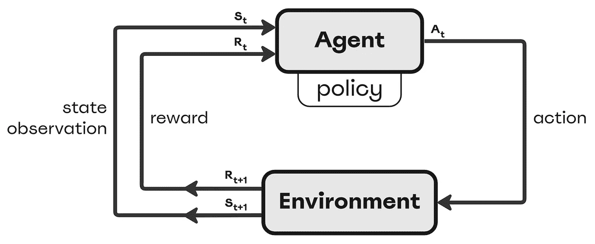
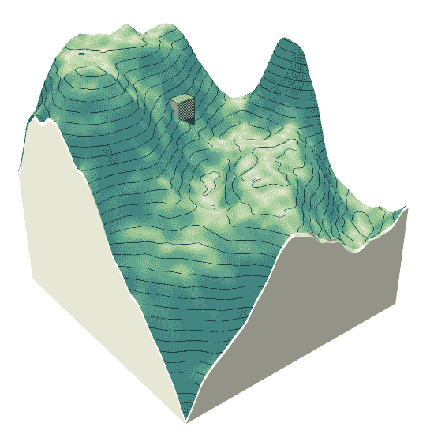
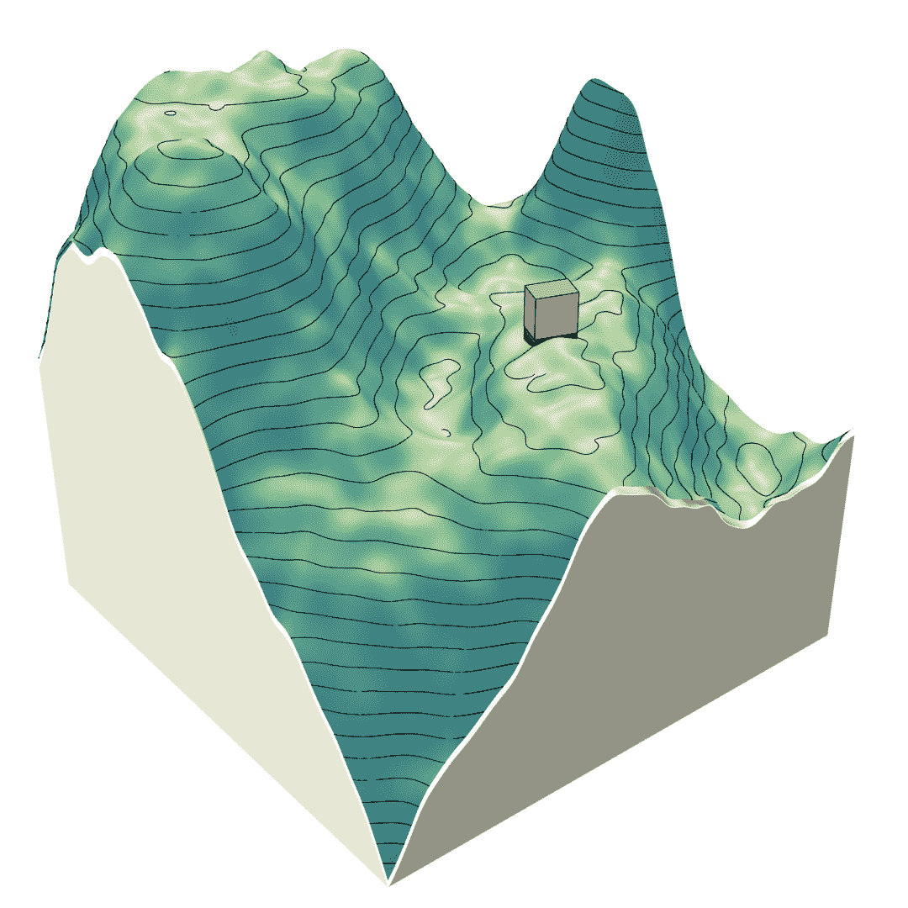

# 决策科学与设计的结合

> 原文：[`towardsdatascience.com/decision-science-meets-design-fb30eaa0ded9`](https://towardsdatascience.com/decision-science-meets-design-fb30eaa0ded9)

## 深入探讨通过深度强化学习解决生成设计问题

[](https://houssameeddinehsain.medium.com/?source=post_page-----fb30eaa0ded9--------------------------------)[](https://towardsdatascience.com/?source=post_page-----fb30eaa0ded9--------------------------------) [Houssame E. Hsain](https://houssameeddinehsain.medium.com/?source=post_page-----fb30eaa0ded9--------------------------------)

·发表于[Towards Data Science](https://towardsdatascience.com/?source=post_page-----fb30eaa0ded9--------------------------------) ·阅读时间约 9 分钟·2023 年 10 月 27 日

--


图片由[Igor Omilaev](https://unsplash.com/@omilaev?utm_source=medium&utm_medium=referral)提供，来源于[Unsplash](https://unsplash.com/?utm_source=medium&utm_medium=referral)

过去几十年间，设计过程发生了巨大的变化。曾经由人类直觉、判断和审美偏好驱动的领域，现在被计算方法和数据驱动过程所增强。这一过渡通过数据科学与设计的交集得到了体现，这是一个精确与创造力相遇的交汇点。

数据驱动技术在设计中的实用性在其子领域生成设计中得到了很好的展示，这是一种使用计算算法根据预定义标准生成多个设计变体的方法。然而，随着这些设计问题变得越来越复杂和多维，需要更复杂的技术来寻找令人满意的解决方案。这时，决策科学，特别是强化学习，就发挥了作用。

## 将决策科学应用于生成设计

> 设计的核心不仅仅是创造，而是一系列有目的的决策，这些决策导致了创造的形成。

决策科学的基本原则是通过评估在特定背景下可用选项的预测或已知后果来做出明智的选择。它包含定量统计方法与优化过程的结合。当应用于生成设计时，决策科学可以帮助确定哪些设计决策或决策序列可以改善某个配置或设计实例。这个过程需要三个组成部分：

+   **评估设计：** 评估每种变体的性能或质量，以了解每个设计选择对预期结果的贡献

+   **优化：**综合设计选择序列，以产生可行且令人满意的设计变体

+   **情景分析：**通过在不同的背景和约束下做出设计决策来探索各种设计可能性

## 将生成设计问题框架化为马尔可夫决策过程（MDPs）



简单的马尔可夫决策过程（插图由作者制作）

在深入探讨生成设计中的深度强化学习（DRL）之前，将这些设计问题框架化为马尔可夫决策过程（MDPs）是至关重要的。但什么是 MDP？

MDPs 是一种数学框架，用于建模在结果部分由概率动态和部分由决策者行为决定的设置中的决策过程。它包括以下主要组成部分：

+   **状态（S）：**表示不同的情景或条件。

+   **行动（A）：**表示每个状态下可用的选择。

+   **过渡（P）：**表示在采取行动后，从一个状态转移到另一个状态的概率。

+   **奖励（R）：**表示在某状态下采取行动后的反馈或结果。

在生成设计的背景下，我们可以将状态视为设计配置，将行动视为设计修改，将过渡视为从一个初始设计配置转移到另一个的可能性。奖励则是向设计师传达设计实例性能度量的反馈，并指导整个设计过程。

## 通过深度强化学习（DRL）解决生成设计问题



强化学习训练闭环（插图由作者制作）

强化学习（RL）的目标是通过试错过程学习执行任务的最佳行动策略。在我们的上下文中，代理即适应性设计策略，通过采取行动（修改设计）并根据结果（效率或性能）获得奖励或惩罚，从环境中学习。

在处理设计问题中的大状态和行动空间时，挑战就会出现。这时，深度学习，特别是深度强化学习（DRL），变得非常宝贵。DRL 将 RL 的决策能力与深度学习的强大函数逼近能力结合起来。简单来说，它利用神经网络预测在大型和复杂设计场景中应采取的最佳行动。

## 深度强化学习（DRL）实践：优化建筑物在地形上的布局



将建筑物质量放置在地形上，并计算所需的开挖和填充体积（动画由作者制作）

考虑在不平坦地形上建造建筑物的挑战。设计师可能需要考虑将建筑物放置在减少土方（挖掘和填充）量的地方。地形中的每一个可能位置代表一个动作，产生的挖填量代表奖励（或在这种情况下的惩罚）。

我们将通过一个工作流程展示如何训练 DRL 代理在地形上放置建筑物，同时最小化所需的挖填量。

> ***定义观察和动作空间***

我们首先定义了 DRL 代理的动作空间。代理控制建筑质量的三个参数：其 x 和 y 坐标以及旋转角度（theta）。我们使用 3 维离散动作空间表示。至于观察空间，使用包含建筑位置的地形图像帧来表示我们环境的状态。

```py
import numpy as np
import torch

# 3-dim action space
param1_space = np.linspace(start=0.1, stop=0.9, num=17)
param2_space = np.linspace(start=0.1, stop=0.9, num=17)
param3_space = np.linspace(start=0, stop=160, num=17)

# Define action space
param1_space = torch.from_numpy(param1_space)
param2_space = torch.from_numpy(param2_space)
param3_space = torch.from_numpy(param3_space)
```

> ***奖励函数***

代理的主要目标是最小化建造建筑物所需的土方。为此，奖励函数根据挖填量对代理进行惩罚。

代理在每一步都会收到一个等同于放置建筑所需的挖填量的惩罚值。在多建筑设置中，如果建筑质量在训练过程中与任何之前定位的建筑质量相交，还会有额外的-5 惩罚。奖励信号在[Rhinoceros 3D Grasshopper](https://en.wikipedia.org/wiki/Grasshopper_3D)环境中根据以下代码计算：

```py
# Grasshopper reward computation code
try:
    from ladybug_rhino.grasshopper import all_required_inputs
except ImportError as e:
    raise ImportError('\nFailed to import ladybug_rhino:\n\t{}'.format(e))

if all_required_inputs(ghenv.Component):
    reward = 0
    reward -= Soil_volume / 1000
    done = False

    bInter_relationList = [list(i) for i in bInter_relation.Branches]

    if len(bInter_relationList[0]) > 1:
        for i in bInter_relationList[0]:
            # building mass is inside some previously placed one
            if i == 0:
                reward -= 5
            # building mass intersects with some previously placed one
            elif i == 1:
                reward -= 5
        # compensate for self-intersection
        reward += 5
```

> ***代理与环境之间的连接***

在建立了观察和动作空间以及奖励函数之后，有必要促进 DRL 代理与 Grasshopper 模拟环境之间的互动。这是通过使用套接字进行协调的，这是一种流行的进程间通信方法。

```py
# Define Socket connection between Grasshopper and RL agent in Python
import socket

HOST = '127.0.0.1'
timeout = 20

def done_from_gh_client(socket):
    socket.listen()
    conn, _ = socket.accept()
    with conn:
        return_byt = conn.recv(5000)
    return_str = return_byt.decode() 

    return eval(return_str)

def reward_from_gh_client(socket):
    socket.listen()
    conn, _ = socket.accept()
    with conn:
        return_byt = conn.recv(5000)
    return_str = return_byt.decode()
    if return_str == 'None':
        return_float = 0
    else:
        return_float = float(return_str) 

    return return_float

def fp_from_gh_client(socket):
    socket.listen()
    conn, _ = socket.accept()
    with conn:
        return_byt = conn.recv(5000)
    fp = return_byt.decode()

    return fp

def send_ep_count_to_gh_client(socket, message):
    message_str = str(message)
    message_byt = message_str.encode()

    socket.listen()
    conn, _ = socket.accept()
    with conn:
        conn.send(message_byt)

def send_to_gh_client(socket, message):
    message_str = ''
    for item in message:
        listToStr = ' '.join(map(str, item))
        message_str = message_str + listToStr + '\n'

    message_byt = message_str.encode()
    socket.listen()
    conn, _ = socket.accept()
    with conn:
        conn.send(message_byt)
```

> ***DRL 演员评论家模型定义***

在定义了各种通信实用函数后，我们定义并初始化 DRL 模型和 ADAM 优化器用于训练：

```py
import torch 
import torch.nn as nn
import torch.optim as optim
import torch.nn.functional as F
from torch.autograd import Variable
from torch.distributions import Categorical

# Actor Critic Model Architecture
def enc_block(in_c, out_c, BN=True):
    if BN:
        conv = nn.Sequential(
            nn.Conv2d(in_c, out_c, kernel_size=4, stride=2, 
                      padding=1, bias=True),
            nn.BatchNorm2d(out_c),
            nn.LeakyReLU(negative_slope=0.2, inplace=True),
            nn.MaxPool2d(kernel_size=2, stride=2)
        )
        return conv
    else:
        conv = nn.Sequential(
            nn.Conv2d(in_c, out_c, kernel_size=4, stride=2, 
                      padding=1, bias=True),
            nn.LeakyReLU(negative_slope=0.2, inplace=True)
        )
        return conv

class GRUpolicy(nn.Module):
    def __init__(self, n_gru_layers, hidden_size, lin_size1, lin_size2, 
                  enc_size1, enc_size2, enc_size3):
        super(GRUpolicy, self).__init__()

        #critic
        self.critic_enc1 = enc_block(3, enc_size1, BN=False)
        self.critic_enc2 = enc_block(enc_size1, enc_size2, BN=True)
        self.critic_enc3 = enc_block(enc_size2, enc_size3, BN=True)
        self.critic_enc4 = enc_block(enc_size3, 128, BN=True)

        self.critic_linear1 = nn.Linear(512, lin_size1)
        self.critic_linear2 = nn.Linear(lin_size1, lin_size2)
        self.critic_linear3 = nn.Linear(lin_size2, 1)

        # actor
        self.gru1 = nn.GRU(4, hidden_size, n_gru_layers, batch_first=True)
        self.gru2 = nn.GRU(4, hidden_size, n_gru_layers, batch_first=True)
        self.gru3 = nn.GRU(4, hidden_size, n_gru_layers, batch_first=True)
        self.actor_linear = nn.Linear(hidden_size, 17)

    def forward(self, state):
        state = Variable(state.unsqueeze(0))

        # critic
        enc = self.critic_enc1(state)
        enc = self.critic_enc2(enc)
        enc = self.critic_enc3(enc)
        enc = self.critic_enc4(enc)

        value = F.relu(self.critic_linear1(torch.flatten(enc)))
        value = F.relu(self.critic_linear2(value))
        value = self.critic_linear3(value)

        # actor
        seq = torch.reshape(enc, (1, 128, 4))

        out1, h_1 = self.gru1(seq)
        out_s1 = torch.squeeze(out1[:, -1, :])
        out_l1 = self.actor_linear(out_s1)
        prob1 = F.softmax(out_l1, dim=-1)
        dist1 = Categorical(prob1)

        out2, h_2 = self.gru2(seq, h_1)  
        out_s2 = torch.squeeze(out2[:, -1, :])
        out_l2 = self.actor_linear(out_s2)
        prob2 = F.softmax(out_l2, dim=-1)
        dist2 = Categorical(prob2)

        out3, _ = self.gru3(seq, h_2)
        out_s3 = torch.squeeze(out3[:, -1, :])
        out_l3 = self.actor_linear(out_s3)
        prob3 = F.softmax(out_l3, dim=-1)
        dist3 = Categorical(prob3)

        return value, dist1, dist2, dist3 

# Set device
is_cuda = torch.cuda.is_available()
device = torch.device('cuda' if is_cuda else 'cpu')
print(f'Used Device: {device}')

# Initialize DRL model
actorcritic = GRUpolicy(config.n_gru_layers, config.hidden_size, 
                        config.lin_size1, config.lin_size2, 
                        config.enc_size1, config.enc_size2, 
                        config.enc_size3).to(device)

# Initialize optimizer 
ac_optimizer = optim.Adam(actorcritic.parameters(), lr=config.lr, weight_decay = 1e-6)
```

代理架构在 GRUpolicy 类中定义。它是一种演员-评论家架构。演员在给定状态下提供动作的概率分布，而评论家估计该状态的价值，即从该状态开始并遵循代理策略的期望回报。

> ***代理训练***

一旦定义了代理与环境之间的套接字连接，模型架构得以实现，并且模型的一个实例被初始化，我们就准备好训练 DRL 代理以正确地在地形上放置建筑物质量。

实验的核心是训练循环。在这里，代理在多个训练回合中反复与环境互动，遵循以下步骤：

+   一旦代理收到当前状态观察，它会根据其当前策略选择一个动作。

```py
# model forward pass
value, dist1, dist2, dist3 = actorcritic.forward(state) 

# get action from probability distributions
param1 = param1_space[dist1.sample()]
param2 = param2_space[dist2.sample()]
param3 = param3_space[dist3.sample()] 

action = [param1, param2, param3]
```

+   智能体随后将动作发送到 Grasshopper，并获得结果奖励和新状态。

```py
# Send action through socket
with socket.socket(socket.AF_INET, socket.SOCK_STREAM) as s:
    s.bind((HOST, 8080))
    s.settimeout(timeout)
    send_to_gh_client(s, action)

# Send episode count through socket
with socket.socket(socket.AF_INET, socket.SOCK_STREAM) as s:
    s.bind((HOST, 8083))
    s.settimeout(timeout)
    send_ep_count_to_gh_client(s, episode)

####### Awaiting Grasshopper script response #######

# Receive observation from Grasshopper Client
with socket.socket(socket.AF_INET, socket.SOCK_STREAM) as s:
    s.bind((HOST, 8084))
    s.settimeout(timeout)
    fp = fp_from_gh_client(s)

# Receive Reward from Grasshopper Client
with socket.socket(socket.AF_INET, socket.SOCK_STREAM) as s:
    s.bind((HOST, 8081))
    s.settimeout(timeout)
    reward = reward_from_gh_client(s)

# Receive done from Grasshopper Client
with socket.socket(socket.AF_INET, socket.SOCK_STREAM) as s:
    s.bind((HOST, 8082))
    s.settimeout(timeout)
    done = done_from_gh_client(s)
```

+   然后，它会根据接收到的阶段性奖励更新其策略。

```py
# compute loss functions
returns = []
for t in reversed(range(len(rewards))):
    Qval = rewards[t] + config.gamma * Qval
    returns.insert(0, Qval)

returns = torch.cat(returns).detach()
values = torch.cat(values)
log_probs = torch.cat(log_probs)

advantage = returns - values

actor_loss = -(log_probs * advantage.detach()).mean() 
critic_loss = 0.5 * advantage.pow(2).mean() 
ac_loss = actor_loss + critic_loss - config.beta * entropy

# update actor critic
ac_optimizer.zero_grad()
ac_loss.backward()
ac_optimizer.step()
```

这个过程会持续进行几个训练迭代，直到智能体收敛到一个最优的建筑质量布置，以最小化地形切割和填充体积。这个由奖励反馈指导的迭代试错学习过程，结果产生了优化的设计配置。



DRL 智能体收敛到一个最小化必要切割和填充体积的建筑位置。地形中的渐变着色代表了其坡度（动画作者提供）

通过这个实验，你可以看到 DRL 智能体如何被调整以应对现实世界中的设计挑战。这种由 DRL 驱动的生成设计方法，展示了数据科学与设计交汇处未来探索的有希望的途径。

*所有关于这个实验的实现和细节，包括在 Grasshopper 中的环境实现以及相关的 Rhinoceros 3D 文件，都可以在 GitHub 上的* [*CutnFill_DeepRL*](https://github.com/houssameehsain/CutnFill_DeepRL) *库中找到。*

# 结论

通过将生成设计问题框架设为 MDP，并利用深度强化学习的力量，我们可以更广泛地探索设计空间，更客观地评估设计，并更有效地优化它们。像 DRL 这样的计算技术在设计实践中变得越来越普遍。数据科学与设计的融合预示着一个未来，在这个未来中，美观且经过严谨信息化的设计方案将被自动生成和评估，从而实现一个快速有效的迭代设计过程，其中人类和机器协作，产生智能设计解决方案。
