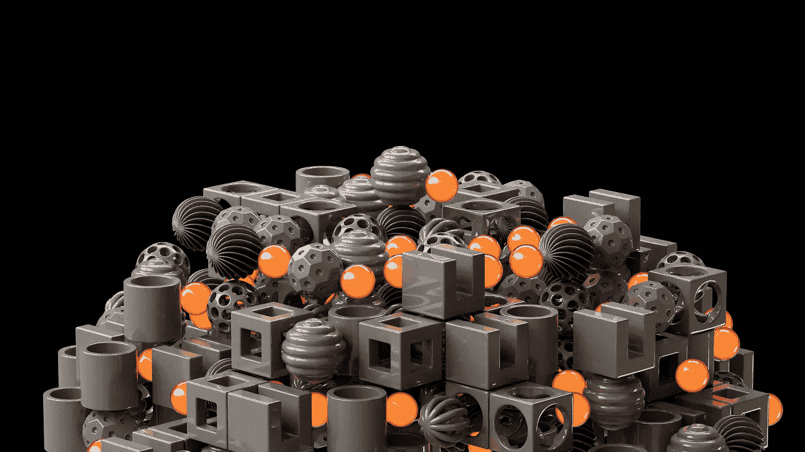

# 决策科学与设计的结合

> 原文：[`towardsdatascience.com/decision-science-meets-design-fb30eaa0ded9?source=collection_archive---------7-----------------------#2023-10-27`](https://towardsdatascience.com/decision-science-meets-design-fb30eaa0ded9?source=collection_archive---------7-----------------------#2023-10-27)

## 深入探讨通过深度强化学习解决生成设计问题

 [Houssame E. Hsain](https://houssameeddinehsain.medium.com/?source=post_page-----fb30eaa0ded9--------------------------------)

·

[关注](https://medium.com/m/signin?actionUrl=https%3A%2F%2Fmedium.com%2F_%2Fsubscribe%2Fuser%2F4056727edcf8&operation=register&redirect=https%3A%2F%2Ftowardsdatascience.com%2Fdecision-science-meets-design-fb30eaa0ded9&user=Houssame+E.+Hsain&userId=4056727edcf8&source=post_page-4056727edcf8----fb30eaa0ded9---------------------post_header-----------) 发表在 [Towards Data Science](https://towardsdatascience.com/?source=post_page-----fb30eaa0ded9--------------------------------) · 9 分钟阅读 · 2023 年 10 月 27 日

--

图片来源：[Igor Omilaev](https://unsplash.com/@omilaev?utm_source=medium&utm_medium=referral) 于 [Unsplash](https://unsplash.com/?utm_source=medium&utm_medium=referral)

设计过程在过去几十年中发生了剧变。从前，这一领域主要依靠人类的直觉、判断和审美偏好，如今则通过计算方法和数据驱动的过程得到了增强。这一过渡的典型例子是数据科学与设计的交汇点，在这里，精准遇上创造力。

数据驱动技术在设计中的实用性在其子领域——生成设计中得到了很好的展示。生成设计是一种利用计算算法根据预定义的标准生成多个设计变体的方法。然而，随着这些设计问题变得越来越复杂和多维，找到令人满意的解决方案需要更复杂的技术。这就是决策科学，特别是强化学习，发挥作用的地方。

## 将决策科学应用于生成设计

> 设计的核心不仅仅是创造，更在于一系列有目的的决策，这些决策最终导致了创造的产生。

决策科学本质上是通过评估在特定上下文中可用的选项及其预测或已知的...
