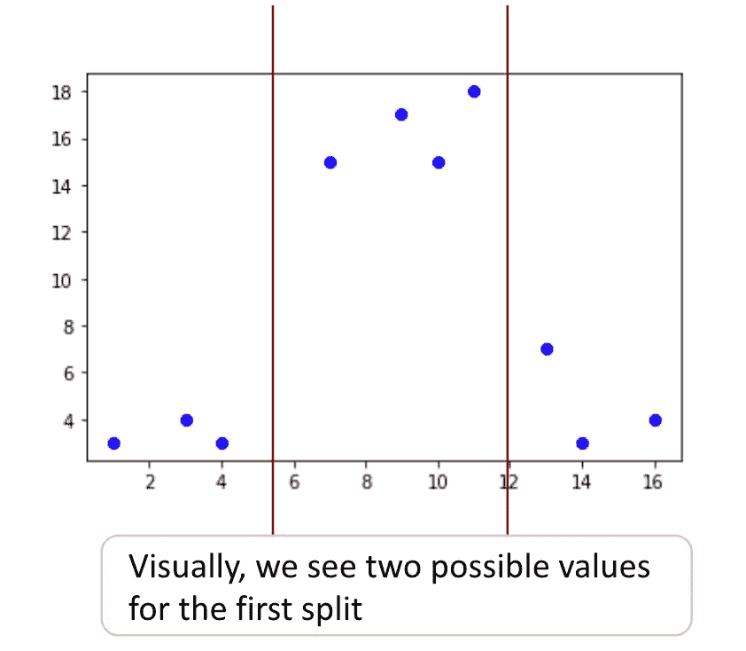
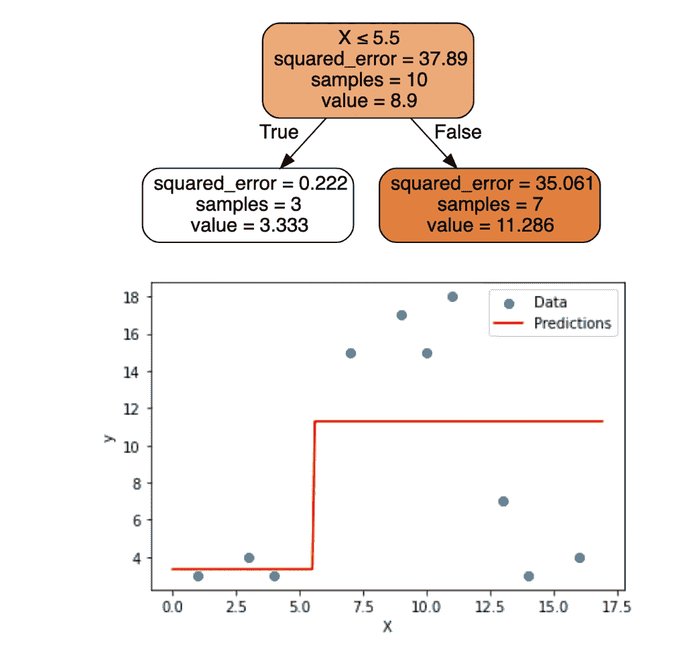
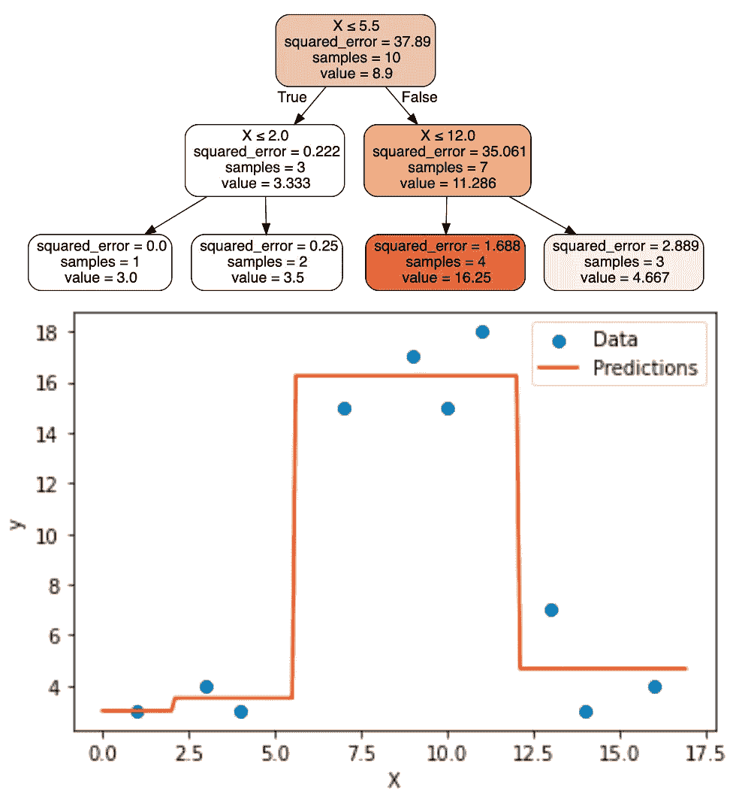
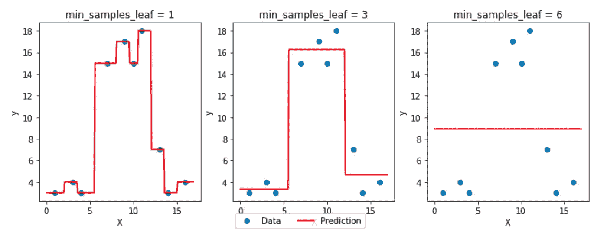
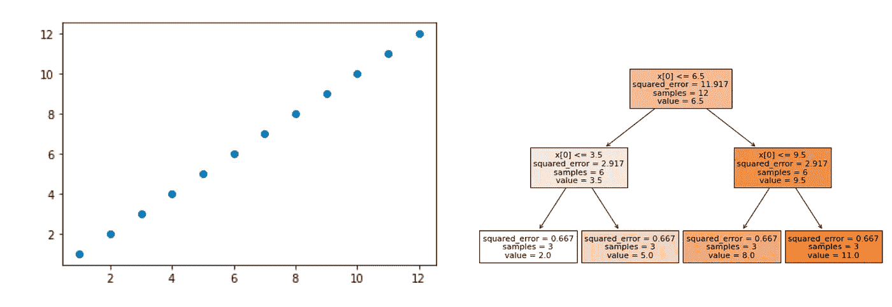
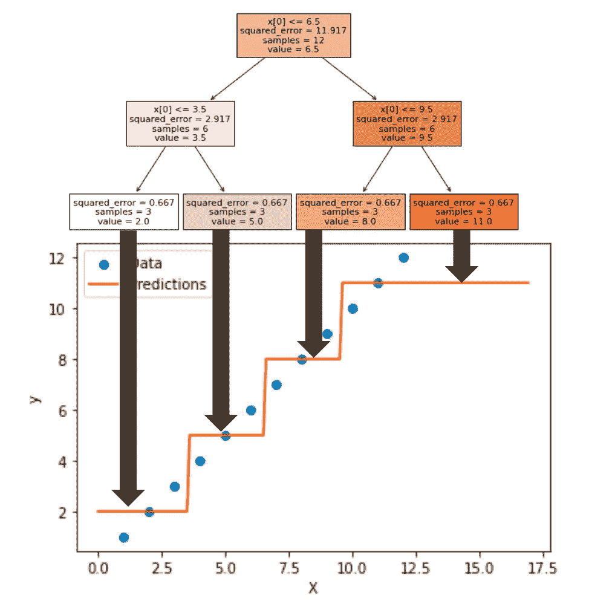
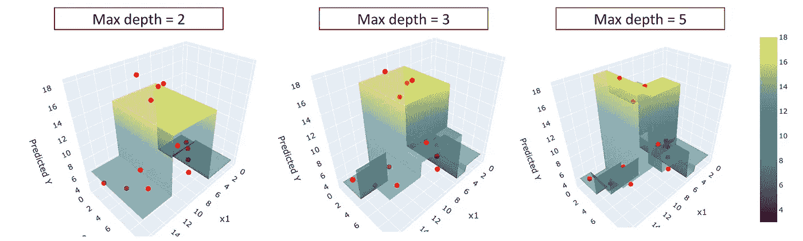

# 决策树回归器——Scikit Learn 的可视化指南

> 原文：[`towardsdatascience.com/decision-tree-regressor-a-visual-guide-with-scikit-learn-2aa9e01f5d7f`](https://towardsdatascience.com/decision-tree-regressor-a-visual-guide-with-scikit-learn-2aa9e01f5d7f)


图片由 [niko photos](https://unsplash.com/@niko_photos?utm_source=medium&utm_medium=referral) 提供，发布在 [Unsplash](https://unsplash.com/?utm_source=medium&utm_medium=referral)

## 无需数学知识了解决策树

[](https://medium.com/@angela.shi?source=post_page-----2aa9e01f5d7f--------------------------------)[](https://towardsdatascience.com/?source=post_page-----2aa9e01f5d7f--------------------------------) [Angela and Kezhan Shi](https://medium.com/@angela.shi?source=post_page-----2aa9e01f5d7f--------------------------------)

·发布在 [Towards Data Science](https://towardsdatascience.com/?source=post_page-----2aa9e01f5d7f--------------------------------) ·5 分钟阅读·2023 年 3 月 27 日

--

在这篇文章中，我们将使用 Python 中的 scikit-learn 实现 DecisionTreeRegressor，以可视化该模型的工作原理。我们不会使用任何数学术语，而是通过可视化来展示决策树回归器的工作原理及一些超参数的影响。

在这个背景下，决策树回归器通过将特征变量切分成小区域来预测一个连续的目标变量，每个区域将有一个预测值。我们将从一个连续变量开始，然后是两个连续变量。我们不会使用分类变量，因为对于决策树，当进行切分时，连续变量最终会像分类数据一样处理。

我们将主要研究两个直观易懂的超参数的影响：max depth 和 min_samples_leaf。其他超参数类似，主要思想是限制规则的大小。

# 一个非线性变量

我们使用一些简单的数据，只有特征变量 x。

```py
# Import the required libraries
from sklearn.tree import DecisionTreeRegressor
import numpy as np
# Define the dataset
X = np.array([[1], [3], [4], [7], [9], [10], [11], [13], [14], [16]])
y = np.array([3, 4, 3, 15, 17, 15, 18, 7, 3, 4])
```

我们可以在一个 (x,y) 图中可视化数据

```py
import matplotlib.pyplot as plt

# Plot the dataset with the decision tree splits
plt.figure(figsize=(10,6))
plt.scatter(X, y, color='blue')
plt.show()
```

在下图中，对于第一次切分，我们可以直观地猜测出两种可能的分割，如下所示：



决策树回归器可视化——作者提供的图像

现在，决策树回归器模型准确地决定了哪个分割更好。我们指定参数 max_depth=1，以仅获得一个分割：

```py
from sklearn.tree import DecisionTreeRegressor

# Fit the decision tree model
model = DecisionTreeRegressor(max_depth=1)
model.fit(X, y)

# Generate predictions for a sequence of x values
x_seq = np.arange(0, 17, 0.1).reshape(-1, 1)
y_pred = model.predict(x_seq)
```



决策树回归器可视化——作者提供的图像

如果我们决定得到 4 个区域，我们可以尝试 max_depth=2，并得到：



决策树回归器可视化 — 作者提供的图片

然后我们可以通过下面的图片可视化 `max_depth` 超参数对最终模型的影响：


决策树回归器可视化 — 作者提供的图片

我们也可以用另一个超参数 `min_samples_leaf` 绘制相同的图形，它是最终区域（我们称之为叶子，因为在树的分支末端，我们找到叶子）的最小观察数。



决策树回归器可视化 — 作者提供的图片

# 一个“线性”特征

决策树回归器是一个非线性回归器。我们可以从之前的示例中看到它如何表现/建模数据。对于“线性”数据会发生什么呢？

让我们以这个完美线性数据的简单例子开始：

```py
import numpy as np

X=np.arange(1,13,1).reshape(-1,1)
y=np.concatenate((np.arange(1,12,1),12), axis=None)

plt.scatter(X,y)
```

你可以看到关系非常简单：y = x！

如果我们使用经典的决策树可视化，你可以立即看到模型的表现。



现在，我们可以创建下面相同的图形。有时，人们会惊讶地看到决策树将完美的线分割成区域，并为预测提供几个值，即使对于线性数据集也是如此。



然后人们会评论说这个模型根本不适合这个数据集，我们不应该使用它。

现在，事实是你无法提前知道数据集的行为。这就是“无免费午餐定理”的全部内容。

在实际操作中，你可以应用几种模型，如线性回归和决策树。如果有一个模型显著优于另一个模型，那么你可以对数据的线性与非线性行为做出结论。

# 两个连续特征

对于两个连续变量，我们需要创建一个 3D 图。

首先，让我们生成一些数据。

```py
import numpy as np
from sklearn.tree import DecisionTreeRegressor
import plotly.graph_objs as go
from plotly.subplots import make_subplots

# Define the data
X = np.array([[1, 2], [3, 4], [4, 5], [7, 2], [9, 5], [10, 4], [11, 3], [13, 5], [14, 3], [16, 1],
              [10, 10], [16, 10], [12, 10]])
y = np.array([3, 4, 3, 15, 17, 15, 18, 7, 3, 4,8,10,13])
```

然后可以创建模型：

```py
# Fit the decision tree model
model = DecisionTreeRegressor(max_depth=3)
model.fit(X, y)
```

最后，我们可以使用 Plotly 创建 3D 图。

```py
# Create an interactive 3D plot with Plotly
fig = make_subplots(rows=1, cols=1, specs=[[{'type': 'surface'}]])

fig.add_trace(go.Surface(x=x_seq, y=y_seq, z=z_seq, colorscale='Viridis', showscale=True,opacity = 0.5),
              row=1, col=1)

fig.add_trace(go.Scatter3d(x=X[:, 0], y=X[:, 1], z=y, mode='markers', marker=dict(size=5, color='red')),
              row=1, col=1)

fig.update_layout(title='Decision Tree with Max Depth = {}'.format(max_depth),
                  scene=dict(xaxis_title='x1', yaxis_title='x2', zaxis_title='Predicted Y'))

fig.show()
```

我们可以比较不同深度的值，如下图所示：



决策树回归器可视化 — 作者提供的图片

如果你用 Python 创建一个图形，你可以操控它以从不同角度查看可视化效果。

# 结论

可视化模型对简单数据集的预测是理解模型如何工作的一个极好的方法。

对于决策树来说，它们通过树状规则的可视化已经相当直观。经典的 x, y（和 z）可视化可以作为补充。

我们也可以看到模型是高度非线性的。而且数据集不需要任何缩放。

我写关于机器学习和数据科学的文章，并以清晰的方式解释复杂的概念。请通过下面的链接关注我并获取我的文章完整访问权限：[`medium.com/@angela.shi/membership`](https://medium.com/@angela.shi/membership)
