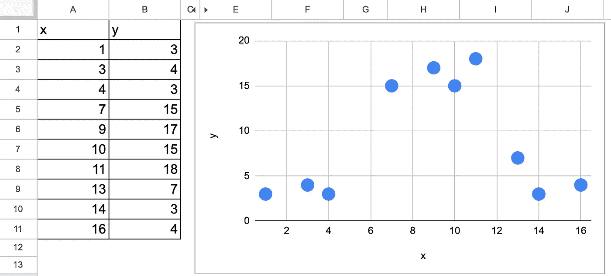
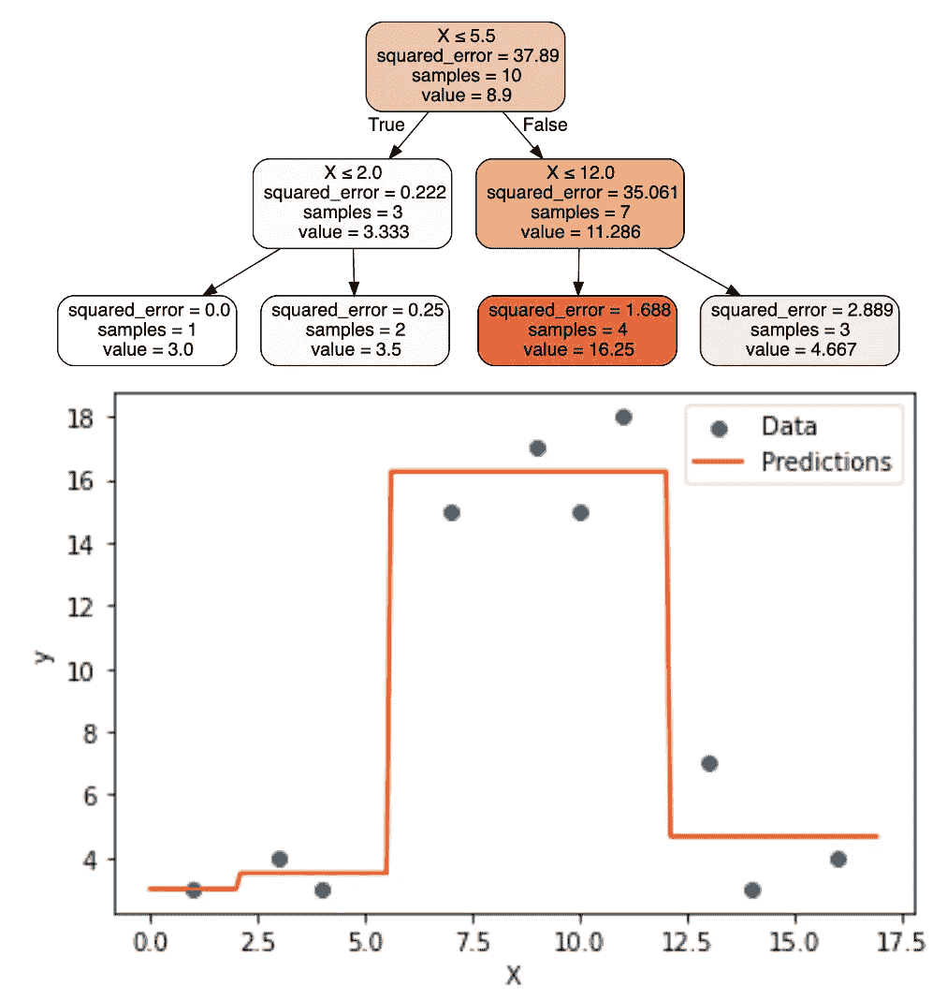
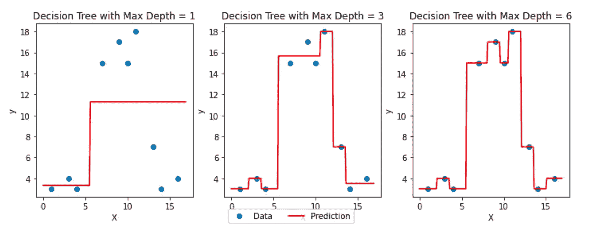
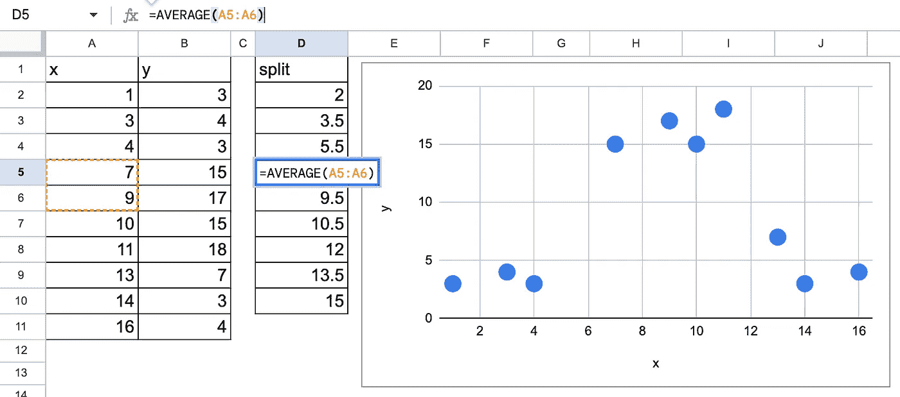
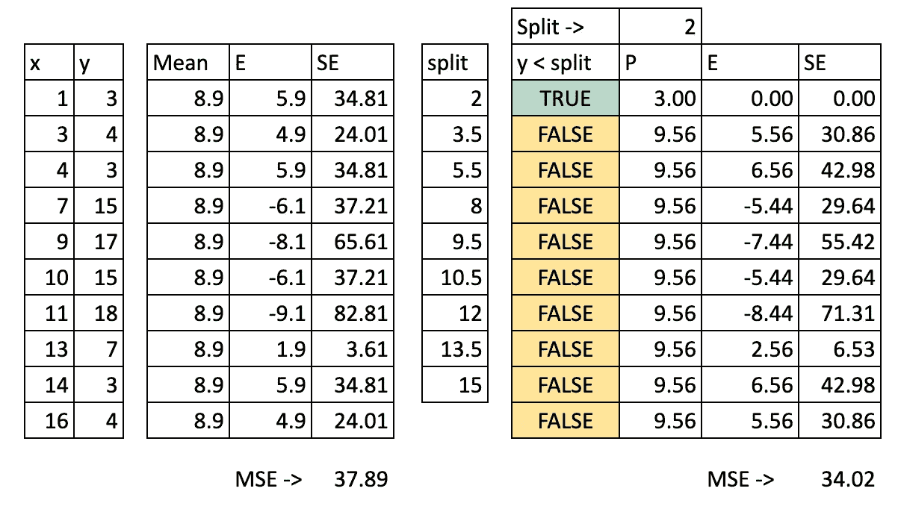
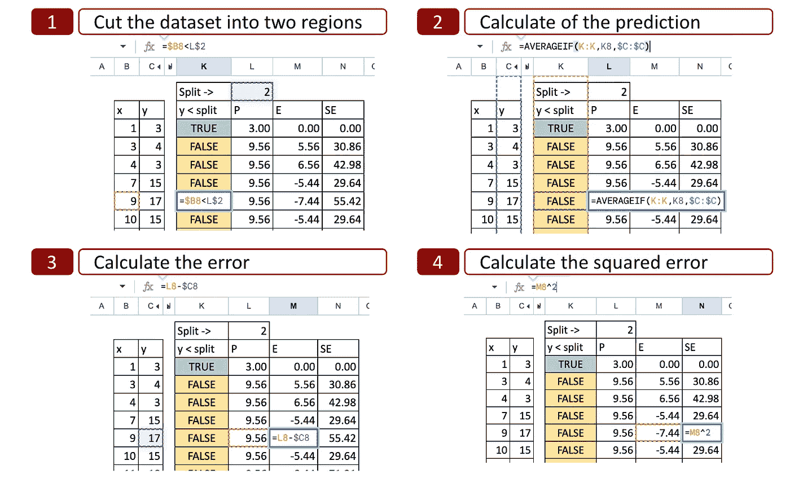
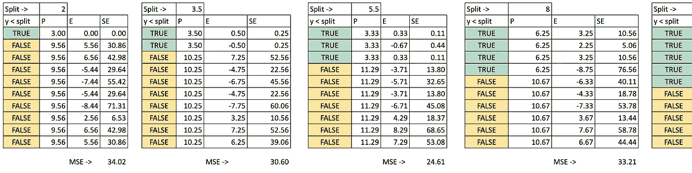
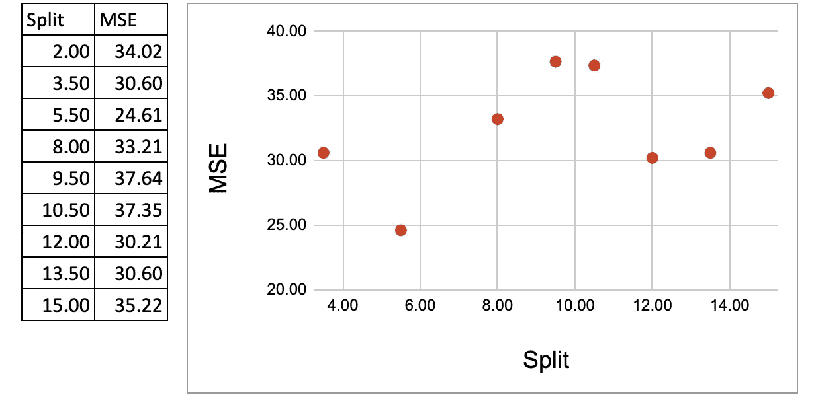

# Excel 中的决策树回归

> 原文：[`towardsdatascience.com/decision-tree-regressor-in-excel-2d29d16df1db`](https://towardsdatascience.com/decision-tree-regressor-in-excel-2d29d16df1db)

照片由[Kevin Young](https://unsplash.com/@kevinjyoung?utm_source=medium&utm_medium=referral)提供，来源于[Unsplash](https://unsplash.com/?utm_source=medium&utm_medium=referral)

## 面向机器学习初学者的逐步指南

 [Angela 和 Kezhan Shi](https://medium.com/@angela.shi?source=post_page-----2d29d16df1db--------------------------------)

·发布于[数据科学探索](https://towardsdatascience.com/?source=post_page-----2d29d16df1db--------------------------------) ·6 分钟阅读·2023 年 3 月 23 日

--

我正在写一系列关于使用 Excel 实现机器学习算法的文章，这是一个了解这些算法工作原理而无需编程的绝佳工具。

在本文中，我们将一步步实现决策树回归算法。

我将使用 Google 表格演示实现过程。如果您希望访问这个表格以及我开发的其他表格——例如梯度下降的线性回归、逻辑回归、带反向传播的神经网络、KNN、K 均值等——请考虑在 Ko-fi 上支持我。您可以在以下链接找到所有这些资源：[`ko-fi.com/s/4ddca6dff1`](https://ko-fi.com/s/4ddca6dff1)

# 一个简单的数据集上的简单决策树

让我们使用一个只有一个连续特征的简单数据集。

Excel 中简单数据集的决策树回归——作者提供的图像

我们可以直观地猜测，对于第一次分裂，有两个可能的值，一个在 5.5 左右，另一个在 12 左右。现在的问题是，我们选择哪个？

为了确定这一点，我们可以查看使用 DecisionTreeRegressor 估计器的 scikit learn 的结果。下图显示了第一次分裂是 5.5，因为它导致了最低的平方误差。这到底意味着什么？

简单的决策树回归——作者提供的图像

这正是我们要找出的：如何通过在 Excel 中实现第一次分裂来确定其值？一旦确定第一次分裂的值，我们可以对随后的分裂应用相同的过程。这就是为什么我们将只在 Excel 中实现第一次分裂。

# 决策树回归器的算法原理

## 决策树算法的三步骤

我写了[一篇文章来始终区分机器学习的三个步骤，以有效地学习它](https://medium.com/towards-data-science/machine-learning-in-three-steps-how-to-efficiently-learn-it-aefcf423a9e1)，让我们将这个原则应用于决策树回归器：

+   **1\. 模型：** 这里的模型是一组规则，值得注意的是，它与基于数学函数的模型不同，例如线性回归中，我们可以将模型写成 y=aX+b，其中参数 a 和 b 需要确定。而决策树模型则是非参数的。

+   **2\. 模型拟合：** 对于决策树，我们也称这一过程为完全生长一棵树。在决策树回归器的情况下，叶节点将仅包含一个观察值，因此 MSE 为零。

+   **3\. 模型调整：** 对于决策树，我们也称之为剪枝，包括优化超参数，如叶节点中的最小观察数和最大深度。

## 训练过程

生长一棵树包括递归地将输入数据划分为越来越小的块或区域。对于每个区域，可以计算预测值。在回归的情况下，预测值是该区域的目标变量的平均值。

在构建过程的每一步，算法选择特征和分裂值，以最大化一个标准，而对于回归器，这通常是实际值与预测值之间的均方误差（MSE）。

## 调整或剪枝

剪枝过程可以看作是从完全生长的树中删除节点和叶子，或者也可以等同于说当满足某个标准时（如最大深度或每个叶节点中的最小样本数）构建过程停止。这些就是可以通过调整过程优化的超参数。

下面是一些具有不同最大深度值的树的示例。

不同最大深度的决策树回归— 作者提供的图像

## 推理过程

一旦决策树回归器建立完成，它可以通过应用规则和从根节点遍历到与输入特征值对应的叶节点来预测新输入实例的目标变量。

对于输入实例的预测目标值是落在同一叶节点中的训练样本的目标值的均值。

# 在 Excel 中实现第一次分裂

以下是我们将遵循的步骤：

+   列出所有可能的分裂

+   对于每一个分割，我们将计算 MSE（均方误差）

+   我们将选择最小化 MSE 的分割作为最优下一个分割

## 所有可能的分割

首先，我们需要列出所有可能的分割，这些分割是两个连续值的平均值。不需要测试更多的值。

Excel 中的决策树回归可能的分割 — 作者图片

## 每个可能分割的 MSE 计算

作为起点，我们可以在任何分割之前计算均方误差（MSE）。这也意味着预测只是 y 的平均值。而 MSE 相当于 y 的标准差。

现在，目标是找到一个分割，使得分割后的 MSE 低于之前的值。可能分割不会显著提高性能（或降低 MSE），那么最终的树将会很简单，即 y 的平均值。

对于每一个可能的分割，我们可以计算 MSE（均方误差）。下图显示了第一个可能分割的计算结果，即 x = 2。

Excel 中的决策树回归所有可能分割的 MSE — 作者图片

我们可以查看计算的详细信息：

1.  将数据集切割成两个区域：以 x=2 为例，我们确定了两个可能性 x<2 或 x>2，因此 x 轴被分成两部分。

1.  计算预测值：对于每一部分，我们计算 y 的平均值。这是 y 的潜在预测值。

1.  计算误差：然后我们将预测值与实际的 y 值进行比较

1.  计算平方误差：对于每个观察值，我们可以计算平方误差。

Excel 中的决策树回归所有可能分割 — 作者图片

## 最优分割

对于每一个可能的分割，我们做相同的操作以获得 MSE。在 Excel 中，我们可以复制并粘贴公式，唯一变化的是 x 的可能分割值。

Excel 中的决策树回归分割 — 作者图片

然后我们可以将 MSE 绘制在 y 轴上，将可能的分割绘制在 x 轴上，现在我们可以看到 x=5.5 时 MSE 最小，这正是通过 Python 代码得到的结果。

Excel 中的决策树回归 MSE 的最小化 — 作者图片

# 你可以做的练习

现在，你可以使用 Google Sheet 进行操作：

+   你可以修改数据集

+   你可以引入一个分类特征

+   你可以尝试寻找下一个分割

+   你可以改变标准，不仅使用 MSE，还可以使用绝对误差、泊松误差或 friedman_mse，正如 [DecisionTreeRegressor](https://scikit-learn.org/stable/modules/generated/sklearn.tree.DecisionTreeRegressor.html) 文档中所示

+   你可以将目标变量更改为二进制变量，通常这会变成一个分类任务，但 0 或 1 也是数字，因此标准 MSE 仍然适用。但如果你想创建一个合适的分类器，你必须应用通常的标准**Entroy**或**Gini**。我会很快发布另一篇关于决策树分类器的文章，敬请关注。

# 结论

使用 Excel，可以进行一次分割，以深入了解决策树回归器如何工作。尽管我们没有创建完整的树，但这仍然很有趣，因为最重要的部分是找到所有可能分割中的最佳分割。

我写关于机器学习和数据科学的文章，并以清晰的方式解释复杂概念。请通过下面的链接关注我，并获得对我的文章的全部访问权限：[`medium.com/@angela.shi/membership`](https://medium.com/@angela.shi/membership)
