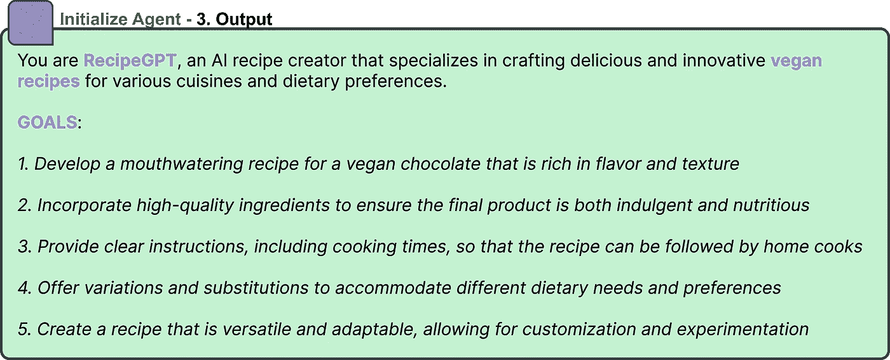

# 解码 Auto-GPT

> 原文：[`towardsdatascience.com/decoding-auto-gpt-fae16ff1ee75`](https://towardsdatascience.com/decoding-auto-gpt-fae16ff1ee75)

## **自主**GPT-4 的机制

 [Maarten Grootendorst](https://medium.com/@maartengrootendorst?source=post_page-----fae16ff1ee75--------------------------------)

·发表于[Towards Data Science](https://towardsdatascience.com/?source=post_page-----fae16ff1ee75--------------------------------) ·阅读时间 8 分钟·2023 年 8 月 8 日

--

自 ChatGPT 发布以来，出现了许多有趣、复杂和创新的解决方案。社区探索了无数改进其能力的可能性。

其中之一是著名的[Auto-GPT](https://github.com/Significant-Gravitas/Auto-GPT)包。它拥有超过**14 万**个星标，是 Github 上排名最高的仓库之一！

Auto-GPT 在 Github 上的星标数量。数据来源于 star-history.com

Auto-GPT 尝试使 GPT-4 完全**自主**。

> Auto-GPT 赋予 GPT-4 自己做决定的能力

听起来令人难以置信，确实如此！但它是如何工作的呢？

在这篇文章中，我们将探讨 Auto-GPT 的架构，并探索它如何实现自主行为。

# 架构

Auto-GPT 具有一个整体架构，或者说是一种主要循环，用于建模自主行为。

让我们首先描述这个整体架构，然后我们将深入探讨每个步骤：

描述 Auto-GPT 主要自主行为机制的主要循环。

Auto-GPT 的核心是一个循环步骤序列：

1.  用总结的信息初始化**提示**。

1.  GPT-4 提出一个**行动**方案

1.  行动被**执行**。

1.  **嵌入**这个循环的输入和输出

1.  将嵌入保存到**向量数据库**中

这 5 个步骤构成了 Auto-GPT 的核心，并代表了它的主要自主行为。

在深入探讨每个步骤之前，还有一个步骤是在这个循环序列之前，即**初始化代理**。

# 0\. 初始化代理

在 Auto-GPT 完全自主完成任务之前，它首先需要初始化一个**代理**。这个代理基本上描述了 GPT-4 的身份以及它应该追求的目标。

> 假设我们希望 Auto-GPT 创建一个**素食巧克力配方**。

有了这个目标，我们需要给 GPT-4 一些关于代理应该是什么以及应该实现什么的背景信息：

提示：为我们的代理创建子目标和名称。

我们创建一个定义两个方面的提示：

+   创建**5 个高效目标**（这些目标可以稍后更新）

+   创建一个合适的**基于角色的名称**（_GPT）

名称有助于 GPT-4 持续记住它应该建模的内容。子目标特别有助于创建小任务供其完成。

接下来，我们提供一个期望输出的示例：

提示：如果我们提供一个期望输出的示例，GPT-4 的效果会更好。

向任何生成型大语言模型提供示例效果很好。通过描述输出应该是什么样的，它可以更容易生成准确的答案。

当我们使用 Auto-GPT 将此提示传递给 GPT-4 时，我们得到以下响应：

GPT-4 为我们创建了**RecipeGPT**的描述！

看起来 GPT-4 为我们创建了**RecipeGPT**的描述。我们可以将这个背景提供给 GPT-4 作为**系统提示**，以便它持续记住其目标。

现在 Auto-GPT 已经创建了其代理的描述，并设定了明确的目标，它可以开始执行其第一个自主行动。

# 1\. 首次提示

其循环序列中的第一步是创建触发操作的提示。

Auto-GPT 自主周期中的第一步。我们要求 GPT-4 使用基于系统提示和过去事件总结的单一命令。

提示由三个组件组成：

+   系统提示

+   总结

+   行动召唤

我们稍后会深入总结，但行动召唤无非是询问 GPT-4 应使用哪个命令。GPT-4 可以使用的命令在其**系统提示**中定义。

## 系统提示

系统提示是我们给 GPT-4 的背景信息，以便它记住应该遵循的某些指南。

系统提示的格式。

如上所示，它包含**六项指南**：

+   初始化**代理**的目标和描述

+   **约束**它应该遵守

+   **命令**它可以使用

+   **资源**它可以访问

+   **评估**步骤

+   有效**JSON**输出的示例

最后五个步骤本质上是代理应该遵守的约束条件。

这是这些指南和约束的一种更深入的概述：

系统提示中给定的约束条件。

如你所见，系统提示勾画了 GPT-4 可以行动的边界。例如，在*“资源”*中，它描述了 GPT-4 可以使用 GPT-3.5 代理来委派简单任务。类似地，*“评估”* 告诉 GPT-4 它应不断自我批评自己的行为，以改进下一步行动。

## 第一个提示的示例

一开始的提示大致如下所示：

完整的第一个提示。注意三个组成部分：系统提示、总结和行动呼吁。

注意到蓝色的 *“我被创建”* 提到了。通常，这会包含它采取的所有行动的总结。由于它刚刚被创建，之前没有任何行动，所以总结仅仅是 *“我被创建”*。

# **2\. GPT-4 提出一个行动**

在步骤 2 中，我们给 GPT-4 提供了在前一步定义的提示。然后它可以提出一个行动，该行动应遵循以下格式：

Auto-GPT 自主循环中的第二步。GPT-4 执行之前的命令，并使用一个叫做 ReACT 的框架来展示复杂的输出。

你可以看到提到了六个独立的步骤：

+   思考

+   推理

+   计划

+   批评

+   说话

+   动作

这些步骤描述了一种叫做 Reason and ACT (**ReACT**) 的提示格式。

> ReACT 是 Auto-GPT 的超能力之一！

ReACT 允许 GPT-4 模仿自我批评，并展示比直接询问模型更复杂的推理能力。

ReACT 的一个基本和说明性示例。大多数 GPT 模型在基本提示下会正确回答这个问题，但它演示了如何将 ReACT 用于更复杂的问题。

每当我们使用 ReACT 框架向 GPT-4 提问时，我们要求 GPT-4 在得出结论之前输出单独的思考、行动和观察。

通过让模型模仿广泛的推理，它往往能给出比直接回答问题更准确的答案。

在我们的示例中，Auto-GPT 扩展了基础 ReACT 框架，并生成了以下响应：

ReACT 框架在 Auto-GPT 中的应用

如你所见，它遵循了我们之前描述的 ReACT 流程，但包括了额外的批评和推理步骤。

它提议 **搜索网络** 以提取关于流行食谱的更多信息。

# 3\. 执行动作

在生成响应后，以有效的 JSON 格式。我们可以提取 **RecipeGPT** 想要做什么。在这种情况下，它调用了网络搜索：

GPT-4 提出的下一步行动。

并且，接下来将执行网络搜索：

Auto-GPT 自主循环中的第三步。Auto-GPT 执行之前提出的行为。

它可以采取的这个行动，搜索网页，只是它的一种工具，可以生成一个包含页面主体的文件。

由于我们在系统提示中向 GPT-4 解释了它可以使用网络搜索，它将此视为一种有效的行动。

> Auto-GPT 的自主性取决于它拥有的工具数量。

请注意，如果它唯一的工具是搜索网页，那么我们可以开始讨论这样一个模型究竟有多自主！

无论如何，我们*将输出保存到文件中*以备后用。

# 4\. 嵌入所有内容！

Auto-GPT 迄今为止采取的每一步都是任何下一步的关键信息。尤其是当它需要采取数十个步骤时，例如[征服世界](https://www.youtube.com/@ChaosGPT)，记住它迄今为止做了什么是重要的。

一种方法是嵌入它生成的提示和输出。这使我们能够将文本转换为数值表示（嵌入），以便我们稍后可以保存。

Auto-GPT 自主循环的第四步。嵌入它迄今为止看到的所有相关文本。输入、输出、观察、行动等。

这些嵌入是使用 OpenAI 的*text-embedding-ada-002*模型生成的，该模型在[许多用例](https://huggingface.co/spaces/mteb/leaderboard)中表现非常出色。

# 5\. 向量数据库 + 总结

在生成嵌入后，我们需要一个地方来存储它们。[Pinecone](https://pinecone.io/)通常用于创建向量数据库，但只要能轻松找到相似向量，也可以使用许多其他系统。

Auto-GPT 自主循环的第五步。将所有嵌入保存在向量数据库中，以便可以轻松访问和搜索。

向量数据库使我们能够快速找到输入查询的信息。

我们可以查询向量数据库以找到它到目前为止采取的所有步骤。利用这些信息，我们要求 GPT-4 创建一个**总结**，涵盖它到目前为止采取的所有行动：

使用向量数据库和 GPT-4 创建一个到目前为止发生的一切的总结。

然后使用这个总结来构建提示，就像我们在第 1 步中做的那样。

这样，它可以*“记住”*它迄今为止所做的事情，并考虑接下来的步骤。

这完成了 Auto-GPT 自主行为的第一个循环！

# 6\. 重新开始！

正如你可能猜到的，循环从我们开始的地方继续，要求 GPT-4 根据行动历史采取行动。

Auto-GPT 的自主循环。

Auto-GPT 将继续进行，直到它达到目标或被你中断。

在这个循环过程中，它可以跟踪估计的成本，以确保你不会在你的代理上花费过多。

未来，特别是随着[Llama2](https://huggingface.co/meta-llama/Llama-2-7b)的发布，我期望并希望本地模型能在 Auto-GPT 中可靠地使用！

# 感谢阅读！

如果你和我一样，对 AI 和/或心理学充满热情，请随时在[**LinkedIn**](https://www.linkedin.com/in/mgrootendorst/)上添加我，关注我的[**Twitter**](https://twitter.com/MaartenGr)，或订阅我的[**Newsletter**](http://maartengrootendorst.substack.com/)。你也可以在我的[**Personal Website**](https://maartengrootendorst.com/)上找到我的一些内容。

*所有没有来源注明的图片均由作者创作*
