# 解码 LLMs：从零开始在 Python 中创建 Transformer 编码器和多头注意力层

> 原文：[`towardsdatascience.com/decoding-llms-creating-transformer-encoders-and-multi-head-attention-layers-in-python-from-scratch-631429553ce8`](https://towardsdatascience.com/decoding-llms-creating-transformer-encoders-and-multi-head-attention-layers-in-python-from-scratch-631429553ce8)

## 探索大型语言模型中编码器、多头注意力和位置编码的复杂性

[](https://medium.com/@luisroque?source=post_page-----631429553ce8--------------------------------)[](https://towardsdatascience.com/?source=post_page-----631429553ce8--------------------------------) [Luís Roque](https://medium.com/@luisroque?source=post_page-----631429553ce8--------------------------------)

·发表于 [Towards Data Science](https://towardsdatascience.com/?source=post_page-----631429553ce8--------------------------------) ·13 分钟阅读·2023 年 12 月 1 日

--

*这篇文章由 Rafael Nardi 共同撰写。*

# 介绍

今天，计算自然语言处理（NLP）是一个迅速发展的领域，其中计算的力量与语言学相结合。语言学方面主要归因于 John Rupert Firth 的*分布式语义*理论。他曾说过以下话：

*“你可以通过一个词的陪伴来了解它”*

因此，单词的语义表示由其使用的上下文决定。正是基于这一假设，Ashish Vaswani 等人的论文“Attention is all you need” [[1]](https://github.com/zaai-ai/large-language-models-math/blob/main/attention_is_all_you_need.md#attention) 具有开创性的相关性。它将 transformer 架构确立为许多快速发展的工具的核心，如 BERT、GPT4、Llama 等。

在这篇文章中，我们将探讨 transformer 架构中编码器部分核心数学操作的关键内容。


图 1：自注意力机制很复杂（图像来源：作者）

像往常一样，代码可以在我们的 [GitHub](https://github.com/zaai-ai/large-language-models) 上找到。

# 标记化、嵌入和向量空间

处理自然语言处理（NLP）问题时，首先要面对的任务是如何将句子中包含的信息编码成机器能够处理的形式。机器只能处理数字，这意味着单词、其含义、标点等必须转换成数值表示。这本质上是嵌入的问题。

在深入了解嵌入（embeddings）之前，我们需要采取一个中间步骤并讨论分词（tokenization）。这里，单词块或单词片段被定义为基本构建块（所谓的 token），这些构建块将来会被表示为数字。一个重要的注意点是，我们不能用一个单一的数字来表征一个单词或单词片段，因此我们使用数字列表（向量）。这给了我们更大的表示能力。

它们是如何构建的？它们生活在哪个空间中？原始论文中使用的是 512 维的向量表示 token。在这里，我们将使用最简单的方式将一组单词表示为向量。如果我们有一个由 3 个单词组成的句子‘今天 是 星期天’，句子中的每个单词将由一个向量表示。最简单的形式，考虑这 3 个单词，是一个 3 维向量空间。例如，向量可以按照独热编码规则分配给每个单词：

‘今天’ — (1,0,0)

‘是’ — (0,1,0)

‘星期天’ — (0,0,1)

这个结构（由 3 个 3 维向量组成），虽然可以使用，但有其缺点。首先，它以一种每个单词都与其他单词正交的方式嵌入单词。这意味着无法为单词之间分配语义关系的概念。相关向量之间的内积总是零。

其次，这种特定的结构可以进一步用于表示任何其他由 3 个不同单词组成的句子。问题出现在尝试表示由三个单词组成的不同句子时。对于一个 3 维空间，你只能拥有 3 个线性独立的向量。线性独立性意味着集合中的任何向量都不能通过其他向量的线性组合来形成。在独热编码（one-hot encoding）的上下文中，每个向量已经是线性独立的。因此，所提出的嵌入所能处理的总单词数与向量空间的总维度相同。

一个流利的英语使用者通常知道的单词数量约为 30,000，这意味着我们需要如此大小的向量来处理任何典型的文本。这种高维空间带来了挑战，特别是在内存方面。回想一下，每个向量只有一个非零分量，这将导致内存和计算资源的非常低效的使用。

尽管如此，让我们坚持完成这个示例。为了描述这个句子的至少一种简单变体，我们需要扩展向量的大小。在这种情况下，我们允许使用‘星期天’或‘星期六’。现在，每个单词都由一个 4 维向量空间来描述：

‘今天’ — (1,0,0,0)

‘是’ — (0,1,0,0)

‘星期天’ — (0,0,1,0)

‘星期六’ — (0,0,0,1)

我们句子中的 3 个单词可以组合成一个矩阵 *X*，该矩阵有 3 行 4 列：

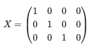

```py
import numpy as np 
from scipy.special import softmax
import math

sentence = "Today is sunday"

vocabulary = ['Today', 'is', 'sunday', 'saturday']

# Initial Embedding (one-hot encoding):

x_1 = [1,0,0,0] # Today 
x_2 = [0,1,0,0] # is 
x_3 = [0,0,1,0] # Sunday
x_4 = [0,0,0,1] # Saturday

X_example = np.stack([x_1, x_2, x_3], axis=0)
```

# 单头注意力层：查询、键和值

从 *X* 开始，变换器架构通过构建另外三组向量（即（3×4）矩阵）*Q*、*K* 和 *V*（查询、键和值）。如果你在线查找，你会发现以下内容：查询是你正在寻找的信息，键是你提供的信息，而值是你实际获得的信息。这确实通过与数据库系统的类比解释了一些关于这些对象的内容。尽管如此，我们相信它们的核心理解来自于它们在模型架构中所扮演的数学角色。

矩阵 *Q*、*K* 和 *V* 通过将 *X* 乘以另外三个矩阵 *W^Q*、*W^K* 和 *W^V*（形状为 4×4）构建。这些 W 矩阵包含在模型训练过程中会调整的参数——可学习参数。因此，W 最初是随机选择的，并在每个句子（或实际中每个批次的句子）中更新。

例如，考虑以下 3 个 W 矩阵：

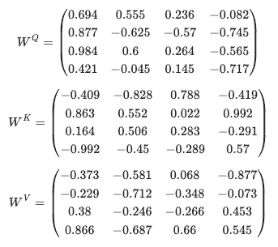

我们可以通过从-1 到 1 的均匀分布中采样来创建它们：

```py
W_Q = np.random.uniform(-1, 1, size=(4, 4))
W_K = np.random.uniform(-1, 1, size=(4, 4))
W_V = np.random.uniform(-1, 1, size=(4, 4))
```

我们来创建一个抽象层来存储我们的权重矩阵，以便稍后使用。

```py
class W_matrices:
    def __init__(self, n_lines, n_cols):
        self.W_Q = np.random.uniform(low=-1, high=1, size=(n_lines, n_cols))
        self.W_K = np.random.uniform(low=-1, high=1, size=(n_lines, n_cols))
        self.W_V = np.random.uniform(low=-1, high=1, size=(n_lines, n_cols))

    def print_W_matrices(self):
        print('W_Q : \n', self.W_Q)
        print('W_K : \n', self.W_K)
        print('W_V : \n', self.W_V)
```

在与输入 *X* 相乘之后，我们得到：

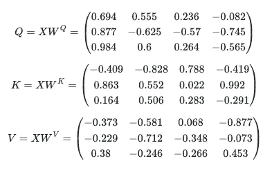

```py
Q = np.matmul(X_example, W_Q)
K = np.matmul(X_example, W_K)
V = np.matmul(X_example, W_V)
```

下一步是（点）乘查询和键矩阵以生成注意力分数。如上所述，结果矩阵是 *Q* 和 *K* 集合中每对向量之间点积（相似性）的结果：

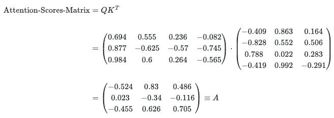

```py
Attention_scores = np.matmul(Q, np.transpose(K))
```

我们再次强调，本质上，注意力分数代表了向量在空间中的接近程度。也就是说，对于两个标准化的向量，它们的点积越接近 1，它们之间的距离就越近。这也意味着这些词更接近彼此。因此，模型考虑了词语在它们出现的句子上下文中的接近度。

然后，将矩阵 A 除以 4 的平方根。这个操作旨在避免梯度消失/爆炸的问题。这里出现这个问题是因为两个维度为 *d_k* 的向量，其分量随机分布，均值为 0，标准差为 1，会产生一个标量积，其均值为 0，但标准差为 *d_k*。由于下一步涉及这些标量积值的指数化，这意味着对于某些值会有很大的因子，如 *exp(d_k)*（考虑到论文中实际使用的维度为 512）。对于其他值，则会有非常小的因子，如 *exp(−d_k)*。

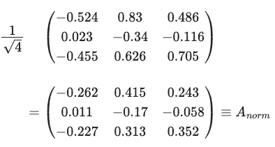

```py
Attention_scores = Attention_scores / 2
```

我们现在准备应用 softmax 映射：

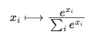

其中 *x_i* 是一个通用向量的第 i 个分量。因此，它导致了概率的分布。值得提到的是，这个函数仅定义在向量上，而不是 2 维矩阵上。当说对 *A_norm* 应用 softmax 时，实际上是对 *A_norm* 的每一行（向量）分别应用 softmax。它假定格式为 1 维向量的堆栈，表示 *V* 中每个向量的权重。这意味着通常应用于矩阵的操作，比如旋转，在这种情况下没有意义。这是因为我们处理的不是一个整体的 2 维实体，而是一个以 2 维格式排列的单独向量的集合。

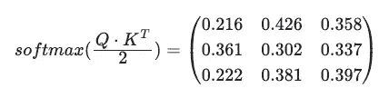

```py
Softmax_Attention_Matrix = np.apply_along_axis(softmax, 1, Attention_scores)
```

我们的结果然后乘以 *V*，最终得到一个单头注意力矩阵，这是初始 *V*（以及初始 X）的更新版本：

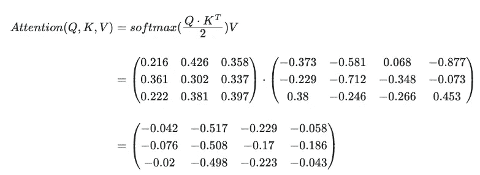

```py
One_Head_Attention = np.matmul(Softmax_Attention_Matrix,V)
```

现在我们来构建一个类，初始化我们的权重矩阵并实现计算单头注意力层的方法。注意，我们只关注前向传播，因此诸如反向传播的方法将在即将到来的文章中讨论。

```py
class One_Head_Attention:
    def __init__(self, d_model, X):
        self.d_model = d_model
        self.W_mat = W_matrices(d_model, d_model)

        self.Q = np.matmul(X, self.W_mat.W_Q)
        self.K = np.matmul(X, self.W_mat.W_K)
        self.V = np.matmul(X, self.W_mat.W_V)

    def print_QKV(self):
        print('Q : \n', self.Q)
        print('K : \n', self.K)
        print('V : \n', self.V)

    def compute_1_head_attention(self):
        Attention_scores = np.matmul(self.Q, np.transpose(self.K)) 
        print('Attention_scores before normalization : \n', Attention_scores)
        Attention_scores = Attention_scores / np.sqrt(self.d_model) 
        print('Attention scores after Renormalization: \n ', Attention_scores)
        Softmax_Attention_Matrix = np.apply_along_axis(softmax, 1, Attention_scores)
        print('result after softmax: \n', Softmax_Attention_Matrix)
        # print('Softmax shape: ', Softmax_Attention_Matrix.shape)

        result = np.matmul(Softmax_Attention_Matrix, self.V)
        print('softmax result multiplied by V: \n', result)

        return result

    def _backprop(self):
        # do smth to update W_mat
        pass
```

# 多头注意力层

论文定义多头注意力为在并行中应用此机制 ℎ 次，每次使用自己独特的 *W^Q*、*W^K* 和 *W^V* 矩阵。在程序结束时，我们会得到 ℎ 个自注意力矩阵，称为头：

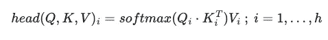

其中 *Q_i*、*K_i*、*V_i* 是通过其各自的权重矩阵 *W_i^Q*、*W_i^K* 和 *W_i^V* 的乘法来定义的。在我们的例子中，我们已经计算出了一个单头注意力：

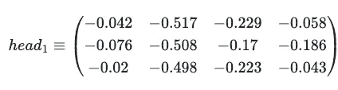

让我们考虑一个第二个头矩阵，经过我们在这里进行的相同计算后，生成以下矩阵：

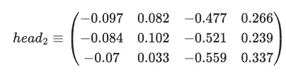

一旦我们得到单头注意力矩阵，我们可以将多头注意力定义为所有 head_i 的串联，乘以一个新的可学习矩阵 *W_0*：

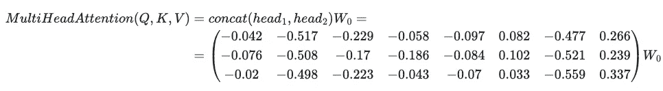

其中 *W_0*（在我们的例子中，是一个 8×4 的矩阵）被随机初始化为

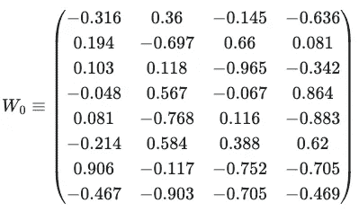

用于生成我们的多头注意力：

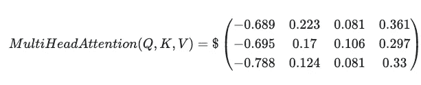

最后，结果被添加到初始向量 *X* 中（一个称为残差连接的操作）：

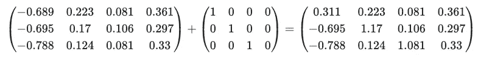

残差连接防止模型遇到消失/爆炸梯度问题（再次）。主要思想是，当我们将原始 *X* 向量添加到矩阵乘法结果中时，每个最终向量的范数被调整为与原始向量相同的数量级。

通过这个过程，将 3 个 4 维向量（X）映射到另一组 3 个 4 维向量（更新后的 V）。那么，这样做的好处是什么？答案是，现在我们拥有 3 个向量，这些向量以某种方式编码（并且这种编码随着训练的进行而变得更好）句子中出现的单词之间的注意力/语义关系，相对于最初通过简单的独热编码算法得到的 3 个向量。也就是说，现在我们有了这样一种向量嵌入，它以更精细的方式考虑了它们出现的上下文。

让我们将多头注意力层实现为一个新类：

```py
class Multi_Head_Attention:
    def __init__(self, n_heads, d_model, X):
        self.d_model = d_model
        self.n_heads = n_heads
        self.d_concat = self.d_model*self.n_heads # 4*8
        self.W_0 = np.random.uniform(-1, 1, size=(self.d_concat, self.d_model))
        # print('W_0 shape : ', self.W_0.shape)
        self.heads = []
        self.heads_results = []
        i = 0
        while i < self.n_heads:
            self.heads.append(One_Head_Attention(self.d_model, X))
            i += 1

    def print_W_0(self):
        print('W_0 : \n', self.W_0)

    def print_QKV_each_head(self):
        i = 0
        while i < self.n_heads:
            print(f'Head {i}: \n')
            self.heads[i].print_QKV()
            i += 1

    def print_W_matrices_each_head(self):
        i = 0
        while i < self.n_heads:
            print(f'Head {i}: \n')
            self.heads[i].W_mat.print_W_matrices()
            i += 1

    def compute(self):
        for head in self.heads:
            self.heads_results.append(head.compute_1_head_attention())
            # print('head: ', self.heads_results[-1].shape)

        multi_head_results = np.concatenate(self.heads_results, axis=1)
        # print('multi_head_results shape = ', multi_head_results.shape)

        V_updated = np.matmul(multi_head_results, self.W_0)
        return V_updated

    def back_propagate(self):
        # backpropagate W_0
        # call _backprop for each head
        pass
```

# 位置编码和全连接前馈网络

我们已经涵盖了我们认为是论文《Attention is all you need》中编码器部分的核心内容。我们遗漏了两个重要部分，将在本节中讨论。第一个是出现在编码器堆栈最开头的，即位置编码过程。

为了简化，我们输入到注意力机制中的向量方式并未考虑句子中出现的单词顺序。这确实是一个重大缺陷。显然，单词的顺序是其语义价值的关键元素，因此，它必须存在于嵌入中。在论文中，作者提出了一个解决方案，利用正弦和余弦函数。它们用于对嵌入向量的每个分量进行顺序编码。对于句子中第 i 个位置的单词，它的每个 j 个分量与位置编码关联如下：

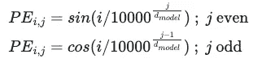

并且，由于*PE_i*是与嵌入向量大小相同的向量，它会被加到嵌入向量中，以包括单词在句子中的位置相关信息：

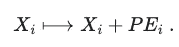

使用这种构造的一个很大优势在于我们包含了新的信息而无需额外空间。另一个优势是信息被分布在整个向量中，因此，它通过在层中发生的多次矩阵乘法与其他向量的所有组件进行通信。

我们现在准备实现我们的位置信息编码层：

```py
class Positional_Encoding:
    def __init__(self, X):
        self.PE_shape = X.shape
        self.PE = np.empty(self.PE_shape)
        self.d_model = self.PE_shape[1]

    def compute(self, X):
        for i in range(self.PE_shape[0]): 
            for j in range(self.PE_shape[1]):
                self.PE[i,2*j] = math.sin(i/(10000**(2*j/self.d_model)))
                self.PE[i,2*j+1] = math.cos(i/(10000**(2*j/self.d_model)))
                # this way we are assuming that the vectors are ordered stacked in X

        return X + self.PE
```

最后，在编码器的末尾，有一个简单的全连接前馈网络，由 2 层组成。尽管它不是论文中创新的部分，但它通过 ReLu 激活函数添加了非线性，从而捕获其他语义关联[[2]](https://github.com/zaai-ai/large-language-models-math/blob/main/attention_is_all_you_need.md#FFN)。

让我们来实现这些：

```py
class FFN:
    def __init__(self, V_updated, layer1_sz, layer2_sz):
        self.layer1_sz = layer1_sz
        self.layer2_sz = layer2_sz
        self.layer1_weights = np.random.uniform(low=-1, high=1, size=(V_updated.shape[1], layer1_sz))
        self.layer2_weights = np.random.uniform(low=-1, high=1, size=(layer2_sz, V_updated.shape[1]))

    def compute(self, V_updated):
        result = np.matmul(V_updated, self.layer1_weights)
        result = np.matmul(result, self.layer2_weights)

        return result

    def backpropagate_ffn(self):
        pass
```

# 结论

我们首先探讨了 NLP 中的嵌入概念，解释了词语及其语义如何被转换为 AI 模型可以处理的数值形式。接着，我们深入研究了 Transformer 架构，从单头注意力层开始，并解释了查询、键和值在这一框架中的作用。

然后我们讲解了注意力得分，它们代表了什么，以及如何对其进行归一化以解决梯度消失和爆炸的问题。在指导了如何理解单头注意力层的工作原理后，我们介绍了创建多头注意力机制的过程。这使得模型能够同时处理和整合多个视角的输入数据。

作为最后一个组成部分，我们涵盖了位置编码和简单的全连接前馈网络。前者使我们能够保持词语的顺序，这对理解句子的上下文意义至关重要。后者则通过激活函数发挥了增加非线性的关键作用。

# 关于我

连续创业者和 AI 领域的领袖。我为企业开发 AI 产品，并投资于以 AI 为重点的初创公司。

[创始人 @ ZAAI](http://zaai.ai) | [LinkedIn](https://www.linkedin.com/in/luisbrasroque/) | [X/Twitter](https://x.com/luisbrasroque)

# 参考文献

[1] Ashish Vaswani 等人（2017），《注意力机制就是你所需要的一切》 [`doi.org/10.48550/arXiv.1706.03762`](https://doi.org/10.48550/arXiv.1706.03762)

[2] Mor Geva 等人（2022）。《变压器前馈层通过在词汇空间中促进概念来构建预测》，2022 年自然语言处理实证方法会议论文集，第 30–45 页 [`arxiv.org/pdf/2203.14680.pdf`](https://arxiv.org/pdf/2203.14680.pdf)

—

除非另有说明，所有图像均由作者提供。
